title: Guide to Gizwits App Framework for APICloud
---

The Gizwits App Framework for APICloud (hereinafter referred to as APICloud Framework) is an open-source mobile application development framework developed based on Gizwits App SDK to implement basic functions such as SDK loading, initialization, user registration, login, device configuration, device discovery, and device connection. You can get a complete App after building the specific product control UI based on one of the Gizwits App Frameworks which currently are available for iOS, Android and APICloud. The main advantage of the APICloud Framework is that it supports both iOS and Android with the same set of code. 

The main purpose of this document is to show you how to use the APICloud Framework to rapidly develop a complete App. Of course, you can also start to build your own App from scratch by referring to the APICloud Framework source code.

This guide also comes with the source code of Gizwits Gokit App, which is an example project that employs the APICloud Framework and intended for developers to achieve a rapid development.

* For source code of the Framework for APICloud, find here:

https://github.com/gizwits/GizOpenSourceAppKit_APICloud

* For source code of Gizwits Gokit App for APICloud, find here:

https://github.com/gizwits/gokit_demo_in_apicloud

# The APICloud Framework code directory structure 

The development based on APICloud is similar to web front-end development, and is also achieved using CSS/HTML/JavaScript which make up the APICloud Framework code directory structure as shown below: 

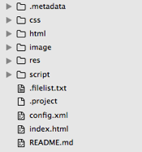
 
The concrete function of each file is described as follows:

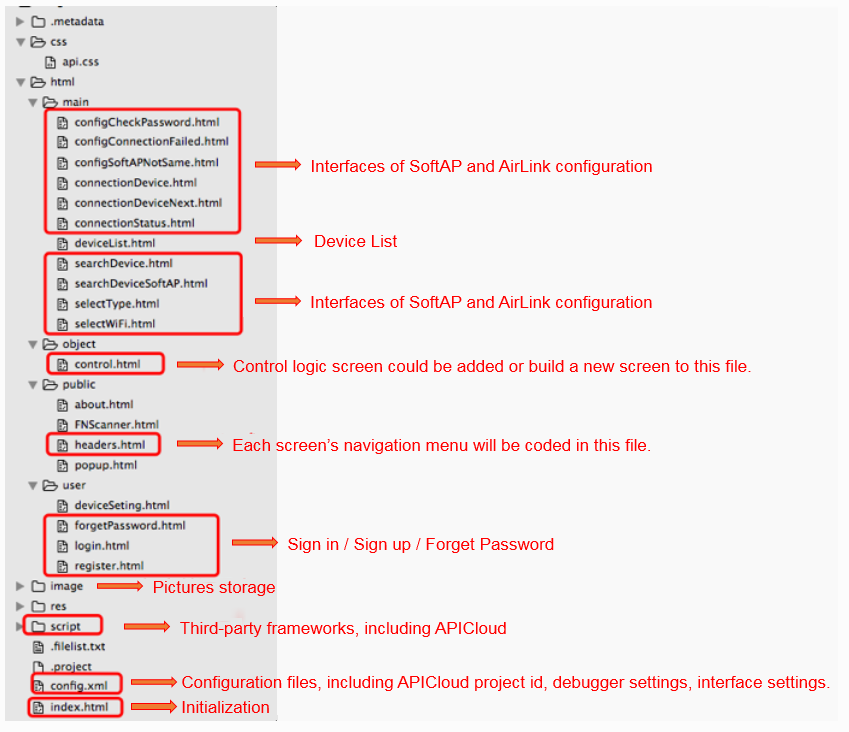
 
# Quick integration steps

Each application in APICloud has a unique id as its identifier. The id does not exists in the APICloud Framework. Thus you need to create an APICloud project and get the project id to run the APICloud Framework.

## Create a blank project

Right-click on the blank part in the "My App Projects" column and click on “New->APICloud Project”; or click the navigation button on the menu bar and click "New App Project" to go to the project creation page.

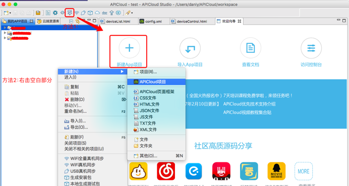
 
Select "Blank App" and click "Finish". At this time, APICloud generates a blank project.

 
Go to APICloud's development console: http://www.apicloud.com/console

You can see the App project created successfully.

 
## APICloud Framework porting

The blank App project directory generated above is as follows. Remove the directories and files in the red box.

The following figure is the source code of the APICloud Framework. Copy the directories and files in the red box to the blank App project shown in the above figure. So the newly created blank App project source code is the same as the APICloud Framework except config.xml.

 
## Upate the config.xml file

config.xml is the configuration file provided by APICloud. There exists a config.xml in each project, which provides id (the unique identifier of the project) on APICloud platform, the developer's personal account information, UI configuration and third-party modules used by the project. For more details, please visit: 

http://docs.apicloud.com/Dev-Guide/app-config-manual

The following figure shows the config.xml content of the APICloud Framework. Update the content in the red box with the corresponding values generated for the new project.

 
If QQ authentication is to be used in your project, you need to go to Tencent Developer Center to register for an application and get the apiKey value. The value of param urlScheme is set to the string of tencent+apiKey; the value of param apikey is set to the apikey value from Tencent Developer Center.

Submit the project changes to APICloud platform as follows:

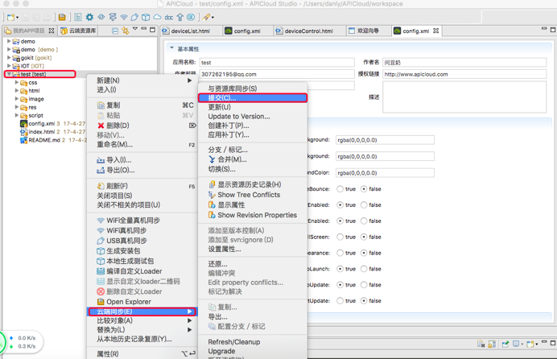
 
## Import GizWifiSDK

After submitting the APICloud Framework porting and config.xml changes to the cloud, APICloud will automatically import the corresponding modules to be used based on the source code. However, GizWifiSDK needs to be imported manually.

Search for GizWifiSDK and import it.

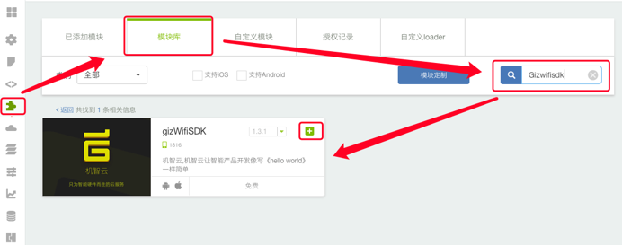
 
## Set parameters for the product and application in the source code

You need to set the appid and appsecret for the Android App and iOS App in the source code, and set the ProductKey of the product created in Gizwits Developer Center at this time.

Get the product ProductKey and ProductSecret in Gizwits Developer Center.

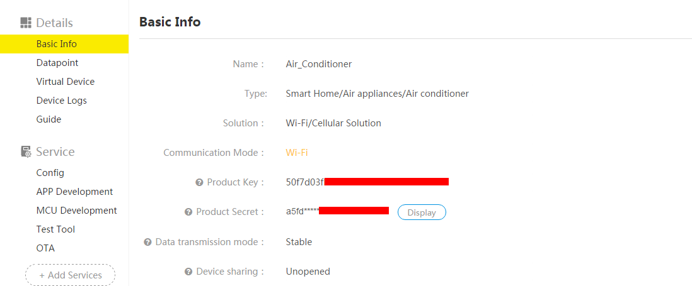
 
Get AppID and AppSecret for Android App and iOS App.

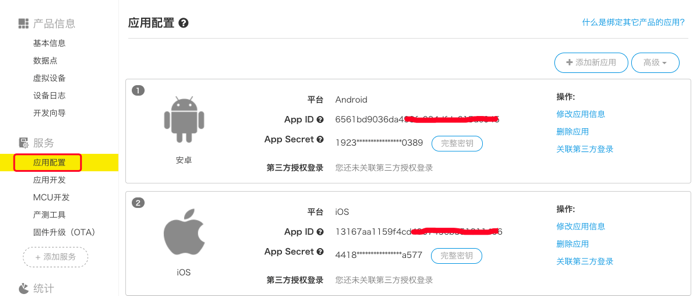
 
Open index.html of the APICloud Framework:

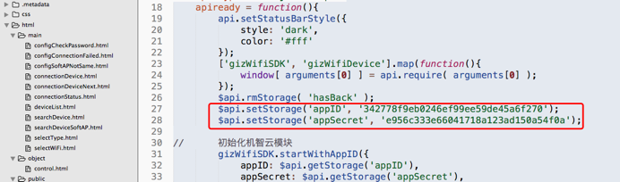
 
Chanage the code in the red box above to the code in the red box below:

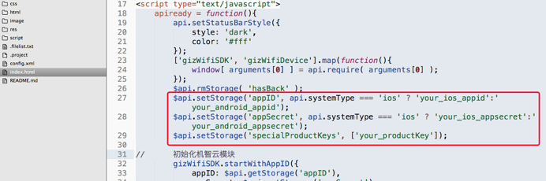
 
your_ios_appid: AppID of the iOS App created in Gizwits Developer Center
your_android_appid: AppID of the Android App created in Gizwits Developer Center
your_ios_appsecret: AppSecret of the iOS App created in Gizwits Developer Center
your_android_appid: AppSecret of the Android App created in Gizwits Developer Center
your_productKey: ProductKey of the product created in Gizwits Developer Center

Besides, in deviceList.html file, set with the ProductKey of the product to which the devices retrieved by the App belong.

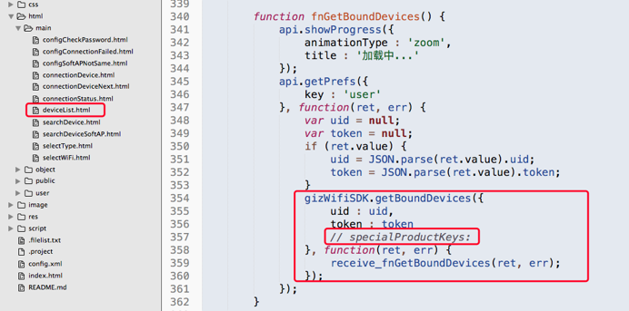

Change the code in the red box above to the code in the red box below:

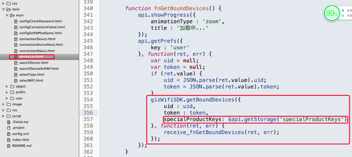
 
## Deploy App

After completing all the steps above, run the App.

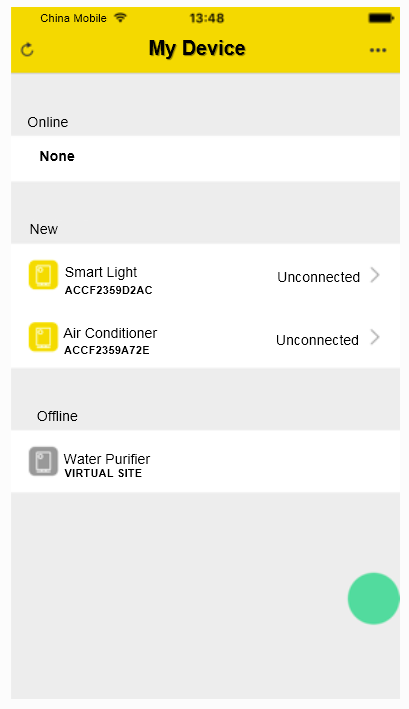
 
# Device debugging of APICloud

There are many methods for device debugging of APICloud, including cloud compilation, device debugging via USB, device debugging via Wi-Fi, etc. The most convenient and efficient one is device debugging via Wi-Fi. The following takes the APICIoud Studio tool as an example to illustrate how to use device synchronization via Wi-Fi. 

## Compile Custom Loader

All third-party modules of APICloud are stored in the cloud. If the compilation and debugging methods are the same as the native App, it will take a long time and more resources to recompile the code every time you perform device debugging. Therefore, APICloud has introduced a compilation and debugging tool, which is called Custom Loader.

Each App project has a Custom Loader, that is, when the third-party modules required by the App are configured in the cloud, and the local code has been updated, the Custom Loader can be compiled based on selected modules and settings to achieve device debugging.

The advantage of Custom Loader for device debugging is: if the code is modified when debugging, you don't need to recompile the Custom Loader but to perform device synchronization via Wi-Fi. During the device synchronization, APICloud will synchronize the changes into Custom Loader.

To compile Custom Loader, select the project you want to debug and right click as shown below:

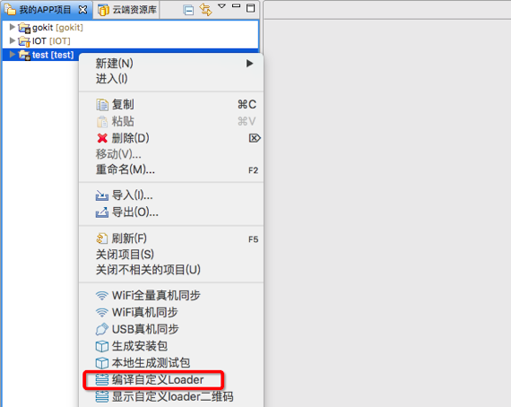
 
If the compilation is successful, the following page will pop up, and Custom Loader can be installed by scanning the QR code.

 
## Install Custom Loader

After scanning the QR code and the installation result of Custom Loader is shown as follows:
 

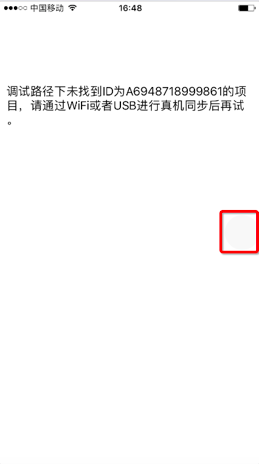

Click the white circle in the red box above to go to the following page, and fill in fields on this page for device synchronization via Wi-Fi.

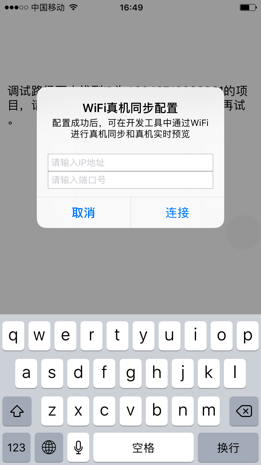
 
Note: Custom Loader can also be obtained in the following way:

 
## Get parameter values for device synchronization

View synchronization parameters in APICloud Studio.

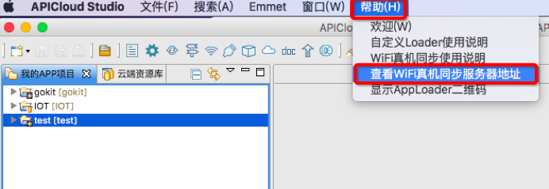

Select "View the server address for device synchronization via Wi-Fi” under “Help”.

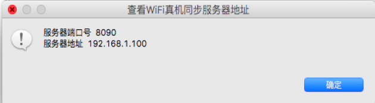
 
Set the parameters in the installed Custom Loader to the above values, click "Connect". If the connection is successful, the circle on the page turns green.

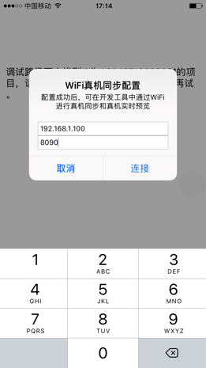

 
## Test device synchronization via Wi-Fi

After completing the Custom Loader configuration, you can test the device synchronization via Wi-Fi. 

Select "Device synchronization via Wi-Fi" in APICloud Studio.

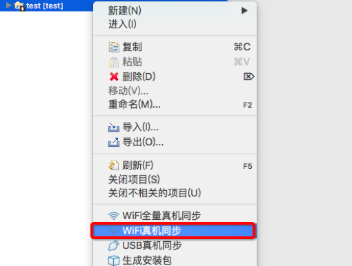
 
The App goes to the following page. After this step is completed, the App is successfully synchronized, then you can go on to the next round of the App test.

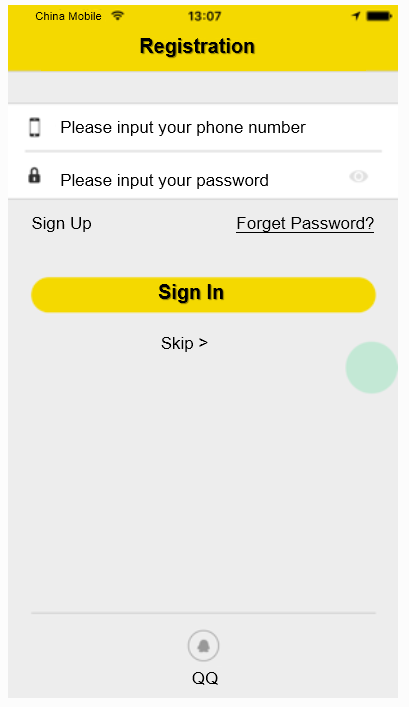
