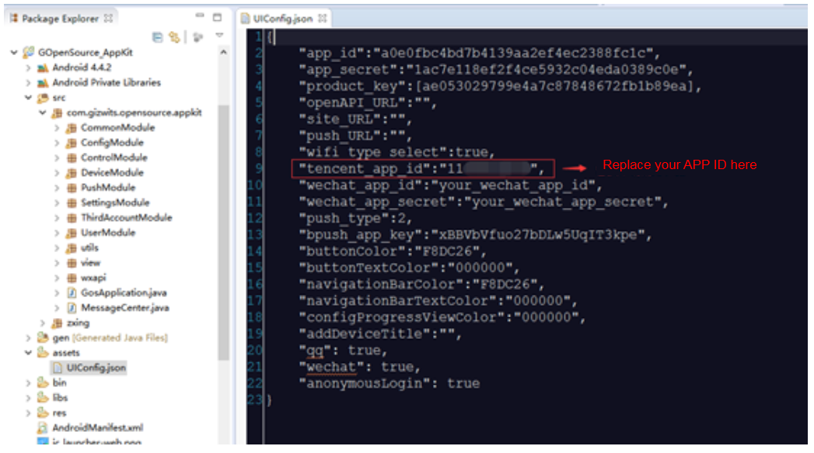
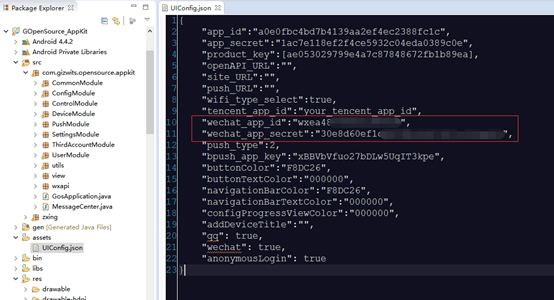
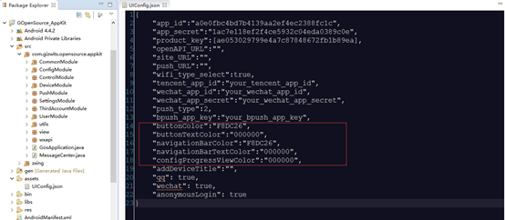
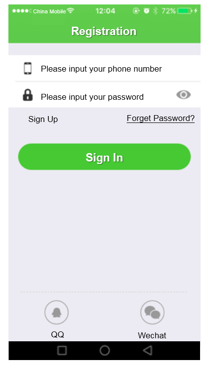
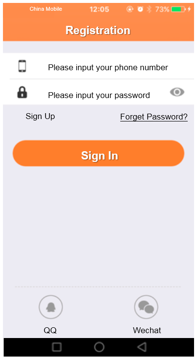
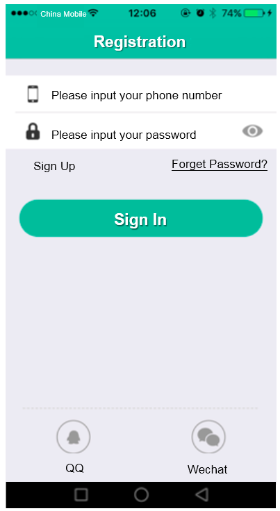

title: Guide to third-party authentication and re-skin for Android
---

See Guide to third party authentication and re-skin for iOS

See Set up third-party authentication with the provider of choice

# Overview 

This document mainly describes how to quickly implement QQ and WeChat authentication through Gizwits App Framework as well as re-skin for the App.

# QQ authentication

To support QQ authentication, you should first create an application on the Tencent open platform, and obtain the APPID for the App, which will be used in Gizwits App Framework. 

## Get APP ID and bind the application

For obtaining APP ID and binding Gizwits application, see Guide to Application for QQ Open Platform.

## Update UIConfig.json

Type the APPID obtained from Tencent development platform into the configuration file UIConfig.json of Gizwits App Framework.



After filling in the "tencent_app_id" and deploying it, you can log in using QQ authentication.

# Wechat authentication

To implement WeChat authentication, you need to go to the WeChat open platform to register for an application, then obtain the APPID and APPSecret of the application which will be applied to Gizwits App Framework.

## Get APPID and APPSecret

To get APPID and APPSecret, see Guide to Application for WeChat Authentication.

## Update UIConfig.json

Type the APPID and APPSecret obtained from WeChat development platform into the configuration file UIConfig.json of Gizwits App Framework, as shown below.



After filling in the "wechat_app_id" and "wechat_app_secret" and deploying it, you can log in using WeChat authentication.

# App Re-Skin

The Gizwits App Framework has the re-skin feature. Quick re-skin can be achieved by modifying the UIConfig.json file.


 
As shown in the red box, the code snippet for your custom skin has the following parameters:

```
buttonColor: button color
buttonTextColor: button text color
navigationBarColor: navigation bar color
navigationBarTextColor: navigation bar text color
configProgressViewColor: configuration progress view color
```

Quick res-skin can be achieved by modifying the corresponding color values. Refer to the following example:

## Sample 1

```
"buttonColor":"6ebe37",
"buttonTextColor":"ffffff",
"navigationBarColor":"6ebe37",
"navigationBarTextColor":"ffffff",
"configProgressViewColor":"000000",
```

The result:


 
## Sample 2

```
"buttonColor":"ff8a44",
"buttonTextColor":"ffffff",
"navigationBarColor":"ff8a44",
"navigationBarTextColor":"ffffff",
"configProgressViewColor":"000000",
```

The result:


 
## Sample 3

```
"buttonColor":" 16b599",
"buttonTextColor":"ffffff",
"navigationBarColor":" 16b599",
"navigationBarTextColor":"ffffff",
"configProgressViewColor":"000000",
```

The result:



# See Also

See [Gizwits App Code Auto-Generator](../UserManual/AppCodeAutoGenerator.md) to learn about the functionality of the automatically generated App code.

See "Gizwits App Framework" to grasp

* [Gizwits App Framework for iOS](../AppDev/iOSFramework.md)
* [Push notification integration for iOS App](../AppDev/iOSPushNotification.md)
* [Third-party authentication and re-skin for iOS App](../AppDev/iOSAuthReSkin.md)
* [Quick start with iOS App development](../quickstart/iOSDevQuickStart.md)
* [Gizwits App Framework for Android](../AppDev/AndroidFramework.md)
* [Push notification integration for Android App](../AppDev/AndroidPushNotification.md)
* [Third-party authentication and re-skin for Android](../AppDev/AndroidAuthReSkin.md)
* [Quick start with Android App development](../quickstart/AndroidDevQuickStart.md)
* [Gizwits App Framework for APICloud](../AppDev/APICloudFramework.md)

See "App Development SDK" to develop your IoT App

* [Gizwits App SDK for Android](../AppDev/AndroidSDKA2.md)
* [Gizwits App SDK for iOS](../AppDev/iOSSDKA2.md)
* [Gizwits App SDK for APICloud](../AppDev/APICloudSDK.md)
* [Data transparent transmission](../AppDev/TransparentTransmission.md)
* [Get Gizwits App SDK debug log](../AppDev/SDKLogCapture.md)
* [SDK error codes](../AppDev/SDKErrorCodes.md)

More application development guides

* [FAQ of mobile application development](../AppDev/AppDevFAQ.md)
* [Gizwits Device Sharing](../cloud/DeviceSharing.md)
* [Set up third-party authentication with the provider of choice](../AppDev/ThirdpartyAuth.md)
