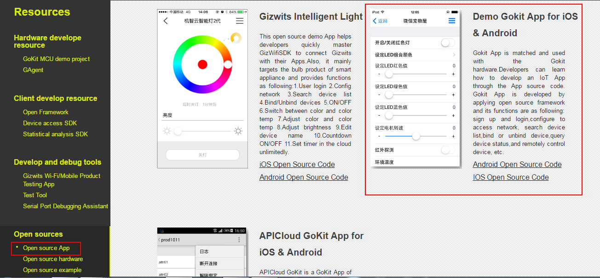
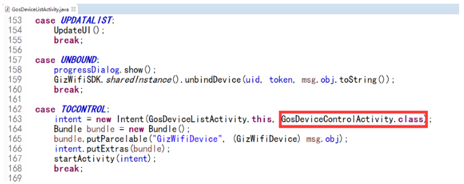
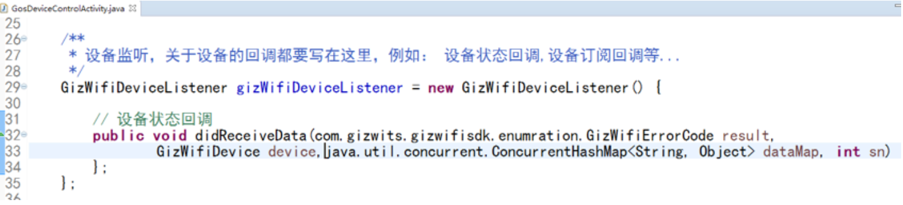
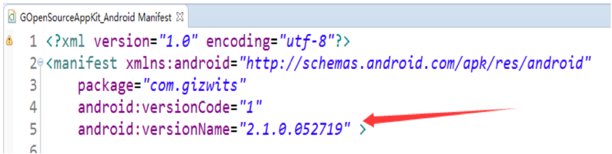
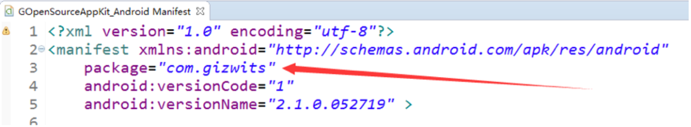
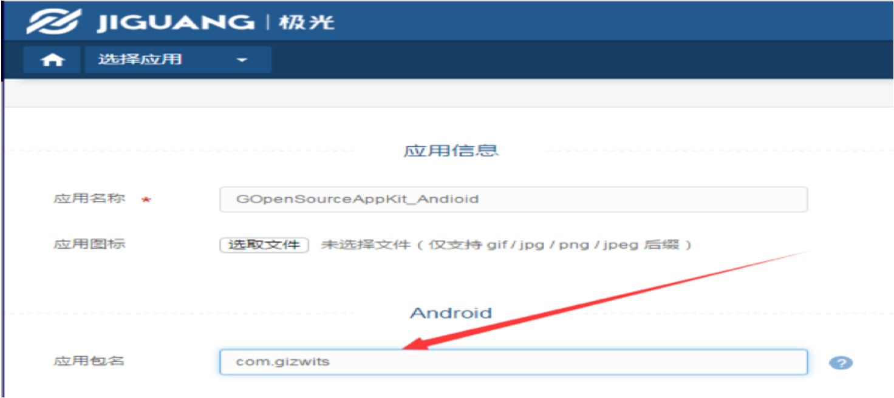

title: Guide to Gizwits App Framework for Android
---

# Overview

Gizwits App Framework (hereinafter referred to as Framework) is an open-source mobile application development framework developed based on Gizwits App SDK to achieve the SDK loading, initialization, user registration, user login, device configuration, device discovery, device connection, device listing and other basic functions. The Framework is a source code project which is available to all developers and currently supports iOS and Android platforms. App developers can create a complete App by implementing specific product control pages based on the Framework.

This guide also comes with the source code of Gizwits Gokit App, which is an example project that employs the Framework and intended for developers to achieve a rapid development.

* For source code of the Framework for Android, find here:

	* Eclipse version: https://git.oschina.net/dantang/GizOpenSource_AppKit_Android

	* Android Studio version：https://github.com/gizwits/GOpenSource_AppKit_Android_AS

* For source code of Gizwits Gokit App for Android, find here:

	* https://git.oschina.net/dantang/GoKit_Demo_Android

It can also be downloaded at the Download Center:


 
# The Framework code directory structure

__A. Library: Third-party library directory including GizWifiSDK__

__assets: contains UIConfig.json__

__B. GizOpenSourceModules: contains__

* GosApplication.java // SDK starts here
* CommonModule // Common helper classes, resource file reader classes
* ConfigModule // Device configuration module, including AirLink and SoftAP
* UserModule // User module, including user login, user registration, password recovery
* DeviceModule // Device module, including device listing
* ControlModule // Device control module with control examples
* SettingsModule // Settings module, containing settings of menu and submenus (About etc.)
* PushModule // Push notification module, encapsulating Baidu push SDK and Jiguang push SDK 
* ThirdAccountModule // Third-party authentication module(QQ, WeChat, etc.)
* view // Custom controls
* utils // Tools
* wxapi // For WeChat integration
* zxing // For scanning QR code

# Quick integration guide

The default program entry is GosUserLoginActivity in UserModule. 

## 1. Set initialization parameters

Gizwits AppID and AppSecret can be set in GosApplication.java file of the project.

If you use third-party authentication or push notification, it is important to ensure that the appropriate parameters are set to the same values as used in the corresponding platform. If you use the push notification, you need to uncomment the related macro line in order to enable the corresponding type of push notification. If you don’t uncomment all the related macro lines, it means you are not using any third-party push notification at the time. Only one type of third-party push notifciation is supported at the same time, hence don’t uncomment all third-party push notification macro lines.

Configurable parameters are:

* app_id: Gizwits app id
* app_secret: Gizwits app secret
* product_key: Gizwits product key 
* wifi_type_select: whether the Wi-Fi module selection function is enabled
* tencent_app_id: app id for qq authentication
* wechat_app_id: app id for WeChat authentication
* wechat_app_secret: app secret for WeChat authentication
* push_type: Push notifciation type [0: Off, 1: Jiguang, 2: Baidu]
* bpush_app_key: app key for Baidu push notification
* openAPI_URL: openAPI domain name and port, format: "api.gizwits.com". Defaults to 80 if unspecified.
* site_URL:site domain name and port, format: "site.gizwits.com". Defaults to 80 if unspecified.
* push_URL: push notification service domain name and port, format: "push.gizwits.com". Defaults to 80 if unspecified.
* buttonColor: Button color
* buttonTextColor: Button text color
* navigationBarColor: Navigation bar color
* navigationBarTextColor: Navigation bar text color
* configProgressViewColor: Configuration progress view color
* addDeviceTitle: Title of “Add Device” page
* qq: whether to enable QQ auhentication [true: enabled]
* wechat: whether to enable WeChat auhentication [true: enabled] 
* anonymousLogin: whether to enable anonymous login [true: enabled] 

Attention:

1. The appid of Jiguang push notification needs to be set in line 243 of AndroidManifest.xml.
2. For WeChat authentication, you needs to set your own md5 value in Tencent api or it will not work normally.
3. The tencent_app_id needs to be set in line 89 of AndroidManifest.xml

## 2. Loading the control page

1) The code provided in the Framework project implements the redirection to the control page without any modification. You only need to focus on the logic of the operation pages. If you want to click a device in the device list page and jump to the view you created, modify the corresponding redirection parameters in the GosDeviceListActivity.java file. Please modify the class definition of the target view as shown in the figure. If you use the blank page (GosDeviceControlActivity) provided by default to create the control page, you can skip this step.



2) Register the device listener in the control page, and implement its callback, as shown in Figure:



It is used to receive the device state change notification reported by the Gizwits App SDK, which will be parsed in order to update the page.

3) Set the listener for the current device in the control page, for example: 

```
	device.setListener(gizWifiDeviceListener);
```

4) To implement the command issuing, you need to call the interface method of the GizWifiDevice instance in the Gizwits App SDK:

```
	device.write(concurrentHashMap ,0); 
```

For detailed parameter explanation, see the guide to Gizwits App SDK.

5) When exiting the control page, you need to unsubscribe from the current device, and call the interface method of the GizWifiDevice instance in the Gizwits App SDK with the parameter set to False:

```
	device.setSubscribe(false);
```

## 3. Add menu items on the settings page

For the addition or modification of an list item in the settings page, you need to add the corresponding control in activity_gos_settings.xml and add the corresponding event in the GosSettingsActivity.java file in the module (SettingsModule).

# FAQ

A. Which Android versions does the Framework support?

Currently it supports Android 4.0 and higher.

B. How to update the version number

Modify the versionName in the AndroidManifest.xml file of the project so as to change the version number display in the SettingsModule module. 



C. How to configure the push notification(the following uses Jiguang push notification as example)

Make sure the package name in the AndroidManifest.xml file matches the application package name you used when you applied for the push notification service, which is shown as below. 





Besides, modify the corresponding settings for the push notification in the project's AndroidManifest.xml file.

1)

```
<permission android:name=”your App package name.permission.JPUSH_MESSAGE” android:protectionLevel=”signature” />
```

(See line 13 of the AndroidManifest.xml file in the Framework)

2)

```
<uses-permission android:name=”your App package name.permission.JPUSH_MESSAGE” />
```

(See line 17 of the AndroidManifest.xml file in the Framework)

3)

Under DaemonService

```
<category android:name="your App package name" />
```

(See line 159 of the AndroidManifest.xml file in the Framework)

4)

Under PushPeceiver  

```
<category android:name=”your App package name” />
```

(See line 170 of the AndroidManifest.xml file in the Framework)

5)

Under PushActivity

```
<category android:name="your App package name" />
```

(See line 193 of the AndroidManifest.xml file in the Framework)

6)

Under JPushReceiver

```
<templategory android:name="your App package name" />
```

(See line 224 of the AndroidManifest.xml file in the Framework)

7)

```
<meta-data android:name=”JPUSH_APPKEY” android:value=”Your AppKey” />
```

(See line 240 of the AndroidManifest.xml file in the Framework)

# See Also

See [Gizwits App Code Auto-Generator](http://docs.gizwits.com/en-us/AppDev/AppCodeAutoGenerator.html) to learn about the functionality of the automatically generated App code.

See "Gizwits App Framework" to grasp

* [Gizwits App Framework for iOS](http://docs.gizwits.com/en-us/AppDev/iOSFramework.html)
* [Push notification integration for iOS App](http://docs.gizwits.com/en-us/AppDev/iOSPushNotification.html)
* [Third-party authentication and re-skin for iOS App](http://docs.gizwits.com/en-us/AppDev/iOSAuthReSkin.html)
* [Quick start with iOS App development](http://docs.gizwits.com/en-us/AppDev/iOSDevQuickStart.html)
* [Gizwits App Framework for Android](http://docs.gizwits.com/en-us/AppDev/AndroidFramework.html)
* [Push notification integration for Android App](http://docs.gizwits.com/en-us/AppDev/AndroidPushNotification.html)
* [Third-party authentication and re-skin for Android](http://docs.gizwits.com/en-us/AppDev/AndroidAuthReSkin.html)
* [Quick start with Android App development](http://docs.gizwits.com/en-us/AppDev/AndroidDevQuickStart.html)
* [Gizwits App Framework for APICloud](http://docs.gizwits.com/en-us/AppDev/APICloudFramework.html)

See "App Development SDK" to develop your IoT App

* [Gizwits App SDK for Android](http://docs.gizwits.com/en-us/AppDev/AndroidSDKA2.html)
* [Gizwits App SDK for iOS](http://docs.gizwits.com/en-us/AppDev/iOSSDKA2.html)
* [Gizwits App SDK for APICloud](http://docs.gizwits.com/en-us/AppDev/APICloudSDK.html)
* [Data transparent transmission](http://docs.gizwits.com/en-us/AppDev/TransparentTransmission.html)
* [Get Gizwits App SDK debug log](http://docs.gizwits.com/en-us/AppDev/SDKLogCapture.html)
* [SDK error codes](http://docs.gizwits.com/en-us/AppDev/SDKErrorCodes.html)

More application development guides

* [FAQ of mobile application development](http://docs.gizwits.com/en-us/AppDev/AppDevFAQ.html)
* [Gizwits Device Sharing](http://docs.gizwits.com/en-us/AppDev/DeviceSharing.html)
* [Set up third-party authentication with the provider of choice](http://docs.gizwits.com/en-us/AppDev/ThirdpartyAuth.html)
