title: Guide to push notification integration for Android App
---

# Overview

The Gizwits App Framework (hereinafter referred as Framework) integrates Baidu push notification and Jiguang push notification, which help rapid development with few modifciation. This document describes how to integreate push notification based on the Framework. For more information on the Framework, please refer to the Quick Start documentation.

# Quick integration with Jiguang push notification

## 1. Get Jiguang AppKey and Master Secret

You need to create an application on Jiguang official website with the appropriate information and the package name of the Framework, as shown below:

1). Find the package name of the Framework

2). Create an application on Jiguang platform

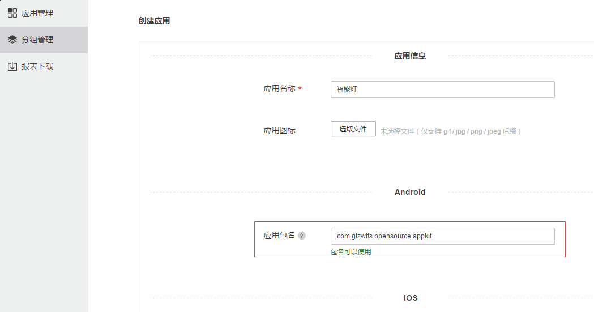

3). Find the corresponding AppKey and Master Secret

 
## 2. Use third-party push notification in the Gizwits IoT Cloud

### 2.1 Enable D3 Engine

1. Find D3 Engine

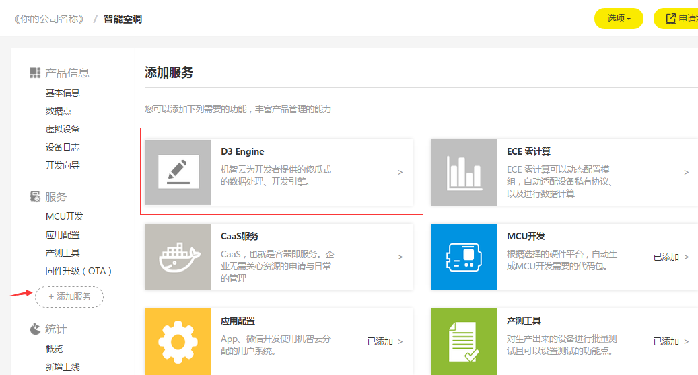

2. Request to use D3 Engine

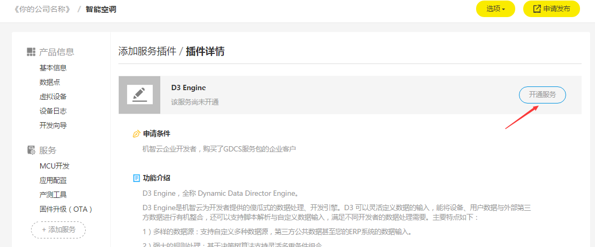

The use of D3 Engine requires the verification of Gizwits. After your request has been submitted, you need to contact the Gizwits FAE for assistant.

### 2.2 Use Jiguang push notification in Gizwits IoT Cloud

After the verification passes, you can see the D3 Engine under the Services column, click "Configuration" -> "Edit Push Notification Platform"

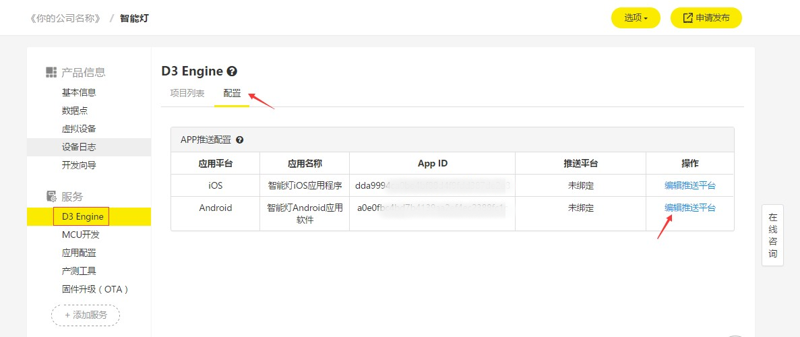

Type the App Key and Master Secret you got from Jiguang as the following figure and choose "Bind".

The following figure shows the successful binding of Jiguang push notification.

 
### 2.3 Create a push notification rule using D3 Engine

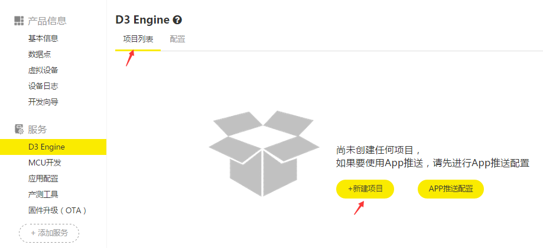

Choose Project List -> New Project. The following shows how to create a rule that will push a notification message to the App after your device comes online.

 
Drag the "Device Data" box to the right and double click it.

 
Set the trigger mode to "Device comes online" and click OK.

Double-click "Push for App" and set the notification content.
 

Click "Save" to save the push notification rule.

The following figure shows that the push notification rule has been successfully saved.

 
## 3. Update UIConfig.json

1. Set the Gizwits app_id and product_key and modify the push_type.

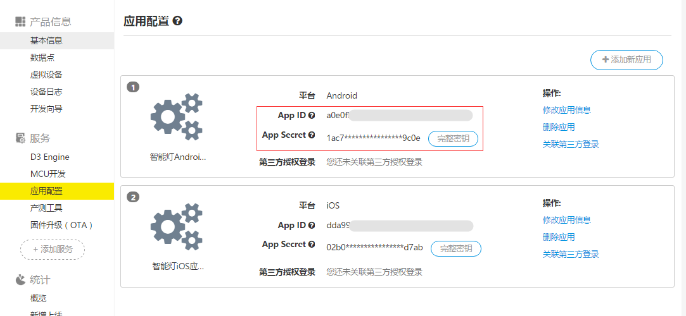

## 4. Update AndroidManifest.xml

Update the APP KEY in AndroidManifest.xml.

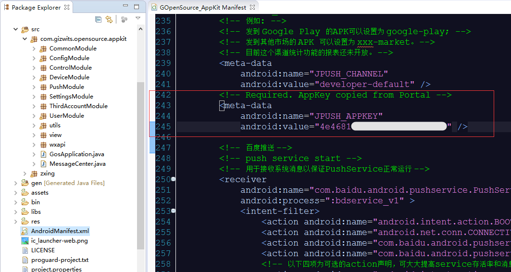

## 5. Start the virtual device

## 6. Run the App

Through the above steps, the App is equipped with Jiguang push notification function. After being deployed to a mobile phone, register a user and login in, then bind the cloud virtual device by scanning its QR code.

## 7. Test push notification

Restart the virtual device to see whether your phone receives a push message.

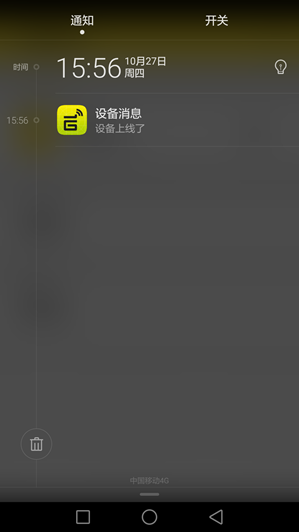

# Quick integration with Baidu push notification

## 1. Get Baidu API KEY

You need to create an application on Jiguang official website with the appropriate information and the package name of the Framework, as shown below:

Find the corresponding API KEY and SECRET KEY.

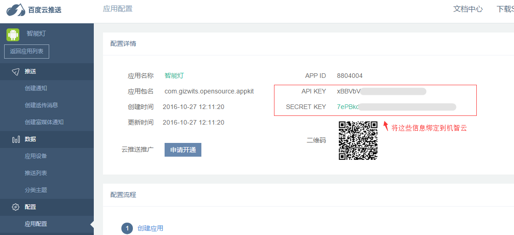
 
## 2. Use third-party authentication in Gizwits IoT Cloud

### 2.1 Request to use D3 Engine

For this step, refer to section 2.1 of Quick integration with Jiguang push notification.

### 2.2 Use Baidu push notification in Gizwits IoT Cloud

Type the API Key and Secret Key you obtained from Baidu as the following figure and choose "Bind".

The following figure shows the successful binding of Baidu push notification.

### 2.3 Create a push notification rule using D3 Engine

For this step, refer to section 2.3 of Quick integration with Jiguang push notification.

## 3. Update UIConfig.json

Set app_id, app_secret, product_key, and set push_type to 2. Update the application API key of Baidu push notification you obtained in step 1.

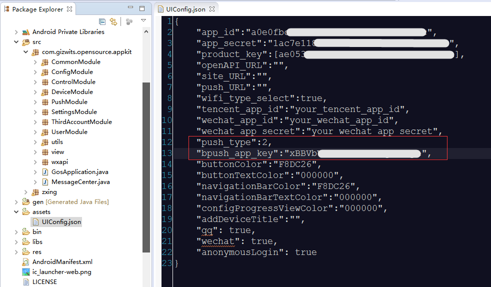

## 4. Start the virtual device

This step can refer to section 5 of Quick integration with Jiguang push notification.

## 5. Run the App

Through the above steps, the App is equipped with Baidu push notification function. After being deployed to a mobile phone, register a user and login in, then bind the cloud virtual device by scanning its QR code. 

## 6. Test push notification

Restart the virtual device to see whether your phone receives a push message.

# FAQ

## 1. Need I request to use D3 Engine for push notification?

Answer: Yes, D3 Engine currently is intended for enterprise developers. Therefore, only enterprise developers can request to use it.

## 2. I completed the above steps using Jiguang push notification, but cannot receive the expected push notification.

Answer:

Follow the steps below to troubleshoot the issue:

i. Confirm whether the App package name has been modified. The default package name is "com.gizwits.opensource.appkit". If the package name has been modified, you need to update AndroidManifest.xml. Please refer to Jiguang document:

http://docs.jiguang.cn/jpush/client/Android/android_guide/

Then it is necessary to test whether it is successful to push messages to the App using Jiguang platform alone. Receiving Gizwits push messages hinges on the successful push from Jiguang platform. 

ii. For the case that the App still can't receive the message when the push from Jiguang platform is successful. 

First, confirm that Gizwits IoT Cloud successfully binds Jiguang push notification with its App Key and Master Secret.

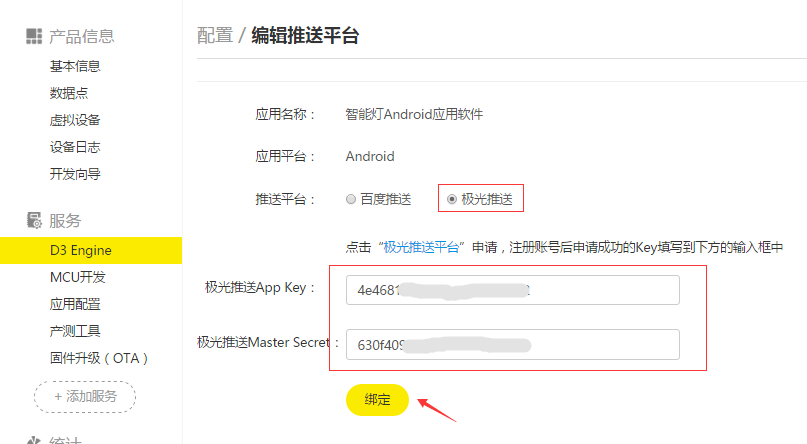

Second, confirm that Gizwits IoT Cloud successfully creates the rule.

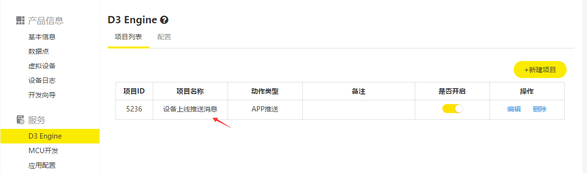

Third, if you still can't receive the message following the two steps above, check the following code:

Check whether the Result value arg0 in the callback of JPushInterface.setAlias ​​method is 0. If it is not 0, it means that the Jiguang alias is incorrect. You need to call this method to set the alias.

Check whether the Result value in the didChannelIDBind callback interface is GIZ_SDK_SUCCESS, and debug your code.
