title: Guide to Gizwits App SDK 2.0 for Android
---

# SDK_API Reference Manual

Attachment: Android_SDK2.0_API Reference Manual

# Overview

## 1. Objectives

The Gizwits App SDK (hereinafter referred to as the SDK) is a mobile application development kit which encapsulates the communication process between mobile phones (including PAD and other devices) and smart devices, and the communication process between mobile phones and Gizwits IoT Cloud. These processes involve configuring network access, device discovery, connectivity, device control, heartbeat, status report, and alarm notification. Using the Gizwits App SDK, you only need to focus on the App UI/UE and are able to rapidly complete your App development, while ignoring the related issues such as complex protocols and error handling.

The SDK has been further simplified based on the definition of the new APIs, and its process is briefer. You have no need to understand the concept of device connectivity underneath at all.

## 2. Gizwits IoT Architecture

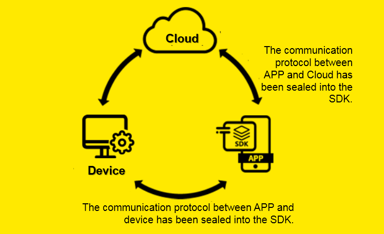
 
## 3. Choose the right SDK

Gizwits currently offers three types of SDKs: the native Gizwits App SDK for iOS, the native Gizwits App SDK for Android, and the cross-platform Gizwits App SDK for APICloud. you can choose any one of those SDKs that best aligns with your desired scenario and customize as needed. The Gizwits App SDK for APICloud can be developed once with HTML5 and adapt to both iOS and Android. For details, please refer to Guide to Gizwits App SDK for APICloud.

## 4. Term definitions

### 4.1 GAgent

GAgent is Gizwits’s hardware connectivity with the embedded system firmware that can operate in Wi-Fi modules, GPRS modules and PCs etc. Devices access Gizwits IoT Cloud through the GAgent. GAgent provides the communication protocol between cloud and MCU, so that, according to the protocol, developers can realize the communication between MCU and GAgent. Currently, GAgent is compatible with mainstream Wi-Fi modules of China. Developers can also implement their own custom modules to access Gizwits using the GAgent secondary development package provided by Gizwits.

### 4.2 Micro Cycle

Connections between smart devices and mobile phones, smart devices and smart devices via the same router to achieve WLAN communication (status check or control), which is called a Micro Cycle.

### 4.3 Macro Cycle

Smart devices access the Internet via routers to accomplish remote monitoring and control by users, which is called a Macro Cycle.

### 4.4 ProductKey 

Product identification code, a 32 characters long string that is automatically generated by the developer after creating a new product in Gizwits IoT Cloud. It is a unique code in the database of Gizwits IoT Cloud. After the developer writes the ProductKey to the device master MCU, the Gizwits identifies the device through this code and automatically completes the registration.

### 4.5 DID

Device code. When a device is connected to Gizwits for the first time, Gizwits automatically generates a DID for the device based on its ProductKey and Wi-Fi module MAC address. DID which is used to associate with users and perform subsequent operations, should be unique across the entire network.

### 4.6 PassCode

Device Pass Code, used to verify the user's binding/control permission. When the user initiates a device binding, the device pass code can be obtained by users with legal means to bind the device and perform operations such as device status check and control during the valid period. GAgent generates a random number as a device pass when it is first run. It is generated and stored in non-volatile memory. When the device goes online, it needs to be reported to the server.

### 4.7 AppID

Application identification code. When you need to develop an application (including iOS, Android, Web application, etc.) for a smart device, an AppID is automatically generated in Gizwits IoT Cloud and associated with the device. This AppID is required for application development.

### 4.8 Onboarding

Network access configuration, the process of connecting a Wi-Fi-based IoT device to a router is called Onboarding. When the new device is used for the first time, it needs to know the router's SSID and password to connect to the Internet via the router. Since most IoT devices do not have their own screens and keyboards, it is necessary to send the router's SSID and password to the device through a smart phone. The Gizwits App SDK has such built-in configuration function.

### 4.9 AirLink

Collectively, the features of UDP broadcast messages that allow you to configure the network access for devices, such as SmartConfig and SmartLink, are called AirLink. It provides the standard onboarding operation procedures with a good user experience, which is compatible with configuration protocols from multiple Wi-Fi module manufacturers. The Gizwits App SDK has built-in AirLink function. 

### 4.10 SoftAP

Because each Smart Config protocol from different Wi-Fi module manufacturers is not fully mature and neither does it support 5G router signal. Gizwits has provided AirLink configuration mode and also supports SoftAP mode to configure devices to access routers. When a device enters the SoftAP configuration mode, the device itself becomes an AP, and the smart phone can directly connect to the device. Then the SSID and password of the router are input on the mobile phone and sent to the device which will automatically switch to the normal mode and try to connect to the router.

## 5. Integration preparation

### 5.1 Register a Gizwits developer account

Before using Gizwits services, you need to sign up for a developer account on site.gizwits.com. Please refer to Quick Start to complete your registration.

### 5.2 Create device connection

For this section, please refer to Quick Start.

### 5.3 Get App ID and product identification code (productkey)

For this section, please refer to Quick Start.

### 5.4 Download the Gizwits App SDK

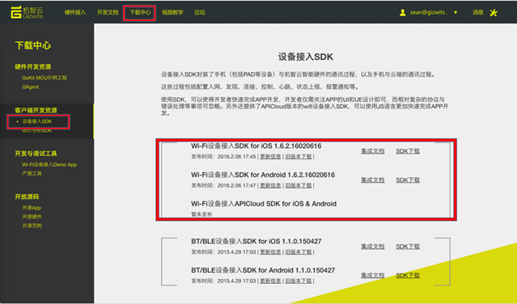
 
### 5.5 Import the Gizwits App SDK

Step 1: Double-click to unzip GizWifiSDK-Android-xxx.zip.

Step 2: Copy all the files in the decompressed libs directory to the libs directory of the specified project, and ensure that the files in the red box below are loaded into the project:

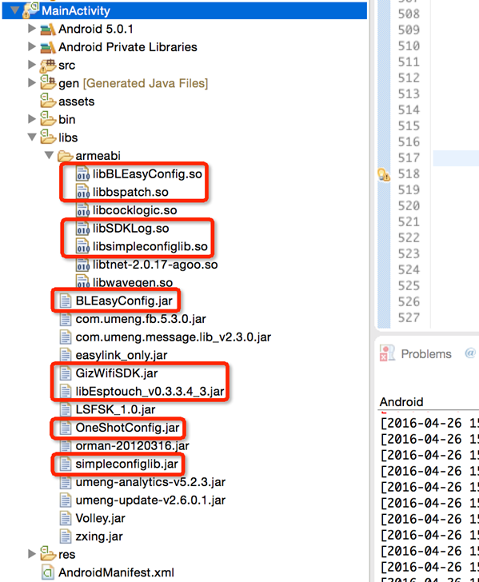

### 5.6 Update AndroidManifest.xml

Copy the following permission configuration code snippet into the AndroidManifest.xml file:

```
<uses-permission android:name="android.permission.ACCESS_NETWORK_STATE" />
<uses-permission android:name="android.permission.ACCESS_WIFI_STATE" />
<uses-permission android:name="android.permission.READ_PHONE_STATE" />
<uses-permission android:name="android.permission.ACCESS_COARSE_LOCATION" />
<uses-permission android:name="android.permission.ACCESS_FINE_LOCATION" />
<uses-permission android:name="android.permission.WRITE_EXTERNAL_STORAGE" />
<uses-permission android:name="android.permission.INTERNET" />
<uses-permission android:name="android.permission.CHANGE_WIFI_STATE" />
<uses-permission android:name="android.permission.CHANGE_WIFI_MULTICAST_STATE" />
```

Note:

Permission |	Usage
----|----
ACCESS_NETWORK_STATE|	Allows applications to access information about networks.
ACCESS_WIFI_STATE|	Allows applications to access information about Wi-Fi networks.
READ_PHONE_STATE|	Allows read only access to phone state, including the phone number of the device, current cellular network information, the status of any ongoing calls, and a list of any PhoneAccounts registered on the device.
ACCESS_COARSE_LOCATION|	Allows an app to access approximate location for CellID or WiFi hotspots.
ACCESS_FINE_LOCATION|	Allows an app to access precise location.  (such as GPRS)
WRITE_EXTERNAL_STORAGE|	Allows an application to write to external storage like SD card.
INTERNET|	Allows applications to open network sockets.
CHANGE_WIFI_STATE|	Allows applications to change Wi-Fi connectivity state.
CHANGE_WIFI_MULTICAST_STATE|	Allows applications to enter Wi-Fi Multicast mode.

### 5.7 Read and write permission settings for Android 6.0 system files

Android 6.0 has added the new feature of runtime permission dynamic check. The following permission used in GizWifiSDK need to be detemined at runtime: ACCESS_FINE_LOCATION, which can detect the current Wi-Fi networks and connectable Wi-Fi network list of for the mobile phone.

Here's an example of how to write dynamic check code with this permission request:

The Android 6.0 grants all the permissions requested for the application with targetSdkVersion less than 23 by default, so if the targetSdkVersion used by the App is lower than 23, it can run normally. However, if the user cancels the granted permission in the settings, or the targetSdkVersion used by the App is 23 or higher, it needs to be solved in the App code. The following is an example with Android Studio:

* Target SDK version

Set targetSdkVersion to 23 in build.gradle:

```
android {
	compileSdkVersion 23
	buildToolsVersion "23.0.1"
	defaultConfig {
		applicationId "com.yourcomany.app     
		minSdkVersion 18     
		targetSdkVersion 23     
		versionCode 1     
		versionName "1.0"
	}
	buildTypes {
		release {
			minifyEnabled false
			proguardFiles getDefaultProguardFile('proguard-android.txt'), 'proguard-rules.pro'
		}
	}
}
```

* Check and request the permission

Check if the App already has ACCESS_FINE_LOCATION permission, if not, request the permission:

```
if(ContextCompat.checkSelfPermission(this, Manifest.permission.ACCESS_FINE_LOCATION) != PackageManager.PERMISSION_GRANTED) {          
	ActivityCompat.requestPermissions(this, new String[] { Manifest.permission.ACCESS_FINE_LOCATION }, ACCESS_FINE_LOCATION_REQUEST_CODE);      
}
```

* After requesting the permission, the system will pop up a dialog box asking for the permission:


* After the user chooses Allow, the onRequestPermissionsResult method will be called back. This method can be handled like this:

```
onActivityResult  
Override  
public void onRequestPermissionsResult(int requestCode, String[] permissions, int[] grantResults) {      
	super.onRequestPermissionsResult(requestCode, permissions, grantResults);      
	doNext(requestCode,grantResults);  
}

// Then follow the requestCode and grantResults (authorization results) for subsequent processing
private void doNext(int requestCode, int[] grantResults) {
	if (requestCode == ACCESS_FINE_LOCATION_REQUEST_CODE) {
		if (grantResults[0] == PackageManager.PERMISSION_GRANTED) {
              		// Permission Granted          
		} else {
              		// Permission Denied
		}
	}
}
```

Special handling for runtime permissions in Fragment

* For permission request in Fragment, do not use ActivityCompat.requestPermissions, directly use Fragment's requestPermissions method, otherwise it will callback Activity onRequestPermissionsResult
* If nesting Fragment in Fragment, use requestPermissions method in the child Fragment, onRequestPermissionsResult will not be called back. It is recommended to use getParentFragment().requestPermissions method. This method will call back the onRequestPermissionsResult of the parent Fragment, and add the following code snippet to the callback method to pass the callback to the child Fragment:

```
Override  
public void onRequestPermissionsResult(int requestCode, String[] permissions, int[] grantResults) {
	super.onRequestPermissionsResult(requestCode, permissions, grantResults);
	List<Fragment> fragments = getChildFragmentManager().getFragments();      
	if (fragments != null) {
		for (Fragment fragment : fragments) {
			if (fragment != null) {
				fragment.onRequestPermissionsResult(requestCode,permissions,grantResults);    
			}          
  		}      
 	}  
}
```

### 5.8 How to use GizWifiSDK with Android Studio

Step 1, download the SDK here.

Please unzip the file after the download is complete.

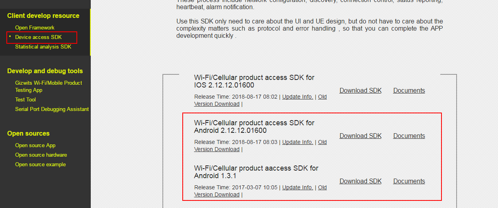

Step 2, import the jar package in Android Studio.

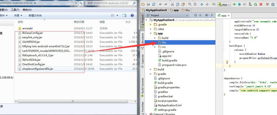

Step 3, add the jar files as libraries.


Step 4, import the so files.

Please create the folder jniLibs under the main folder and paste armeabi into the created folder:

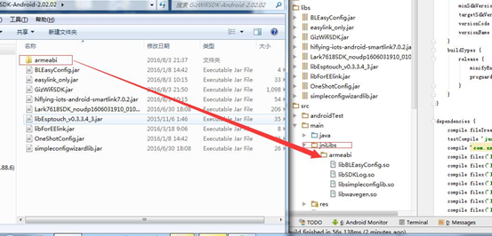

Step 5, after the import is completed, check the corresponding build.gradle

In the figure below, you can see the associated library:


Step 6, test if it is successful.


If there is a log in the picture below, it means success:


# The Gizwits App SDK workflow

## 1. General flow chart

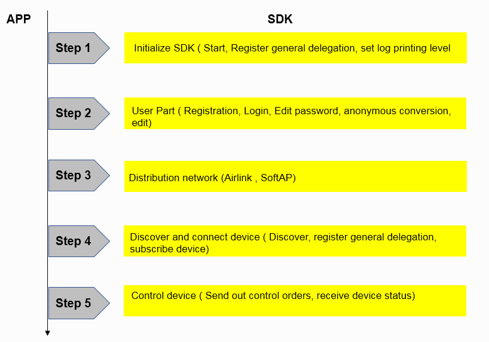

## 2. Key point description

1) The Gizwits App SDK has encapsulated all the activities related to user, configuration, discovery, connection, and control. You can use these APIs to develop the functions in the above flow chart without having to implement the communication protocol by yourself.

2) The Gizwits App SDK adopts the callback method, so it is necessary to set up necessary delegates, such as the common delegate and the device delegates. For more information, please refer to the detailed workflow. The SDK calls the App in the main thread.

3) The Gizwits App SDK supports Applications to transfer objects between Activities and between Activity and Service.

* You can use intent to pass objects between Activities.

(Send)

```
Intent intent = new Intent(Context, A.class);
	Bundle bundle = new Bundle();
	bundle.putParcelable("parameter name", device type object);
	intent.putExtras(bundle);
	startActivity(intent);
```

(Receive)

```
Intent intent = getIntent();
	intent.getParcelableExtra("parameter name");
```

* For passing objects between activity and service, it can be achieved by broadcast. One party sends data and the other party receives it.

(Register broadcast receiver)

```
IntentFilter filter = new IntentFilter();// Create IntentFilter object
	//Register a broadcast receiver to receive commands sent by the Activity to control the behaviors of the Service, such as: sending data, stopping services, etc.
	filter.addAction("AAAAAAA");
	//Register Broadcast Receiver
	registerReceiver(cmdReceiver, filter);
```

(Send broadcast)

```
Intent intent = new Intent();  
	intent.setAction("AAAAAAA");  
	Bundle bundle = new Bundle();
	bundle.putParcelable("parameter name",  device type object);
	intent.putExtras(bundle);
	sendOrderedBroadcast(intent, null);
```

* Obtain the Service object in the Activity via bindService, and directly call the Service method to get the desired device object.

## 3. Key point description

If your project uses Proguard obfuscation, in order to avoid the SDK being confused twice and the SDK cannot be used normally, be sure to add the following code snippet into proguard-project.txt:

```
-libraryjars libs/GizWifiSDK.jar
-dontwarn com.gizwits.**
-keep class com.gizwits.**{
    *;
}
```

And refer to the Android obfuscation file in project.properties:

```
proguard.config=${sdk.dir}/tools/proguard/proguard-android.txt:proguard-project.txt
```

# Detailed workflow of the Gizwits App SDK 

## 1. Initialization

### 1.1 Flow chart

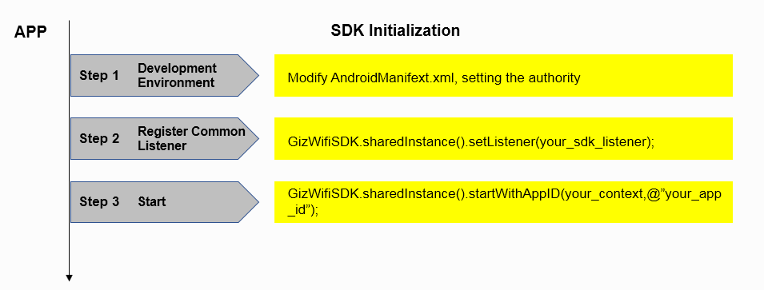

### 1.2 Set up the common listener

Registering the common listener for the SDK is to enable the App to receive events from GizWifiSDK class, which involves the callback interfaces such as registration, login, device configuration, and device binding. This is a very important listener in the use of the SDK, where the operations related to GizWifiSDK class will be called back. If the common listener is not properly registered, the SDK will not work normally. When registering the listener, you can implement callback interfaces on your behalf.

There are two recommended ways:

1) Instantiate a listener and register it once in each used Activity, and only implement the required callback interface. This method is more flexible and can be used in the service. But ensure that every time you start the activity you must register the listener, and multiple Activities cannot receive the callback at the same time.

[Code sample]

```
// Instantiate a listener
GizWifiSDKListener mListener = new GizWifiSDKListener() {

// Callback for user registration with mobile phone
Override
public void didRegisterUser(GizWifiErrorCode result, String uid, String token){
if (result == GizWifiErrorCode.GIZ_SDK_SUCCESS) {
// Success
} else {
// Failure
}
}
};

public void onCreate() {
super.onCreate();

// Register the listener
GizWifiSDK.sharedInstance().setListener(mListener);
// Call the SDK interface for user registration with mobile phone
GizWifiSDK.sharedInstance().registerUser("HelloGizwits", "12345678");
}
```

2) Instantiate a listener in a base class and throw the callback. The subclass inherits the base class, which eliminates the need for each subclass to instantiate the listener. In this way, by inheritance, multiple Activities can receive the callback. But this method cannot be used in the Service. Except where otherwise noted, the examples in this documentation use this method to register the listener.

[Code sample]

```
// Create a base class that instantiates and registers the listener
public class BaseActivity extends Activity {
private GizWifiSDKListener mListener = new GizWifiSDKListener() {
Override
public void didRegisterUser(GizWifiErrorCode result, String uid, String token) {
BaseActivity.this.didRegisterUser(result, uid, token);
}
};

public void didRegisterUser(GizWifiErrorCode result, String uid, String token)
{
// to do
}

Override
protected void onCreate(Bundle savedInstanceState) {
super.onCreate(savedInstanceState);

//Every time you start the activity, you must register the SDK listener to ensure that the SDK state can be passed into the callback correctly.
GizWifiSDK.sharedInstance().setListener(mListener);
}
}

//The subclass inherits the base class and implements the callback interface of the base class.
public class TestActivity extends BaseActivity {
    protected void onCreate(android.os.Bundle savedInstanceState) {
        //Call the parent class method
        super.onCreate(savedInstanceState);
        //Call the method for user registration 
GizWifiSDK.sharedInstance().registerUser ("your_phone_number", "your_ password", “your_verify_code”, GizUserAccountType.GizUserPhone);
}

@Override
public void didRegisterUser(GizWifiErrorCode result, String uid,  String token) {
if (result == GizWifiErrorCode.GIZ_SDK_SUCCESS) {
// Success
} else {
// Failure
}
}
}
```


### 1.3 Initialize the Gizwits App SDK

Before the SDK is launched, any feature is not working properly. When the SDK starts, it will be initialized and automatically discover devices in the current LAN. The SDK will report the discovered devices and corresponding events through the common listener. You can set the SDK's common listener first, then launch the SDK so as to handle these events.

When the SDK starts, the App AppID needs to be specified. You should register for the AppID for your own App in the Gizwits Developer Center. Please call the method in the App Application or the onCreate of the first started Activity with the specified AppID. This method only needs to be called once.

The SDK's log can help you discover issues that occur while the App is running. By default, the SDK outputs all log information to the debug terminal and log files. If the phone has an SD card, the log file will be saved on the SD card. If there is no SD card, it will only be saved in the application path. The log file directory on the SD card is GizWifiSDK/app_package_name/GizSDKLog under the path of the mobile phone SD card. If you do not want to output logs in the debugging terminal, you can change the log output level to GizLogPrintNone.

[Code sample]

```
public void onCreate() {
super.onCreate();
GizWifiSDK.sharedInstance().setListener(mListener);
GizWifiSDK.sharedInstance().startWithAppID(getApplicationContext(), "your_app_id");

GizWifiSDKListener mListener = new GizWifiSDKListener() {
@Override
public void didNotifyEvent(GizEventType eventType, Object eventSource, GizWifiErrorCode eventID, String eventMessage) {
if (eventType == GizEventType.GizEventSDK) {
// SDK event notification
	    		Log.i("GizWifiSDK", "SDK event happened: " + eventID + ", " + eventMessage);
} else if (eventType == GizEventType.GizEventDevice) {
	    		// Notification that may occur when the device is disconnected
	    		GizWifiDevice mDevice = (GizWifiDevice)eventSource;
	    		Log.i("GizWifiSDK", "device mac: " + mDevice.getMacAddress() + " disconnect caused by eventID: " + eventID + ", eventMessage: " + eventMessage);
} else if (eventType == GizEventType.GizEventM2MService) {
	    		// Notification for the M2M service exception
	    		Log.i("GizWifiSDK", "M2M domain " + (String)eventSource + " exception happened, eventID: " + eventID + ", eventMessage: " + eventMessage);
} else if (eventType == GizEventType.GizEventToken) {
	    		// Notification for invalid token
	    		Log.i("GizWifiSDK", "token " + (String)eventSource + " expired: " + eventMessage);
}
}
};
```

## 2. User Management

The user management of Gizwits IoT Cloud includes functions such as user registration, login, password recovery, and personal information modification. Gizwits IoT Cloud distinguishes users by APPID, and the users with different APPIDs are independent of each other. After changing the APPID of a user, you need to re-register the user.
The listener registration method involved in the following process is implemented using class inheritance.

### 2.1 Flow chart

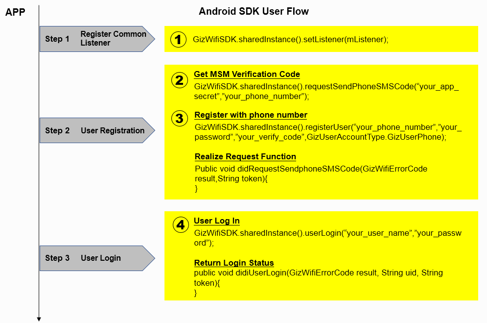

There are many ways for users to register, such as mobile phone number, user name, email address, etc. The App can take the method as needed. For other processes such as login, password change, personal information modification, etc., see the following section.

### 2.2 User registration

Gizwits provides three user registration methods, such as register via mobile phone, regular user registration, and register via Email.

#### 2.2.1 Register as a mobile phone user

To register an account with your mobile phone, you need a valid mobile phone number. Two steps are required for registration: get the SMS verification code and register the user with the SMS verification code.

Step 1: get the SMS verification code. The SDK sends a SMS verification code request to the cloud. If the request is successful, the cloud will respond a SMS verification code to the mobile phone.

[Code sample]

```
GizWifiSDK.sharedInstance().setListener(mListener);
GizWifiSDK.sharedInstance().requestSendPhoneSMSCode ("your_app_secret", "your_phone_number");

GizWifiSDKListener mListener = new GizWifiSDKListener() {
@Override
public void didRequestSendPhoneSMSCode(GizWifiErrorCode result, String token) {
if (result == GizWifiErrorCode.GIZ_SDK_SUCCESS) {
// Success
} else {
// Failure
}
}
}
```

Step 2: Register with SMS verification code. The App passes the SMS verification code received by the mobile phone to the SDK, and fills in the mobile phone number and password to register.

[Code sample]

```
GizWifiSDK.sharedInstance().setListener(mListener);
GizWifiSDK.sharedInstance().registerUser("your_phone_number", "your_password", "your_verify_code", GizUserAccountType.GizUserPhone);

GizWifiSDKListener mListener = new GizWifiSDKListener() {
@Override
public void didRegisterUser(GizWifiErrorCode result, String uid,  String token) {
if (result == GizWifiErrorCode.GIZ_SDK_SUCCESS) {
// Success
} else {
// Failure
}
}
}
```

#### 2.2.2 Register as a regular user

Register as a regular user account with a username and a password.

[Code sample]

```
GizWifiSDK.sharedInstance().setListener(mListener);
GizWifiSDK.sharedInstance().registerUser("your_user_name", "your_password", null, GizUserAccountType.GizUserNormal);

GizWifiSDKListener mListener = new GizWifiSDKListener() {
@Override
public void didRegisterUser(GizWifiErrorCode result, String uid,  String token) {
if (result == GizWifiErrorCode.GIZ_SDK_SUCCESS) {
// Success
} else {
// Failure
}
}
}
```

#### 2.2.3 Register as an Email user

Register a user account with a valid email address. After the registration is successful, the cloud will send an Email of the successful registration to the specified Email address.

[Code sample]

```
GizWifiSDK.sharedInstance().setListener(mListener);
GizWifiSDK.sharedInstance().registerUser("your_email_address", "your_password", null, GizUserAccountType.GizUserEmail);

GizWifiSDKListener mListener = new GizWifiSDKListener() {
@Override
public void didRegisterUser(GizWifiErrorCode result, String uid,  String token) {
if (result == GizWifiErrorCode.GIZ_SDK_SUCCESS) {
// Success
} else {
// Failure
}
}
}
```

### 2.3 User login

Gizwits IoT Cloud provides three user login methods: real-name login, anonymous login, and third-party authentication. Real-name login is suitable for those Apps which have login UI and need to register before use. Anonymous login is applicable to the Apps that do not have login UI and user accounts are automatically generated in the cloud when needed. The token obtained after login is valid in 7 days.

#### 2.3.1 Real-name login

For real-name login, the user name can be the registered mobile phone number, Email address, and regular user name. If the AppID is changed, the user account needs to be re-registered.

[Code sample]

```
GizWifiSDK.sharedInstance().setListener(mListener);
GizWifiSDK.sharedInstance().userLogin("your_user_name", "your_password");

GizWifiSDKListener mListener = new GizWifiSDKListener() {
@Override
public  void didUserLogin(GizWifiErrorCode result, String uid,  String token) {
if (result == GizWifiErrorCode.GIZ_SDK_SUCCESS) {
// Success
} else {
// Failure
}
}
}
```

#### 2.3.2 Anonymous login

Every time a user logs in anonymously, the obtained uid is the same. The SDK uses the Android ID to generate a login account. Each Android system has a separate Android ID, which will change after the system is flashed. Therefore, the anonymously logged in user information cannot be retained after the system is flashed.

[Code sample]

```
GizWifiSDK.sharedInstance().setListener(mListener);
GizWifiSDK.sharedInstance().userLoginAnonymous();

GizWifiSDKListener mListener = new GizWifiSDKListener() {
@Override
public  void didUserLogin(GizWifiErrorCode result, String uid,  String token) {
if (result == GizWifiErrorCode.GIZ_SDK_SUCCESS) {
// Success
} else {
// Failure
}
}
}
```

#### 2.3.3 Third-party authentication

Gizwit IoT Cloud currently supports third-party authentication from Baidu, Sina, and Tencent. You can use the APIs of these three platforms to obtain uid and token to log into Gizwits Cloud. When using third-party authentication, you do not need to register on Gizwits IoT Cloud, you can log in directly.

You can get uid and token through those APIs of Sina, Baidu or Tencent. For details, please refer to the corresponding development documentation. 

[Code sample]

```
// Take the Sina account as example
GizWifiSDK.sharedInstance().setListener(mListener);
GizWifiSDK.sharedInstance().loginWithThirdAccount(GizThirdAccountType.GizThirdSINA, "your_third_uid", "your_third_token");

GizWifiSDKListener mListener = new GizWifiSDKListener() {
@Override
public  void didUserLogin(GizWifiErrorCode result, String uid,  String token) {
if (result == GizWifiErrorCode.GIZ_SDK_SUCCESS) {
// Success
} else {
// Failure
}
}
}
```

### 2.4 Password reset

If you have forgotten your password, you can set a new password via mobile phone or Email, which are supported by the SDK. For the password reset via mobile phone, the verification code will sent to your mobile phone. For the password reset via Email, there will be a hyperlink delivered to your Email address which prompts you to complete the rest steps.

#### 2.4.1 Password reset via mobile phone

For the password reset via mobile phone, you need to get the SMS verification code. The approach of obtaining the SMS verification code is the same as when you registered with your mobile phone.

Step 1: get SMS verification code

[Code sample]

```
GizWifiSDK.sharedInstance().setListener(mListener);
GizWifiSDK.sharedInstance().requestSendPhoneSMSCode("your_app_secret", "your_phone_number");

GizWifiSDKListener mListener = new GizWifiSDKListener() {
@Override
public void didRequestSendPhoneSMSCode(GizWifiErrorCode result, String token) {
if (result == GizWifiErrorCode.GIZ_SDK_SUCCESS) {
// Success
} else {
// Failure
}
}
}
```

Step 2: Reset your password with SMS verification code

[Code sample]

```
GizWifiSDK.sharedInstance().setListener(mListener);
GizWifiSDK.sharedInstance().resetPassword("your_phone_number", "your_verify_code", "your_new_password", GizUserAccountType.GizUserPhone);

GizWifiSDKListener mListener = new GizWifiSDKListener() {
@Override
public  void didChangeUserPassword(GizWifiErrorCode result) {
if (result == GizWifiErrorCode.GIZ_SDK_SUCCESS) {
// Success
} else {
// Failure
}
}
}
```

#### 2.4.2 Password reset via Email

For the password reset via Email, the cloud sends a secure link to the specified Email address. You needs to check the Email in the mailbox and follow the instructions to perform the reset operation. It is possible that the password reset link is delivered into the trash folder of your mailbox, which you needs to be aware of.

The callback for the successful Email delivery is the same with the callback for the password change, so it is necessary to notice the distinction between these two cases.

[Code sample]

```
GizWifiSDK.sharedInstance().setListener(mListener);
GizWifiSDK.sharedInstance().resetPassword("your_email_address", null, "your_new_password", GizUserAccountType.GizUserEmail);

GizWifiSDKListener mListener = new GizWifiSDKListener() {
@Override
public  void didChangeUserPassword(GizWifiErrorCode result) {
if (result == GizWifiErrorCode.GIZ_SDK_SUCCESS) {
        		//The reset password email is sent successfully, prompting the user to check
} else {
        		//The reset password email failed to send, an error message pops up
}
}
}
```

### 2.5 Password change

The password can be changed after you log in.

[Code sample]

```
GizWifiSDK.sharedInstance().setListener(mListener);
GizWifiSDK.sharedInstance().changeUserPassword("your_token", "your_old_password", "your_new_password");

GizWifiSDKListener mListener = new GizWifiSDKListener() {
@Override
public  void didChangeUserPassword(GizWifiErrorCode result) {
if (result == GizWifiErrorCode.GIZ_SDK_SUCCESS) {
// Success
} else {
// Failure
}
}
}
```

### 2.6 User type conversion

An anonymous user can be converted to a real-name user, such as a regular user or a user registered with mobile phone. After the conversion, the anonymous user's information will be transferred to the real-name user, and the original anonymous user account will be invalid. However, the user name or the mobile phone number of the target user must be unregistered before conversion, otherwise it will fail.

#### 2.6.1 An anonymous user converted to a regular user

For an anonymous user converted to a regular user, set the username, password, and token of the target regular user.

[Code sample]

```
// An anonymous user converted to a regular user
GizWifiSDK.sharedInstance().setListener(mListener);
GizWifiSDK.sharedInstance().transAnonymousUser("your_token", "your_user_name", "your_password", null, GizUserAccountType.GizUserNormal);


GizWifiSDKListener mListener = new GizWifiSDKListener() {
@Override
public  void didTransAnonymousUser(GizWifiErrorCode result) {
if (result == GizWifiErrorCode.GIZ_SDK_SUCCESS) {
// Success
} else {
// Failure
}
}
}
```

#### 2.6.2 An anonymous user converted to a user registered with mobile phone

For an anonymous user converted to a mobile phone user, set the mobile phone number, password, SMS verification code, and token of the target user registered with mobile phone. The procedure of obtaining the SMS verification code is the same as when registering as a mobile phone user.

[Code sample]

```
// An anonymous user converted to a user registered with mobile phone
GizWifiSDK.sharedInstance().setListener(mListener);
GizWifiSDK.sharedInstance().transAnonymousUser("your_token", "your_phone_number", "your_password", "your_verify_code", GizUserAccountType. GizUserPhone);


GizWifiSDKListener mListener = new GizWifiSDKListener() {
@Override
public  void didTransAnonymousUser(GizWifiErrorCode result) {
if (result == GizWifiErrorCode.GIZ_SDK_SUCCESS) {
// Success
} else {
// Failure
}
}
}
```

### 2.7 Update user information

For real-name users, Gizwis does not support the regular user name modification. But you can modify the Email address and mobile phone number, supplement personal information after logging in, and the Email address or mobile phone number to be modified must be already registered.

After the real-name user has modified the email address or mobile phone number, he can log in using the modified email address or mobile phone number. The list of bound devices retrieved after login is the same as the original real-name user.

When you modify your Email address or mobile phone number, you can supplement your personal information at the same time. When you do not want to modify your personal information, the corresponding parameter can be set to nil. In the case of the Email address or user name is successfully modified and the personal information fails to be modified, the callback method will return success and prompt the failure reason of the personal information modification in errorMessage.

#### 2.7.1 Modify Email address

When only Email address is needed to be modified, the parameter of the personal information is set to nil, and the user type can be set to GizUserEmail. The following is a code sample to modify a user's Email address.

[Code sample]

```
GizWifiSDK.sharedInstance().setListener(mListener);
GizWifiSDK.sharedInstance().changeUserInfo("your_token", "your_email_address", null, GizUserAccountType.GizUserEmail, null);


GizWifiSDKListener mListener = new GizWifiSDKListener() {
@Override
public  void didChangeUserPassword(GizWifiErrorCode result) {
if (result == GizWifiErrorCode.GIZ_SDK_SUCCESS) {
// Success
} else {
// Failure
}
}
}
```

#### 2.7.2 Modify mobile phone number

When only the user's mobile phone number is needed to be modified, the personal information parameter is set to nil, and the user type can be set to GizUserPhone. Before modifying your mobile phone number, you need to get the SMS verification code. The following code sample is used to modify the user's mobile phone number. For the code to get the SMS verification code, please refer to the registration with mobile phone number. 

[Code sample]

```
GizWifiSDK.sharedInstance().setListener(mListener);
GizWifiSDK.sharedInstance().changeUserInfo("your_token", "your_phone_number", "your_verify_code", GizUserAccountType.GizUserPhone, null);


GizWifiSDKListener mListener = new GizWifiSDKListener() {
@Override
public  void didChangeUserPassword(GizWifiErrorCode result) {
if (result == GizWifiErrorCode.GIZ_SDK_SUCCESS) {
// Success
} else {
// Failure
}
}
}
```

#### 2.7.3 Modify personal information

When only the user's personal information is needed to be modified, the phone number or mailbox parameter is set to null, and the user type can be set to GizUserNormal. The personal information can contain multiple items, which can be specified by GizUserInfo class. The information that you do not want to modify is set to null, and the cloud will retain the last modified value.

[Code sample]

```
GizWifiSDK.sharedInstance().setListener(mListener);

GizUserInfo additionalInfo = new GizUserInfo();
additionalInfo.setName("nickname");
additionalInfo.setGender(GizUserGenderType.Male);
additionalInfo.setBirthday("1990-1-1");
additionalInfo.setAddress("Beijing");
additionalInfo.setRemark("home");

GizWifiSDK.sharedInstance().changeUserInfo("your_token", null, null, GizUserAccountType.GizUserNormal, additionalInfo);


GizWifiSDKListener mListener = new GizWifiSDKListener() {
@Override
public  void didChangeUserPassword(GizWifiErrorCode result) {
if (result == GizWifiErrorCode.GIZ_SDK_SUCCESS) {
// Success
} else {
// Failure
}
}
}
```

#### 2.7.4 Modify both Email addres and personal information

When modifying the Email address and personal information at the same time, the user type must be set to GizUserEmail.

[Code sample]

```
GizWifiSDK.sharedInstance().setListener(mListener);

GizUserInfo additionalInfo = new GizUserInfo();
additionalInfo.setName("nickname");
additionalInfo.setGender(GizUserGenderType.Male);
additionalInfo.setBirthday("1990-1-1");
additionalInfo.setAddress("Beijing");
additionalInfo.setRemark("home");

GizWifiSDK.sharedInstance().changeUserInfo("your_token", "your_email_address", null, GizUserAccountType.GizUserEmail, additionalInfo);


GizWifiSDKListener mListener = new GizWifiSDKListener() {
@Override
public  void didChangeUserPassword(GizWifiErrorCode result) {
if (result == GizWifiErrorCode.GIZ_SDK_SUCCESS) {
// Success
} else {
// Failure
}
}
}
```

#### 2.7.5 Modify both mobile phone number and personal information

When modifying the mobile phone number and personal information at the same time, the user type must be set to GizUserPhone. To modify the mobile phone number, you also need to get the SMS verification code first. For the SMS verification code, please refer to the registration with mobile phone. 

[Code sample]

```
GizWifiSDK.sharedInstance().setListener(mListener);

GizUserInfo additionalInfo = new GizUserInfo();
additionalInfo.setName("nickname");
additionalInfo.setGender(GizUserGenderType.Male);
additionalInfo.setBirthday("1990-1-1");
additionalInfo.setAddress("Beijing");
additionalInfo.setRemark("home");

GizWifiSDK.sharedInstance().changeUserInfo("your_token", "your_phone_number", "your_verify_code", GizUserAccountType.GizUserPhone, additionalInfo);


GizWifiSDKListener mListener = new GizWifiSDKListener() {
@Override
public  void didChangeUserPassword(GizWifiErrorCode result) {
if (result == GizWifiErrorCode.GIZ_SDK_SUCCESS) {
// Success
} else {
// Failure
}
}
}
```

## 3. Configure device to access network

Before controlling a device, you need to connect the device to a router. If the router can access internet, the device connected to the router will automatically register to Gizwits IoT Cloud.

There are two ways to configure the device to connect to the router. One is AirLink and the other is SoftAP. The App can adopt the favorite approach according to product requirements. Before configuration, the device must first enter the configuration mode, and then the App calls the configuration API to send the router SSID and password to be configured. After the device is successfully configured, the SDK returns the configured MAC address and product type identifier of the device to the App, which is convenient for the App to perform the next step. If the device has entered the configuration mode after reset and does not have time to get the DID from the cloud when the configuration is successful, the DID value obtained by the App is empty.

If the timeout period of the configuration API of the SDK is not over, the next configuration cannot be performed. In addition, because the broadcast packet of the successful device configuration can be received only if the App is connected to the same router, the above timeout period should reserve the time for the App to connect to the router.

It should be noted that if the device configured is not the expected product type for the App, the device will not appear in the App device list.

### 3.1 Flow chart

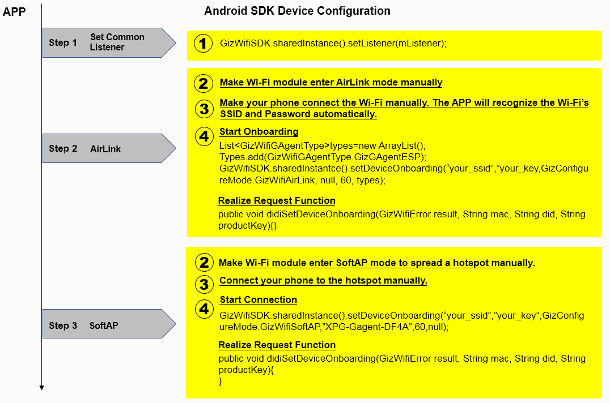
 
### 3.2 Configuration with AirLink

AirLink uses a UDP broadcast sent from a mobile phone which contains the target router SSID and password. Then the Wi-Fi module on the device automatically connects to the target router when receiving the broadcast. After connected to the router successfully, the Wi-Fi module notifies the mobile phone of the configuration's success by using broadcast.

After the Wi-Fi module enables AirLink mode, if it does not receive AirLink broadcast within one minute or is not able to connect to the router correctly, it will enter SoftAP mode.

[Code sample]

```
// Let the phone connect to the target Wi-Fi
// The MCU issues a serial port command to tell the module to enable AirLink mode. For details, please refer to "Gizwits Air Conditioner – Serial communication protocol for Gizwits IoT Cloud access"

// Configure the device to access the network and send the Wi-Fi SSID and password to be configured.
GizWifiSDK.sharedInstance().setListener(mListener);
List<GizWifiGAgentType> types = new ArrayList<GizWifiGAgentType> ();
types.add(GizWifiGAgentType.GizGAgentESP); 
// This code example uses the latest network configuration API (Espressif or Hanfeng firmware require the version of 040002027 or higher, other module types do not require the minimum version)
GizWifiSDK.sharedInstance().setDeviceOnboardingDeploy("your_ssid", "your_key", GizWifiConfigureMode.GizWifiAirLink, null, 60, types, false);

GizWifiSDKListener mListener = new GizWifiSDKListener() {
//Wait for configuration to complete or timeout, then call back the configuration completion interface
@Override
public  void didSetDeviceOnboarding (GizWifiErrorCode result, String mac, String did, String productKey) {
if (result == GizWifiErrorCode.GIZ_SDK_SUCCESS) {
            // Configuration is successful
		} else if (result == GIZ_SDK_DEVICE_CONFIG_IS_RUNNING) {
		// Configuration in progress
} else {
            // Failed to configure
}
}
};
```

### 3.3 Configuration with SoftAP

After the device enters SoftAP mode, a Wi-Fi hotspot is created on it. After the mobile phone is connected to this hotspot, the SSID and password to be used are sent to the device. After receiving the SoftAP configuration package, the Wi-Fi module on the device automatically connects to the target router. Just like the AirLink, after connected to the router successfully, the Wi-Fi module notifies the mobile phone of the configuration's success by using broadcast.

Using the Wi-Fi module firmware provided by Gizwits, the Wi-Fi hotspot created by the device starts with “XPG-GAgent-” and the password is “123456789”. Modules provided by other vendors, SoftAP hotspot names are specified by respective vendors. The App can give the correct hotspot prefix as needed.

[Code sample]

```
// The MCU issues a serial port command to tell the module to enable SoftAP mode. For details, please refer to "Gizwits Air Conditioner – Serial communication protocol for Gizwits IoT Cloud access"
//Let the phone connect to the module's SoftAP hotspot

//Configure the device to access the network and send the Wi-Fi SSID and password to be configured.
GizWifiSDK.sharedInstance().setListener(mListener);
// This code example uses the latest network configuration API (Espressif or Hanfeng firmware require the version of 040002027 or higher, other module types do not require the minimum version)
GizWifiSDK.sharedInstance().setDeviceOnboardingDeploy("your_ssid", "your_key", GizWifiConfigureMode.GizWifiSoftAP, "your_gagent_hotspot_prefix", 60, null, false);

//The module receives the configuration information, tries to connect to the router and automatically turns off the hotspot
//Let the phone connect to the configured Wi-Fi network

GizWifiSDKListener mListener = new GizWifiSDKListener() {
//Wait for configuration to complete or timeout, then call back the configuration completion interface
@Override
public  void didSetDeviceOnboarding (GizWifiErrorCode result, String mac, String did, String productKey) {
if (result == GizWifiErrorCode.GIZ_SDK_SUCCESS) {
            // Success
} else {
            // Failure
}
}
};
```

## 4. Device discovery and subscription

### 4.1 Flow chart

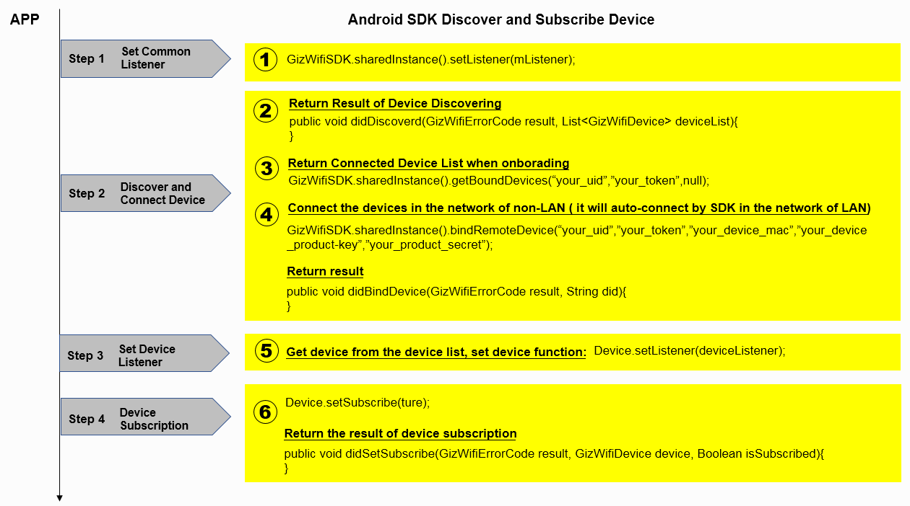
 
### 4.2 Device discovery

After setting a delegate for the App and launching the SDK, the App can receive the push notification of device list from the SDK. Each time there are changes for the devices in the current LAN or bound devices, the SDK will automatically report the latest device list. When a device is powered off and then powered on, or a new device comes online, the device list will be refreshed. After the user logs in, the SDK will automatically report the list of devices that the user has bound to the App. The bound device can be obtained by the same user account on different mobile phones.

If the App wants to refresh the list of bound devices, you can call the bound device list API and specify the product type identifier that you care about. The SDK will return the filtered device list to the App.

The SDK provides a device list cache, and device objects in the device list remain valid throughout the App lifecycle. The cached device list is updated synchronously with the most recently discovered devices.

[Code sample]

```
// Refresh the UI with a cached device list
List<GizWifiDevice> devices = GizWifiSDK.sharedInstance().getDeviceList();

// Receive the reported device list change, refresh UI
GizWifiSDKListener mListener = new GizWifiSDKListener() {
@Override
public  void didDiscovered(GizWifiErrorCode result, List<GizWifiDevice> deviceList) {
        // Prompt error reason
        if(result != GizWifiErrorCode.GIZ_SDK_SUCCESS) {
            Log.d("", "result: " + result.name());
        }
        // Display the changed list of devices
        Log.d("", "discovered deviceList: " + deviceList);
devices = deviceList;
}
};

// Actively refresh the list of bound devices, specify productKey to filter devices 
List<String> pks = new ArrayList<String> ();
pks.add("your_productKey");
GizWifiSDK.sharedInstance().getBoundDevices("your_uid", "your_token", pks);
```

### 4.3 Set device delegate

Get the device objects in the device list, set the device delegate for each of them, in order to refresh the device related UI. The App implements the corresponding callback according to its own needs.

### 4.4 Device subscription and binding

After the App gets the device list and sets delegate, you can subscribe to the device. The subscribed device will be automatically bound and automatically log in. After the device logs in successfully, it will automatically report the latest status.

The automatically bound devices are limited to the same LAN where your App resides. For devices that cannot be discovered in the LAN, the App can bind them manually. A device that is successfully bound must be subscribed before it can be used.

Whether it is manual binding or automatic binding, the remark and alias information of the device must be set after the device is successfully bound.

If the device is unsubscribed, the connection will be disconnected and commands are not able to be issued to the device.

#### 4.4.1 Device subscription

All devices obtained through the SDK can be subscribed, and the subscription result is returned via callback. Status query and command issuing can only be perform on those successfully subscribed devices when their network becomes available.

[Code sample]

```
// Take the first device instance in the device list as an example, set the listener for it.
GizWifiDevice mDevice = null;
for (int i = 0; i < deviceList.size(); i++) {
	mDevice = deviceList[0];
mDevice.setListener(mListener);
mDevice.setSubscribe(true);
break;
}

GizWifiDeviceListener mListener = new GizWifiDeviceListener() {
@Override
public  void didSetSubscribe(GizWifiErrorCode result, GizWifiDevice device, boolean isSubscribed) {
if (result == GizWifiErrorCode.GIZ_SDK_SUCCESS) {
// Success
} else {
// Failure
}
}
};
```

#### 4.4.2 Non-LAN device binding

The App can complete the binding of the non-LAN device through the MAC, productKey, and productSecret of the device. The above information can be used to generate a QR code, which will be used by the App to bind the device. GPRS devices, Bluetooth devices, etc. are devices that cannot be discovered through the Wi-Fi LAN, and all belong to non-LAN devices.

[Code sample]

```
GizWifiSDK.sharedInstance().setListener(mListener);
GizWifiSDK.sharedInstance().bindRemoteDevice ("your_uid", "your_token", "your_device_mac", "your_device_product_key", "your_product_secret");


GizWifiSDKListener mListener = new GizWifiSDKListener() {
@Override
public void didBindDevice(GizWifiErrorCode result, String did) {
if (result == GizWifiErrorCode.GIZ_SDK_SUCCESS) {
            // Success
} else {
            // Failure
}
}
};
```

#### 4.4.3 Set device binding information

You can also set the binding information of the device without subscribing to it. Find the device you want to modify the remark and alias information in the device list if it is bound already.

[Code sample]

```
// mDevice is the device entity object obtained from the device list, setting the listener for it.
mDevice.setCustomInfo("your_remark", "your_alias");


GizWifiDeviceListener mListener = new GizWifiDeviceListener() {
@Override
public void didSetCustomInfo(GizWifiErrorCode result, GizWifiDevice device) {
if (result == GizWifiErrorCode.GIZ_SDK_SUCCESS) {
// Success
} else {
// Failure
}
}
};
```

### 4.5 Unbind device

The bound device can be unbound. To unbind a device requires the App to invoke the API to complete the operation. The SDK does not support automatic unbinding. For the device subscribed to, after unbound, it will be un-subscribed and disconnected and not report status. Thus, the App will not get the device when it refreshes the device list.

[Code sample]

```
GizWifiSDK.sharedInstance().setListener(mListener);
GizWifiSDK.sharedInstance().unbindDevice("your_uid", "your_token", "your_device_did");


GizWifiSDKListener mListener = new GizWifiSDKListener() {
@Override
public void didUnbindDevice(GizWifiErrorCode result, String did) {
if (result == GizWifiErrorCode.GIZ_SDK_SUCCESS) {
            // Success
} else {
            // Failure
}
}
};
```

### 4.6 Get hardware information

Hardware information can be obtained without subscribing to the device. The App can get hardware information such as the module protocol version number and the MCU firmware version number, but only by the way of Micro Cycle.

[Code sample]

```
// mDevice is the device entity object obtained from the device list, setting the listener for it.
mDevice.setListener(mListener);
mDevice.getHardwareInfo();


GizWifiDeviceListener mListener = new GizWifiDeviceListener() {
@Override
public  void didGetHardwareInfo(GizWifiErrorCode result, GizWifiDevice device, ConcurrentHashMap<String, String> hardwareInfo) {
StringBuilder sb = new StringBuilder();
if(result == GizWifiErrorCode.GIZ_SDK_SUCCESS) {
sb.append("Wifi Hardware Version:" + hardwareInfo.get("wifiHardVersion")
						+ "\r\n");
sb.append("Wifi Software Version:" + hardwareInfo.get("wifiSoftVersion")
						+ "\r\n");
sb.append("MCU Hardware Version:" + hardwareInfo.get("mcuHardVersion")
						+ "\r\n");
sb.append("MCU Software Version:" + hardwareInfo.get("mcuSoftVersion")
						+ "\r\n");
sb.append("Firmware Id:" + hardwareInfo.get("wifiFirmwareId") + "\r\n");
sb.append("Firmware Version:" + hardwareInfo.get("wifiFirmwareVer")
						+ "\r\n");
sb.append("Product Key:" + hardwareInfo.get("productKey") + "\r\n");
sb.append("Device ID:" + device.getDid() + "\r\n");
sb.append("Device IP:" + device.getIPAddress() + "\r\n");
sb.append("Device MAC:" + device.getMacAddress() + "\r\n");

}else{
sb.append("获取失败，错误号：" + result);
}

Message msg = new Message();
msg.what = HARDWARE;
msg.obj = sb.toString();
handler.sendMessage(msg);
}
};
```

## 5. Device control 

The SDK controls devices and receives device status through dictionary key-value pairs. After receiving dictionary key-value pairs of a command sent by the App, the SDK parses the data that can be recognized by the device and sends it to the device. In the opposite direction, after receiving the data that the device replies or reports, the SDK parses it to dictionary key-value pairs and reports it to the App.

The GAgent firmware needs to be flashed onto the smart device correctly. If Data Points are defined for the device, the commands sent by the App must conform to the Data Point definition. If there is no Data Point defined for the device, the commands can be issued in a custom format.

### 5.1 Flow chart

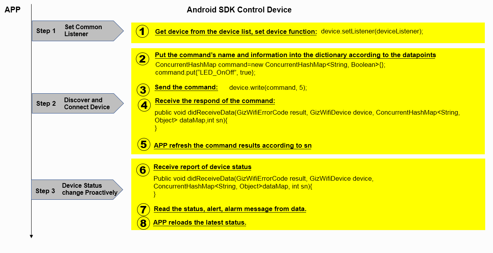

### 5.2 Send commands

After the device subscription becomes available, the App can send commands, which are in dictionary format, with key-value pairs being Data Point names and values. The response is returned in the didReceiveData callback.

When the App issues an command in which the parameter sn can be specified, and the parameter sn in the callback can indicate whether the issued command is successfully sent. However, the callback parameter dataMap may be an empty dictionary, depending on whether the device passes the current Data Point status when replying.

If the App only concerns whether there is a device status report after the command is issued, the parameter sn of the issued command can be set to 0, and the callback parameter sn is also 0.

[Code sample]

```
// mDevice is the device entity object obtained from the device list, setting the listener for it.
mDevice.setListener(mListener);

// After the device is subscribed and becomes controllable, the light-on action is performed.
int sn = 5;
ConcurrentHashMap<String, Object> command = new ConcurrentHashMap<String, Object> ();
command.put("LED_OnOff", true);
mDevice.write(command, sn);


GizWifiDeviceListener mListener = new GizWifiDeviceListener() {
@Override
public  void didReceiveData(GizWifiErrorCode result, GizWifiDevice device, ConcurrentHashMap<String, Object> dataMap, int sn) {
if (result == GizWifiErrorCode.GIZ_SDK_SUCCESS) {
if (sn == 5) {
		// The command sequence number matches, and the light-on command is executed successfully.
} else {
		// ACK for other command or data report
}
} else {
// Failure
}
}
};
```

### 5.3 Get device status

After the device subscription becomes available, the App can receive the device status report at any time through the didReceiveData callback. When the device reports its status, the callback parameter sn is 0, and the callback parameter dataMap has the status reported by the device.

[Code sample]

```
GizWifiDeviceListener mListener = new GizWifiDeviceListener() {
@Override
public void didReceiveData(GizWifiErrorCode result, GizWifiDevice device, ConcurrentHashMap<String, Object> dataMap, int sn) {
if (result == GizWifiErrorCode.GIZ_SDK_SUCCESS) {

    // Defined device Data Points with boolean, numeric, and enumeration data
    if (dataMap.get("data") != null) {
	ConcurrentHashMap<String, Object> map = (ConcurrentHashMap<String, Object>) dataMap.get("data");

		// Regular Data Points, print the corresponding key and value pairs
		StringBuilder sb = new StringBuilder();
		for (String key : map.keySet()) {
			sb.append(key + "  :" + map.get(key) + "\r\n");
			Toast.makeText(DeviceControlActivity.this,
					sb.toString(), Toast.LENGTH_SHORT).show();
		}

		// extension type Data Point, if the key is "BBBB"
		byte[] bytes = (byte[]) map.get("BBBB");
		String string = Arrays.toString(bytes);
		Toast.makeText(DeviceControlActivity.this,
				string, Toast.LENGTH_SHORT).show();
	}

        // The device defined fault Data Points. After the device failures occurred, the field is populated. If there is no fault, it is empty.
	if (dataMap.get("faults") != null) {
	ConcurrentHashMap<String, Object> map =  (ConcurrentHashMap<String, Object>)dataMap.get("faults");
		StringBuilder sb = new StringBuilder();

		for (String key : map.keySet()) {
			sb.append(key + "  :" +  map.get(key) + "\r\n");
			Toast.makeText(DeviceControlActivity.this,
					sb.toString(), Toast.LENGTH_SHORT).show();
		}
	}

        // The device defined alarm Data Points. After the device has alarms, the field is populated. If there is no alarm, it is empty.
	if (dataMap.get("alerts") != null) {
	ConcurrentHashMap<String, Object> map =  (ConcurrentHashMap<String, Object>)dataMap.get("alerts");
		StringBuilder sb = new StringBuilder();

		for (String key : map.keySet()) {
					sb.append(key + "  :" +  map.get(key) + "\r\n");
					Toast.makeText(DeviceControlActivity.this,
					sb.toString(), Toast.LENGTH_SHORT).show();
		}
	}

        // Transparent transmission, no defined Data Points, suitable for developers to define their own protocols
	if (dataMap.get("binary") != null) {
		byte[] binary = (byte[]) dataMap.get("binary");
		Log.i("", "Binary data:"
				+ bytesToHex(binary, 0, binary.length));
	}
    }
}
};
```

### 5.4 Device status query

After the device subscription becomes available, the App can query the device status. The device status query result is also obtained by the didReceiveData callback, and the callback parameter sn is 0. The callback parameter dataMap has the status of the returned status.

[Code sample]

```
// mDevice is the device entity object obtained from the device list, setting the listener for it
mDevice.setListener(mListener);
mDevice.getDeviceStatus();


GizWifiDeviceListener mListener = new GizWifiDeviceListener() {
    @Override
    public  void didReceiveData(GizWifiErrorCode result, GizWifiDevice device, ConcurrentHashMap<String, Object> dataMap, int sn) {
        if (result == GizWifiErrorCode.GIZ_SDK_SUCCESS) {
            // The data parse is the same as section 3.5.3
        } else {
            // Failure
        }
    }
};
```

## 6. Device task scheduling

By setting up a scheduled task for a device, you can have the device perform certain actions on a predetermined date and time. These tasks can be repeated on certain days of each month or on certain days of each week.

Scheduled tasks can be set first and then executed or stopped at any time. The scheduled task is enabled by default when it is created.

### 6.1 Flow chart

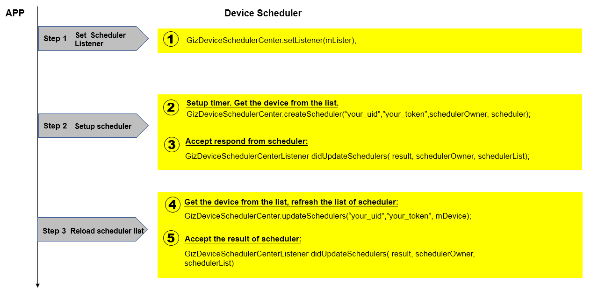

### 6.2 Create a scheduled task

Scheduled tasks can be executed repeatedly or only once, and repeated tasks are divided into monthly occurring tasks and weekly occurring tasks. However, you can only specify one type of repetition at the same time, that is, not repeated or repeated on a weekly basis or repeated on a monthly basis.

When using the SDK API, the parameter weekDays is set for weekly occurring tasks and the parameter monthDays is set for monthly occurring tasks. However, if both are set, only the parameter weekDays will be used.

The following three examples are shown below.

#### 6.2.1 Create a one-time scheduled task

Suppose we need to turn on a light at 6:30 am on January 16, 2017. In the following code, the date and time are set to the corresponding values, where the date is 2017-01-16, the time is 06:30 (in 24-hour format).

[Code sample]

```
// Set up scheduled task listener
GizDeviceSchedulerCenter.setListener(mListener);

// Create a one-time scheduled task，to turn on a light at 6:30 am on January 16, 2017. 
GizDeviceScheduler scheduler = new GizDeviceScheduler();
scheduler.setDate("2017-01-16");
scheduler.setTime("06:30");
scheduler.setRemark("开灯任务");
ConcurrentHashMap<String, Object> attrs = new ConcurrentHashMap<String, Object>();
attrs.put("LED_OnOff", true);
scheduler.setAttrs(attrs);

// Create a scheduled task for the device mDevice that is the device object obtained in the device list.
GizDeviceSchedulerCenter.createScheduler("your_uid", "your_token", mDevice, scheduler);

GizDeviceSchedulerCenterListener mListener = new GizDeviceSchedulerCenterListener() {
    @Override
    public void didUpdateSchedulers(GizWifiErrorCode result, GizWifiDevice schedulerOwner, List<GizDeviceScheduler> schedulerList) {
        if (result == GizWifiErrorCode.GIZ_SDK_SUCCESS) {
            // Success
        } else {
            // Failure
        }
    }
};
```

#### 6.2.2 Create a weekly occurring scheduled task

We now get the scheduled task executed on a weekly basis, and we have to turn on a light every Monday to Friday at 6:30 in the morning.

[Code sample]

```
// Set up scheduled task listener
GizDeviceSchedulerCenter.setListener(mListener);

// Create a weekly occurring scheduled task to turn on a light every Monday to Friday 
GizDeviceScheduler scheduler = new GizDeviceScheduler();
scheduler.setDate("2017-01-16");
scheduler.setTime("06:30");
scheduler.setRemark("开灯任务");
ConcurrentHashMap<String, Object> attrs = new ConcurrentHashMap<String, Object>();
attrs.put("LED_OnOff", true);
scheduler.setAttrs(attrs);
List<GizScheduleWeekday> weekDays = new ArrayList<GizScheduleWeekday>();
weekDays.add(GizScheduleWeekday.GizScheduleMonday);
weekDays.add(GizScheduleWeekday.GizScheduleTuesday);
weekDays.add(GizScheduleWeekday.GizScheduleWednesday);
weekDays.add(GizScheduleWeekday.GizScheduleThursday);
weekDays.add(GizScheduleWeekday.GizScheduleFriday);
scheduler.setMonthDays(monthDays);

// Create a scheduled task for the device mDevice that is the device object obtained in the device list.
GizDeviceSchedulerCenter.createScheduler("your_uid", "your_token", mDevice, scheduler);


GizDeviceSchedulerCenterListener mListener = new GizDeviceSchedulerCenterListener() {
    @Override
    public void didUpdateSchedulers(GizWifiErrorCode result, GizWifiDevice schedulerOwner, List<GizDeviceScheduler> schedulerList) {
        if (result == GizWifiErrorCode.GIZ_SDK_SUCCESS) {
            // Success
        } else {
            // Failure
        }
    }
};
```

#### 6.2.3 Create a monthly occurring scheduled task

We now get the scheduled tasks executed on a monthly basis, and we have to turn on the light on the 1st and 15th of each month at 6:30 in the morning. 

Note that do not set a weekly occurring scheduled task together with a monthly occurring scheduled task. If you do so, the monthly occurring scheduled task will be ignored. 

[Code sample]

```
// Set up scheduled task listener
GizDeviceSchedulerCenter.setListener(mListener);

// Create a monthly occurring scheduled task to turn on the light on the 1st and 15th of each month
GizDeviceScheduler scheduler = new GizDeviceScheduler();
scheduler.setDate("2017-01-16");
scheduler.setTime("06:30");
scheduler.setRemark("开灯任务");
ConcurrentHashMap<String, Object> attrs = new ConcurrentHashMap<String, Object>();
attrs.put("LED_OnOff", true);
scheduler.setAttrs(attrs);
List<Integer> monthDays = new ArrayList<Integer>();
monthDays.add(1);
monthDays.add(15);
scheduler.setMonthDays(monthDays);

// Create a scheduled task for the device mDevice that is the device object obtained in the device list.
GizDeviceSchedulerCenter.createScheduler("your_uid", "your_token", mDevice, scheduler);


GizDeviceSchedulerCenterListener mListener = new GizDeviceSchedulerCenterListener() {
    @Override
    public void didUpdateSchedulers(GizWifiErrorCode result, GizWifiDevice schedulerOwner, List<GizDeviceScheduler> schedulerList) {
        if (result == GizWifiErrorCode.GIZ_SDK_SUCCESS) {
            // Success
        } else {
            // Failure
        }
    }
};
```

### 6.3 Obtain the scheduled task list

After creating a scheduled task, you can get a list of all scheduled tasks that have been created. After obtaining the scheduled task list, you can modify or delete any created scheduled task in the list.

[Code sample]

```
// Set up scheduled task listener
GizDeviceSchedulerCenter.setListener(mListener);

// Synchronize the scheduled task list of the device mDevice that is the device object obtained in the device list.
GizDeviceSchedulerCenter.updateSchedulers("your_uid", "your_token", mDevice);


GizDeviceSchedulerCenterListener mListener = new GizDeviceSchedulerCenterListener() {
    @Override
    public void didUpdateSchedulers(GizWifiErrorCode result, GizWifiDevice schedulerOwner, List<GizDeviceScheduler> schedulerList) {
        if (result == GizWifiErrorCode.GIZ_SDK_SUCCESS) {
            // Success
        } else {
            // Failure
        }
    }
};
```

### 6.4 Modify a scheduled task

You can modify a scheduled task that has been created. When modifying, the scheduled task object is taken out from the obtained scheduled task list.

Note that once a scheduled task is created, it is assigned an ID that cannot be modified.

[Code sample]

```
// Set up scheduled task listener
GizDeviceSchedulerCenter.setListener(mListener);

// Modify the previously created one-time scheduled task to a scheduled task that is executed repeatedly on the 1st and 15th of each month. The scheduler is the scheduled task object to be modified in the scheduled task list.
scheduler.setTime("06:30");
scheduler.setRemark("开灯任务");
ConcurrentHashMap<String, Object> attrs = new ConcurrentHashMap<String, Object>();
attrs.put("LED_OnOff", true);
scheduler.setAttrs(attrs);
List<Integer> monthDays = new ArrayList<Integer>();
monthDays.add(1);
monthDays.add(15);
scheduler.setMonthDays(monthDays);

// Modify the scheduled task of the device mDevice that is the device object in the device list to create a scheduled task.
GizDeviceSchedulerCenter.editScheduler("your_uid", "your_token", mDevice, scheduler);


GizDeviceSchedulerCenterListener mListener = new GizDeviceSchedulerCenterListener() {
    @Override
    public void didUpdateSchedulers(GizWifiErrorCode result, GizWifiDevice schedulerOwner, List<GizDeviceScheduler> schedulerList) {
        if (result == GizWifiErrorCode.GIZ_SDK_SUCCESS) {
            // Success
        } else {
            // Failure
        }
    }
};
```

### 6.5 Delete a scheduled task

In the obtained scheduled task list, find the scheduled task ID to be deleted and delete it.

[Code sample]

```
// Set up scheduled task listener
GizDeviceSchedulerCenter.setListener(mListener);

// Delete the scheduled task list of the device mDevice that is the device object obtained in the device list. your_scheduler_id is the ID of the scheduled task to be deleted.
GizDeviceSchedulerCenter.deleteScheduler("your_uid", "your_token", mDevice, "your_scheduler_id");


GizDeviceSchedulerCenterListener mListener = new GizDeviceSchedulerCenterListener() {
    @Override
    public void didUpdateSchedulers(GizWifiErrorCode result, GizWifiDevice schedulerOwner, List<GizDeviceScheduler> schedulerList) {
        if (result == GizWifiErrorCode.GIZ_SDK_SUCCESS) {
            // Success
        } else {
            // Failure
        }
    }
};
```

## 7. Device Sharing

After binding a device, you can let others use the device through Device Sharing. In order to facilitate multiple customers use the same device, Device Sharing provides device permission management with a more secure and convenient device binding. There are four types of device permissions for device binding:

* Owner: The primary account of the device, who can share the device;
* Guest: The guest account of the device, who can accept the sharing invitation and can no longer share the device to other users;
* Special: The account who has bound to the device at the earliest but has not shared the device, and will become the Owner of the device after sharing it;
* Normal: The account that has bound to the device but cannot share the device or become the Owner of the device.

Only the user bound to a device at the earliest or the Owner of a device can share the device. Once a device has an Owner account, other users can no longer bind the device. The Owner can view the currently users bound to the device and can unbind other users. When a device does not have an Owner, other users can bind the device.

### 7.1 Flow chart

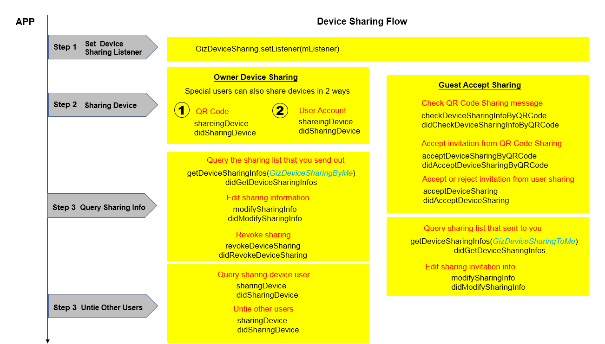

### 7.2 Make a Device Sharing invitation

Before sharing your devices, check which devices you can share. Using the SDK, the App can traverse the list of devices and find those devices on which the currently logged in user has a permission of GizDeviceSharingSpecial or GizDeviceSharingOwner to create a Device Sharing invitation.

There are two ways to create a Device Sharing invitation by Owner and Special: Device Sharing via user ID and Device Sharing via QR code.

#### 7.2.1 Device Sharing via user ID

For Device Sharing via user ID, the receiver's ID can be a mobile phone number, an email address, a regular user name, or an anonymous ID, but it must be a user who has already registered in Gizwits IoT Cloud. If the user is already the Guest of this device or has already bound the device, the sharing invitation will fail to be created. The sharing invitation is valid for 24 hours, that is, the receiver must respond within 24 hours, otherwise the invitation will expire. 

You need to specify the user ID type. The guestUser parameter for the anonymous user should be set to the uid of the anonymous user. When the Account Sharing is created successfully, the sharingID will be returned in the callback parameter, but the QRCodeImage will not be returned. The following is only an example of Device Sharing to a user registered with mobile phone number:

[Code sample]

```
// Set Device Sharing listener
GizDeviceSharing.setListener(mListener);

// Find devices that can be shared in the device list

// Share the device via phone number
GizDeviceSharing.sharingDevice("your_token", "your_device_id", GizDeviceSharingWay.GizDeviceSharingByNormal, "guest_phone_number", GizUserAccountType.GizUserPhone);

GizDeviceSharingListener mListener = new GizDeviceSharingListener() {
 
    @Override
    public void didSharingDevice(GizWifiErrorCode result, String deviceID, int sharingID, Bitmap QRCodeImage) {
        if (result == GizWifiErrorCode.GIZ_SDK_SUCCESS) {
            // Success
        } else {
            // Failure
        }
    }
};
```

#### 7.2.2 Device Sharing via QR code

For the Device Sharing via QR code, the QR code is valid for 15 minutes, that is, the receiver must scan the generated QR code within 15 minutes and respond, otherwise the QR code invitation will expire. When the QR code Sharing invitation is created successfully, the sharingID will be returned in the callback parameter, and the corresponding QRCodeImage will also be returned. The App can directly load the QR code image.

[Code sample]

```
// Set Device Sharing listener
GizDeviceSharing.setListener(mListener);

// Find devices that can be shared in the device list

// Share the device via QR code
GizDeviceSharing.sharingDevice("your_token", "your_device_id", GizDeviceSharingWay.GizDeviceSharingByQRCode, null, null);

GizDeviceSharingListener mListener = new GizDeviceSharingListener() {
 
    @Override
    public void didSharingDevice(GizWifiErrorCode result, String deviceID, int sharingID, Bitmap QRCodeImage) {
        if (result == GizWifiErrorCode.GIZ_SDK_SUCCESS) {
            // Success
        } else {
            // Failure
        }
    }
};
```

### 7.3 Accept sharing invitation

The Guest account can query the received sharing invitations. Only the Guest account can accept the sharing invitation.

If a sharing invitation received by the Guest has not yet been accepted, the Guest can accept or reject it.

[Code sample]

```
// Set Device Sharing listener
GizDeviceSharing.setListener(mListener);

// Query the list of sharing invitations sent to you
GizDeviceSharing.getDeviceSharingInfos("your_token", GizDeviceSharingType.GizDeviceSharingToMe, "your_device_id");

GizDeviceSharingListener mListener = new GizDeviceSharingListener() {

 
    @Override
    public void didGetDeviceSharingInfos(GizWifiErrorCode result, String deviceID, List<GizDeviceSharingInfo> deviceSharingInfos) {
        if (result == GizWifiErrorCode.GIZ_SDK_SUCCESS) {

	    	// Successfully retrieved. Find the share invitations that have not yet been accepted in deviceSharingInfos. your_sharing_id is the ID of the share invitation to be acceptted
	    	int your_sharing_id = -1;
	    	for (int i = 0; i < deviceSharingInfos.size(); i++) {
	    		GizDeviceSharingInfo mDeviceSharing = deviceSharingInfos.get(i);
	    		if (mDeviceSharing.getStatus() == GizDeviceSharingStatus.GizDeviceSharingNotAccepted) {
	    			your_sharing_id = mDeviceSharing.getId();
	    			break;
	    		}
	    	}
    
	    	// Accept invitation
	    	if (your_sharing_id != -1) {
	    		GizDeviceSharing.acceptDeviceSharing("your_token", your_sharing_id, true);
	    	}

        } else {
            // Failed to retrieve
        }
    }

 
    @Override
    public void didAcceptDeviceSharing(GizWifiErrorCode result, int sharingID) {
        if (result == GizWifiErrorCode.GIZ_SDK_SUCCESS) {
            // Success
        } else {
            // Failure
        }
    }
};
```

# See Also

See [Gizwits App Code Auto-Generator](http://docs.gizwits.com/en-us/AppDev/AppCodeAutoGenerator.html) to learn about the functionality of the automatically generated App code.

See "Gizwits App Framework" to grasp

* [Gizwits App Framework for iOS](http://docs.gizwits.com/en-us/AppDev/iOSFramework.html)
* [Push notification integration for iOS App](http://docs.gizwits.com/en-us/AppDev/iOSPushNotification.html)
* [Third-party authentication and re-skin for iOS App](http://docs.gizwits.com/en-us/AppDev/iOSAuthReSkin.html)
* [Quick start with iOS App development](http://docs.gizwits.com/en-us/AppDev/iOSDevQuickStart.html)
* [Gizwits App Framework for Android](http://docs.gizwits.com/en-us/AppDev/AndroidFramework.html)
* [Push notification integration for Android App](http://docs.gizwits.com/en-us/AppDev/AndroidPushNotification.html)
* [Third-party authentication and re-skin for Android](http://docs.gizwits.com/en-us/AppDev/AndroidAuthReSkin.html)
* [Quick start with Android App development](http://docs.gizwits.com/en-us/AppDev/AndroidDevQuickStart.html)
* [Gizwits App Framework for APICloud](http://docs.gizwits.com/en-us/AppDev/APICloudFramework.html)

See "App Development SDK" to develop your IoT App

* [Gizwits App SDK for Android](http://docs.gizwits.com/en-us/AppDev/AndroidSDKA2.html)
* [Gizwits App SDK for iOS](http://docs.gizwits.com/en-us/AppDev/iOSSDKA2.html)
* [Gizwits App SDK for APICloud](http://docs.gizwits.com/en-us/AppDev/APICloudSDK.html)
* [Data transparent transmission](http://docs.gizwits.com/en-us/AppDev/TransparentTransmission.html)
* [Get Gizwits App SDK debug log](http://docs.gizwits.com/en-us/AppDev/SDKLogCapture.html)
* [SDK error codes](http://docs.gizwits.com/en-us/AppDev/SDKErrorCodes.html)

More application development guides

* [FAQ of mobile application development](http://docs.gizwits.com/en-us/AppDev/AppDevFAQ.html)
* [Gizwits Device Sharing](http://docs.gizwits.com/en-us/AppDev/DeviceSharing.html)
* [Set up third-party authentication with the provider of choice](http://docs.gizwits.com/en-us/AppDev/ThirdpartyAuth.html)
