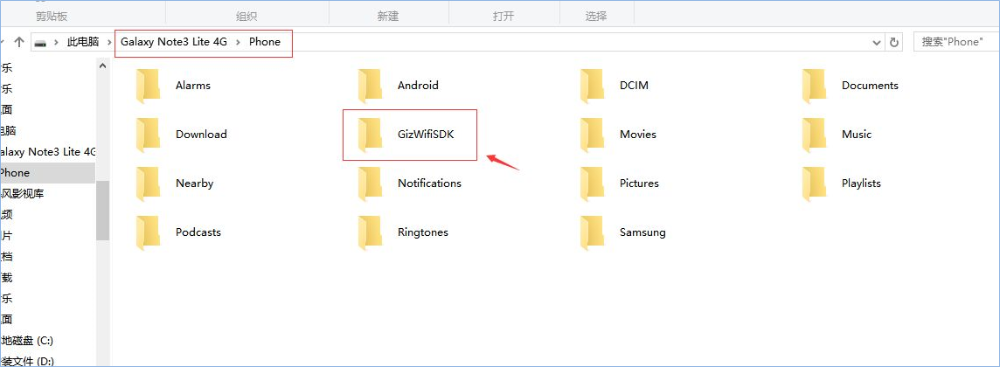

title: Guide of SDK debug log capture
---

# Overview

This document describes how to get the debug log of the SDK.

When using the Gizwits SDK for debugging, if there are some unknown errors, you can get and provide the corresponding log information to the Gizwits technical team to do trouble shooting.

# How to get the App SDK log

## 1. Get Android App SDK log

The following steps take the Samsung Galaxy Note3 Lite 4G as an example.

Step 1: Integrate our SDK on Android phones and refer to the initialization process of the document on the Gizwits website: 

http://docs.gizwits.com/hc/kb/article/175453/ 

After launching our SDK correctly, the SDK will output all the log information to the debug terminal and log file by default. If the phone has an SD card, the log file will be saved on the SD card. If there is no SD card, it will only be saved in the application path.

Step 2: Connect your phone to your computer with a USB cable and open the phone's SD card directory.

 
Step 3: Find the GizWifiSDK file and double-click it to see the package name of the application you developed. If you have developed multiple applications on the phone at the same time, there will be multiple package folders in the directory.

Step 4: According to the application that has the problem, find the package folder of the corresponding application, and provide all the contents of the folder to the Gizwits FAE.

 
## 2. Get iOS App SDK log

To get iOS App SDK log, note that there are two cases: iOS 10 and prior versions.

1) How to get debug log for the versions before iOS10 

Step 1: Integrate our SDK on iOS phones and refer to the initialization process of the document on the Gizwits website: 
http://docs.gizwits.com/hc/kb/article/175453/ 
After launching our SDK correctly, the SDK will output all the log information to the debug terminal and log file by default. 

Step 2: Download and install the sync assistant (which includes the Mac and Win versions):  
http://zs.tongbu.com/mac/ 

Step 3: Connect the phone to the computer with the USB cable, open the sync assistant, follow the instructions in the following figure, and hand the final copy of the folder to the Gizwits FAE.

 
2) How to get debug log for iOS10

Step 1: Add a key to the project's info.plist: Application supports iTunes file sharing, and its value is YES, as shown below:

 
Step 2: Run the App on your phone.

Step 3: Get the log in the File Sharing of iTunes.

Connect the phone to the computer with the USB cable, open iTunes, and find the log file under the project to export, as shown below:

 
 

