title: Set up third-party authentication with the provider of choice
---

# 1.  Providers of China

## WeChat

To implement WeChat authentication in App, you must go to the WeChat Open Platform to create an application, then get the AppID and AppSecret of the application and use them in the Gizwits App Framework.

### Sign up a WeChat Open Platform developer account

Skip this step if you already have the developer account.

Click here to navigate to [WeChat Open Platform](https://open.weixin.qq.com/).

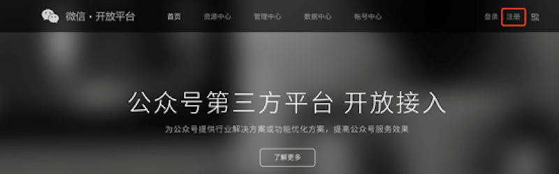

Click Sign Up to jump to the following page, type the developer basic information. 
 

Click Next, WeChat Open Platform will send an activation link to your registered Email address.

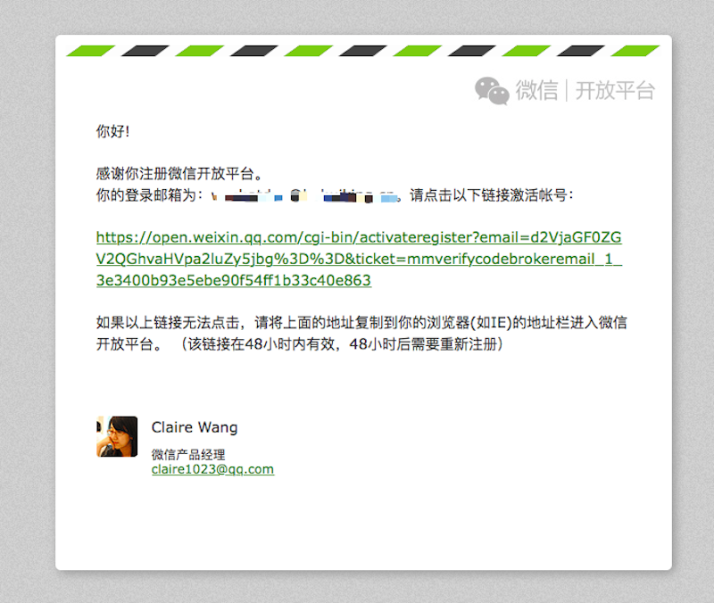
 
Click the activation link, jump to the complete profile page, enter the related information, and click Finish to create the WeChat Open Platform developer account.

 
### Create an application

After signing up successfully, log in to the WeChat Open Platform, select Admin Center, and jump to the application creation page.

 
Click the Create Mobile Application button, then type the basic information of the application.

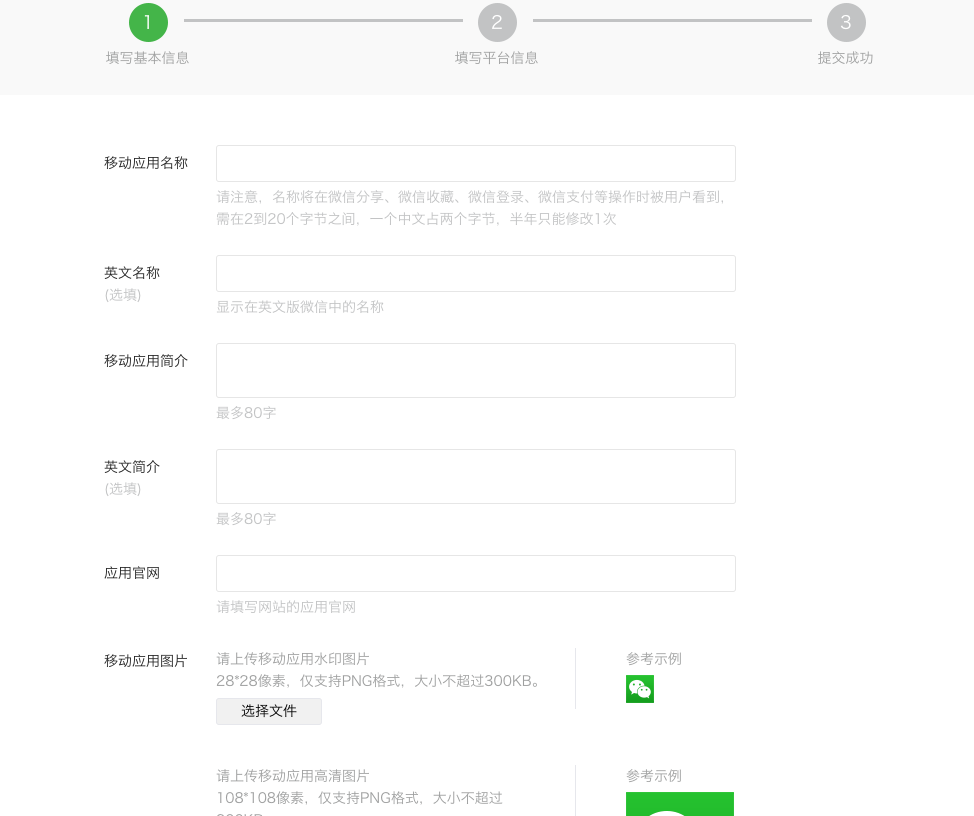
 
Fill out the form and click Next, go to the "Fill in platform info" page.

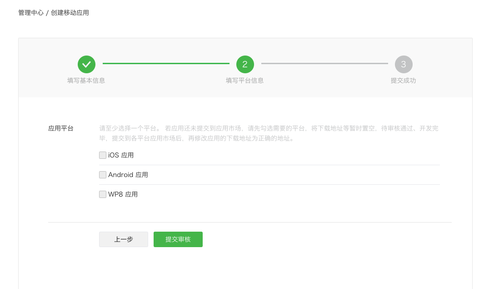
 
Select the desired application platform (usually both iOS and Android are required). The iOS application needs Bundle ID. The Android application needs the application signature and application package name.

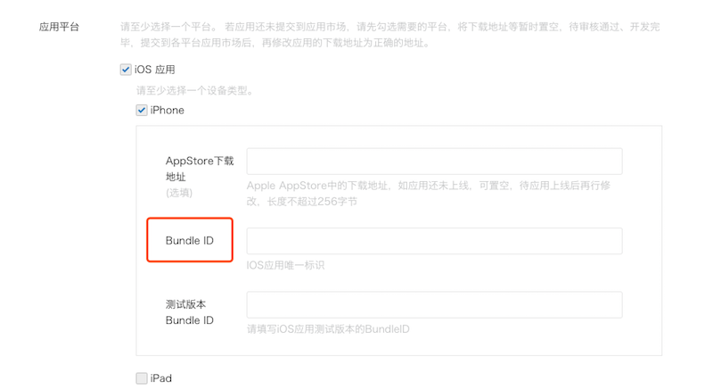
 
 
After completing the form, click Submit for verification. WeChat will give the result within 7 days. After the verification passes, the application AppID and AppSecret will be available.

### Get AppID and AppSecret

Click View on the mobile application list after the verification passes.

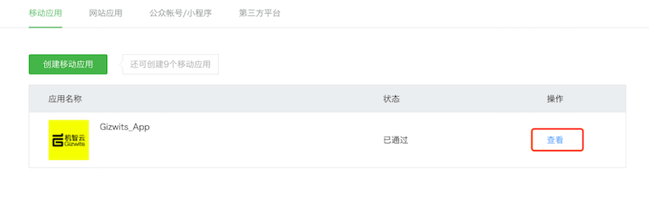

AppID and AppSecret can be seen on the Application details page.

 
### Configuration of Gizwits App Framework

Click to view [iOS SDK configuration for WeChat authentication](http://docs.gizwits.com/zh-cn/AppDev/iOS%E7%AC%AC%E4%B8%89%E6%96%B9%E7%99%BB%E9%99%86%E4%B8%8E%E6%8D%A2%E8%82%A4.html#%E5%BC%80%E6%BA%90%E6%A1%86%E6%9E%B6%E9%85%8D%E7%BD%AE-1).

Click to view [Android SDK configuration for WeChat authentication](http://docs.gizwits.com/zh-cn/AppDev/Android%E7%AC%AC%E4%B8%89%E6%96%B9%E7%99%BB%E5%BD%95%E4%B8%8E%E6%8D%A2%E8%82%A4.html#%E4%BF%AE%E6%94%B9UIConfig-json%E6%96%87%E4%BB%B6-1).

## Tencent QQ

To accomplish QQ authentication in App, you need to first create an application on Tencent Open Platform, then get the AppID of the application, and use it in the Gizwits App Framework.

### Sign up for a developer account

Click here to navigate to [Tencent Open Platform](http://open.qq.com/).

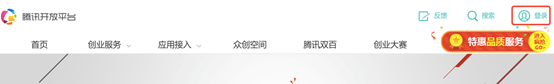
 
Click Login, enter your ID and password.

 
After logging in successfully, you can jump to the registration page. You can choose the type of individual or enterprise on your behalf.

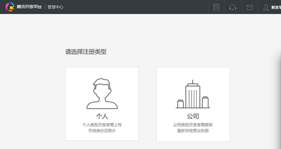
 
The following picture is for individual type registration. You need to type the complete information and finish the Email verification before you successfully create a Tencent Developer account.

 
### Create an application

Go to Tencent Open Platform, click Application Connection.

 
#### Android App

Select the Mobile App Android, click Create Application.

Fill out the pane and submit for verification.

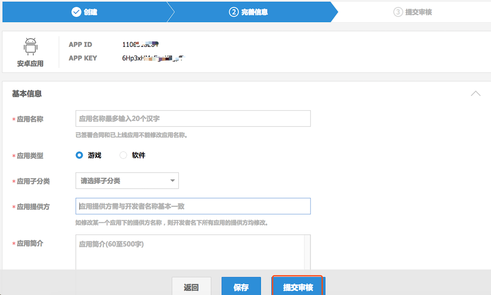
 
#### iOS App

Select the Mobile App iOS, click Create Application.

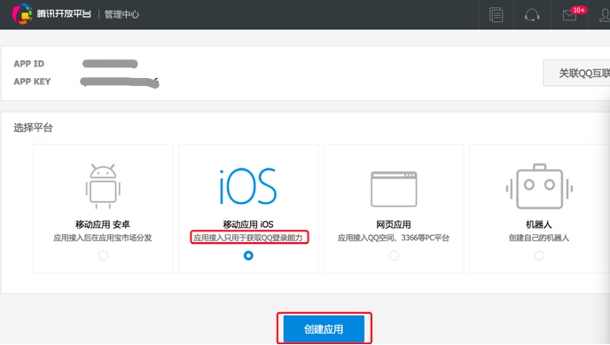
 
Fill out the pane and submit for verification.

 
### Get APP ID and APP KEY

#### Android App

After the verification passes, you can get the APP ID and APP KEY as the following figure to create a QQ authentication.

 
#### iOS App

After the verification passes, you can get the APP ID and APP KEY as the following figure to create a QQ authentication. 

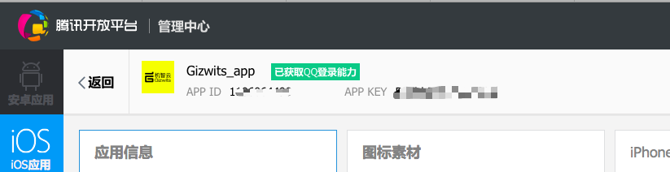
 
### Associate the authentication application

Log in to the [Gizwits Developer Center](http://dev.gizwits.com/zh-cn/developer/product/) and select the product that need to be associated to a third party authentication application.

 
Go to the Application Configuration page and select the Gizwits application that needs to be associated with a QQ authentication application, as shown below:

 
Click Associate Third Party Authentication, type the APPID applied from Tencent Open Platform, and click OK to complete the association of the Gizwits application to the QQ authentication application.

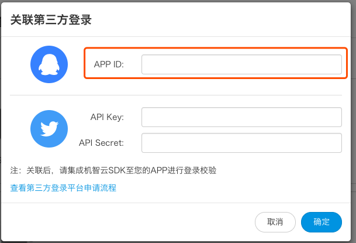
 
### Configuration of Gizwits App Framework

Click to view the [iOS SDK configuration for QQ authentication](http://docs.gizwits.com/zh-cn/AppDev/iOS%E7%AC%AC%E4%B8%89%E6%96%B9%E7%99%BB%E9%99%86%E4%B8%8E%E6%8D%A2%E8%82%A4.html#%E5%BC%80%E6%BA%90%E6%A1%86%E6%9E%B6%E9%85%8D%E7%BD%AE).

Click to view the [Android SDK configuration for QQ authentication](http://docs.gizwits.com/zh-cn/AppDev/Android%E7%AC%AC%E4%B8%89%E6%96%B9%E7%99%BB%E5%BD%95%E4%B8%8E%E6%8D%A2%E8%82%A4.html#%E4%BF%AE%E6%94%B9UIConfig-json%E6%96%87%E4%BB%B6).

## Sina Weibo

To support Sina Weibo authentication in App, you need to first create an application on the Weibo Open Platform. After getting the token and uid through Sina SDK, you can call Gizwits Open API to create a user.

### Sign up for a developer account

Click here to navigate to [Weibo Open Platform](http://open.weibo.com/).

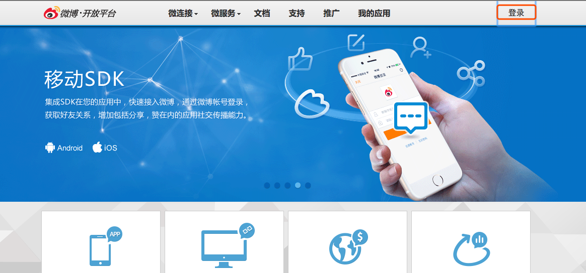
 
Click Log In, type your user name and password to sign in.

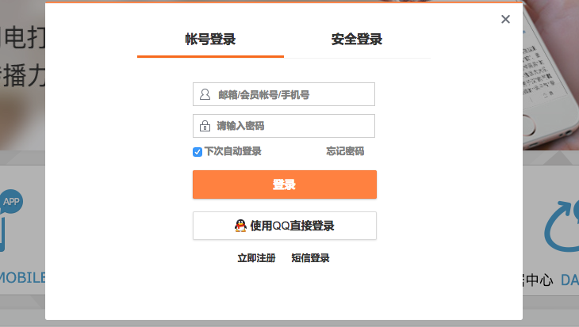
 
Click Edit Developer Information, fill out developer information form and complete identity authentication.

 
You can choose individual or enterprise type on your behalf.

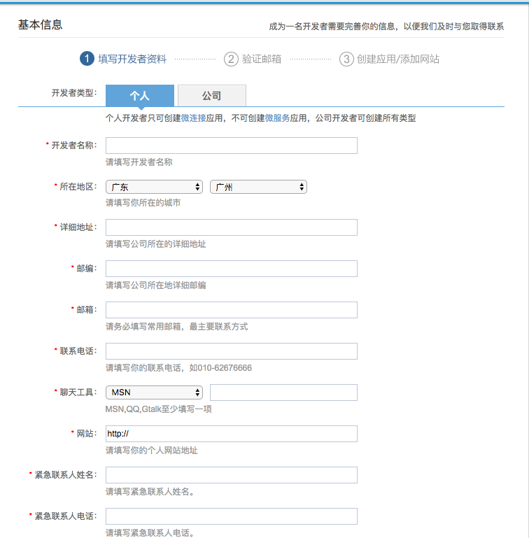
 
Complete identity authentication. 

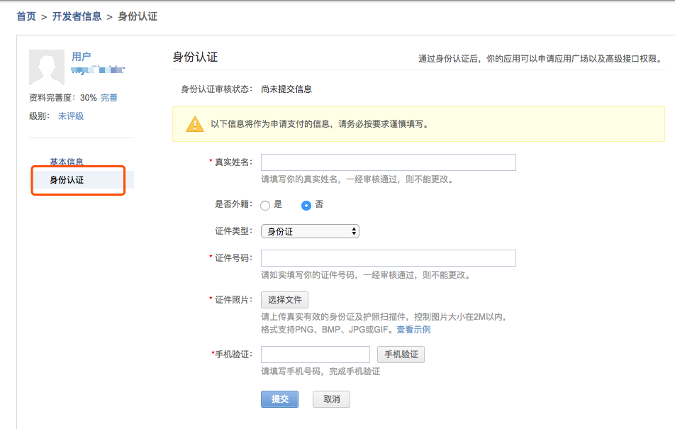
 
### Create an application

Go to Weibo Open Platform and click on Wei Connect >> Mobile Application.

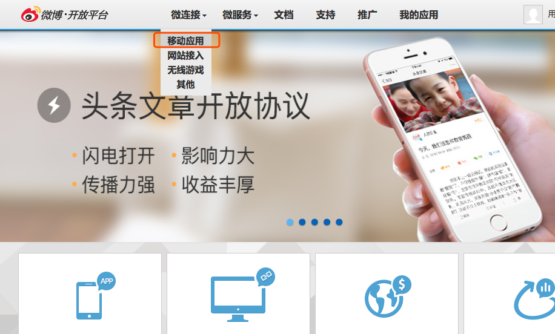
 
Click to Connect Now.

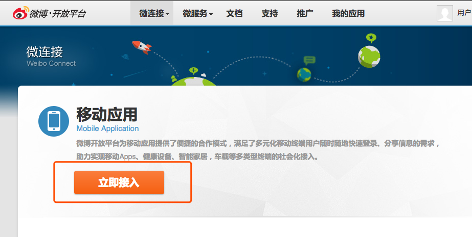
 
Choose the App platform you need (usually both iOS and Android are required).

 
Fill in the blanks and submit for verification. The iOS App needs Apple ID and Bundle ID. The Android App needs the signature information and download address.

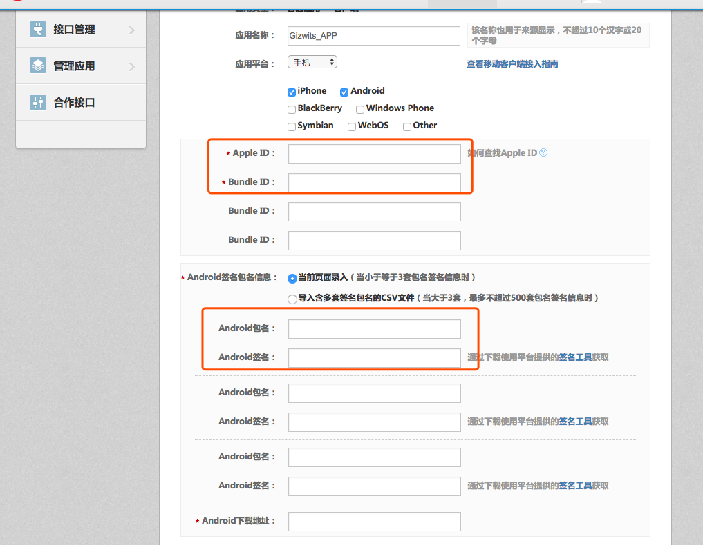
 
### Get AppID and AppSecret

Click on the Application Information and view the AppID and AppSecret as shown below.

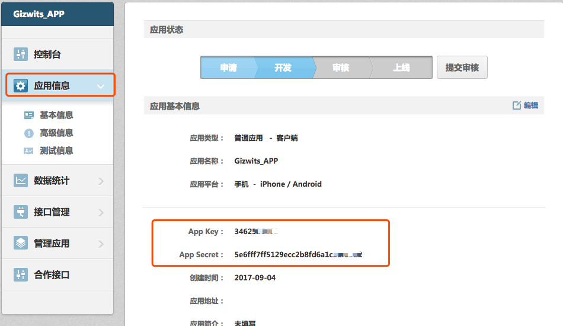
 
### API call

You can accomplish the third-party authentication via the SDK provided by Weibo, and with the returned user_id and access_token, call the [Gizwits Open API Create a user](http://swagger.gizwits.com/doc/index/openapi_apps#/%E7%94%A8%E6%88%B7%E7%AE%A1%E7%90%86/post_app_users) to complete the user login.

## Baidu

To support Baidu authentication in App, you need to first create an application in the Baidu Developer Center. After getting the token and uid, call Gizwits Open API to create a user.

### Sign up for a developer account

Click here to navigate to [Baidu Open Platform](http://developer.baidu.com/).

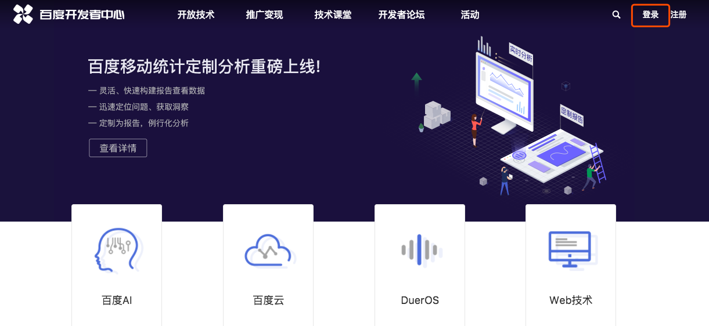
 
After login, update the developer information. You can choose the individual or enterprise type on your behalf. After Email verification, a Baidu developer account will be successfully created.

 
### Create an application

After completing the Email verification, go to Baidu Developer Center via the Email link and create a application.

 
Go to Developer Service Management and click Create Project.

 
Type the application name.

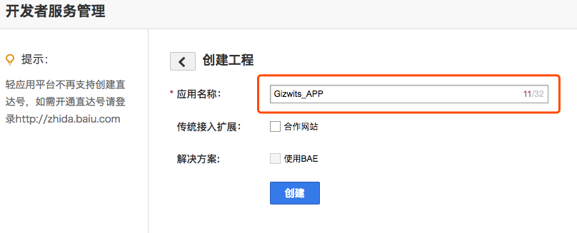
 
### Get API Key and Secret Key

Click on the Basic Information and view the API Key and Secret Key as shown below.

 
### API call

You can accomplish the third-party authentication via the SDK provided by Baidu and get the access_token. After that, call the Baidu REST API and get the UID, then call the [Gizwits Open API Create a user](http://swagger.gizwits.com/doc/index/openapi_apps#/%E7%94%A8%E6%88%B7%E7%AE%A1%E7%90%86/post_app_users) to complete the user login.

# Providers outside China

## Facebook

To support Facebook authentication in App, you need to first create an application on Facebook for developers, then get the APPID of the application, and use it in the Gizwits App Framework.

### Log in to Facebook for developers

Click here to navigate to [Facebook for developers](https://developers.facebook.com/) and log in.

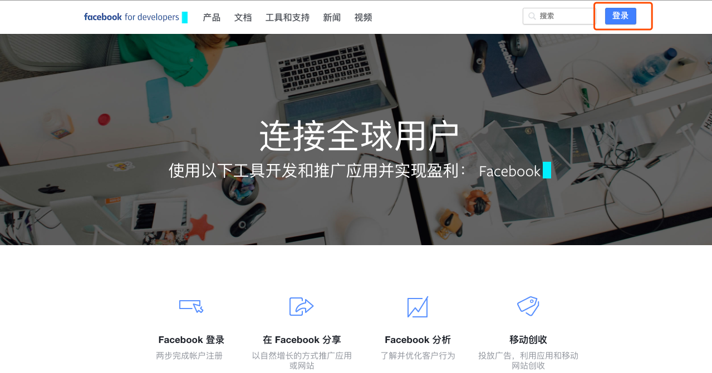
 
### Create an application

Create an app after verifying your account.

Click Add a New App for new users.

Click Create New App for old users.

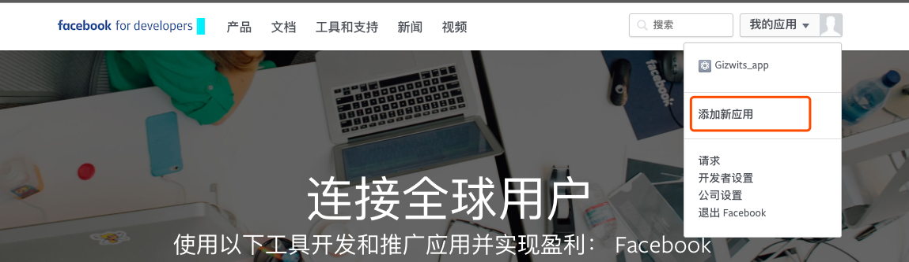
 
Type Display Name and Contact Email, click Create App ID.

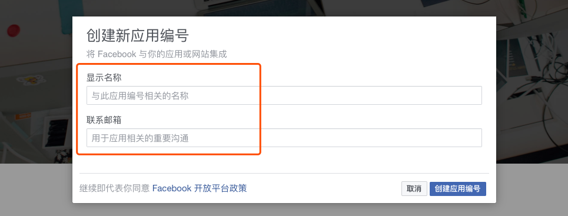
 
Then the App details page will be automatically displayed. Select Settings >> Basic, click Add Platform at the bottom.

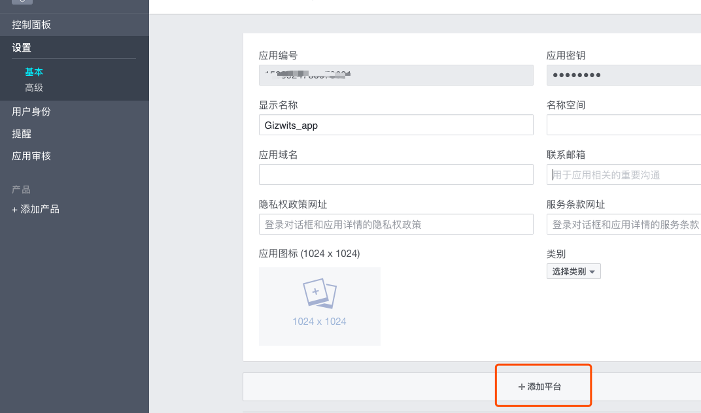
 
Choose the application platform you need (usually both iOS and Android are required).

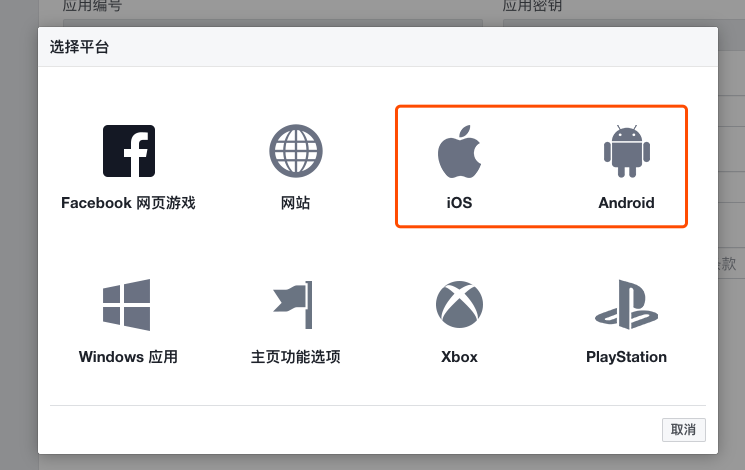
 
Fill out the application information pane.

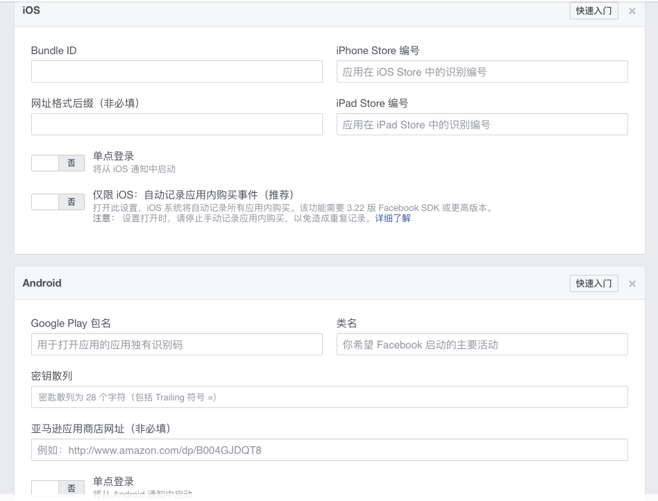
 
### Get App ID and App Secret

Click Settings >> Basic to view the App ID and click Show to see the App Secret.

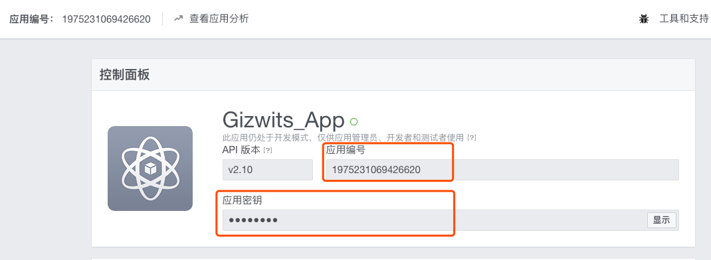
 
### API call 

You can accomplish the third-party authentication via the SDK provided by Facebook, and with the returned user_id and access_token, call the [Gizwits Open API Create a user](http://swagger.gizwits.com/doc/index/openapi_apps#/%E7%94%A8%E6%88%B7%E7%AE%A1%E7%90%86/post_app_users) to complete the user login.

## Twitter

To support Twitter authentication in App, you need to first create an application in Twitter Developer Platform to get the application APPID.

### Sign in to Twitter Developer Platform

Open [Twitter Developer Platform](https://dev.twitter.com/) and click My apps.

 
If you have not sign up for your Twitter account yet, you need to register for your account first. If you already have an account, please sign in directly.

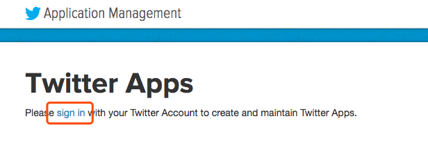
 
### Create an application

Click Create New App.

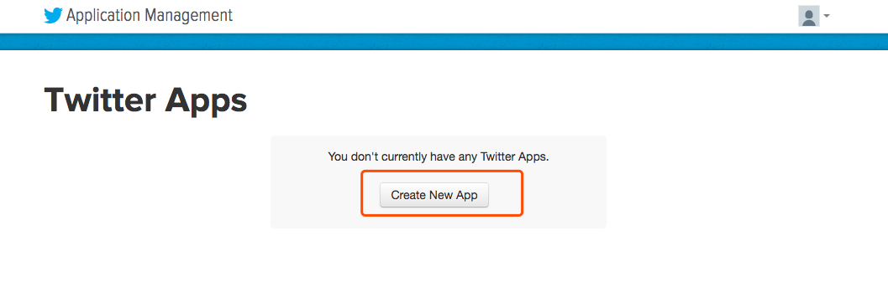
 
Type the App Name, Description and Website.

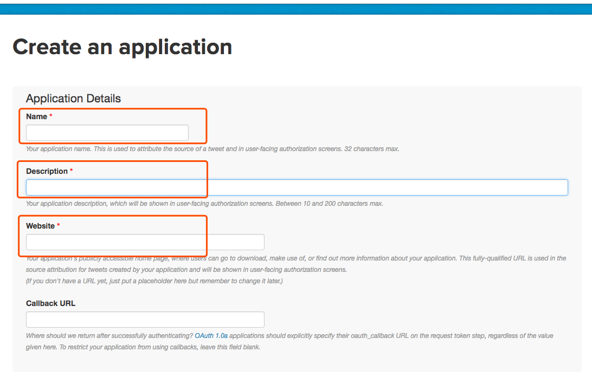
 
Note: 

1. When creating a new application, you must add your mobile phone number to your Twitter account. 
2. To support Twitter login in iOS or Android App, it is required to enter the CallBack URL.

### Get API KEY and API Secret

Click Keys and Access Tokens and you will get the API KEY and API Secret as shown below.

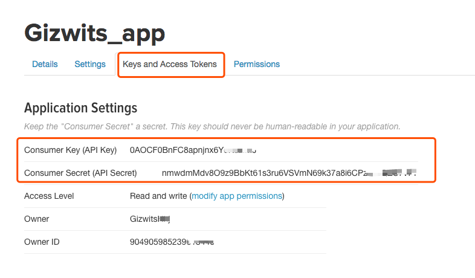
 
### Associate the authentication application

Log in to [Gizwits Developer Center](http://dev.gizwits.com/zh-cn/developer/product/) and select the product that need to be associated to a third party authentication application.

 
Go to the Application Configuration page and select the application that needs to be associated with Twitter authentication application, as shown below:

 
Click Associate Third-party Authentication Application to jump to the association page. Enter the API KEY and API Secret applied from Twitter Developers, and click OK to complete the association of the Gizwits application to the Twitter authentication application.

 
### API call

You can accomplish the third-party authentication via the SDK provided by Twitter, and with the returned user_id and access_token, call the [Gizwits Open API Create a user](http://swagger.gizwits.com/doc/index/openapi_apps#/%E7%94%A8%E6%88%B7%E7%AE%A1%E7%90%86/post_app_users) to complete the user login.

## Google+

### Login to Google APIs

Go to [Google APIs](https://console.developers.google.com/). If you have not sign up for a Google account, you need to register for an account first. If you already have an account, please log in directly.

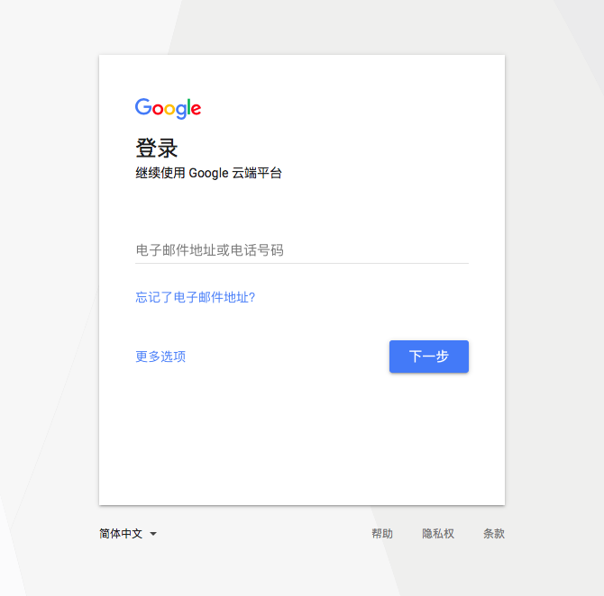
 
### Create an application

Click Select a project after successful login.

 
Then the project selection window pops up and create a project.

 
Type the project name and click the Create button.

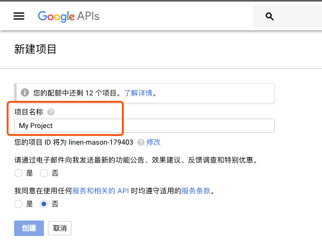
 
Under the new project, click Credentials >> OAuth consent screen, enter the App name in the field “Product name shown to users”, and fill in other fields.

 
Return to the Credentials tab, click Create credentials >> OAuth client ID.

 
Type the App package ID (Bundle ID) and the optional fields App Store ID and team ID.

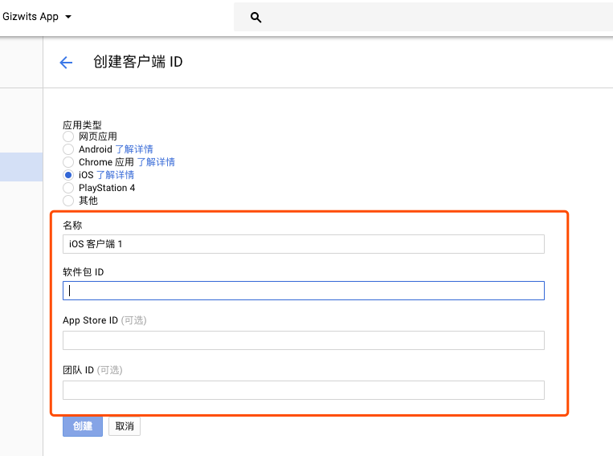
 
### Get the Client ID

Click the Credentials tab to view the client ID (Client ID) as shown below.

 
### API call

You can accomplish the third-party authentication via the SDK provided by Google, and with the returned user_id and access_token, call the [Gizwits Open API Create a user](http://swagger.gizwits.com/doc/index/openapi_apps#/%E7%94%A8%E6%88%B7%E7%AE%A1%E7%90%86/post_app_users) to complete the user login.

Note: The value of the API parameter token needs to start with Bearer and a space. Format: Bearer access_token

## Amazon

To support Amazon authentication in App, you need to first create an application on [Login with Amazon](https://login.amazon.com/) to get the application APPID.

### Sign in to the Amazon Developer Center

Go to Login with Amazon of Amazon Developers Center and click Sign Up.

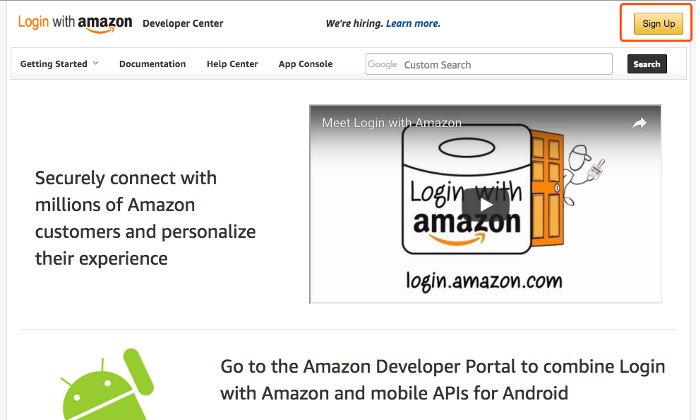
 
If you have not sign up for your Amazon account yet, you need to register for your account first. If you already have an account, please log in directly.

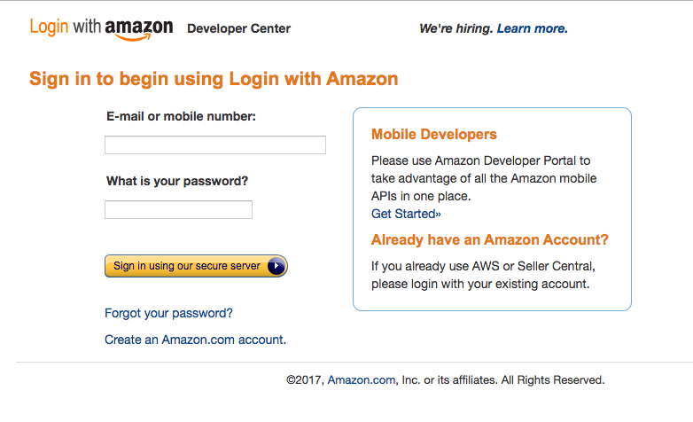
 
### Create an application

Click Register new application.

 
Enter the Application Name, Description and Privacy Notice URL.

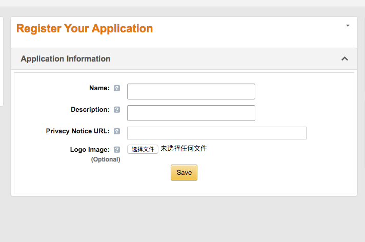

Add the required application platform (usually both iOS and Android are required).

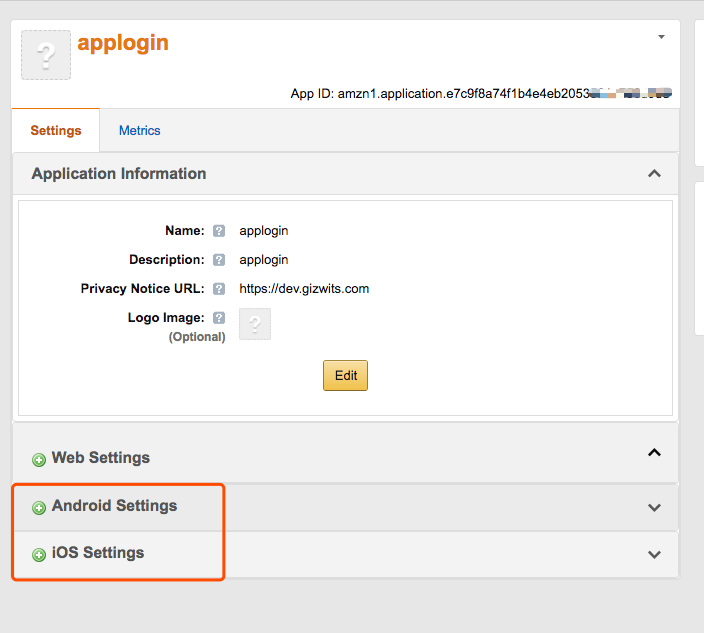
 
Fill out the application Settings form.

 
### Get App ID and API Key

See the App ID in the application settings.

 
For API Key, you need to click Get API Key Value in iOS or Android Settings to view.

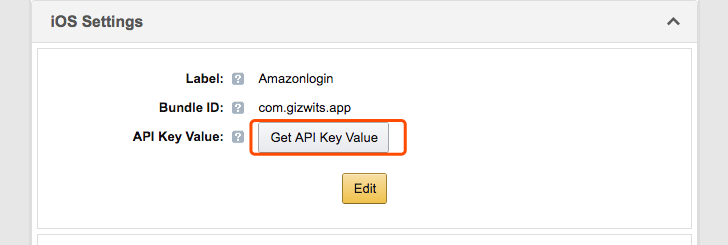
 
### API call

You can accomplish the third-party authentication via the SDK provided by Amazon, and with the returned user_id and access_token, call the [Gizwits Open API Create a user](http://swagger.gizwits.com/doc/index/openapi_apps#/%E7%94%A8%E6%88%B7%E7%AE%A1%E7%90%86/post_app_users) to complete the user login.

Note: The value of the API parameter token needs to start with Bearer and a space. Format: Bearer access_token

