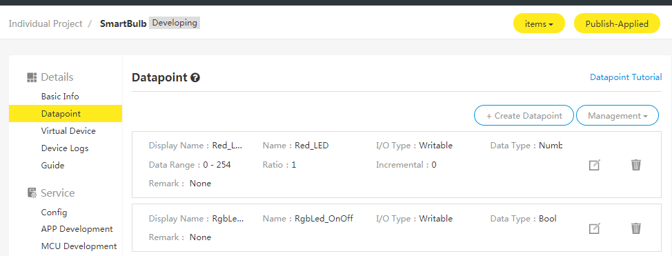
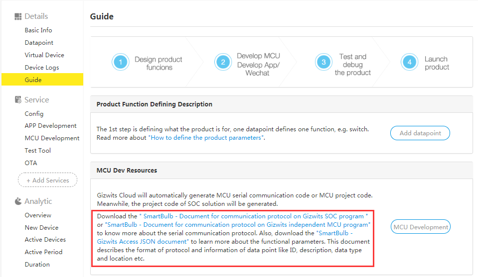
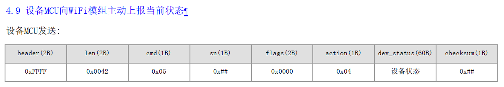
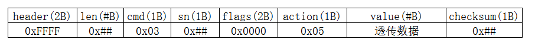

title: Data transparent transmission
---

# Overview

This document goes into details on how to use the Gizwits App SDK to achieve data transparent transmission between the App and the device, for which there are two ways:

* Transparent transmission using the "Extension type" Data Point
* Transparent transmission without Data Points

# Transparent transmission using the "Extension type" Data Point

## 1. Defining Data Point



Define a Data Point of extension type on the product management page of Gizwits Developer Center, as shown in the figure above:

The data length is defined as 60 bytes (in the case of transparent transmission, it temporarily supports data transmission with a maximum data length of 900 bytes).

## 2. Protocol for device data report

The device MCU reports the data via transparent transmission according to the definition of the Data Point. After completing the new product definition, each product has a corresponding Serial communication protocol for Gizwits IoT Cloud access, whose download link is as shown in the following figure:


 
In the section 4.9 of Serial communication protocol for Gizwits IoT Cloud access, there is a format for MCU reporting data, as shown below:



The dev_status(60B) in the figure is the data that needs to be transparently transmitted.

## 3. SDK callback

The callback for the App receiving data reported by the MCU is: didReceiveData. If the result is GizWifiErrorCode.GIZ_SDK_SUCCESS, the received data may be a regular Data Point or a Data Point of Extension type.

## 4. Sample code for the App receiving data 

An Android example for receiving data of Extension type reported by the MCU:

```
final protected static char[] hexArray = "0123456789ABCDEF".toCharArray();

// Convert the hexadecimal bytes to a string, such as the bytes value {0x62, 0x63}, then it will be converted to "6263"
public static String bytesToHex(byte[] bytes) {
		char[] hexChars = new char[bytes.length * 3];
		for (int j = 0; j < bytes.length; j++) {
			int v = bytes[j] & 0xFF;
			hexChars[j * 3] = hexArray[v >>> 4];
			hexChars[j * 3 + 1] = hexArray[v & 0x0F];
			hexChars[j * 3 + 2] = ' ';
		}
		return new String(hexChars);
}

@Override
protected void didReceiveData(GizWifiErrorCode result, GizWifiDevice device,
			ConcurrentHashMap<String, Object> dataMap, int sn) {

	if (result == GizWifiErrorCode.GIZ_SDK_SUCCESS) {
	
// the regular Data Point types include Boolean, integer, and enumeration, which are generally readable and writable.
		if (dataMap.get("data") != null) {
			ConcurrentHashMap<String, Object> map = (ConcurrentHashMap<String, Object>) dataMap.get("data");
			// the Data Point of Extension type, the key is "kuozhan"
			byte[] bytes = (byte[]) map.get("kuozhan");
			String string = bytesToHex(bytes);
			Toast.makeText(this, string, Toast.LENGTH_SHORT).show();
		}
	}
}
```

An iOS example for receiving data of Extension type reported by the MCU:

```
- (void)device:(GizWifiDevice *)device didReceiveData:(NSError *)result data:(NSDictionary *)dataMap withSN:(NSNumber *)sn
{
    if (result.code == GIZ_SDK_SUCCESS)
    {
        NSLog(@"接收到数据");
        NSDictionary *data = dataMap[@"data"];
        NSString *kuozhan = data[@"kuozhan"];
            
        NSLog(@"dataMap = %@", dataMap);
        NSLog(@"kuozhan = %@", kuozhan);
        
    }
}
```

## 5. Case for the data report of device

Case: Reporting data according to the Data Point format:

FF FF 00 42 05 00 00 00 04 01 02 03 04 05 06 07 08 09 00 00 00 00 00 00 00 00 00 00 00 00 00 00 00 00 00 00 00 00 00 00 00 00 00 00 00 00 00 00 00 00 00 00 00 00 00 00 00 00 00 00 00 00 00 00 00 00 00 00 00 78

Note that the defined Extension type has the length of 60 bytes. Therefore, when reporting data, the number of "device status" bytes in the report command must be 60 bytes. Otherwise, the App will not be able to receive the data. The unnecessary data can be zero-padded. 

The dataMap dictionary received by the App has a key of "kuozhan", and the corresponding value is the data transferred via transparent transmission.

```
dataMap = {
    alerts={
    };
    data ={
        kuozhan = <01020304 05060708 09000000 00000000 00000000 00000000 00000000 00000000 00000000 00000000 00000000 00000000 00000000 00000000 00000000>;
    };
    faults={
    };
}
```

## 6. Sample code for the App sending data

The App sends the data of Extension type using the write method of GizWifiDevice class according to the Data Point definition.

An Android example for issuing command of Extension type:

```
byte[] input1 = { 0x11, 0x22, 0x33, 0x44, 0x55, 0x66, 0x77 };
// byte[] input2 = { 11, 22, 33, 44, 55, 66, 77, 88, 99};
ConcurrentHashMap<String, Object> dataMap = new ConcurrentHashMap<String, Object>();
dataMap.put("kuozhan", input1);
device.write(dataMap, 0);
```

An iOS example for issuing command of Extension type:

```
char input1[7] = {0x11, 0x22, 0x33, 0x44, 0x55, 0x66, 0x77};
// char input2[7] = {11, 22, 33, 44, 55, 66, 77};
    NSData* data = [NSData dataWithBytes:input1 length:sizeof(input1)];
    NSDictionary *request = @{@"kuozhan": data};
    [self.device write:request withSN:44];
```	

In the above code, the transparent transmission results of input1 and input2 are different. The input1 defines the hexadecimal value, and the input2 defines the decimal value. If the value of 0x11 in input1 is sent to the device, the device will receive a hexadecimal value of 0x11. If the value of 11 in input2 is sent to the device, the device will receive 0x0b (the decimal value 11 corresponding to the hexadecimal value b). After delivering input1 to the device, the data received by the MCU is:


FF FF 00 43 03 45 00 00 01 01 11 22 33 44 55 66 77 00 00 00 00 00 00 00 00 00 00 00 00 00 00 00 00 00 00 00 00 00 00 00 00 00 00 00 00 00 00 00 00 00 00 00 00 00 00 00 00 00 00 00 00 00 00 00 00 00 00 00 00 00 69


# Transparent transmission without Data Points

## 1. Protocol for device data report

The format of the data reported by the MCU is shown in the following table. The packet length (len) refers to the length of the bytes (including the command and checksum) from the beginning of the command to the checksum. The value needs to be transparently transmitted, and can be set to any length, but temporarily supports transmission within 900B.

  

If the device reports the command: FF FF 00 0D 05 00 00 00 06 11 22 33 44 55 66 77 F4 ; then the data transferred via transparent transmission is 11 22 33 44 55 66 77

## 2. SDK callback

The callback for the App receiving data reported by the MCU is: didReceiveData. If the result is GizWifiErrorCode.GIZ_SDK_SUCCESS, indicating that the action is successful, and the value of "binary" field in the returned dataMap is the data transferred via transparent transmission.

## 3. Sample code for the App receiving data

An Android example for receiving data without Data Points reported by the MCU:

```
@Override
protected void didReceiveData(GizWifiErrorCode result, GizWifiDevice device,ConcurrentHashMap<String, Object> dataMap, int sn) {
	if (result == GizWifiErrorCode.GIZ_SDK_SUCCESS) {
		// data for transparent transmission, no Data Point definition, suitable for developers to define their own protocols 

		if (dataMap.get("binary") != null) {
		byte[] binary = (byte[]) dataMap.get("binary");
		Log.i("info", "Binary data:" + bytesToHex(binary));
			// Need to parse after receiving it
		}
	}
}
```

An iOS example for receiving data without Data Points reported by the MCU:

```
- (void)device:(GizWifiDevice *)device didReceiveData:(NSError *)result data:(NSDictionary *)dataMap withSN:(NSNumber *)sn
{
    if (result.code == GIZ_SDK_SUCCESS)
    {
        NSLog(@"接收到数据");
        NSLog(@"dataMap = %@", dataMap);
        
        NSString *binary = dataMap[@"binary"];
        // Need to parse after receiving it
	}
}
```

If the MCU reports: FF FF 00 0D 05 00 00 00 06 11 22 33 44 55 66 77 F4

Then the App will print: Binary data: 11 22 33 44 55 66 77

## 4. Sample code for the App sending data
The App sends the data using the write method of GizWifiDevice class, following the JSON format: {“binary”: “xxxxxx”}; the data format received by the MCU is as follows:

 

An Android example for sending data without Data Points:

```
byte[] input1 = { 0x11, 0x22, 0x33, 0x44, 0x55, 0x66, 0x77 };
ConcurrentHashMap<String, Object> dataMap = new ConcurrentHashMap<String, Object>();
dataMap.put("binary", input1);
device.write(dataMap, 0);
```

An iOS example for sending data without Data Points:

```
char input1[7] = {0x11, 0x22, 0x33, 0x44, 0x55, 0x66, 0x77};
// char input2[7] = {11, 22, 33, 44, 55, 66, 77};    
NSData* data = [NSData dataWithBytes:input1 length:sizeof(input1)];
NSDictionary *request = @{@"binary": data};    
[self.device write:request withSN:0];
```

The data format sent by the App and received by the MCU (that is, the data received by the MCU after the above bytes array is delivered):
FF FF 00 0D 03 16 00 00 05 11 22 33 44 55 66 77 07
