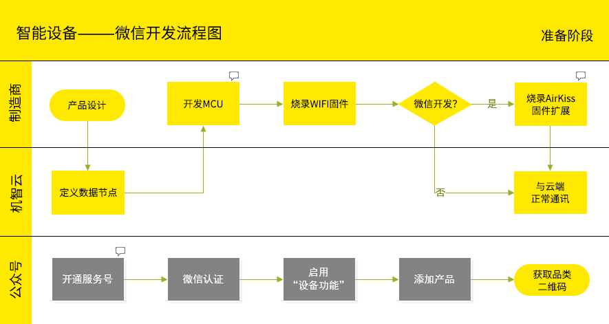
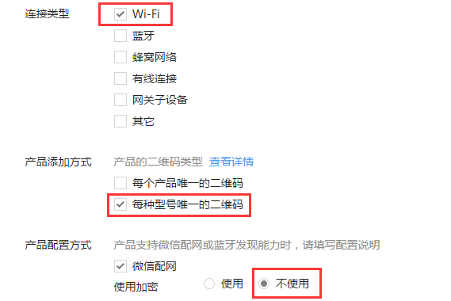
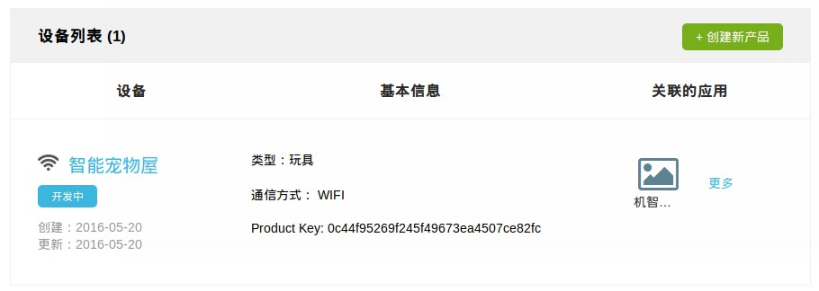
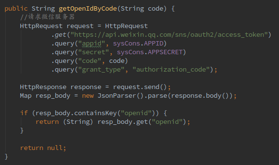
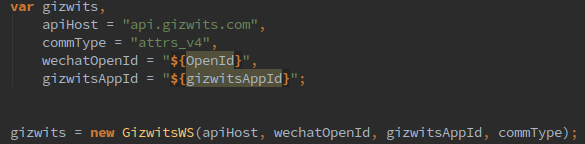
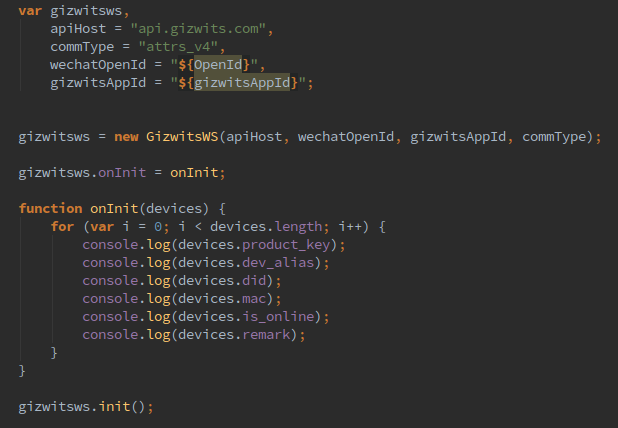
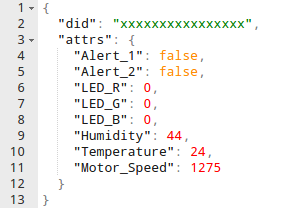

title: Guide to WeChat application development
---

# Gizwits App SDK for WeChat

[WeChat SDK on Github](https://github.com/gizwits/gizwits-wechat-js-sdk)

# Goal-driven

This guide is driven by the goal and removes unnecessary details so that Gizwits's friends can quickly access WeChat. Well, let's get started!

# Why access WeChat?

* WeChat has a large number of users.
* Users are unwilling to install a new application for any vertical domain service.
* WeChat supports the popular operating systems, hence you applications are developed once and run everywhere.
* and more……

Because of these benefits we will leverage the power of WeChat which is built on two essentials:

* User System (OpenId)
* Wechat App (AirKiss and built-in browser)

In the end, we hope that customers will be able to use our smart devices just like the WeChat native features.

# Do you have a WeChat Official Account?

First of all, we need to sign up for a WeChat Official Account.

Note that you cannot sign up for the WeChat Subscription Account which does not support WeChat authentication. We will sign up for the WeChat Service Account and complete the verification operation before we can enable the "Device Function" module and finally add a product.

In the end, you will get two artifacts:

* The original ID of your Official Account
* QR code of your device

Of course, you can also use a test account for debugging in the early stages of development.

# Do you have a device?

Before WeChat access, it is necessary to ensure that the device can normally communicate with Gizwits IoT Cloud. The detailed development flow of the device is as follows.


 
Note that when integrating AirKiss into the Wi-Fi module, you need to configure the original ID of your WeChat Official Account. In other words, in addition to write the product_key of Gizwits into the MCU, it is also necessary to write the original ID of your WeChat Official Account into the Wi-Fi module firmware. Regarding the firmware downloading, if you have difficulties, please seek help from Gizwits Customer Service. 

# Device QR code

The WeChat App can add a device by scanning its QR code. To enable devices that have been successfully connected to Gizwits IoT Cloud to be controlled by WeChat App, check the following settings when creating a product on the WeChat Official Accounts Platform. The settings are as follows:


 
Choose "Wi-Fi" device for the connection type;

Select “Unique QR code for each product model” as the product adding method. After the product is added successfully, WeChat will generate only one QR code for each product model. After scanning this unique QR code, you can perform near-field discovery to bind devices using WeChat App. If you select “unique QR code for each product”, then a QR code will be generated for each product. Scanning the QR code can help directly bind the device, but it cannot bind the device through near-field discovery.

For the product configuration mode, choose "network configuration by WeChat" and "Do not use encryption."

# Device authentication

The device must not only write the original ID of your official account (note that it is not an APPID) into the Wi-Fi firmware, but also register the MAC address of all devices to the WeChat server. In the beginning, WeChat sets the quota with the limit of 100 devices per user, which means that you can only authenticate 100 devices at most.

The authentication method is to send a request to the WeChat API. For details, see WeChat Documentation - Device authentication. 

Many developers share the feedback that their authentication often fails. Here we give a set of examples based on Wi-Fi communication for reference.


 
Note: The 12 characters of xxxxxxxxxxxx represents the device MAC address, and the id refers to the device ID, which is did of Gizwits. But Gizwits only assign a did value to a device until it comes online, so you cannot predict the value of did in advance. The usual practice is to set both id and MAC to the device MAC address.

auth_key can be omitted, but set to an empty string, because this field cannot be absent.

When the op_type is 0, it means adding one device, followed by the product_id field (product ID, which is generated after a product is added in the "device function" of WeChat Official Accounts Platform). When op_type is 1, it indicates that a device is updated, and the product_id field is omitted at the time.

When performing bulk authentication, remember to update device_num at the top.

In this way, the hardware (device) part of preparation are completed.

# Primary achievement

Well, to this point, you can reward yourself a little and enjoy the initial achievement!

Open your WeChat (ensure Wi-Fi network access is in use) and scan your product QR code.


 
There are two buttons below. The green button is for starting WeChat AirKiss, which sends the Wi-Fi SSID and password to the Wi-Fi module of the device.
 
Some devices need to start matching mode at first in order to configure the network access, then perform the configuration on WeChat. After the configuration is complete, it will automatically jump to the device discovery page.

On the discovery page, you can certainly find the device (whether it is bound or not) if you are all set to go. Click the discovered device and bind it. WeChat will automatically jump to the page of WeChat Official Account. Then, you can find an additional item on the WeChat settings page: Devices.

Of course, the above operations are just for binding devices. The following part describes how to monitor the device Data Points.

# Simplified operation

In order to simplify the development, we have encapsulated some necessary APIs into two types of Gizwits App SDKs for WeChat: java-SDK and js-SDK, which encapsulate the Gizwits Open API and Web Socket API of Gizwits respectively. They are used for back-end and front-end development.

These two SDKs will greatly simplify the operation of the API and help you take over token and user management. We only need to call related operations to bind and unbind devices.

These SDKs can be downloaded in the attachment of this article.

# Set up business server

What we need now is to control the devices.

Since devices can communication with Gizwits IoT Cloud nomally, operations on the devices are actually how to interact with Gizwits IoT Cloud.

# Device Binding

Now that you have bound the device in WeChat, you want to see the device online status. How to do?

We use WeChat OpenId as a unique identifier to generate an anonymous user. When do you register the anonymous user? When WeChat binds a device, it will push a device binding event message to our business server. At this time, we will simultaneously complete the registration of anonymous users, as well as the user/device binding operation.


 
When WeChat is binding a device, it sends such an event message:


 
What we need are OpenID and MAC, and then we call the operation provided by the Java-SDK:

```
DeviceInfo deviceInfo = OpenApi.bindDevice(
                                    wechatOpenId,
                                    gizwitsAppId,
                                    gizwitsProductKey,
                                    gizwitsProductSecret,
                                    Mac,
                                    deviceAlias,
                                    deviceRemark)
```

Params |	Type |	Description
----|----|----
wechatOpenId	|String	|WeChat OpenId, which is an anonymous user registered in Gizwits
gizwitsAppId	|String	|The ID of the App with which the Gizwits product is associated
gizwitsProductKey	|String	|Gizwits product key
gizwitsProductSecret	|String	|Gizwits product secret
mac	|String	|Device MAC address
deviceAlias	|String	|Device alias
deviceRemark	|String	|Device notes

This operation solves two problems at one time: registering an anonymous user and binding the user and the device. Many parameters have to be set. All parameters are of type String.

In which deviceAlias (device alias) and deviceRemark (device notes) can be set with empty string "". gizwitsProductKey is the key of the product you created in the Developer Center.


 
The gizwitsProductSecret, which is the secret corresponding to the product, can be found in the product details.


 
gizwitsAppId is the ID of the App in Gizwits IoT Cloud. Because a product may be operated by multiple Apps, such as an iOS App, an Android App, a Web App, or even a light App such as WeChat, each of them is considered as a separate App. Therefore, after creating a product, you can also associate one or more Apps for the product. The gizwitsAppId here is the ID of the App that is associated with the product. Note that an App must be associated with the product before it can be used.

When you call this operation, you can register an anonymous user and bind user/device. Is it convenient? Of course, you can further encapsulate this SDK for your convenience. It will not be explained here.

# Unbind Devices

Unbinding operation is similar as binding operation. When WeChat pushes an unbinding event message, we will perform unbinding operation by calling the following method in the SDK:

```
Boolean isSuccess = OpenApi.unbindDevice(wechatOpenId, gizwitsAppId, gizwitsDid);
```

Params |	Type |	Description
----|----|----
WechatOpenId	|String	|OpenId in WeChat, which is an anonymous user registered in Gizwits
gizwitsAppId	|String	|The ID of the App with which the Gizwits product is associated

# Get device online status

```
Boolean isOnline = OpenApi.getDeviceOnlineStatus(wechatOpenId, gizwitsAppId, gizwitsDid);
```

Params |	Type |	Description
----|----|----
wechatOpenId	|String	|OpenId in WeChat, which is an anonymous user registered in Gizwits IoT Cloud
gizwitsAppId	|String	|The ID of the App with which the Gizwits product is associated
gizwitsDid	|String	|The device ID in Gizwits IoT Cloud, which will be re-registered when the device is reset

# Code sample
 
Please note that some developers might encounter deployment failure on server. Catalina log in tomcat will print:

```
javax.net.ssl.SSLException: java.security.ProviderException: java.security.KeyException
```

This is because the SDK uses HTTPS for access.

The workaround is: Upgrade the nss library in the server environment.

# Control device on Wechat page


Well, we have now bound the device and can also know the device online status. But how do we control our device? A good user experience of course depends on interactive pages.

Here we will build an interactive page step by step to monitor our device!

# Get OpenId

When a user navigate to the page, how do we know which user is it? We need to get the current user's OpenId to identify which user it is. How to get it? For details, see the official document of WeChat.

In simple terms, we send an authentication request to WeChat's server. WeChat will verify whether the URL we request is an authorized domain name. If the verification is successful, it will be forwarded to our URL with a few parameters.

The most important parameter is “code”. We can obtain OpenId through “code”. Then we print OpenId on the page. 



# Web Socket connection

For Gizwits IoT Cloud access with Web Socket API, it’s encapsulated into the JS-SDK. you only need to include it on your page.

# Initialize Gizwits service

The first is to create a Gizwits service:


 
This Gizwits service will be responsible for all the following operations, including: connecting devices, reading device Data Points, controlling devices, etc.

Params |	Type |	Description
----|----|----
ApiHost	|String	|The API target domain name of Web Socket
CommType	|String	|Protocol type: custom (Raw Data Protocol v4); attrs_v4 (Data Point Protocol v4)
wechatOpenId	|String	|WeChat user OpenId
GizwitsAppId	|String	|The ID of the App with which the Gizwits product is associated

Of course, at this time, the Gizwits service does not run. We also need to initialize it. But before that, we can set a callback function that will execute automatically after the initialization is complete.


 
When gizwits.init() is executed, the Gizwits service is initialized and all devices bound to the anonymous user OpenId are inserted into the array variable “devices” of the callback function. 

What we need to do should be written in the callback function gizwits.onInit.

Each device in the devices list will have six attributes: product_key (product key), dev_alias (device alias), did (device ID), mac, is_online (online/offline state), and remark (device note). We can use them in light of circumstances.

# Device List
 
In the above step, we have obtained a list of devices. In general, a customer may own multiple devices. Therefore, we can list all devices at this stage. It is up to the user to determine which device to control.

# Connect device


You can connect to the device that you want to operate on by: gizwits.connect(did). Of course, after the connection is successful, there is also a callback function: gizwits.onConnected. This callback function does not have incoming arguments.

Note that before connecting the device, it must be initialized at first.

Since initializing and connecting devices are not synchronous operations, if you simply perform them one after the other, you may get an error. Therefore, it is recommended that the operation of connecting device be placed in the callback function of the initialization method to ensure the execution sequence.

After the connection is successful, you can receive the data reported by the device. The reported data is passed to the callback function: gizwits.onReceivedAttrs, whose format is as follows:




 

# Read device Data Points
It is also very simple to get the device Data Points. You just call the gizwits.read() method and pass in the did to get it immediately. Similarly, the data is obtained through the callback function gizwits.onReceivedAttrs, or gizwits.onReceivedRaw.

# Connection error

When a Web Socket connection error occurs, the gizwits.onError function is called. If necessary, the function can be overridden; the error message is contained in the incoming argument of the callback function:

```
gizwits.onError = function(value){
    Console.log("error!!!!:::::", value.toString());
}
```

# Device comes online/goes offline

Gizwits service will call gizwits.onOnlineStatusChanged callback function when a device comes online or goes offline.

The callback function has two arguments: did and on_online.

```
gizwits.onOnlineStatusChanged = function(value) {
    Alert("Device oneline/offline notification, did=", value.did);
    Alert("Device oneline/offline notification, is_online=", value.is_online);
}
```

# Control device

The last is the remote control of the device.

For the method calls used in remote control, use the method gizwitsws.send(command) when commType=custom, and the method gizwitsws.write(command) when the commType=attrs_v4.

For the method argument, if commType=custom, pass the raw data according to Raw Data Protocol v4, for example [,,...]; if commType=attrs_v4, pass Data Point name-value pairs, for example {"power":true}.

The following is a code example of controlling a RBG lamp:

```
var command = '{"LED_R": 0, "LED_G": 0, "LED_B": 0}';
gizwits.write(did, JSON.parse(command));
```

Of course, the premise of controlling devices is that we have connected a device to Gizwits IoT Cloud.

# Summary

At this point, we have already achieved the core part of WeChat access with the Java-SDK and js-SDK. We almost do not need to worry about how to call Gizwits IoT Cloud API as well as Web Socket operations, but directly call the SDK methods.

Finally, I hope you can give more feedback so as to help us offer a more convenient development environment. 
