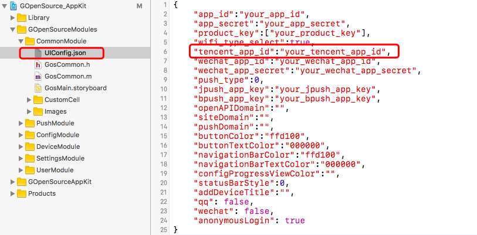
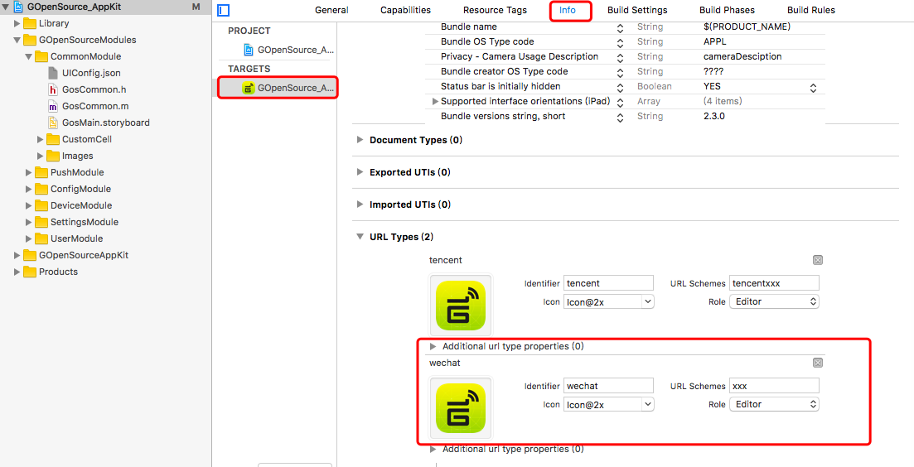
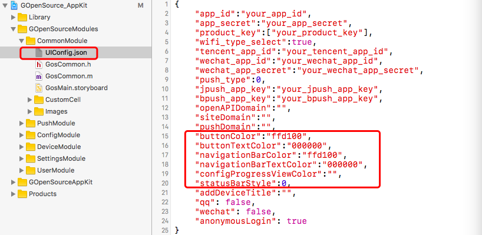
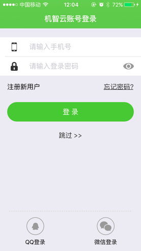
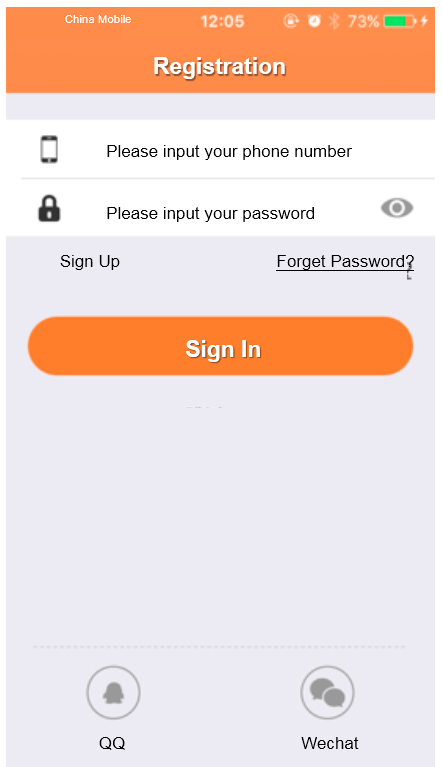
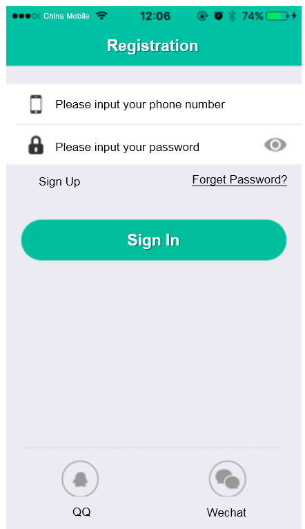

title: Guide to third-party authentication and re-skin for iOS App
---

See Guide to Android third party authentication and re-skin

See Set up third-party authentication with the provider of choice

# Overview 

This document mainly describes how to quickly implement QQ and WeChat authentication through Gizwits App Framework as well as re-skin for the App.

# QQ authentication

To support QQ authentication, you should first create an application on the Tencent open platform, obtain the APPID for the App, which will be used in the Gizwits App Framework. 

## Get APP ID and bind the application

For obtaining APP ID and binding Gizwits application, see Guide to Application for QQ authentication.

## Configuration of Gizwits App Framework

### Configure Tencent APPID

Type the APPID obtained from Tencent development platform into the configuration file UIConfig.json of Gizwits App Framework.


 
### Configure URL Schemes

The user is supposed to navigate to the QQ authentication page for login. After successful login, it will be redirected to you own App. At this time, you need to give the QQ SDK a redirect URL, which is set through the URL Schemes.

Select Targets -> Info, click URL Types to see the following page:


 
There are two parts that should be modified in the red box: URL Schemes and Identifier.

The format of URL Schemes value is: tencent + Tencent's APP ID.

Identifier value generally adopts the reversed domain name to ensure its uniqueness. It can also be set to the Bundle Identify of the program.

# Wechat authentication

To implement WeChat authentication, you need to go to the WeChat open platform to register for an application, obtain the APPID and APPSecret of the application which will be applied to the Gizwits App Framework.

## Get APPID and APPSecret

To get APPID and APPSecret, see Guide to Application for WeChat authentication.

## Configuration of Gizwits App Framework 

### Configure WeChat APPID

Type the APPID and APPSecret obtained from WeChat development platform into the configuration file UIConfig.json of Gizwits App Framework, as shown below.


 
### Configure URL Schemes

The user is supposed to navigate to the WeChat authentication page for login. After successful login, it will be redirected to you own App. At this time, you need to give the WeChat SDK a redirect URL, which is set through the URL Schemes.

Select Targets -> Info, click URL Types to see the following page:


 
There are two parts that should be modified in the red box: URL Schemes and Identifier.

The format of URL Schemes value is: WeChat APP ID.

Identifier value generally adopts the reversed domain name to ensure its uniqueness. It can also be set to the Bundle Identify of the program.

# App Re-Skin

The Gizwits App Framework has the re-skin feature. Quick re-skin can be achieved by modifying the UIConfig.json file.


 
As shown in the red box, the code snippet for your custom skin has the following parameters:

```
buttonColor: button color
buttonTextColor: button text color
navigationBarColor: navigation bar color
navigationBarTextColor: navigation bar text color
configProgressViewColor: configuration progress view color
statusBarStyle: status bar color
```

Quick res-skin can be achieved by modifying the corresponding color values. Refer to the following example:

## Sample 1

```
"buttonColor":"6ebe37",
"buttonTextColor":"ffffff",
"navigationBarColor":"6ebe37",
"navigationBarTextColor":"ffffff",
"configProgressViewColor":"000000",
" statusBarStyle ":1
```

The result:


 
## Sample 2

```
"buttonColor":"ff8a44",
"buttonTextColor":"ffffff",
"navigationBarColor":"ff8a44",
"navigationBarTextColor":"ffffff",
"configProgressViewColor":"000000",
" statusBarStyle ":1
```

The result:


 
## Sample 3

```
"buttonColor":" 16b599",
"buttonTextColor":"ffffff",
"navigationBarColor":" 16b599",
"navigationBarTextColor":"ffffff",
"configProgressViewColor":"000000",
" statusBarStyle ":0
```

The result:



# See Also

See [Gizwits App Code Auto-Generator](http://docs.gizwits.com/en-us/AppDev/AppCodeAutoGenerator.html) to learn about the functionality of the automatically generated App code.

See "Gizwits App Framework" to grasp

* [Gizwits App Framework for iOS](http://docs.gizwits.com/en-us/AppDev/iOSFramework.html)
* [Push notification integration for iOS App](http://docs.gizwits.com/en-us/AppDev/iOSPushNotification.html)
* [Third-party authentication and re-skin for iOS App](http://docs.gizwits.com/en-us/AppDev/iOSAuthReSkin.html)
* [Quick start with iOS App development](http://docs.gizwits.com/en-us/AppDev/iOSDevQuickStart.html)
* [Gizwits App Framework for Android](http://docs.gizwits.com/en-us/AppDev/AndroidFramework.html)
* [Push notification integration for Android App](http://docs.gizwits.com/en-us/AppDev/AndroidPushNotification.html)
* [Third-party authentication and re-skin for Android](http://docs.gizwits.com/en-us/AppDev/AndroidAuthReSkin.html)
* [Quick start with Android App development](http://docs.gizwits.com/en-us/AppDev/AndroidDevQuickStart.html)
* [Gizwits App Framework for APICloud](http://docs.gizwits.com/en-us/AppDev/APICloudFramework.html)

See "App Development SDK" to develop your IoT App

* [Gizwits App SDK for Android](http://docs.gizwits.com/en-us/AppDev/AndroidSDKA2.html)
* [Gizwits App SDK for iOS](http://docs.gizwits.com/en-us/AppDev/iOSSDKA2.html)
* [Gizwits App SDK for APICloud](http://docs.gizwits.com/en-us/AppDev/APICloudSDK.html)
* [Data transparent transmission](http://docs.gizwits.com/en-us/AppDev/TransparentTransmission.html)
* [Get Gizwits App SDK debug log](http://docs.gizwits.com/en-us/AppDev/SDKLogCapture.html)
* [SDK error codes](http://docs.gizwits.com/en-us/AppDev/SDKErrorCodes.html)

More application development guides

* [FAQ of mobile application development](http://docs.gizwits.com/en-us/AppDev/AppDevFAQ.html)
* [Gizwits Device Sharing](http://docs.gizwits.com/en-us/AppDev/DeviceSharing.html)
* [Set up third-party authentication with the provider of choice](http://docs.gizwits.com/en-us/AppDev/ThirdpartyAuth.html)
