title: Quick start with iOS App development
---

# Overview

This document mainly walks you through how to use the Gizwits App Framework for iOS (hereinafter referred as Framework) for rapid App development and testing. Before reading this document, please go through Get started with App development.

# Deploy and debug the Framework in 10 minutes

## 1. Download the Framework

The Framework development environment: XCode

The Framework code repository:

https://git.oschina.net/dantang/GizOpenSource_AppKit_iOS

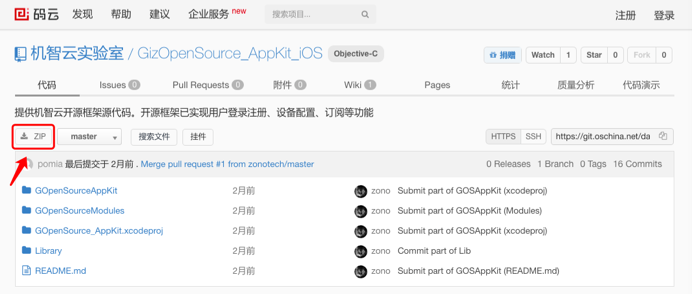
 
## 2. Import project to XCode

The downloaded Framework is shown in the figure below. Double click on the red box to open.


 
The Framework directory is as follows:


 
## 3. The Framework directory structure

The overall directory structure of the Framework is shown in the following figure. The code is stored under the path “GOpenSourceModules”. According to the functional decomposition of the Framework, it is divided into five major modules with loose coupling between modules. All modules can be removed arbitrarily according to your own needs except the common module “CommonModule”. For example, if push notification is not required, you can delete "PushModule" straightway and comment out related properties and methods used in other classes. 

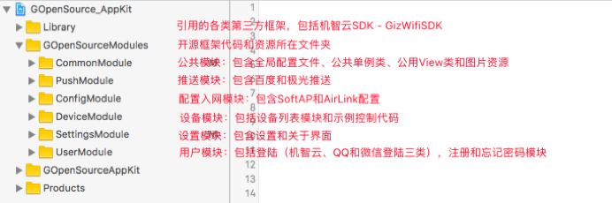

## 4. Modify the UIConfig.json

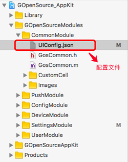

As shown in the above figure, the UIConfig.json file is a global configuration file. Here you can set the configuration information of the project.

* app_id: Gizwits app id
* app_secret: Gizwits app secret
* product_key: Gizwits product key  
* wifi_type_select: Whether the Wi-Fi module selection function is enabled
* tencent_app_id:qq authentication app id 
* wechat_app_id: Wechat authentication app id
* wechat_app_secret: Wechat authentication app secret 
* push_type: Push notification type [0: Off, 1: Jiguang, 2: Baidu]
* jpush_app_key: Jiguang push notification app key
* bpush_app_key: Baidu push notification app key
* openAPIDomain: Domain name and port, in the format of “api.gizwits.com:80”. The default port is 80.
* siteDomain: Domain name and port, in the format: "site.gizwits.com:80". The default port is 80.
* pushDomain: Push notification service domain name and port, in the format: "push.gizwits.com:80". The default port is 80.
* buttonColor: Button color
* buttonTextColor: Button text color
* navigationBarColor: Navigation bar color
* navigationBarTextColor: Navigation bar text color
* configProgressViewColor: Configuration progress view color
* statusBarStyle: Status bar looks like [0: default black style, 1: white style]
* addDeviceTitle: Navigation bar text of Adding device page
* qq: QQ login button on the login page [true: display, false: hidden]
* wechat: Wechat login button on the login page [true: display, flase: hide]
* anonymousLogin: Skip button on the login page [true: display, flase: hide]

Find the Product Key (for example, the figure in "1. Create Product and Define Data Points"), App ID (for example, the second figure in "2. Create Android and iOS App for the product") and App Secret on Gizwits IoT Cloud Console, and fill in the corresponding fields in the json file, as shown below:


## 5. UI customization

If you want to change the App UI page to a user-defined UI page instead of the page provided by the Framework, you can replace "GosDeviceController" in the following figure to a custom UI page through removing the red box on the right side of the figure and complete the following two steps:

1) Initialize the custom UI page

2) Navigate from deviceListController (device list page) to your custom UI page


## 6. App deployment

After typing the Product Key, App ID, and App Secret correctly, the project can be deployed and executed.


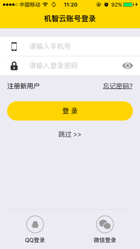

## 7. Register a new user

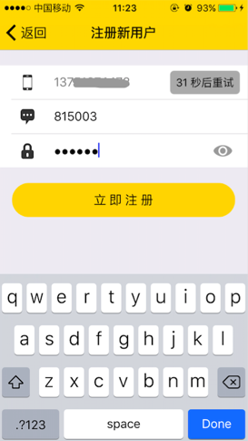

## 8. Log in the App

After the successful registration, the use will automatically log in and navigate to My Devices page.


 
## 9. Start the virtual device and display its QR code

Choose the "Virtual Device" of the corresponding product in left navigation pane of the Developer Center.

Virtual Device: The Gizwits IoT Cloud automatically generates a simulation device that simulates the behavior of reporting data by real devices. Developers can use the virtual device provided by Gizwits for App development when the development of physical devices has not been completed yet.


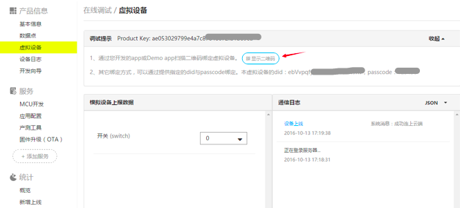	

## 10. Scan QR code to bind the device

Choose the menu in the upper right corner and click Scan QR code to bind device.

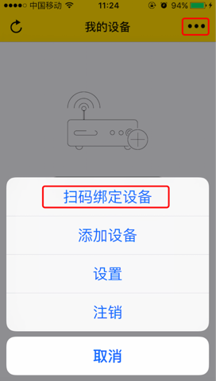


After scanning successfully, it will navigate to the "My Devices" page. At this time, the "virtual device" that was just scanned will appear on the page.

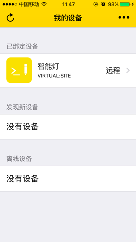
 
## 11. Click on "Smart Lamp" to access the device control page

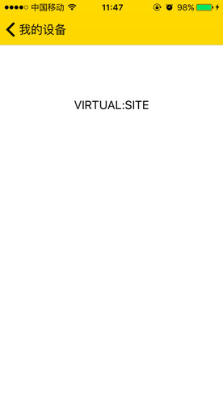

After navigating to the control page, you will find that it is a blank page. In order to develop App quickly, the Gizwits App Framework has encapsulated user login, device discovery, device connection, and other functions into various standard modules, leaving only control pages for you to build on your own demand, which saves your time. The next section will illustrate how to develop a simple and attractive control page quickly.

# Rapid development of device control pages

## 1. Code preview

Open ControlModule -> GosDeviceControlActivity.java. You can see that the entire control page is very simple, in which only one TextView displays the device MAC address.

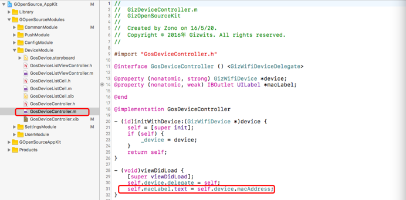

## 2. UI design

According to the created product "Smart Lamp", the expected UI effect is as follows:

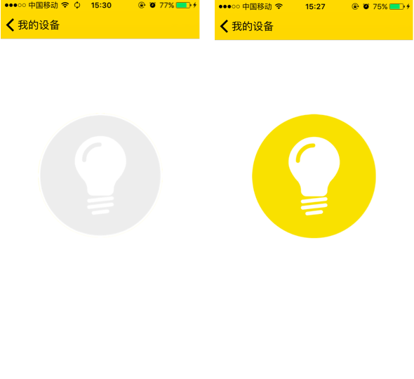

Click the lamp icon on the left page, then the App issues an command to control the light switch. The two icons are swapped for each other when tapped.

## 3. Page layout

### 3.1 Import pictures


Copy the switch pictures that swap the states of the smart lamp to the drawable directory, as shown in the following figure:


 
### 3.2 Add a Button control

1) Open the controller's xib file - GosDeviceController.xib, delete the Label control, and remove all related code from the GosDeviceController.m file


2) Add a Button control

As shown, drag a Button control to the center of the xib, set the Button's State Config property to Default, the Image property to light_off.png. When the Button's State Config property value is selected, the Image property value will be light_on.png.


 
3) Reference the xib Button in GosDeviceController.m file


At this point the entire page layout is ready.

## 4. Control logic development

### 4.1 Define Data Point Macros

Define the macro according to the name of the Data Point: DataPointSwitch


 
### 4.2 Implement control logic

Implementing the control logic requires the following three steps:

1) Specify the device delegate

2) Implement the device agreement

3) Issue commands


```
// Control logic of the button
- (void)switchBtnDidClick:(UIButton *)btn
{
    If (btn.isSelected)
    {
        // turn off the lamp
        Btn.selected = NO;
        // Send command to the device
        [self.device write:@{DataPointSwitch:@NO} withSN:5];
    }
    Else
    {
        // turn on the lamp
        Btn.selected = YES;
        // Send command to the device
        [self.device write:@{DataPointSwitch:@YES} withSN:5];
    }
}
```

### 4.3 Received data handling

As shown in the figure, the callback logic is implemented in the device delegate method to swap the switch pictures of the Button.


```
// Received a device status callback
- (void)device:(GizWifiDevice *)device didReceiveData:(NSError *)result data:(NSDictionary *)dataMap withSN:(NSNumber *)sn
{
    NSDictionary *data = dataMap[@"data"];
    If (data != nil && data.count != 0)
    {
        NSNumber *switchNum = data[DataPointSwitch];
        self.switchBtn.selected = switchNum.boolValue;
    }
}
```

### 4.4 Unsubscribe action

When going back from the control page to the device list page, you need to take an unsubscribe action. Otherwise, unforeseen errors will occur.

```
- (void) dealloc
{
    [self.device setSubscribe:NO];
}
```

### 4.5 Deployment and Test

After completing the above code, you can deploy to a mobile phone to test.

1) Issue a command

As shown in the figure, after the App is installed into the mobile phone, it goes to the control page.

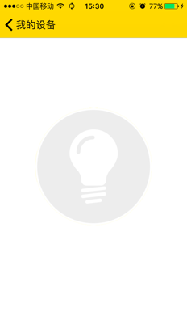
 
Click the icon of the lamp in the App and it will issue a command. At this time, the icon of the App will change to the on-state.


At this point, you can see the App command in the virtual device communication log in Gizwits IoT Cloud, as shown in the following figure:


 
2) The device actively reports data

As shown in the figure, in the virtual device, change the value of the switch to “0” and click on the push button below. At this point, you can see that there is a record “The virtual device reporting data” in the communication log, indicating that the device reported the data successfully. .


At this time, the button of the lamp on the control page of the App change immediately to the off-state, indicating that the App successfully received the reported data from the device.


# See Also

See [Gizwits App Code Auto-Generator](../UserManual/AppCodeAutoGenerator.md) to learn about the functionality of the automatically generated App code.

See "Gizwits App Framework" to grasp

* [Gizwits App Framework for iOS](../AppDev/iOSFramework.md)
* [Push notification integration for iOS App](../AppDev/iOSPushNotification.md)
* [Third-party authentication and re-skin for iOS App](../AppDev/iOSAuthReSkin.md)
* [Quick start with iOS App development](../quickstart/iOSDevQuickStart.md)
* [Gizwits App Framework for Android](../AppDev/AndroidFramework.md)
* [Push notification integration for Android App](../AppDev/AndroidPushNotification.md)
* [Third-party authentication and re-skin for Android](../AppDev/AndroidAuthReSkin.md)
* [Quick start with Android App development](../quickstart/AndroidDevQuickStart.md)
* [Gizwits App Framework for APICloud](../AppDev/APICloudFramework.md)

See "App Development SDK" to develop your IoT App

* [Gizwits App SDK for Android](../AppDev/AndroidSDKA2.md)
* [Gizwits App SDK for iOS](../AppDev/iOSSDKA2.md)
* [Gizwits App SDK for APICloud](../AppDev/APICloudSDK.md)
* [Data transparent transmission](../AppDev/TransparentTransmission.md)
* [Get Gizwits App SDK debug log](../AppDev/SDKLogCapture.md)
* [SDK error codes](../AppDev/SDKErrorCodes.md)

More application development guides

* [FAQ of mobile application development](../AppDev/AppDevFAQ.md)
* [Gizwits Device Sharing](../cloud/DeviceSharing.md)
* [Set up third-party authentication with the provider of choice](../AppDev/ThirdpartyAuth.md)
