title: Guide of iOS App push notification integration
---

# Overview

The Gizwits App open source framework (hereinafter referred as Framework) integrates Baidu push notification and Jiguang push notification, which help rapid development with few modifciation. This document describes how to integreate push notification based on the Framework. For more information on the Framework, please refer to the Quick Start documentation.

# Quick integration with Jiguang push notification

## 1. Apply for Jiguang AppKey and Master Secret

### 1.1 Creating a Jiguang Application

Click https://www.jiguang.cn/app/form to create a Jiguang application.


 
As shown in the figure, you need to upload the Apple Developer Certificate, including the development certificate and the production certificate and their passwords.

### 1.2 Apply for iOS development certificate

Log in to the Apple Developer Center: https://developer.apple.com, apply and download the cer certificate, double-click the certificate to open it from the Keychain, select the certificate, choose "login" and "My Certificates", right-click the certificate, export p12 certificate.

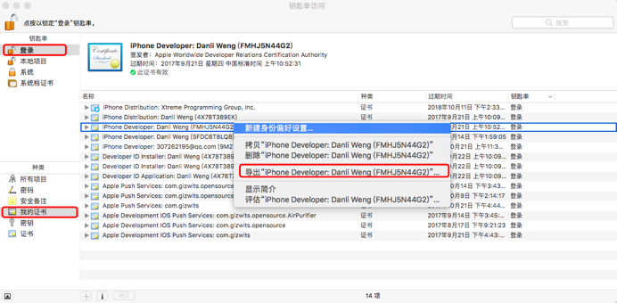
 
Click "Export" will pop up the following dialog box, set the certificate name and save path.

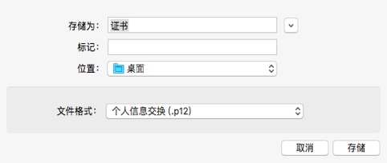
 
Click “Save”. When prompted for a password, set the certificate password.


 
### 1.3 Import Certificate to Jiguang

After successfully importing the certificate as shown below, it will show "verified".

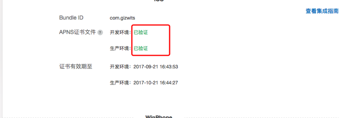
 
At this point, the Jiguang application has been created and the AppKey and Master Secret generated by the application can be used normally.
 
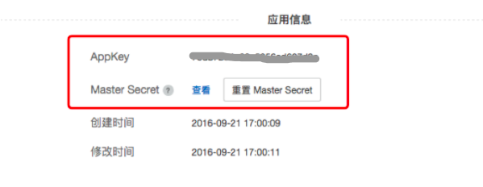
 
## 2. Bind third-party push notification in the Gizwits cloud

### 2.1 Applying for D3 Engine service


The use of D3 Engine service requires the approval of Gizwits. After request to access the service, you need to contact the Gizwits FAE for assistant.

### 2.2 Binding Jiguang push notification in Gizwits cloud

After approval, you can see the D3 Engine under the Services column, click "Configuration" -> "Edit Push Notification Platform"

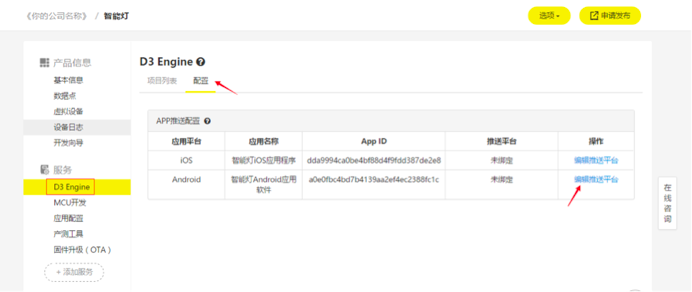

Type the App Key and Master Secret you applied to Jiguang as the following figure and select the certificate type.

Note: When selecting "Development" for the certificate type, only in the development environment your App is able to receive notifications.

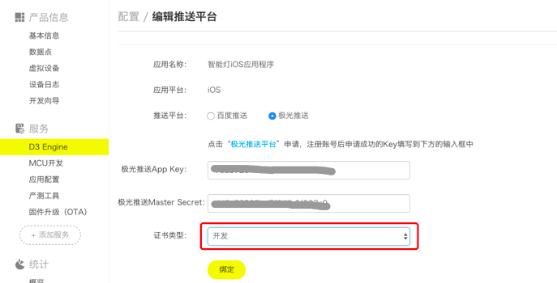

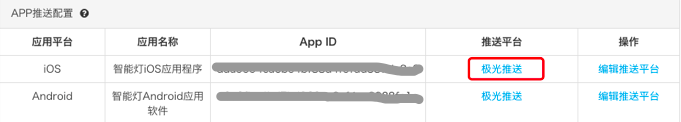
 
### 2.3 Create a push notification rule using D3 Engine

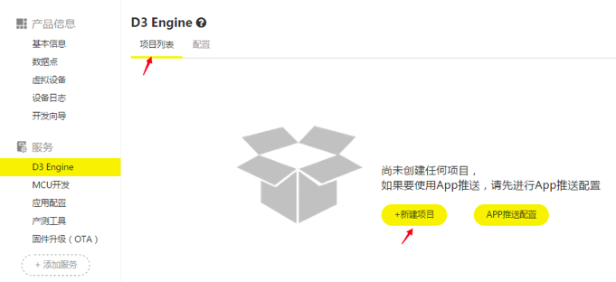

Choose Project List -> New Project. The following shows how to create a rule that will push a notification message to the App after your device comes online.


 
Drag the "Device Data" box to the right and double click it.


 
Set the trigger mode to "Device comes online" and click OK.


 
Double-click "Push for App" and set the notification content.
 


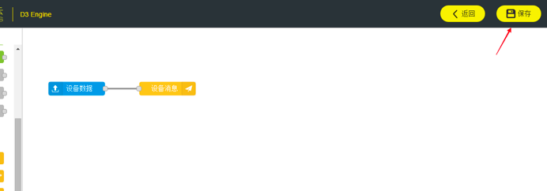


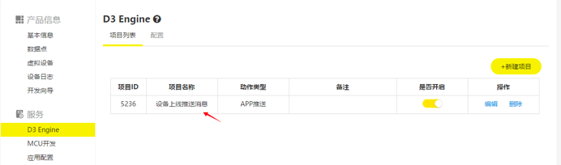
 
 
## 3. Modify the code of UIConfig.json

Fill in jpush_app_key, and set push_type to 1, indicating that Jiguang push notification is selected. Then fill in the values of app_id, app_secret, and product_key of the Gizwits application that is bound to Jiguang push notification.


## 4. Configure push notification in XCode

Open the project, select Targets -> Capabilities, and turn on the Push Notifications button, which enables the project remote push functionality.


 
After the button is turned on, an .entitlements file is automatically generated, as shown below, where the value in the red box indicates the push environment. Development indicates the development environment, and distribution indicates the production environment. When the value is set to development, push notification only takes effect in the development environment. When it is distribution, push notification takes effect only in the production environment.


## 5. Start the virtual device

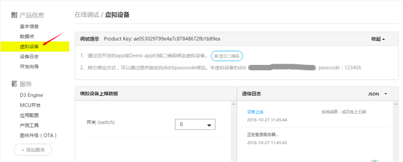

## 6. Run the APP

Through the above steps, the App is equipped with Jiguang push notification function. After being deployed to a mobile phone, register a user and login in, then bind the cloud virtual device by scanning its QR code.


## 7. Test push notification

Restart the virtual device to see whether your phone receives a push message.


## 8. Customize the push notification sound of Jiguang

The D3 Engine supports setting the push notification sound for each rule. Generally it needs to update two places.

### 8.1 Configure push notification sound

Open a push notification rule as follows:


Select the push for App box (which is in red box above):


Click "Show JSON sample":

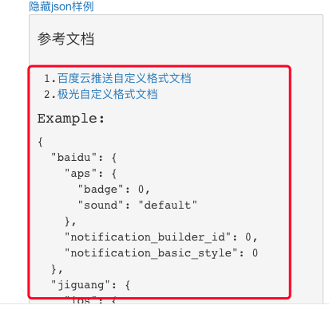

The sample detail is as follows:

```
{
  "baidu": {
    "aps": {
      "badge": 0,
      "sound": "default"
    },
    "notification_builder_id": 0,
    "notification_basic_style": 0
  },
  "jiguang": {
    "ios": {
      "sound": "sound.caf",
      "badge": 1
    },
    "android": {
      "builder_id": 0,
      "alert_type": 1,
      "style": 1
    }
  }
}
```

Here we use Jiguang push notification. If the sound name is pushMusic.caf, the Advanced Parameter field need to be filled in as follows:

```
{
  "jiguang": {
    "ios": {
      "sound": "pushMusic.caf",
      "badge": 1
    }
  }
}
```

See below:


Click "OK" to save and complete the settings.

Note: The "badge" parameter is for the content of App Badge. When it is set to 1, the App that receives push notifications displays 1. But in general, the App that receives multiple push notifications will automatically accumulate the Badge number. If "badge" parameter is set to 1, no matter how many notifications are pushed, the Badge number will always be 1.

If you want the App to accumulate the number of received messages, remove "badge": 1. That means if it is not set, it will do the cumulative operation by default.

8.2 Import push notification sound file to project

After D3 Engine successfully configures the custom push notification sound, whenever a notification message is sent to the App, the system will first go to the App to find out whether there is a sound file with the relevant name. If there is, then the sound is played. If not, then play the default system sound.

The audio format of the push notification sound includes aiff, wav, and caf, and the playback time must be within 30 seconds. The file must also be placed in the mainBundle directory of the App. If any one of the above conditions is not met, the system will play the default notification sound instead.

Import an audio file to the project as follows:


At this point, the configuration of push notification sound is completed. The App will play the audio after receiving a notification message.

# Quick integration with Baidu push notification

## 1. Apply for Baidu API KEY

### 1.1 Create a Baidu application

Go to Baidu cloud push notification platform: http://push.baidu.com, create an application and configure required certificates.

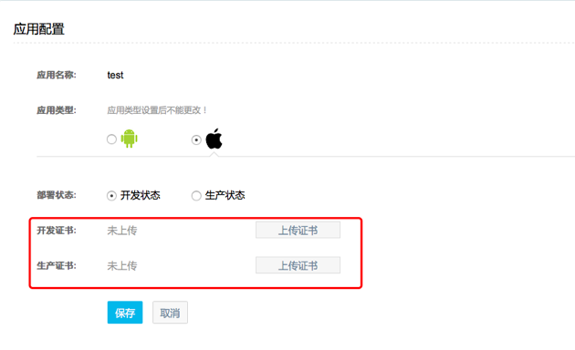

As shown above, you need to upload the development certificate and production certificate in the pem format.

### 1.2 Apply for Apple Certification

The process of applying for the cer certificate and its exporting is described in section 1.2 of "Quick integrated with Jiguang push notification". The following figure shows how to export the pem certificate from the p12 certificate.

Open a Terminal and enter the following command to export the pem certificate.

```
openssl pkcs12 -in <p12 certificate name> -out <pem certificate name> -nodes
```

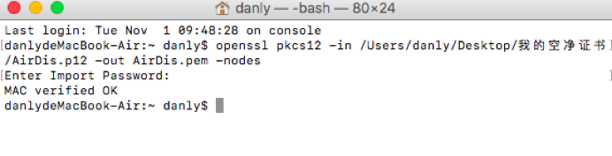

### 1.3 Import certificate to Baidu Push notification

Upload the pem certificate to the figure in "1.1 Create a Baidu application". After that, "Verified" will be displayed, and the API KEY and SECRET KEY of Baidu push notification will be generated.

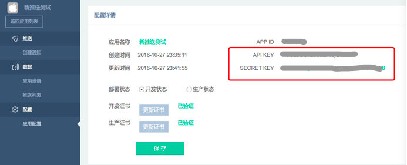
 
## 2. Bind third-party authentication in Gizwits cloud

### 2.1 Apply for D3 Engine

For this step, refer to section 2.1 of Quick integration with Jiguang push notification.

### 2.2 Bind Baidu push notification in Gizwits cloud


Type the App Key and Master Secret you applied to Baidu as the following figure and select the certificate type.

Note: When selecting "Development" for the certificate type, only in the development environment your App is able to receive notifications.


### 2.3 Create a push notification rule using D3 Engine

For this step, refer to section 2.3 of Quick integration with Jiguang push notification.

## 3. Modify the code of UIConfig.json

Fill in bpush _app_key, and set push_type to 1, indicating that Baidu push notification is selected. Then fill in the values of app_id, app_secret, and product_key of the Gizwits application that is bound to Baidu push notification.

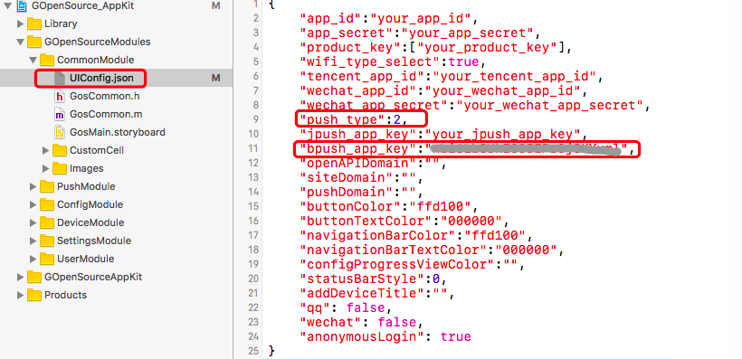

Note: Configuration of XCode push notification is also required here. For details, see "4 Configure push notification in XCode " in "Quick integration with Jiguang push notification".
 
## 4. Modify the App launch interface for Baidu push notification

The App launch interface for Baidu push notification has a pushMode parameter, there are two optional values BPushModeDevelopment and BPushModeProduction.

BPushModeDevelopment: Set Baidu push notification in development environment

When the environment set above matches the current running environment of the APP, the push notification will take effect. 

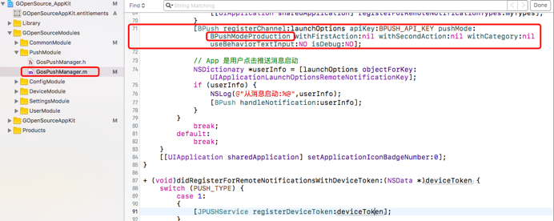

## 5. Start the virtual device

This step can refer to section 5 of Quick integration with Jiguang push notification.

## 6. Run the APP

Through the above steps, the App is equipped with Baidu push notification function. After being deployed to a mobile phone, register a user and login in, then bind the cloud virtual device by scanning its QR code. 


## 7. Test push notification

Restart the virtual device to see whether your phone receives a push message.

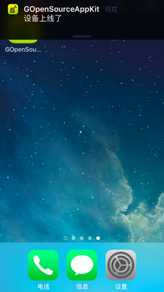

## 8. Customize the push notification sound of Baidu

### 8.1 Configure push notification sound

Go to the page of push notification sound configuration as follows. How to navigate to this page, please refer to the section “8.1 Configure push notification sound” of “Quick integration with Jiguang push notification”.


The sample detail is as follows:

```
{
  "baidu": {
    "aps": {
      "badge": 0,
      "sound": "default"
    },
    "notification_builder_id": 0,
    "notification_basic_style": 0
  },
  "jiguang": {
    "ios": {
      "sound": "sound.caf",
      "badge": 1
    },
    "android": {
      "builder_id": 0,
      "alert_type": 1,
      "style": 1
    }
  }
}
```

Here we use Baidu push notification. If the sound name is pushMusic.caf, the Advanced Parameter field need to be filled in as follows:

```
{
  "baidu": {
    "aps": {
      "badge": 0,
      "sound": "pushMusic.caf"
    }
  }
}
```

The setting is completed as follows:


Click "OK" to save and complete the settings.

### 8.2 Import push notification sound file to project

Please refer to section “8.2 Import push notification sound file to project” of “Quick integration with Jiguang push notification”.

# FAQ

## 1. Need I request to access D3 Engine to use push notification?

Answer: Yes, D3 Engine currently only targets at enterprise developers. Therefore, only enterprise developers can request to access it.

## 2. I completed the above steps using Jiguang push notification, but cannot receive the expected push notification.

Answer:

Step 1: Check whether the XCode push notification switch is enabled. For details, see 2.4 Configure push notification in XCode.
 
Step 2: Check whether the key value of the project .entitlements file matches the current test environment. Distribution represents the production environment,Development represents the development environment.

Step 3: Determine if the Bundle ID of the project is the same as the Bundle ID of the certificate.

Note: If using Baidu push notification, you also need to check whether the pushMode value of the App launch interface is consistent with the current test environment. For details, see “4. Modify the App launch interface for Baidu push notification” in Quick integration with Baidu push notification.

If after the above three steps, it still cannot be pushed, you need to verify the problem on the push notification platform.

Step 4: Log in to the Jiguang/Baidu push notification platform, and test whether the push notification from the platform can reach the App.

For the case of being unable to push from the platform:

1) Check whether the certificate has expired. Consider replacing the certificate.

For the case of being able to push from the platform:

1) Confirm whether the push environment set on Gizwits D3 Engine is consistent with the current test environment, as shown in the "Certificate Type" below.

2) Confirm whether the push notification APPID and Secret bound to the Gizwits application match those used in the App, as shown below.


3) If it still fails, insert a breakpoint in the following figure. Then print the result value, and determine the specific error code. Diagnose and fix the issue according to the error code hints.


Usually result is wrong, it needs to confirm further from the code shown in the figure below.

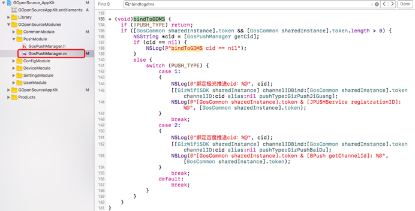

## 3. How to set the App Badge value for Jiguang push notification

Answer: [JPUSHService setBadge:0];
