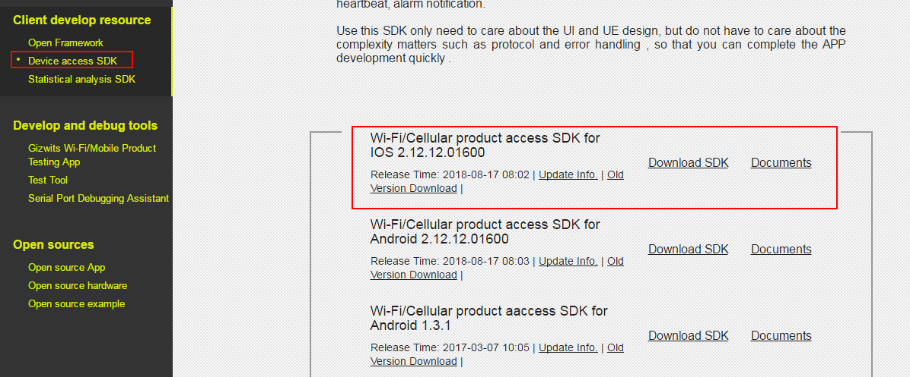
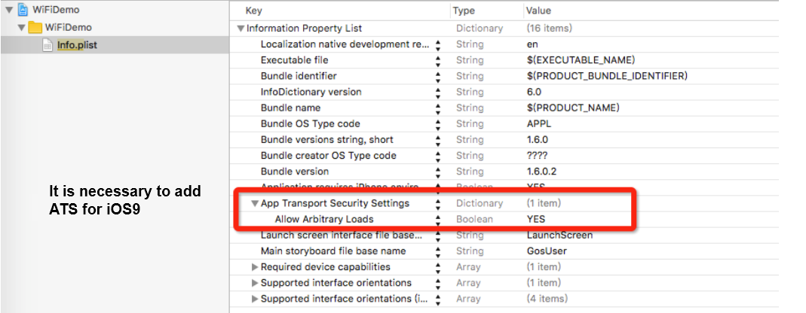
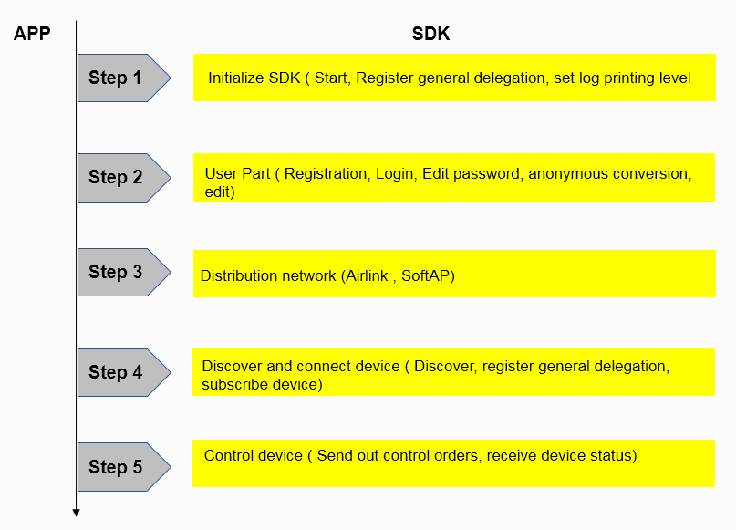
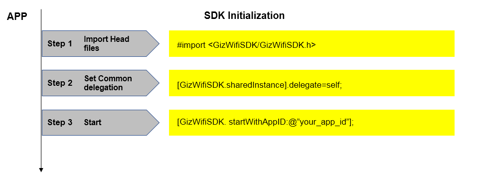
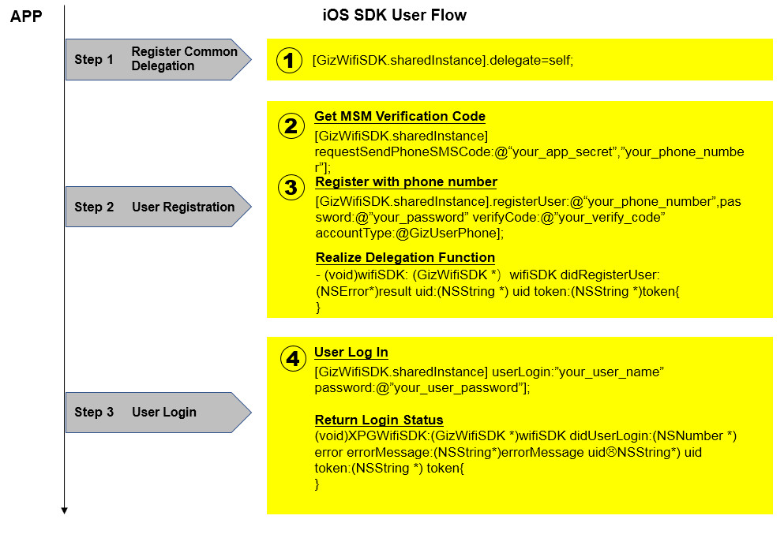
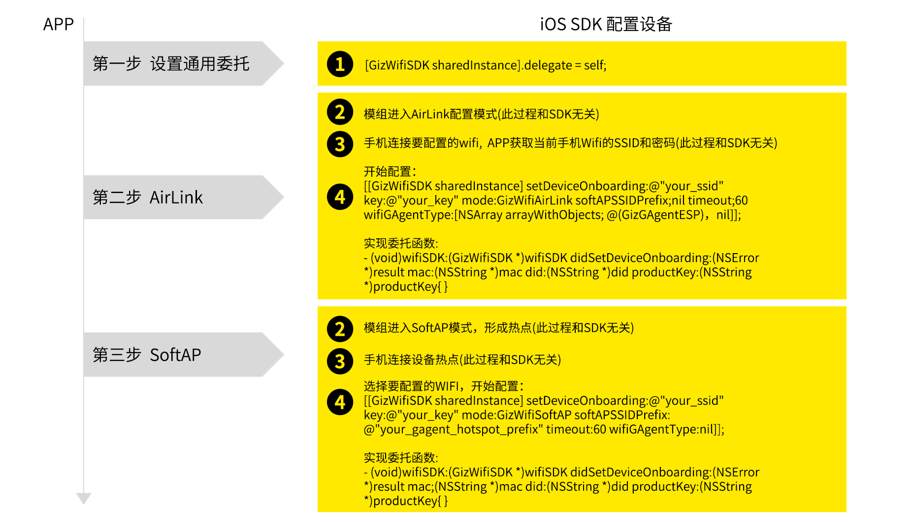
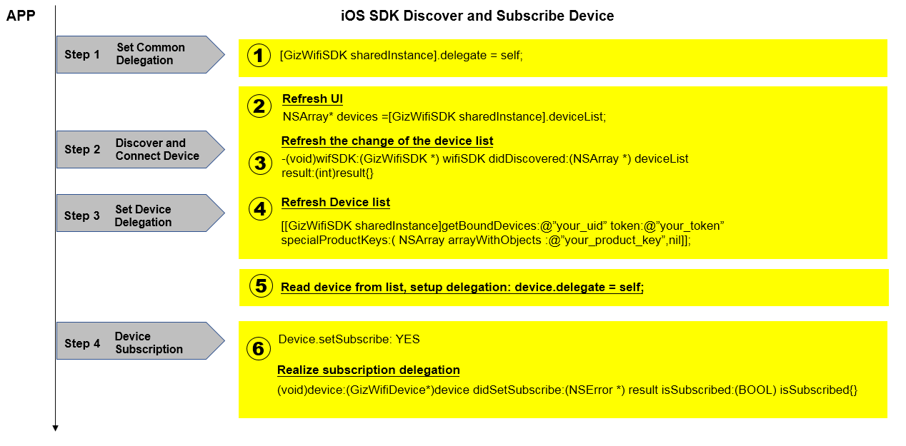
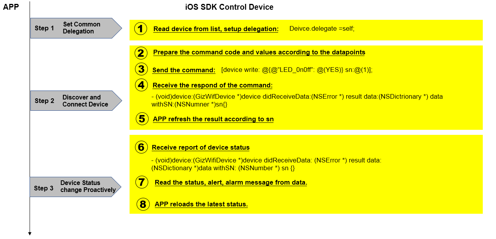
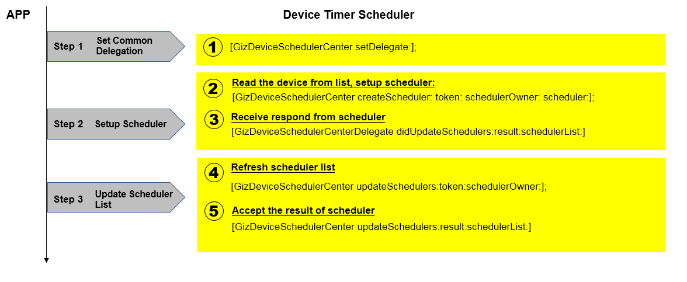
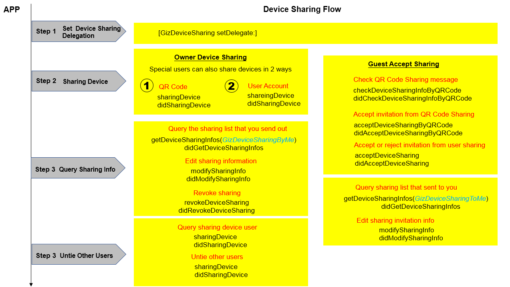

title: Guide to Gizwits Device SDK 2.0 for iOS App
---

# SDK_API Reference Manual

Attachment: iOS_SDK2.0_API Reference Manual

# Overview

## 1. Objectives

The Gizwits Device SDK (hereinafter referred to as the SDK) encapsulates the communication process between mobile phones (including PAD and other devices) and smart devices, and the communication process between mobile phones and Gizwits Cloud. These processes involve configuring network access, device discovery, connectivity, device control, heartbeat, status report, and alarm notification. Using the SDK, you only need to focus on the App UI/UE and are able to rapidly complete your App development, while ignoring the related issues such as complex protocols and error handling.
The SDK has been further simplified based on the definition of the new APIs, and its process is briefer. You have no need to understand the concept of device connectivity underneath at all.

## 2. Gizwits IoT Architecture


 
## 3. Choose the right SDK

Gizwits currently offers three types of SDKs: the native Device SDK for iOS, the native Device SDK for Android, and the cross-platform APICloud SDK. you can choose any one of those SDKs that best aligns with your desired scenario and customize as needed. The APICloud SDK can be developed once with HTML5 and adapt to both iOS and Android. For details, please refer to Guide of Gizwits Device SDK for APICloud.

## 4. Term definitions

### 4.1 GAgent

The full name is Gizwits Agent, which runs on Wi-Fi modules, and through which devices access the Gizwits server. Currently, it is compatible with mainstream Wi-Fi modules of China. Developers can also implement their own custom modules to access Gizwits using the GAgent secondary development package provided by Gizwits.

### 4.2 Micro Cycle

Connections between smart devices and mobile phones, smart devices and smart devices via the same router to achieve WLAN communication (status check or control), which is called a Micro Cycle.

### 4.3 Macro Cycle

Smart devices access the Internet via routers to accomplish remote monitoring and control by users, which is called a Macro Cycle.

### 4.4 ProductKey 

Product identification code, a 32 characters long string that is automatically generated by the developer after creating a new product in Gizwits cloud. It is a unique code in the database of Gizwits cloud. After the developer writes the ProductKey to the device master MCU, the Gizwits identifies the device through this code and automatically completes the registration.

### 4.5 DID

Device code. When a device is connected to Gizwits for the first time, Gizwits automatically generates a DID for the device based on its ProductKey and Wi-Fi module MAC address. DID which is used to associate with users and perform subsequent operations, should be unique across the entire network.

### 4.6 PassCode

Device Pass Code, used to verify the user's binding/control permission. When the user initiates a device binding, the device pass code can be obtained by users with legal means to bind the device and perform operations such as device status check and control during the valid period. GAgent generates a random number as a device pass when it is first run. It is generated and stored in non-volatile memory. When the device goes online, it needs to be reported to the server.

### 4.7 AppID

Application identification code. When you need to develop an application (including iOS, Android, Web application, etc.) for a smart device, an AppID is automatically generated in Gizwits cloud and associated with the device. This AppID is required for application development.

### 4.8 Onboarding

Network access configuration, the process of connecting a Wi-Fi-based IoT device to a router is called Onboarding. When the new device is used for the first time, it needs to know the router's SSID and password to connect to the Internet via the router. Since most IoT devices do not have their own screens and keyboards, it is necessary to send the router's SSID and password to the device through a smart phone. The network access SDK for Wi-Fi devices provided by Gizwits has such built-in configuration function.

### 4.9 AirLink

Collectively, the features of UDP broadcast messages that allow you to configure the network access for devices, such as SmartConfig and SmartLink, are called AirLink. It provides the standard onboarding operation procedures with a good user experience, which is compatible with configuration protocols from multiple Wi-Fi module manufacturers. The network access SDK for Wi-Fi devices provided by Gizwits has built-in AirLink function. 

### 4.10 SoftAP

Because each Smart Config protocol from different Wi-Fi module manufacturers is not fully mature and neither does it support 5G router signal. Gizwits has provided AirLink configuration mode and also supports SoftAP mode to configure devices to access routers. When a device enters the SoftAP configuration mode, the device itself becomes an AP, and the smart phone can directly connect to the device. Then the SSID and password of the router are input on the mobile phone and sent to the device which will automatically switch to the normal mode and try to connect to the router.

## 5. Integration preparation

### 5.1 Register a Gizwits developer account

Before using Gizwits services, you need to sign up for a developer account on site.gizwits.com. Please refer to Quick Start to complete your registration.

### 5.2 Create device connection

For this section, please refer to Quick Start.

### 5.3 Get App ID and product identification code (productkey)

For this section, please refer to Quick Start.

### 5.4 Download the SDK


 
### 5.5 Import the SDK

First double click to unzip the file GizWifiSDK-iOS-xxx.zip. According to the needs of the application development, you can choose to use dynamic libraries or static libraries. The following are the loading methods for both dynamic and static libraries:

#### 5.5.1 Import dynamic libraries

The dynamic libraries are in the decompressed DynamicLibrary directory. For dynamic library loading, please follow the settings as shown below, otherwise the App will crash immediately after running.


 
#### 5.5.2 Importing a static SDK

Firstly, after uncompressing, copy the files in the StaticLibrary directory to the specified project:


Secondly, download OpenSSL library and add the corresponding dependency. After the download is completed, double-click and extract the lib-ios, then copy and add it to the specified project.


Thirdly, if Xcode7.2 or below is used, you need to add the libraries of AudioToolbox, SystemConfiguration, CoreTelephony.


Fourthly, you must remember to enable the ATS feature in Info.plist, otherwise some functions under iOS9 cannot be used normally.



Finally, make sure that the following libraries exist in the project.


### 5.6 Use GizWifiSDK via cocoapods (optional)

Step 1: Check that installed cocoapods works properly.

```
pod –help
```

Step 2: Edit the Podfile file corresponding to the project

```
#Uncomment this line to define a global platform for your project #
platform :ios, ‘6.0’
#source ‘https://github.com/gizwits/PodSpecs.git'
Source ‘https://git.oschina.net/dantang/PodSpecs.git’
#Select only one of the above two sources
target ‘cocoapodsTest’ do pod ‘GizWifiSDK’, ‘2.04.04’ end
```

Step 3: installation

```
pod install --no-repo-update
```

Step 4: open the workspace project

# The SDK workflow

## 1. General flow chart



## 2. Key point description

1) The SDK has encapsulated all the activities related to user, configuration, discovery, connection, and control. You can use these APIs to develop the functions in the above flow chart without having to implement the communication protocol by yourself.

2) The SDK adopts the callback method, so it is necessary to set up necessary delegates, such as the common delegate and the device delegates. For more information, please refer to the detailed workflow. The SDK calls the App in the main thread.

# Detailed workflow of the SDK 

## 1. Initialization

### 1.1 Flow chart


 
### 1.2 Import header files

```
import <GizWifiSDK/GizWifiSDK.h>
```

### 1.3 Set up the common delegate

Registering the common delegate for the SDK is to enable the App to receive events from GizWifiSDK class, which involves the callback interfaces such as registration, login, device configuration, and device binding. This is a very important delegate in the use of the SDK, where the operations related to GizWifiSDK class will be called back. If the common delegate is not properly registered, the SDK will not work normally. When registering the delegate, you can implement callback interfaces on your behalf.

### 1.4 Initialize the SDK

Before the SDK is launched, any feature is not working properly. When the SDK starts, it will be initialized and automatically discover devices in the current LAN. The SDK will report the discovered devices and corresponding events through the common delegate. You can set the SDK's common delegate first, then launch the SDK so as to handle these events.

When the SDK starts, the App AppID needs to be specified. You should apply for an AppID for your own App in the Gizwits Developer Center. Please call the method in the App AppDelegate with the specified AppID. This method only needs to be called once.

The SDK's log can help you discover issues that occur while the App is running. By default, the SDK outputs all log information to the debug terminal and log files. The log files are saved in the Applications\Documents\GizWifiSDK\GizSDKLog directory. If you do not want to output logs in the debugging terminal, you can change the log output level to GizLogPrintNone.

[Code sample]

```
[GizWifiSDK shareInstance].delegate = self;
[GizWifiSDK startWithAppID:@"your_app_id"];

// Callback for system events 
- (void)wifiSDK:(GizWifiSDK *)wifiSDK didNotifyEvent:(GizEventType)eventType eventSource:(id)eventSource eventID:(GizWifiErrorCode)eventID eventMessage: (NSString *)eventMessage {
	if(eventType == GizEventSDK) {
		// SDK exception event 
		NSLog(@"SDK event happened: [%@] = %@", @(eventID), eventMessage);
	} else if(eventType == GizEventDevice) {
		// Device disconnection event 
		GizWifiDevice* mDevice = (GizWifiDevice*)eventSource;
		NSLog(@"device mac %@ disconnect caused by %@", mDevice.macAddress, eventMessage);
	} else if(eventType == GizEventM2MService) {
		// M2M service exception event 
		NSLog(@"M2M domain %@ exception happened: [%@] = %@", (NSString*)eventSource, @(eventID), eventMessage);
	} else if(eventType == GizEventToken) {
		// Event of invalid token 
		NSLog(@"token %@ expired: %@", (NSString*)eventSource, eventMessage);
	}
}
```

## 2. User Management

The user management of Gizwits Cloud includes functions such as user registration, login, password recovery, and personal information modification. Gizwits Cloud distinguishes users by APPID, and the users with different APPIDs are independent of each other. After changing the APPID of a user, you need to re-register the user.
The listener registration method involved in the following process is implemented using class inheritance.

### 2.1 Flow chart



There are many ways for users to register, such as mobile phone number, user name, email address, etc. The App can take the method as needed. For other processes such as login, password change, personal information modification, etc., see the following section.

### 2.2 User registration

Gizwits provides three user registration methods, such as register via mobile phone, regular user registration, and register via Email.

#### 2.2.1 Register as a mobile phone user

To register an account with your mobile phone, you need a valid mobile phone number. Two steps are required for registration: get the SMS verification code and register the user with the SMS verification code.

Step 1: get the SMS verification code. The SDK sends a SMS verification code request to the cloud. If the request is successful, the cloud will respond a SMS verification code to the mobile phone.

[Code sample]

```
[GizWifiSDK sharedInstance].delegate = self; 
[[GizWifiSDK sharedInstance] requestSendPhoneSMSCode:@"your_app_secret" phone:@"your_phone_number"];

// Callback
- (void)wifiSDK:(GizWifiSDK *)wifiSDK didRequestSendPhoneSMSCode:(NSError *)result token:(NSString *)token {
    if(result.code == GIZ_SDK_SUCCESS) {
        // success
    } else {
        // failure
    }
}
```

Step 2: Register with SMS verification code. The App passes the SMS verification code received by the mobile phone to the SDK, and fills in the mobile phone number and password to register.

[Code sample]

```
[GizWifiSDK sharedInstance].delegate = self; 
[[GizWifiSDK sharedInstance] registerUser:@"your_phone_number" password:@"your_password" verifyCode:@"your_verify_code" accountType:GizUserPhone];

// Callback
- (void)wifiSDK:(GizWifiSDK *)wifiSDK didRegisterUser:(NSError *)result uid:(NSString *)uid token:(NSString *)token {
    if(result.code == GIZ_SDK_SUCCESS) {
        // success
    } else {
        // failure
    }
}
```

#### 2.2.2 Register as a regular user

Register as a regular user account with a username and a password.

[Code sample]

```
[GizWifiSDK sharedInstance].delegate = self; 
[[GizWifiSDK sharedInstance] registerUser:@"your_user_name" password:@"your_password" verifyCode:nil accountType:GizUserNormal];

// Callback
- (void)wifiSDK:(GizWifiSDK *)wifiSDK didRegisterUser:(NSError *)result uid:(NSString *)uid token:(NSString *)token {
    if(result.code == GIZ_SDK_SUCCESS) {
        // success
    } else {
        // failure
    }
}
```

#### 2.2.3 Register as an Email user

Register a user account with a valid email address. After the registration is successful, the cloud will send an Email of the successful registration to the specified Email address.

[Code sample]

```
[GizWifiSDK sharedInstance].delegate = self; 
[[GizWifiSDK sharedInstance] registerUser:@"your_email_address" password:@"your_password" verifyCode:nil accountType:GizUserEmail];

// Callback
- (void)wifiSDK:(GizWifiSDK *)wifiSDK didRegisterUser:(NSError *)result uid:(NSString *)uid token:(NSString *)token {
    if(result.code == GIZ_SDK_SUCCESS) {
        // success
    } else {
        // failure
    }
}
```

### 2.3 User login

Gizwits Cloud provides three user login methods: real-name login, anonymous login, and third-party authentication. Real-name login is suitable for those Apps which have login UI and need to register before use. Anonymous login is applicable to the Apps that do not have login UI and user accounts are automatically generated in the cloud when needed. The token obtained after login is valid in 7 days.

#### 2.3.1 Real-name login

For real-name login, the user name can be the registered mobile phone number, Email address, and regular user name. If the AppID is changed, the user account needs to be re-registered.

[Code sample]

```
[GizWifiSDK sharedInstance].delegate = self; 
[[GizWifiSDK sharedInstance] userLogin:@"your_user_name" password:@"your_user_password"]; 

// Callback
- (void)wifiSDK:(GizWifiSDK *)wifiSDK didUserLogin:(NSError *)result uid:(NSString *)uid token:(NSString *)token {
    if(result.code == GIZ_SDK_SUCCESS) {
        // success
    } else {
        // failure
    }
}
```

#### 2.3.2 Anonymous login

Every time a user logs in anonymously, the obtained uid is the same. When an anonymous user logs in, if the account does not exist, the cloud generates an anonymous account based on the device ID and logs in with it.

[Code sample]

```
[GizWifiSDK sharedInstance].delegate = self; 
[[GizWifiSDK sharedInstance] userLoginAnonymous];

// Callback
- (void)wifiSDK:(GizWifiSDK *)wifiSDK didUserLogin:(NSError *)result uid:(NSString *)uid token:(NSString *)token {
    if(result.code == GIZ_SDK_SUCCESS) {
        // success
    } else {
        // failure
    }
}
```

#### 2.3.3 Third-party authentication

Gizwit Cloud currently supports third-party authentication from Baidu, Sina, and Tencent. You can use the APIs of these three platforms to obtain uid and token to log into Gizwits Cloud. When using third-party authentication, you do not need to register on Gizwits Cloud, you can log in directly.

You can get uid and token through those APIs of Sina, Baidu or Tencent. For details, please refer to the corresponding development documentation. You can also use the following tools to obtain uid and token from these third-party platforms:

ShareSDK http://mob.com/

BaiduSDK http://developer.baidu.com/wiki/index.php?title=%E5%B8%AE%E5%8A%A9%E6%96%87%E6%A1%A3%E9%A6%96%E9%A1%B5/%E7%99%BE%E5%BA%A6%E5%B8%90%E5%8F%B7%E8%BF%9E%E6%8E%A5

[Code sample]

```
// Take Sina as example
[GizWifiSDK sharedInstance].delegate = self; 
[[GizWifiSDK sharedInstance] userLoginWithThirdAccount:GizThirdSINA uid:@"your_third_uid" token:@"your_third_token"]; 

// Callback
- (void)wifiSDK:(GizWifiSDK *)wifiSDK didUserLogin:(NSError *)result uid:(NSString *)uid token:(NSString *)token {
    if(result.code == GIZ_SDK_SUCCESS) {
        // success
    } else {
        // failure
    }
}
```

### 2.4 Password reset

If you have forgotten your password, you can set a new password via mobile phone or Email, which are supported by the SDK. For the password reset via mobile phone, the verification code will sent to your mobile phone. For the password reset via Email, there will be a hyperlink delivered to your Email address which prompts you to complete the rest steps.

#### 2.4.1 Password reset via mobile phone

For the password reset via mobile phone, you need to get the SMS verification code. The approach of obtaining the SMS verification code is the same as when you registered with your mobile phone.

Step 1: get SMS verification code

[Code sample]

```
[GizWifiSDK sharedInstance].delegate = self; 
[[GizWifiSDK sharedInstance] requestSendPhoneSMSCode:@"your_app_secret" phone:@"your_phone_number"];

// Callback
- (void)wifiSDK:(GizWifiSDK *)wifiSDK didRequestSendPhoneSMSCode:(NSError *)result token:(NSString *)token {
    if(result.code == GIZ_SDK_SUCCESS) {
        // success
    } else {
        // failure
    }
}
```

Step 2: Reset your password with SMS verification code

[Code sample]

```
[GizWifiSDK sharedInstance].delegate = self; 
[[GizWifiSDK sharedInstance] resetPassword:@"your_phone_number" verifyCode:@"your_verify_code" newPassword:@"your_new_password" accountType:GizUserPhone]; 

// Callback
- (void)wifiSDK:(GizWifiSDK *)wifiSDK didChangeUserPassword:(NSError *)result {
    if(result.code == GIZ_SDK_SUCCESS) {
        // success
    } else {
        // failure
    }
}
```

#### 2.4.2 Password reset via Email

For the password reset via Email, the cloud sends a secure link to the specified Email address. You needs to check the Email in the mailbox and follow the instructions to perform the reset operation. It is possible that the password reset link is delivered into the trash folder of your mailbox, which you needs to be aware of.

The callback for the successful Email delivery is the same with the callback for the password change, so it is necessary to notice the distinction between these two cases.

[Code sample]

```
[GizWifiSDK sharedInstance].delegate = self; 
[[GizWifiSDK sharedInstance] resetPassword:@"your_email_address" verifyCode:nil newPassword:@"your_new_password" accountType:GizUserEmail]; 

// Callback
- (void)wifiSDK:(GizWifiSDK *)wifiSDK didChangeUserPassword:(NSError *)result {
    if(result.code == GIZ_SDK_SUCCESS) {
        	// The reset password Email is sent successfully, prompting the user to check
    } else {
        	// The reset password Email failed to send, the error message pops up
    }
}
```

### 2.5 Password change

The password can be changed after you log in.

[Code sample]

```
[GizWifiSDK sharedInstance].delegate = self; 
[[GizWifiSDK sharedInstance] changeUserPassword:@"your_token" oldPassword:@"your_old_password" newPassword:@"your_new_password"]; 

// Callback
- (void)wifiSDK:(GizWifiSDK *)wifiSDK didChangeUserPassword:(NSError *)result {
    if(result.code == GIZ_SDK_SUCCESS) {
        // success
    } else {
        // failure
    }
}
```

### 2.6 User type conversion

An anonymous user can be converted to a real-name user, such as a regular user or a user registered with mobile phone. After the conversion, the anonymous user's information will be transferred to the real-name user, and the original anonymous user account will be invalid. However, the user name or the mobile phone number of the target user must be unregistered before conversion, otherwise it will fail.

#### 2.6.1 An anonymous user converted to a regular user

For an anonymous user converted to a regular user, fill in the username, password, and token of the target regular user.

[Code sample]

```
[GizWifiSDK sharedInstance].delegate = self; 
[[GizWifiSDK sharedInstance] transAnonymousUser:@"your_token" username:@"your_user_name" password:@"your_password" verifyCode:nil accountType:GizUserNormal]; 

// Callback
- (void)wifiSDK:(GizWifiSDK *)wifiSDK didTransAnonymousUser:(NSError *)result {
    if(result.code == GIZ_SDK_SUCCESS) {
        // success
    } else {
        // failure
    }
}
```

#### 2.6.2 An anonymous user converted to a user registered with mobile phone

For an anonymous user converted to a mobile phone user, fill in the mobile phone number, password, SMS verification code, and token of the target user registered with mobile phone. The procedure of obtaining the SMS verification code is the same as when registering as a mobile phone user.

[Code sample]

```
[GizWifiSDK sharedInstance].delegate = self; 
[[GizWifiSDK sharedInstance] transAnonymousUser:@"your_token" username:@"your_phone_number" password:@"your_password" verifyCode:@"your_verify_code" accountType:GizUserPhone]; 

// Callback
- (void)wifiSDK:(GizWifiSDK *)wifiSDK didTransAnonymousUser:(NSError *)result {
    if(result.code == GIZ_SDK_SUCCESS) {
        // success
    } else {
        // failure
    }
}
```

### 2.7 Update user information

For real-name users, Gizwis does not support the regular user name modification. But you can modify the Email address and mobile phone number, supplement personal information after logging in, and the Email address or mobile phone number to be modified must be already registered.

After the real-name user has modified the email address or mobile phone number, he can log in using the modified email address or mobile phone number. The list of bound devices retrieved after login is the same as the original real-name user.

When you modify your Email address or mobile phone number, you can supplement your personal information at the same time. When you do not want to modify your personal information, the corresponding parameter can be set to nil. In the case of the Email address or user name is successfully modified and the personal information fails to be modified, the callback method will return success and prompt the failure reason of the personal information modification in errorMessage.

#### 2.7.1 Modify Email address

When only Email address is needed to be modified, the parameter of the personal information is set to nil, and the user type can be set to GizUserEmail. The following is a code sample to modify a user's Email address.

[Code sample]

```
[GizWifiSDK sharedInstance].delegate = self; 
[[GizWifiSDK sharedInstance] changeUserInfo:@"your_token" username:@"your_email_address" SMSVerifyCode:nil userType:GizUserEmail additionalInfo:nil]; 

// Callback
- (void)wifiSDK:(GizWifiSDK *)wifiSDK didChangeUserInfo:(NSError *)result {
    if(result.code == GIZ_SDK_SUCCESS) {
        // success
    } else {
        // failure
    }
}
```

#### 2.7.2 Modify mobile phone number

When only the user's mobile phone number is needed to be modified, the personal information parameter is set to nil, and the user type can be set to GizUserPhone. Before modifying your mobile phone number, you need to get the SMS verification code. The following code sample is used to modify the user's mobile phone number. For the code to get the SMS verification code, please refer to the registration with mobile phone number. 

[Code sample]

```
[GizWifiSDK sharedInstance].delegate = self; 
[[GizWifiSDK sharedInstance] changeUserInfo:@"your_token" username:@"your_phone_number" SMSVerifyCode: @"your_verify_code" userType:GizUserPhone additionalInfo:nil]; 

// Callback
- (void)wifiSDK:(GizWifiSDK *)wifiSDK didChangeUserInfo:(NSError *)result {
    if(result.code == GIZ_SDK_SUCCESS) {
        // success
    } else {
        // failure
    }
}
```

#### 2.7.3 Modify personal information

When only the user's personal information is needed to be modified, the phone number or mailbox parameter is set to nil, and the user type can be set to GizUserNormal. The personal information can contain multiple items, which can be specified by GizUserInfo class. The information that you do not want to modify is set to nil, and the cloud will retain the last modified value.

[Code sample]

```
[GizWifiSDK sharedInstance].delegate = self; 

GizUserInfo* additialInfo = new GizUserInfo();
additialInfo.name = @"nickname";
additialInfo.userGender = GizUserGenderMale;
additialInfo.birthday = @"1990-1-1";
additialInfo.address = @"Beijing";
additialInfo.remark = @"home";

[[GizWifiSDK sharedInstance] changeUserInfo:@"your_token" username:nil SMSVerifyCode:nil userType:GizUserNormal additionalInfo:additialInfo]; 

// Callback
- (void)wifiSDK:(GizWifiSDK *)wifiSDK didChangeUserInfo:(NSError *)result {
    if(result.code == GIZ_SDK_SUCCESS) {
        // success
    } else {
        // failure
    }
}
```

#### 2.7.4 Modify both Email addres and personal information

When modifying the Email address and personal information at the same time, the user type must be set to GizUserEmail.

[Code sample]

```
[GizWifiSDK sharedInstance].delegate = self; 

GizUserInfo* additialInfo = new GizUserInfo();
additialInfo.name = @"nickname";
additialInfo.userGender = GizUserGenderMale;
additialInfo.birthday = @"1990-1-1";
additialInfo.address = @"Beijing";
additialInfo.remark = @"home";

[[GizWifiSDK sharedInstance] changeUserInfo:@"your_token" username:@"your_email_address" SMSVerifyCode:nil userType:GizUserEmail additionalInfo:additialInfo]; 

// Callback
- (void)wifiSDK:(GizWifiSDK *)wifiSDK didChangeUserInfo:(NSError *)result {
    if(result.code == GIZ_SDK_SUCCESS) {
        // success
    } else {
        // failure
    }
}
```

#### 2.7.5 Modify both mobile phone number and personal information

When modifying the mobile phone number and personal information at the same time, the user type must be set to GizUserPhone. To modify the mobile phone number, you also need to get the SMS verification code first. For the SMS verification code, please refer to the registration with mobile phone. 

[Code sample]

```
[GizWifiSDK sharedInstance].delegate = self; 

GizUserInfo* additialInfo = new GizUserInfo();
additialInfo.name = @"nickname";
additialInfo.userGender = GizUserGenderMale;
additialInfo.birthday = @"1990-1-1";
additialInfo.address = @"Beijing";
additialInfo.remark = @"home";

[[GizWifiSDK sharedInstance] changeUserInfo:@"your_token" username:@"your_phone_number" SMSVerifyCode: @"your_verify_code" userType:GizUserPhone additionalInfo:additialInfo];

// Callback
- (void)wifiSDK:(GizWifiSDK *)wifiSDK didChangeUserInfo:(NSError *)result {
    if(result.code == GIZ_SDK_SUCCESS) {
        // success
    } else {
        // failure
    }
}
```

## 3. Configure device to access network

Before controlling a device, you need to connect the device to a router. If the router can access internet, the device connected to the router will automatically register to Gizwits Cloud.

There are two ways to configure the device to connect to the router. One is Airlink and the other is SoftAP. The App can adopt the favorite approach according to product requirements. Before configuration, the device must first enter the configuration mode, and then the App calls the configuration API to send the router SSID and password to be configured. After the device is successfully configured, the SDK returns the configured MAC address and product type identifier of the device to the App, which is convenient for the App to perform the next step. If the device has entered the configuration mode after reset and does not have time to get the DID from the cloud when the configuration is successful, the DID value obtained by the App is empty.

If the timeout period of the configuration API of the SDK is not over, the next configuration cannot be performed. In addition, because the broadcast packet of the successful device configuration can be received only if the App is connected to the same router, the above timeout period should reserve the time for the App to connect to the router.

It should be noted that if the device configured is not the expected product type for the App, the device will not appear in the App device list.

### 3.1 Flow chart


 
### 3.2 Configuration with AirLink

AirLink uses UDP broadcast sent from a mobile phone which contains the target router SSID and password. The Wi-Fi module on the device automatically connects to the target router after receiving the broadcast packet, and then sends a configuration success broadcast after connecting to the router to notify the mobile phone that the configuration has been completed.

After the Wi-Fi module enables AirLink mode, if it does not receive AirLink broadcast within one minute or is not able to connect to the router correctly, it will enter SoftAP mode.

[Code sample]

```
[GizWifiSDK sharedInstance].delegate = self; 
[[GizWifiSDK sharedInstance] setDeviceOnboarding:@"your_ssid" key:@"your_key" mode:GizWifiAirLink softAPSSIDPrefix:nil timeout:60 wifiGAgentType:[NSArray arrayWithObjects: @(GizGAgentESP), nil]];

// Callback
- (void)wifiSDK:(GizWifiSDK *)wifiSDK didSetDeviceOnboarding:(NSError *)result mac:(NSString *)mac did:(NSString *)did productKey:(NSString *)productKey {
	if(result.code == GIZ_SDK_SUCCESS) {
		// success
	} else {
		// failure
	}
}
```

### 3.3 Configuration with SoftAP

After the device enters SoftAP mode, a Wi-Fi hotspot is created on it. After the mobile phone is connected to this hotspot, the SSID and password to be used are sent to the device. After receiving the SoftAP configuration package, the Wi-Fi module on the device automatically connects to the target router. Just like the AirLink, after the router is connected, the configuration success broadcast is sent to notify the mobile phone that the configuration is completed.

Using the Wi-Fi module firmware provided by Gizwits, the Wi-Fi hotspot created by the device starts with “XPG-GAgent-” and the password is “123456789”. Modules provided by other vendors, SoftAP hotspot names are specified by respective vendors. The App can give the correct hotspot prefix as needed.

[Code sample]

```
// The MCU issues a serial port command to notify the module to enable SoftAP mode. For details, please refer to "Gizwits Air Conditioner –Serial Port Communication Protocol Document for Gizwits Cloud Access "

// Get the phone connected to the module's SoftAP hotspot

// Configure the device to access the network, send the Wi-Fi SSID and password to be used 

[GizWifiSDK sharedInstance].delegate = self; 
[[GizWifiSDK sharedInstance] setDeviceOnboarding:@"your_ssid" key:@"your_key" mode:GizWifiSoftAP softAPSSIDPrefix: @"your_gagent_hotspot_prefix" timeout:60 wifiGAgentType:nil]];

// The module receives configuration information, try to connect to the router and automatically close the hotspot
// Get the mobile phone connected to the Wi-Fi network to be used

// Wait for configuration completion or timeout, call the configuration completion interface

- (void)wifiSDK:(GizWifiSDK *)wifiSDK didSetDeviceOnboarding:(NSError *)result mac:(NSString *)mac did:(NSString *)did productKey:(NSString *)productKey {
        if(result.code == GIZ_SDK_SUCCESS) {
            // success
        } else {
            // failure
        }
}
```

## 4. Device discovery and subscription

### 4.1 Flow chart


 
### 4.2 Device discovery

After setting a delegate for the App and launching the SDK, the App can receive the push notification of device list from the SDK. Each time there are changes for the devices in the current LAN or bound devices, the SDK will automatically report the latest device list. When a device is powered off and then powered on, or a new device comes online, the device list will be refreshed. After the user logs in, the SDK will automatically report the list of devices that the user has bound to the App. The bound device can be obtained by the same user account on different mobile phones.

If the App wants to refresh the list of bound devices, you can call the bound device list API and specify the product type identifier that you care about. The SDK will return the filtered device list to the App.

The SDK provides a device list cache, and device objects in the device list remain valid throughout the App lifecycle. The cached device list is updated synchronously with the most recently discovered devices.

[Code sample]

```
// Refresh the UI with a cached device list
NSArray* devices = [GizWifiSDK sharedInstance].deviceList;

// Receive device list change report, refresh UI
- (void)wifiSDK:(GizWifiSDK *)wifiSDK didDiscovered:(NSError *)result deviceList:(NSArray *)deviceList {
        // Get the error message
        if(result.code != GIZ_SDK_SUCCESS) {
            NSLog(@"result: %@", result.localizedDescription);
        }
        // Display the device list after changed 
        NSLog(@"discovered deviceList: %@", deviceList);
		devices = deviceList;
}

// Actively refresh the list of bound devices, specify the productKey to filter devices
[GizWifiSDK sharedInstance].delegate = self; 
[[GizWifiSDK sharedInstance] getBoundDevices:@"your_uid" token:@"your_token" specialProductKeys:[NSArray arrayWithObjects: @"your_product_key", nil]];
```

### 4.3 Set device delegate

Get the device objects in the device list, set the device delegate for each of them, in order to refresh the device related UI. The App implements the corresponding callback according to its own needs.

### 4.4 Device subscription and binding

After the App gets the device list and sets delegate, you can subscribe to the device. The subscribed device will be automatically bound and automatically log in. After the device logs in successfully, it will automatically report the latest status.

The automatically bound devices are limited to the same LAN where your App resides. For devices that cannot be discovered in the LAN, the App can bind them manually. A device that is successfully bound must be subscribed before it can be used.

Whether it is manual binding or automatic binding, the remark and alias information of the device must be set after the device is successfully bound.

If the device is unsubscribed, the connection will be disconnected and instructions are not able to be issued to the device.

#### 4.4.1 Device subscription

All devices obtained through the SDK can be subscribed, and the subscription result is returned via callback. Status query and instructions issuing can only be perform on those successfully subscribed devices when their network becomes available.

[Code sample]

```
// Take the first device instance in the device list as an example and set a delegate for it. 
GizWifiDevice* mDevice = nil;
for (int i = 0; i < deviceList.count; i++) {
	mDevice = deviceList[0];
mDevice.delegate = self;
[mDevice setSubscribe:YES];
break;
}

// Callback
- (void)device:(GizWifiDevice *)device didSetSubscribe:(NSError *)result isSubscribed:(BOOL)isSubscribed {
    if(result.code == GIZ_SDK_SUCCESS) {
        // subscribe or unsubscribe successfully 
    }
}
```

#### 4.4.2 Non-LAN device binding

The App can complete the binding of the non-LAN device through the MAC, productKey, and productSecret of the device. The above information can be used to generate a QR code, which will be used by the App to bind the device. GPRS devices, Bluetooth devices, etc. are devices that cannot be discovered through the Wi-Fi LAN, and all belong to non-LAN devices.

[Code sample]

```
[GizWifiSDK sharedInstance].delegate = self;
[[GizWifiSDK sharedInstance] bindRemoteDevice:@"your_uid" token:@"your_token" mac:@"your_mac" productKey:@"your_product_key" productSecret:@"your_product_secret"];

// Callback
- (void)wifiSDK:(GizWifiSDK *)wifiSDK didBindDevice:(NSError *)result did:(NSString *)did {
    if(result.code == GIZ_SDK_SUCCESS) {
        // success
    } else {
        // failure
    }
}
```

#### 4.4.3 Set device binding information

You can also set the binding information of the device without subscribing to it. Find the device you want to modify the remark and alias information in the device list if it is bound already.

[Code sample]

```
// mDevice is the device entity object obtained from the device list, and the delegate is set for it.
mDevice.delegate = self;
[mDevice setCustomInfo:@"your_remark" alias:@"your_alias"]; 

// Callback
- (void)device:(GizWifiDevice *)device didSetCustomInfo:(NSError *)result {
    if(result.code == GIZ_SDK_SUCCESS) {
        // success
    } else {
        // failure
    }
}
```

### 4.5 Unbind device

The bound device can be unbound. To unbind a device requires the App to invoke the API to complete the operation. The SDK does not support automatic unbinding. For the device subscribed to, after unbound, it will be un-subscribed and disconnected and not report status. Thus, the App will not get the device when it refreshes the device list.

[Code sample]

```
[GizWifiSDK sharedInstance].delegate = self;
[[GizWifiSDK sharedInstance] unbindDevice:@"your_uid" token:@"your_token" did:@"your_did"];

// Callback
- (void)wifiSDK:(GizWifiSDK *)wifiSDK didUnbindDevice:(NSError *)result did:(NSString *)did {
    if(result.code == GIZ_SDK_SUCCESS) {
        // success
    } else {
        // failure
    }
}
```

### 4.6 Get hardware information

Hardware information can be obtained without subscribing to the device. The App can get hardware information such as the module protocol version number and the MCU firmware version number, but only for the devices located in the same LAN.

[Code sample]

```
// mDevice is the device entity object obtained from the device list, and the delegate is set for it.

mDevice.delegate = self;
[mDevice getHardwareInfo]; 

// Callback
- (void)device:(GizWifiDevice *)device didGetHardwareInfo:(NSError *)result hardwareInfo:(NSDictionary *)hardwareInfo {
    if(result.code == GIZ_SDK_SUCCESS) {
        // success
		NSString *hardWareInfo = [NSString stringWithFormat:@"WiFi Hardware Version: %@,\
			WiFi Software Version: %@,\
			MCU Hardware Version: %@,\
			MCU Software Version: %@,\
			Firmware Id: %@,\
			Firmware Version: %@,\
			Product Key: %@“
			, [hwInfo valueForKey: @"wifiHardVersion"]
			, [hwInfo valueForKey: @"wifiSoftVersion"]
			, [hwInfo valueForKey: @"mcuHardVersion"]
			, [hwInfo valueForKey: @"mcuSoftVersion"]
			, [hwInfo valueForKey: @"wifiFirmwareId"]
			, [hwInfo valueForKey: @"wifiFirmwareVer"]
			, [hwInfo valueForKey: @"productKey"];
    } else {
        // failure
    }
}
```

## 5. Device control 

The SDK controls devices and receives device status through dictionary key-value pairs. After receiving dictionary key-value pairs of an instruction sent by the App, the SDK parses the data that can be recognized by the device and sends it to the device. In the opposite direction, after receiving the data that the device replies or reports, the SDK parses it to dictionary key-value pairs and reports it to the App.

The GAgent firmware and Gizwits serial port communication protocol need to be flashed onto the smart device correctly. If data points are defined for the device, the instructions sent by the App must conform to the data point definition. If there is no data point defined for the device, the device instructions can be issued in a custom format.

### 5.1 Flow chart



### 5.2 Send device instructions

After the device subscription becomes available, the App can send instructions. Device instructions are in dictionary format, with key-value pairs being data point names and values. The instruction result is returned in the didReceiveData callback.

When the App issues an instruction in which the parameter sn can be specified, and the parameter sn in the callback can indicate whether the issued instruction is successfully sent. However, the callback parameter dataMap may be an empty dictionary, depending on whether the device passes the current data point status when replying.

If the App only concerns whether there is a device status report after the instruction is issued, the parameter sn of the issued instruction can be filled with 0, and the callback parameter sn is also 0.

[Code sample]

```
// Get the device object in the device list, set the delegate for it
mDevice.delegate = self;

// Send a light-on instruction to a device whose subscription is available
int sn = 5;
[self write: @{@"LED_OnOff": @(YES)} sn:@(sn)];

// Callback
- (void)device:(GizWifiDevice *)device didReceiveData:(NSError *)result data:(NSDictionary *)data withSN:(NSNumber *)sn {
if(result.code == GIZ_SDK_SUCCESS) {
    // The command sequence number matches, and the light-on instruction is executed successfully.
if (sn == 5) {
}
    } else {
        // Execution failure
    }
}
```

### 5.3 Get device status

After the device subscription becomes available, the App can receive the device status report at any time through the didReceiveData callback. When the device reports its status, the callback parameter sn is 0, and the callback parameter dataMap has the status reported by the device.

[Code sample]

```
(void)device:(GizWifiDevice *)device didReceiveData:(NSError *)result data:(NSDictionary *)data withSN:(NSNumber *)sn {
    //Basic data, whose format is consistent with the sent data
    NSDictionary *_data = [data valueForKey:@"data"];

    // Alarm
    NSArray *alarms = [data valueForKey:@"alerts"];

    // Fault
    NSArray *faults = [data valueForKey:@"faults"];

    //Data via transparent transmission
    NSDictionary *binary = [data valueForKey:@“binary"];

    //Deal with these types of data 
}
```

### 5.4 Device status query

After the device subscription becomes available, the App can query the device status. The device status query result is also obtained by the didReceiveData callback, and the callback parameter sn is 0. The callback parameter dataMap has the status of the returned status.

[Code sample]

```
// mDevice is the device entity object obtained from the device list, set a delegate for it
mDevice.delegate = self;
[mDevice getDeviceStatus];

- (void)device:(GizWifiDevice *)device didReceiveData:(NSError *)result data:(NSDictionary *)data withSN:(NSNumber *)sn {
    if(result.code == GIZ_SDK_SUCCESS) {
        // The data parse is the same as section 3.5.3
    } else {
        // failure
    }
}
```

## 6. Device task scheduling

By setting up a scheduled task for a device, you can have the device perform certain actions on a predetermined date and time. These tasks can be repeated on certain days of each month or on certain days of each week.

Scheduled tasks can be set first and then executed or stopped at any time. The scheduled task is enabled by default when it is created.

### 6.1 Flow chart



### 6.2 Create a scheduled task

Scheduled tasks can be executed repeatedly or only once, and repeated tasks are divided into monthly occurring tasks and weekly occurring tasks. However, you can only specify one type of repetition at the same time, that is, not repeated or repeated on a weekly basis or repeated on a monthly basis.

When using the SDK API, the parameter weekDays is set for weekly occurring tasks and the parameter monthDays is set for monthly occurring tasks. However, if both are set, only the parameter weekDays will be used.

The following three examples are shown below.

#### 6.2.1 Create a one-time scheduled task

Suppose we need to turn on a light at 6:30 am on January 16, 2017. In the following code, the date and time are set to the corresponding values, where the date is 2017-01-16, the time is 06:30 (in 24-hour format).

[Code sample]

```
// Set a scheduled task delegate
[GizDeviceSchedulerCenter setDelegate:self];

// Create a one-time scheduled task, which will turn on a light at 6:30 am on January 16, 2017
GizDeviceScheduler *scheduler = [[GizDeviceScheduler alloc] init];
scheduler.date = @"2017-01-16";
scheduler.time = @"06:30";
scheduler.remark = @"一次性开灯任务";
scheduler.attrs = @{@"LED_OnOff": @YES};

// Create a scheduled task for the device mDevice which is the device object obtained in the device list
[GizDeviceSchedulerCenter createScheduler:@"your_uid" token:@"your_token" schedulerOwner:mDevice scheduler:scheduler]; 

// Callback
- (void)didUpdateSchedulers:(GizWifiDevice*)schedulerOwner result:(NSError*)result schedulerList:(NSArray*)schedulerList {
    if(result.code == GIZ_SDK_SUCCESS) {
        // success
    } else {
        // failure
    }
}
```

#### 6.2.2 Create a weekly occurring scheduled task

We now get the scheduled task executed on a weekly basis, and we have to turn on a light every Monday to Friday at 6:30 in the morning.

[Code sample]

```
// Set a scheduled task delegate
[GizDeviceSchedulerCenter setDelegate:self];

// The repeated scheduled task from Monday to Friday
GizDeviceScheduler *scheduler = [[GizDeviceScheduler alloc] init];
scheduler.time = @"06:30";
scheduler.weekDays = @[@GizScheduleMonday, @GizScheduleTuesday, @GizScheduleWednesday, @GizScheduleThursday, @GizScheduleFriday];
scheduler.remark = @"按周重复执行的开灯任务";
scheduler.attrs = @{@"LED_OnOff": @YES};

// Create a scheduled task for the device mDevice which is the device object obtained in the device list. 
[GizDeviceSchedulerCenter createScheduler:@"your_uid" token:@"your_token" schedulerOwner:mDevice scheduler:scheduler]; 

// Callback
- (void)didUpdateSchedulers:(GizWifiDevice*)schedulerOwner result:(NSError*)result schedulerList:(NSArray*)schedulerList {
    if(result.code == GIZ_SDK_SUCCESS) {
        // success
    } else {
        // failure
    }
}
```

#### 6.2.3 Create a monthly occurring scheduled task

We now get the scheduled tasks executed on a monthly basis, and we have to turn on the light on the 1st and 15th of each month at 6:30 in the morning. 

Note that do not set a weekly occurring scheduled task together with a monthly occurring scheduled task. If you do so, the monthly occurring scheduled task will be ignored. 

[Code sample]

```
// Set a scheduled task delegate 
[GizDeviceSchedulerCenter setDelegate:self];

// The task will be executed on the 1st and 15th of each month
GizDeviceScheduler *scheduler = [[GizDeviceScheduler alloc] init];
scheduler.time = @"06:30";
scheduler.monthDays = @[@1, @15];
scheduler.remark = @"按月重复执行的开灯任务";
scheduler.attrs = @{@"LED_OnOff": @YES};

// Create a scheduled task for the device mDevice which is the device object obtained in the device list. 
[GizDeviceSchedulerCenter createScheduler:@"your_uid" token:@"your_token" schedulerOwner:mDevice scheduler:scheduler]; 

// Callback
- (void)didUpdateSchedulers:(GizWifiDevice*)schedulerOwner result:(NSError*)result schedulerList:(NSArray*)schedulerList {
    if(result.code == GIZ_SDK_SUCCESS) {
        // success
    } else {
        // failure
    }
}
```

### 6.3 Obtain the scheduled task list

After creating a scheduled task, you can get a list of all scheduled tasks that have been created. After obtaining the scheduled task list, you can modify or delete any created scheduled task in the list.

[Code sample]

```
// Set a scheduled task delegate 
[GizDeviceSchedulerCenter setDelegate:self];

// Update the scheduled task list for the device mDevice which is the device object obtained in the device list.
[GizDeviceSchedulerCenter updateSchedulers:@"your_uid" token:@"your_token" schedulerOwner:mDevice]; 

// Callback
- (void)didUpdateSchedulers:(GizWifiDevice*)schedulerOwner result:(NSError*)result schedulerList:(NSArray*)schedulerList {
    if(result.code == GIZ_SDK_SUCCESS) {
        // success
    } else {
        // failure
    }
}
```

### 6.4 Modify a scheduled task

You can modify a scheduled task that has been created. When modifying, the scheduled task object is taken out from the obtained scheduled task list.

Note that once a scheduled task is created, it is assigned an ID that cannot be modified.

[Code sample]

```
// Set a scheduled task delegate 
[GizDeviceSchedulerCenter setDelegate:self];

// Modify the previously created one-time scheduled task to a scheduled task that is executed repeatedly on the 1st and 15th of each month. The scheduler is the scheduled task object to be modified in the scheduled task list. 
scheduler.time = @"06:30";
scheduler.remark = @"开灯任务";
scheduler.attrs = @{@"LED_OnOff": @YES};
scheduler.monthDays = @[@1, @15];

// Modify the scheduled task for the device mDevice which is the device object obtained in the device list. 
[GizDeviceSchedulerCenter editScheduler:@"your_uid" token:@"your_token" schedulerOwner:mDevice scheduler:scheduler]; 

// Callback
- (void)didUpdateSchedulers:(GizWifiDevice*)schedulerOwner result:(NSError*)result schedulerList:(NSArray*)schedulerList {
    if(result.code == GIZ_SDK_SUCCESS) {
        // success
    } else {
        // failure
    }
}
```

### 6.5 Delete a scheduled task

In the obtained scheduled task list, find the scheduled task ID to be deleted and delete it.

[Code sample]

```
// Set a scheduled task delegate
[GizDeviceSchedulerCenter setDelegate:self];

// Delete the scheduled task of the device mDevice which is the device object obtained in the device list. The parameter your_scheduler_id is the scheduled task ID to be deleted.
[GizDeviceSchedulerCenter deleteScheduler:@"your_uid" token:@"your_token" schedulerOwner:mDevice schedulerID:@"your_scheduler_id"]; 

// Callback
- (void)didUpdateSchedulers:(GizWifiDevice*)schedulerOwner result:(NSError*)result schedulerList:(NSArray*)schedulerList {
    if(result.code == GIZ_SDK_SUCCESS) {
        // success
    } else {
        // failure
    }
}
```

## 7. Device sharing

After binding a device, you can let others use the device through device sharing. When multiple customers use the same device, device sharing provides device permission management with a more secure and convenient device binding. There are four types of device permissions for device binding:

* Owner: The primary account of the device, which can share the device;
* Guest: The shared account of the device, which can accept the sharing invitation and can no longer share the device to other users;
* Special: The account which has bound to the device at the earliest but has not shared the device, and will become the Owner of the device after sharing it;
* Normal: The account that has bound to the device but cannot share the device or become the Owner of the device.

Only the user bound to a device at the earliest or the Owner of a device can share the device. Once a device has an Owner account, other users can no longer bind the device. The Owner can view the currently users bound to the device and can unbind other users. When a device does not have an Owner, other users can bind the device.

### 7.1 Flow chart



### 7.2 Make a device sharing invitation

Before sharing your devices, check which devices you can share. Using the SDK, the App can traverse the list of devices and find those devices on which the currently logged in user has a permission of GizDeviceSharingSpecial or GizDeviceSharingOwner to create a device sharing invitation.

There are two ways to create a device sharing invitation by Owner and Special: Device Sharing via user ID and Device Sharing via QR code.

#### 7.2.1 Device Sharing via user ID

For Device Sharing via user ID, the receiver's ID can be a mobile phone number, an email address, a regular user name, or an anonymous ID, but it must be a user who has already registered in Gizwits Cloud. If the user is already the Guest of this device or has already bound the device, the sharing invitation will fail to be created. The sharing invitation is valid for 24 hours, that is, the receiver must respond within 24 hours, otherwise the invitation will expire. 

You need to specify the user ID type. The guestUser parameter for the anonymous user should be set to the uid of the anonymous user. When the Account Sharing is created successfully, the sharingID will be returned in the callback parameter, but the QRCodeImage will not be returned. The following is only an example of device sharing to a user registered with mobile phone number:

[Code sample]

```
// Set a device sharing delegate
[GizDeviceSharing setDelegate:self];

// Find devices that can be shared in the device list

// Share the device to a user registered with mobile phone number
[GizDeviceSharing sharingDevice:@"your_token" deviceID: @"your_device_id" sharingWay:GizDeviceSharingByNormal guestUser:@"guest_phone_number" guestUserType:GizUserPhone]; 

// Callback
- (void)didSharingDevice:(NSError*)result deviceID:(NSString*)deviceID sharingID:(NSInteger)sharingID QRCodeImage:(UIImage*)QRCodeImage {
    if(result.code == GIZ_SDK_SUCCESS) {
        // success
    } else {
        // failure
    }
}
```

#### 7.2.2 Device Sharing via QR code

For the Device Sharing via QR code, the QR code is valid for 15 minutes, that is, the receiver must scan the generated QR code within 15 minutes and respond, otherwise the QR code invitation will expire. When the QR code Sharing invitation is created successfully, the sharingID will be returned in the callback parameter, and the corresponding QRCodeImage will also be returned. The App can directly load the QR code image.

[Code sample]

```
// Set a device sharing delegate
[GizDeviceSharing setDelegate:self];

// Find devices that can be shared in the device list

// Share the device through QR code Sharing
[GizDeviceSharing sharingDevice:@"your_token" deviceID: @"your_device_id" sharingWay:GizDeviceSharingByQRCode guestUser:nil guestUserType:GizUserOther]; 

// Callback
- (void)didSharingDevice:(NSError*)result deviceID:(NSString*)deviceID sharingID:(NSInteger)sharingID QRCodeImage:(UIImage*)QRCodeImage {
    if(result.code == GIZ_SDK_SUCCESS) {
        // success
    } else {
        // failure
    }
}
```

### 7.3 Accept sharing invitation

The Guest account can query the received sharing invitations. Only the Guest account can accept the sharing invitation.

If a sharing invitation received by the Guest has not yet been accepted, the Guest can accept or reject it.

[Code sample]

```
// Set a device sharing delegate
[GizDeviceSharing setDelegate:self];

// Query the received sharing invitations
[GizDeviceSharing getDeviceSharingInfos:@"your_token" sharingType: GizDeviceSharingToMe deviceID: @"your_device_id"];

// Callback for getting the invitation list 
- (void)didGetDeviceSharingInfos:(NSError*)result deviceID:(NSString*)deviceID deviceSharingInfos:(NSArray*)deviceSharingInfos {
    if(result.code == GIZ_SDK_SUCCESS) {
        // Get the invitation list successfully. Find the unaccepted sharing invitations in deviceSharingInfos, and your_sharing_id represents the sharing invitation to be accepted
        NSInteger your_sharing_id = -1;
        for (int i = 0; i < deviceSharingInfos.count; i++) {
            GizDeviceSharingInfo* mDeviceSharing = [deviceSharingInfos objectAtIndex:i];
            if (mDeviceSharing.status == GizDeviceSharingNotAccepted) {
                your_sharing_id = mDeviceSharing.id;
                break;
            }
        }
           
        // Accept the invitation
        if (your_sharing_id != -1) {
            [GizDeviceSharing acceptDeviceSharing:@"your_token" sharingID:your_sharing_id accept:YES];
        }
    } else {
        // Fail to get the invitation list
    }
}

// Callback for accepting the sharing invitation	
- (void)didAcceptDeviceSharing:(NSError*)result sharingID:(NSInteger)sharingID {
    if(result.code == GIZ_SDK_SUCCESS) {
        // success
    } else {
        // failure
    }
}
```

# See Also

See "Introduction to App code auto-generator" to understand what functions the automatically generated App code has;

See "App open source framework" to understand

* Guide of App open source framework for iOS
* Guide of iOS App push notification integration
* Guide of iOS App third-party authentication and re-skin
* Quick start of iOS App development
* Guide of App open source framework for Android
* Guide of Android App push notification integration
* Guide of Android App third-party authentication and re-skin
* Guide of APICloud open source framework

See "App Development SDK" to develop the IoT App (many user cases of design details can be found here)

* Guide of Gizwits Device SDK 2.0 for iOS App
* Guide of Gizwits Device SDK 2.0 for Android App
* Guide of Gizwits Device SDK for APICloud App
* Explanation of SDK data transparent transmission
* Guide of SDK debug log capture
* SDK error codes

More application development guides

* Application development FAQ
* Device sharing guide
* Application process for third-party authentication platform 