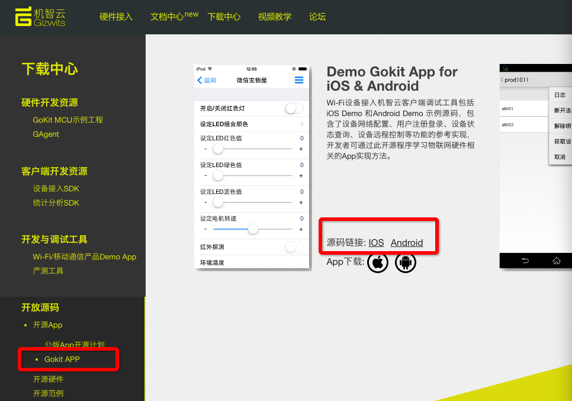

title: Guide of App open source framework for iOS (including source code)
---

# Overview

The App open source framework (hereinafter referred to as Framework) of Gizwits is a App template developed by Gizwits SDK to achieve the SDK loading, initialization, user registration, user login, device configuration, device discovery, device connection, device listing and other basic functions. The Framework is a source code project which is available to all developers and currently supports iOS and Android platforms. App developers can create a complete App by implementing specific product control pages based on the Framework.

This document is the guide of the Gizwits IoT App Suite. It is intended to provide a rapid development template for developers of Gizwits IoT, which can also be used for reference.

For source code of the Framework for iOS, find here:

https://git.oschina.net/dantang/GizOpenSource_AppKit_iOS

iOS Gokit App is an example project that uses the Framework. Its source code can be find here:

https://git.oschina.net/dantang/GoKit_Demo_iOS

It can also be downloaded at the Download Center:


 
# The Framework code directory structure

__A. Library: Third-party library directory including GizWifiSDK__

__B. GizOpenSourceModules: contains__

* CommonModule: Common helper classes, resource files, and custom Cell
* ConfigModule: Device configuration module, including AirLink and SoftAP
* UserModule: User module, including user login, user registration, password recovery
* DeviceModule: Device module, including device listing
* SettingsModule: Settings module, containing settings of menu and submenus (About etc.)
* PushModule: Push notification module, encapsulating Baidu push SDK and Jiguang push SDK 

# Quick Integration Guide

## 1. Set initialization parameters
The default program entry is LoginViewController in UserModule. Gizwits AppID, AppSecret and program styles can be filled in GOpenSourceModules/CommonModule/UIConfig.json file of the project.

If you use a third-party authentication or push notification, you need to fill in the appropriate parameters from the related platforms. If you use the push notification, you need to uncomment the related macro line in order to enable the corresponding type of push notification. If you don’t uncomment all the related macro lines, it means you are not using any third-party push notification at the time. Only one type of third-party push is supported at the same time, hence don’t uncomment multiple third-party push notification macro lines.

Configurable parameters are:

* app_id: Gizwits app id
* app_secret: Gizwits app secret
* product_key: Gizwits product key 
* wifi_type_select: whether the Wi-Fi module selection function is enabled
* tencent_app_id: app id for qq authentication
* wechat_app_id: app id for WeChat authentication
* wechat_app_secret: app secret for WeChat authentication
* push_type: Push notifciation type [0: Off, 1: Jiguang, 2: Baidu]
Jpush_app_key: app key for Jiguang push notification
* bpush_app_key: app key for Baidu push notification
* openAPIDomain: openAPI domain name and port, format: "api.gizwits.com". To specify the port, the format is: "xxx.xxxxxxx.com:81&8443"
* siteDomain:site domain name and port, format: "site.gizwits.com". To specify the port, the format is: "xxx.xxxxxxx.com:81&8443"
* pushDomain: push notification service domain name and port, format: "push.gizwits.com". To specify the port, the format is: "xxx.xxxxxxx.com:81&8443"
* buttonColor: Button color
* buttonTextColor: Button text color
* navigationBarColor: Navigation bar color
* navigationBarTextColor: Navigation bar text color
* configProgressViewColor: Configuration progress view color
* statusBarStyle: Status bar text color [0: black, 1: white] 
* addDeviceTitle: Title of “Add Device” page
* qq: whether to enable QQ auhentication [true: open]
* wechat: whether to enable WeChat auhentication [true: open] 
* anonymousLogin: whether to enable anonymous login [true: open] 

## 2. Loading the control page

1) The code provided in the Framework project implements the redirection to the control page without any modification. You only need to focus on the logic of the operation pages. If you want to click a device in the device list page and jump to the view you created, modify the corresponding redirection parameters in the AppDelegate.m file. Please modify the imported header files and class definition of the target view as shown in the figure. If you use the blank page (GosDeviceController) provided by default to create the control page, you can skip this step.

2) Set the GizWifiDeviceDelegate in the control page, for example:

```
self.device.delegate = self;
```

3) Defining the delegate callback of the class in the control page to implement the GizWifiDeviceDelegate delegate method of the SDK:

```
- (void)device:(GizWifiDevice *)device didReceiveData:(NSError *)result data:(NSDictionary *)data withSN:(NSNumber *)sn;
```

It is used to receive the device state change notification reported by the SDK, which will be parsed in order to update the page.

4) To implement the instruction issuing, you need to call the interface method of the GizWifiDevice instance in the SDK:

```
 (void)write:(NSDictionary *)data withSN:(int)sn;
```

For detailed parameter explanation, see the SDK guide.

5) When exiting the control page, you need to unsubscribe from the current device, and call the interface method of the GizWifiDevice instance in the SDK with the parameter set to NO:

```
- (void)setSubscribe:(BOOL)subscribed;
```

## 3. Add menu items on the settings page

If you need to add or modify an item in the settings page, you need to update the GosSettingsViewController class file in the SettingsModule. Find and modify the delegate method of the UITableView in the .m file.

# FAQ

## A. Which iOS versions are supported by the Framework?

It supports iOS 7 and later systems currently.

## B. How to change the version number?

The version number consists of two parts, the format is: project version number.program compilation time, where the project version number is set in the info, the program compilation time consists of the latter two digits of the year, month and day, which has a total of 6 characters. If you need to modify the display version number, you need to update the value of the property appVersionLabel in the viewDidLoad method of About page (GosAboutViewController) of SettingsModule.

# See Also

See "Introduction to App code auto-generator" to understand what functions the automatically generated App code has;

See "App open source framework" to understand

* Guide of App open source framework for iOS
* Guide of iOS App push notification integration
* Guide of iOS App third-party authentication and re-skin
* Quick start of iOS App development
* Guide of App open source framework for Android
* Guide of Android App push notification integration
* Guide of Android App third-party authentication and re-skin
* Guide of APICloud open source framework

See "App Development SDK" to develop the IoT App (many user cases of design details can be found here)

* Guide of iOS SDK 2.0 integration
* Guide of Android SDK 2.0 integration
* Guide of APICloud SDK
* Explanation of SDK data transparent transmission
* Guide of SDK debug log capture
* SDK error codes

More application development guides

* Application development FAQ
* Device sharing guide
* Application process of third-party authentication platform 