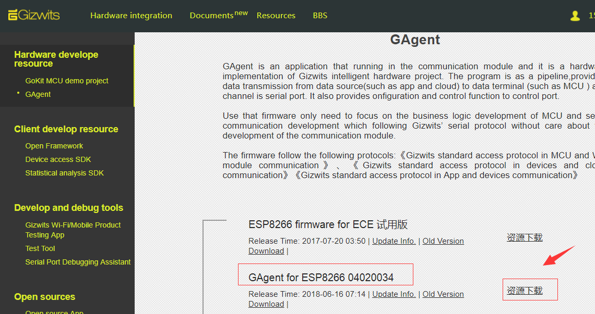
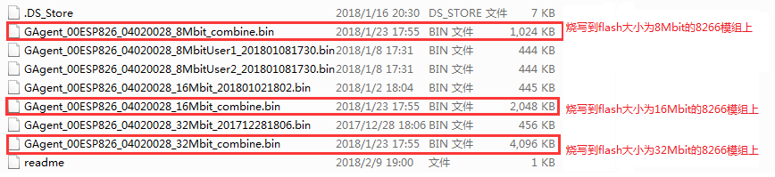
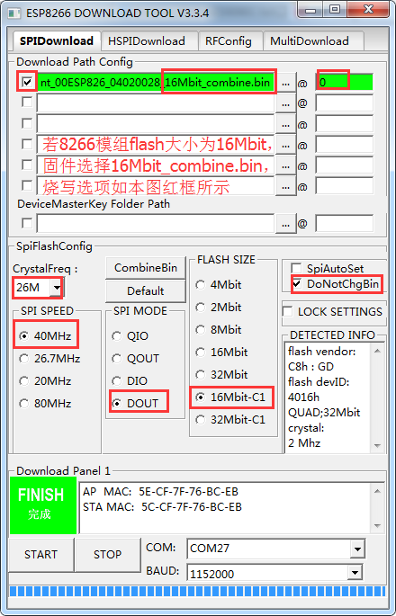
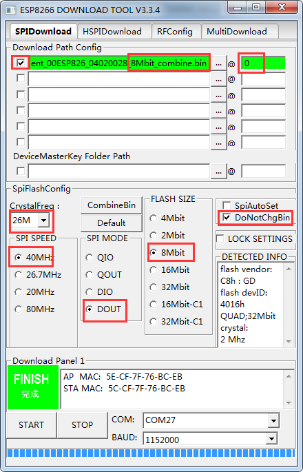
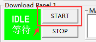

title: Firmware downloading for ESP8266 via serial port
---

# Overview

This document describes how to perform firmware downloading on ESP8266 module via serial port. When downloading firmware for the module, please follow the steps below, otherwise an unknown error will occur.

# Procedure

## 1. Download the firmware package for ESP8266

GAgent firmware download link for ESP8266: https://download.gizwits.com/zh-cn/p/92/94

 
## 2. Confirm the downloaded firmware files (Take combine files as an example)

The files which have a bin extension are what we need.
 
## 3. Connect the module to PC

Connect the ESP8266 module to a USB-to-TTL converter according to the following schematic. Note that GPIO0 (Pin 18) needs to be set to LOW as an input. Here it is connected to ground directly. KEY1 is used for the external reset function.

The above figure is a simplified schematic diagram for firmware downloading. When actually setting up the wiring, please refer to the official circuit diagram, as shown below:

## 4. Configuration of the firmware downloading tool

### Get the firmware downloading tool

Please download the ESP8266 DOWNLOAD TOOL from:

https://www.espressif.com/sites/default/files/tools/flash_download_tools_v3.6.4.rar

### Configuration of the firmware downloading tool for standalone MCU scheme (Flashing the combine firmware file according to the flash size)

### Configuration of the firmware downloading tool for SoC scheme (Flashing the firmware files compiled using Gizwits SoC scheme)

## 5 Flash firmware

Step 1: Select the actual COM port of ESP8266 and connect it to the PC successfully. Then click START button and wait for ESP8266 to power up.

It will display as below.

Step 2: Reset ESP8266 (Press the KEY1 shown in the schematic of section 3 and release it) to enter the download mode. It will start to download the firmware.

Step 3: After waiting for a while, it will display the FINISH message which indicates that the firmware downloading is successful.

