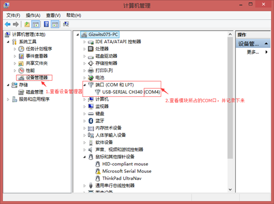
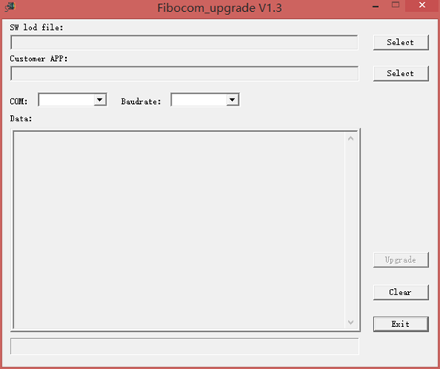
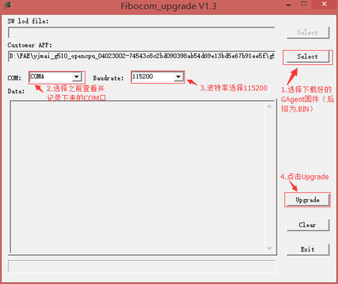
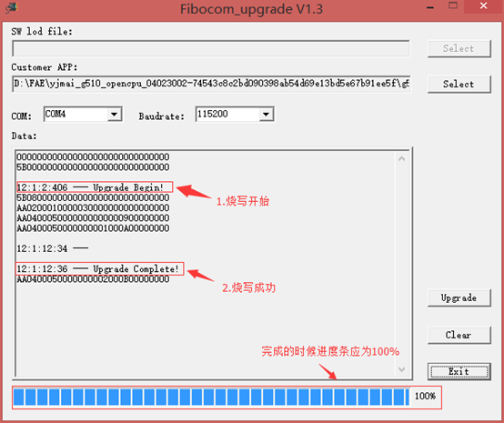
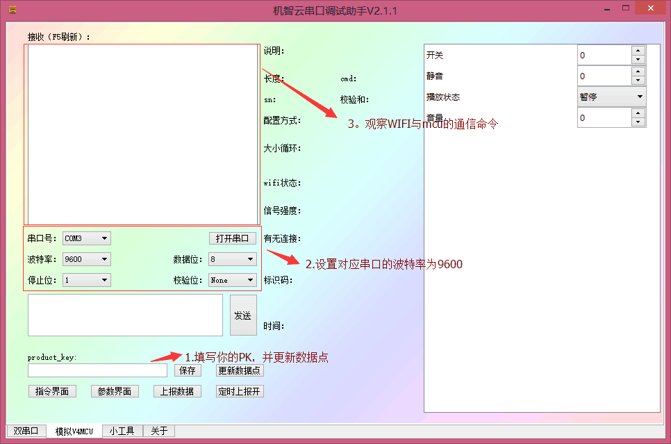
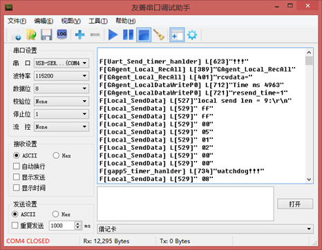

title: Firmware downloading for Fibocom G510 
---

# Overview

G510 is a GPRS-based communication module introduced by Fibocom. This document describes how to connect a MCU to Gizwits IoT Cloud via the G510 module so as to realize the communication scheme, which covers the G510 module pin description, SIM card wiring, power supply requirements, serial port definition, and firmware downloading etc. Please refer to the following information when connecting devices to Gizwits IoT Cloud to avoid unknown errors. .

# Get ready

## Pin layout 

 
## Wiring for SIM card

The module contains a SIM card interface that complies with the GSM 11.11 and GSM 11.12 standards (based on ISO/IEC 7816), which define the electrical characteristics, signaling and protocol specifications of the GSM SIM card.

The module does not contain a SIM card slot which should be placed on the user development kit outside the module. The module's SIM card interface incorporates all necessary signals that are connected to a interface connector and then totally connected to an external SIM card. The module supports automatic frame recognition of 1.8V or 2.85V level. When the module is power-on, SIM_VCC first supplies 1.8V output voltage to the external SIM card in order to establish communication. If it failed to establish communication, SIM_VCC will again output 2.85V and help establish communication with the SIM card.

 
The figure below shows a typical SIM card interface that can attach to the module. This type of connection is implemented using the MOLEX (PN 912283001 & 912360001) SIM card slot on the development kit. 

Regardless of whether SIM_CD is used or not, it must be pulled up to ensure the stable detection to SIM card. The internal pull-up on SIM_DATA is active and connected to SIM_VCC, so SIM_DATA does not need external pull-up again.

 
The design of the SIM interface and signals is especially important. In order to meet design standards and specifications, the following points are the design guidelines that must be followed:

* The SIM card location and the SIM signal trace must be kept away from any possible sources of electromagnetic interference, such as RF antennas and switching digital pins in close temporal proximity. 
* Between the module interface connector and the SIM card slot, the SIM card trace length should not exceed 100mm so as to satisfy the EMC rule while providing signal integrity.
* To avoid crosstalk between the SIM card clock and the data signals (SIM_CLK and SIM_DATA), it is recommended to separate them on the development kit, preferably by ground.
* ESD protection should be provided for SIM card signals using low- capacitance protection components. AVR M1005C270MAAB (TDK) is recommended and the ESD components should be placed near the SIM card.

## Power management 

The module must be provided with a separate, external DC power supply in the range of 3.3V to 4.5V, which should allow 2.0A of current to flow within this voltage range. It is the instantaneous current during GSM transmitting time slots. The module provides 2 pins that are powered by an external supply, as shown in the following table.

No | Name |	Description
--|--|--
9	|VBAT|	DC power supply VBAT = 3.3 V to 4.5 V
10	|VBAT|	Recommended voltage：4.0V

GSM uses the time-division multiple access scheme, which causes instantaneous current fluctuations during transmitting time slots, and leads to voltage ripple phenomenon. These frequent voltage ripples will degrade the module performance if not handled properly. It is recommended to limit the ripple to 300mV or less. In any case, the module's power supply voltage should not be lower than its minimum value. In order to reduce the ripple impact on the power supply, we recommend:

* Use a 1000uF or larger, low ESR capacitor at the power input of the module. The closer this capacitor is to the VBAT pin of the module, the better.
* Use a low-impedance power supply, power cord and LAYOUT wiring.
* The shorter the power supply wiring, the better.
* Using a filter capacitor for the power supply to the module as shown in the following table:

Recommended capacitance value	| Function	| Description
--|--|--
1000 uF	|Current ripple|	Reduce the impact on the power supply during transmitting time slots, use bulk capacitors whenever possible
10 nF, 100 nF	|Digital switching noise|	Filter out noise caused by clock signals and digital signals
8.2 pF, 10 p	|DCS1800/PCS1900 MHz GSM band|	Filter out clutter caused by GSM high-band transmission
33 pF, 39 pF	|GSM850/GSM900 MHz GSM band	| Filter out clutter caused by GSM low-band transmission

## Serial port definition and usage

The G510 module has three UART serial ports.

* UART1 is a stand-alone serial communication interface with 8 wires (UART1), which is the main serial port. The default port configuration is a baud rate of 115200bps, 8 data bits, 1 stop bit, and no parity. UART1 is mainly used for firmware downloading, log output, etc.

No	| Name	| Description
--|--|--
19	|UART1_TXD|	Send data
18	|UART1_RXD|	Receive data
21	|UART1_CTS|	Clear to send
20	|UART1_RTS|	Request to send

* UART2 is a 2-wire serial port that supports only some AT commands for communication with the MCU. The default port configuration is a baud rate of 115200bps, 8 data bits, 1 stop bit, and no parity.

No |	Name	| Description
--|--|--
40	|UART1_TXD|	Send data
39	|UART1_RXD|	Receive data

* HOST UART is a Debug UART, mainly used for download, calibration, Trace, etc. It does not support AT commands. This port is only used during End-of-line test, and the user only needs to connect to the test points.

## References

For more information on the G510 module, please visit the Fibocom website at http://www.fibocom.com.cn/down.aspx?FId=n14:14:8.

For more information on accessing Gizwits IoT Cloud, please visit Gizwits Documentation Center at http://docs.gizwits.com/en-us/overview/overview.html.

# Set up development environment

## Solder corresponding pins

For G510 module soldering, see the schematic diagram below to connect the following pins with DuPont cables.

Pin	| Parameter
--|--
1	|GND
10	|VBAT
19	|UART1_TXD
18	|UART1_RXD
14	|POWER_ON

## Connect G510 module

Connect a USB-to-TTL converter to the PC and check the COM port where the converter is located.

Connect the USB-to-TTL converter to the soldered G510 module using DuPont lines.

 
## Download the firmware file and firmware downloading tool

Download the corresponding GAgent firmware file for the G510 module and launch the firmware downloading tool Fibocom_upgrade V1.3.

# Flash firmware

## Step 1. Turn off the power

First cut off the power supply to the module (you can disconnect the DuPont line of VCC).

## Step 2. Configure the firmware downloading tool

Configure Fibocom_upgrade V1.3 as shown below.

## Step 3. Start firmware downloading

Reconnect the DuPont line of VCC for the module power supply. Set power_on to low (connected to GND). The firmware downloading tool will run automatically.

If the firmware downloading fails, the module may not be powered on. Check the G510 on-off state. When the VDD pin has the voltage level of 0V, the G510 is turned off. When the voltage level is greater than 2.85V, the G510 is turned on.

When the POWER_ON pin is low and it continues for more than 800ms, the module will power on.

# Verification

1. Connect the USB-to-TTL converter to the G510 module UART2 using DuPont lines (note: it is not the same serial port as the firmware downloading).

G510 Pin |	USB-to-TTL convertor
--|--
1:GND	|GND
10：VBAT	|VCC
39：UART2_RXD	|TRX
40：UART2_TXD	|TXD

2. Use Gizwits XPG tool to mimic the MCU.

Configure Gizwits XPG tool as below. For more information, see here.

3. In addition, you can use an extra USB-to-TTL converter connected to the G510's UART1 serial port to output log where you can see the G510 interacting with GAgent.

G510 Pin	| USB-to-TTL converter
--|--
1:GND	|GND
18：UART1_RXD	|TRX
19：UART1_TXD	|TXD

Note: The baud rate is: 115200. Since the SIM card is not inserted, the module cannot be connected to the network and it will always report errors.
 

