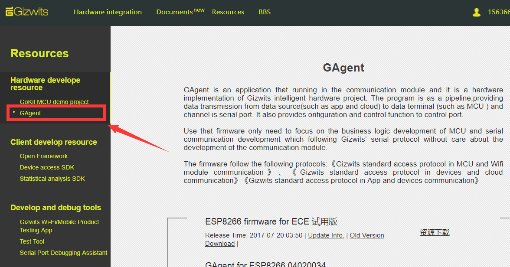
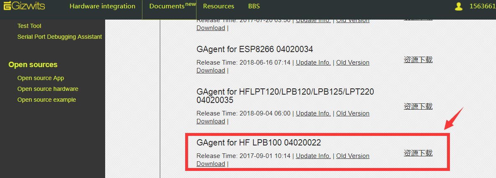
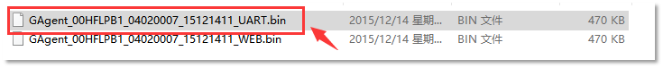
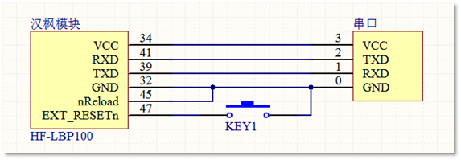
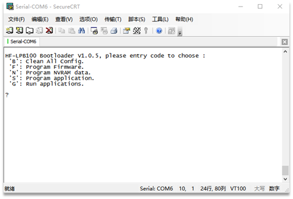
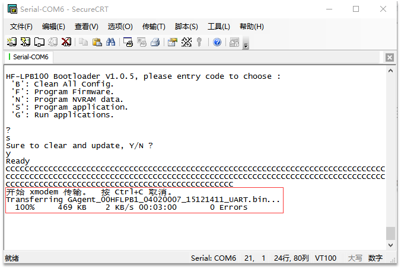

title: Firmware downloading for HF-LPB100 via serial port
---

# Overview

This document describes how to perform firmware downloading on HF-LPB100 module via serial port. When downloading firmware for the module, please follow the steps below, otherwise an unknown error will occur.

# Procedure

## 1. Download the firmware package for HF-LPB100

 
## 2. Unzip the downloaded firmware package

After unzipping the package, you will find two bin files. The file whose name has a UART suffix is what we need.

 
## 3. Connect the module to PC

Connect the HF-LPB100 module to a USB-to-TTL converter according to the following schematic. Note that nReload (Pin 45) needs to be set to LOW as an input. Here it is connected to ground directly. KEY1 is used for the external reset function.

## 4. Configuration of the firmware download tool

### 4.1 Confirm serial port parameters

After connecting the above USB-to-TTL converter to the PC, you can see the corresponding COM port through the "My Computer" -> "Administration" -> "Device Manager" -> "Port (COM and LPT)".

 
### 4.2 Download the serial port tool SecureCRT

Download it here: http://pan.baidu.com/s/1dECLxYD

Unzip the package and start SecureCRT. Clicking Quick Connection will bring up the serial port configuration dialog.

 
Select Serial for the Protocol. Set the Port to the COM above, Baud rate to 115200, Data bit to 8, Stop bit to 1, Parity to None, and finally click Connect.

After the successful connection, the cursor will flash in the SecureCRT workspace.

 
## 5. Firmware downloading

### 5.1 Enter flash mode

Step 1. After the HF-LPB100 module is connected to your PC, reset the HF-LPB100 (Press the KEY1 shown in the schematic of section 3 and release it) or power on the module again.

Step 2: Once completing Step 1, quickly click the keyboard space bar continuously. If the following message appears, it indicates that the module enters the flash mode.

Note: This step is not easy to complete. It needs several attempts. When the above message is always unable to appear, please check whether the serial port settings is correct and repeat above steps again.

Each code in the above message is explained as follows:

Command | meaning
---|---
B |Clear all setting parameters, including manufacture defaults, etc.
F |Upgrade the driver. The Wi-Fi module driver generally does not need to be upgraded. In case of an error, the driver can be erased from the module and download the new version of HF-LPB100/HF-LPT100WiFi from High-Flying website for upgrade.
N |Upgrade Nvram. No need to change RF settings.
S |Upgrade the application. Use this option to upgrade the file compiled from SDK etc. 
G |Execute the application.

Note: N, F, S are prerequisites for the module to start. If any one of them is invalid after input, the module will directly enter the upgrade mode after power-on. There should be careful consideration about the input.

### 5.2 Flash firmware

Step 1. Enter S to upgrade the application, and then enter Y to receive the firmware.
Step 2: When the window prints "CCC...." continuously, select "Transfer" -> "Send Xmode(N)" in the menu bar, and choose the firmware file downloaded in section 2, then click Send.

After waiting for a while, it will display the above message which indicates that the firmware downloading is successful.
