title: Guide to Gizwits Serial Port Debug Tool
---

# Get ready

## 1. Sign up for a developer account and create a product

To use the Gizwits serial port debug tool, you need to create a product in Gizwits Developer Center. See here for reference.

## 2. Download Gizwits Debug App

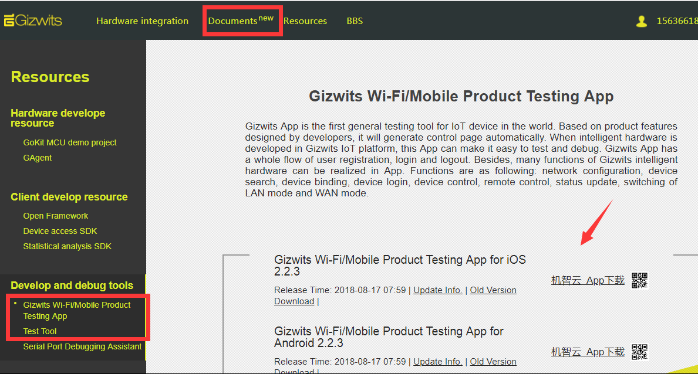

## 3. Download GAgent firmware

Take ESP8266 as an example. On how to download GAgent firmware, please refer to: Firmware downloading for ESP8266 via serial port.

## 4. Connect the module to the computer

According to the following schematic, connect ESP8266 to your PC using a USB-to-TTL converter.

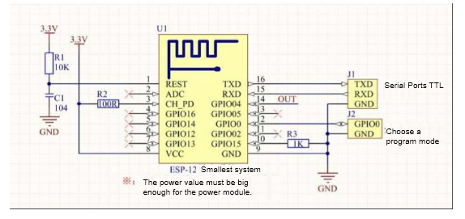

## 5. Download Gizwits Serial Port Debug Tool

Download it here: https://download.gizwits.com/en-us/p/98/119

## 6. Configure Gizwits Serial Port Debug Tool

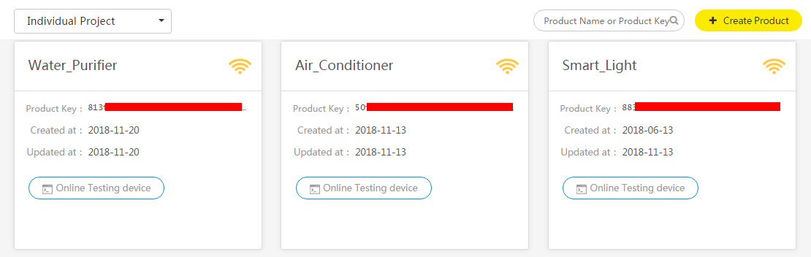

Find the productkey corresponding to the product in Gizwits Developer Center and fill in the blank of the serial port debug tool and save it.

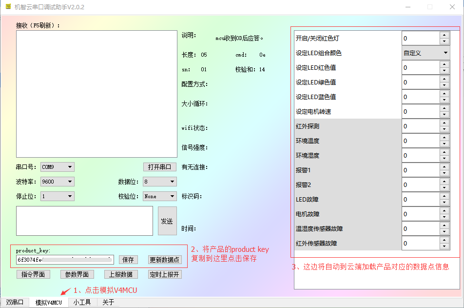

# UI description for Gizwits Serial Port Debug Tool 

## 1. Home Screen

## 2. Command Screen

## 3. Parameter Screen

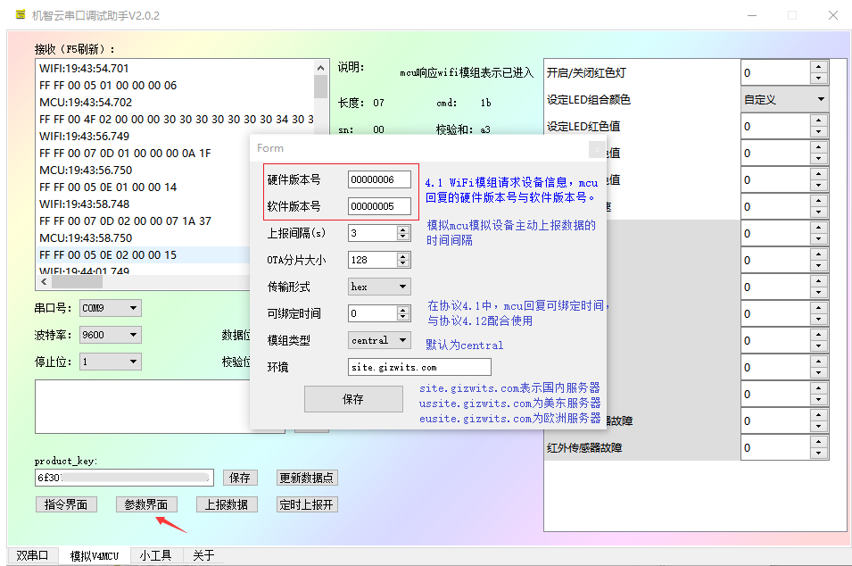

# Configure the module to access Gizwits Cloud

## 1. Power on the module for the first time

As shown in the figure, when the ESP8266 module is powered on for the first time, the following message will be printed in the receiving box.

## 2. Start Gizwits Debug App

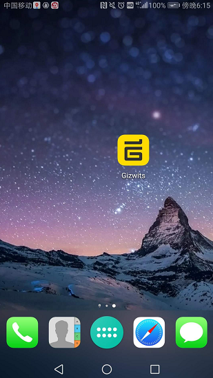

## 3. Register for an account and log in

Here you can use your mobile phone number to register for an account or simply click Skip to jump to the next step.

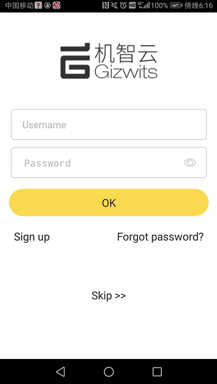

## 4. Add Device

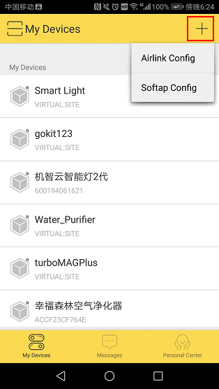

## 5. Input the router SSID and password

Select the corresponding module model which defaults to Espressif, and enter the SSID and password of the router that your mobile phone connected to. Then click Next.

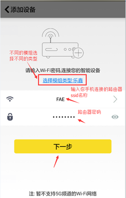

## 6. Send to the Airlink command

Click AirLink on the Command Screen, and the PC simulates the MCU function of sending a command to inform the module to enter AirLink mode.

The figure below shows the output of the Wi-Fi module after entering the AirLink mode.

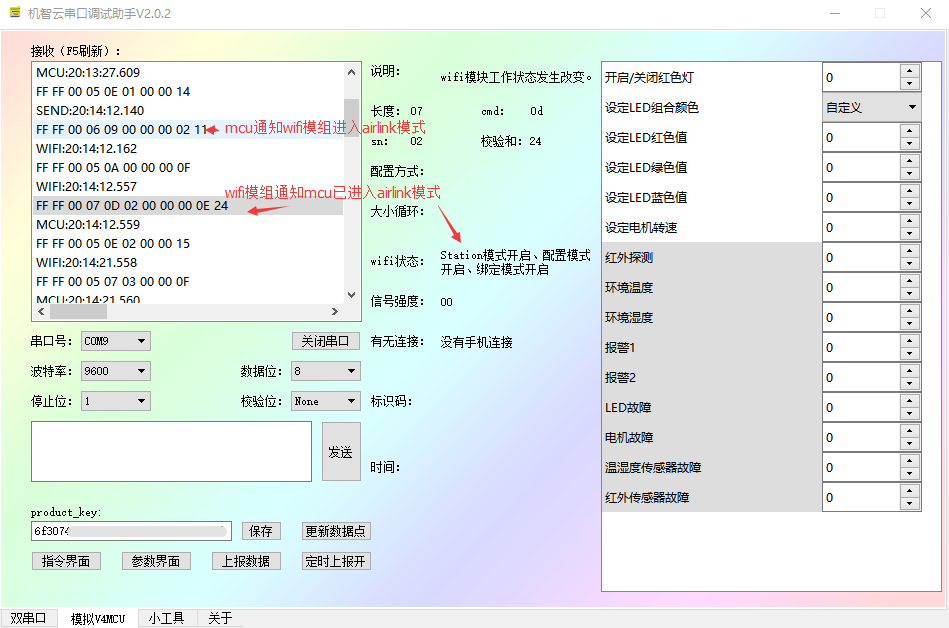

## 7. App sends configuration information

After the above steps are completed, check the “Done above operations” on the App and click Next.

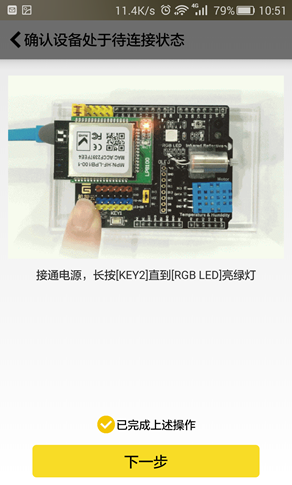

At this point the App will issue a configuration package and display that it is discovering devices.

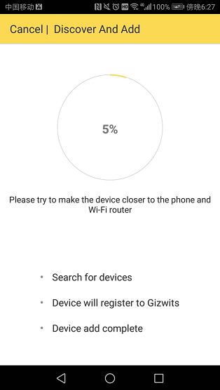

## 8. Configuration result

Observe the receiving box of the serial port tool. When the following two commands are output, it indicates that the Wi-Fi module has successfully received the configuration information sent by the App, and connected to the router and Gizwits Cloud.

After the Wi-Fi module is successfully connected to the router, it will broadcast a success message. After App receives the success message, it will show a device list page in which the Wi-Fi device locates.

# Control device

## 1. Go to the device control page

Clicking the device on the device list page will take you to the device control page.

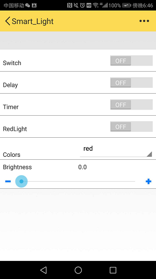

## 2. Send control commands

Toggle "Turn on/off red light" button on the App to issue commands to control the red light.

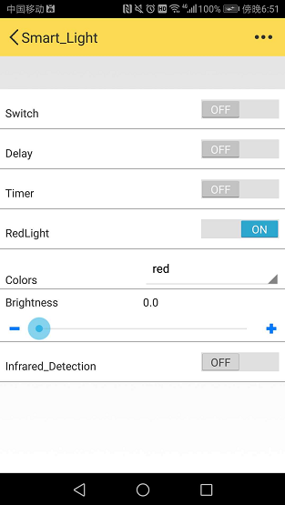

## 3. Control result

When you see the following command in the serial port debug tool, it means that the App controlled the device successfully.

 

## 4. Report data

Change the infrared detection value on the serial port debug tool to "1", click Report Data to mimic the MCU behavior of reporting the device status actively.

After the App received the reported data, the "Infrared Detection" toggle button is switched on, which indicates that the MCU reported data to the App successfully.

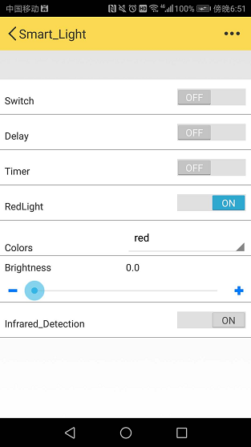

