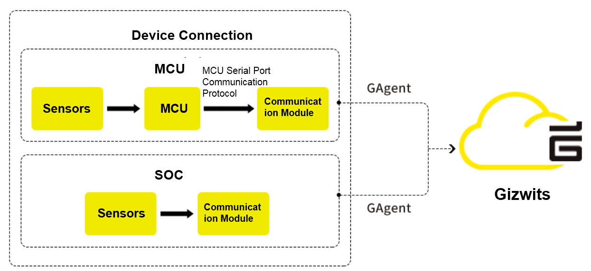
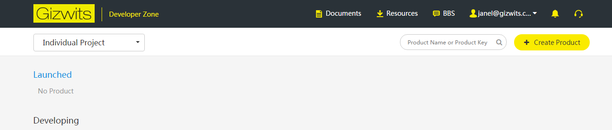
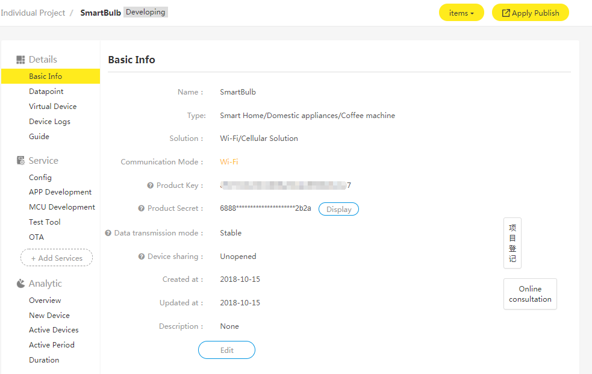
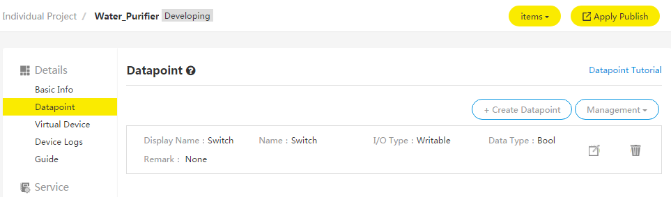
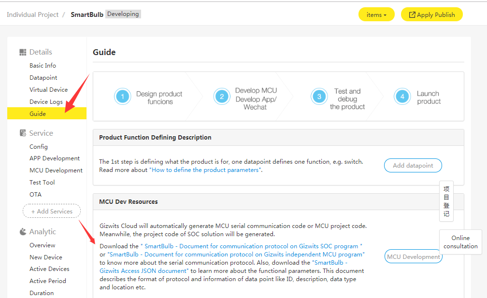

title: Get started with device connection
---

# Overview

This article briefly introduces preparations for device connection, the MCU code auto-generator, the communication module firmware burning, the log print, and the related information of the open source kit Gokit.

# Documentation brief for Gizwits device connection 

Gizwits provides two types of GAgent communication protocols: MCU and SoC. For the MCU type, it needs to implement the communication protocol encapsulation and parse, sensor data and network data conversion logic following the "Gizwits Serial Port Communication Protocol". For the SoC type, the development is carried out on the Wi-Fi module, so there is no obvious concept of MCU.  

## 1. Fast device connection to Gizwits Cloud

In order to let you quickly know the process of device connection process, we provide two tutorials of fast device connection respectively for MCU and SoC based on the open source kit Gokit. Both tutorials adopt the smart light as a case.

Note: Gokit is not necessary for device connection

* Fast device connection for MCU scheme
* Fast device connection for SoC scheme

## 2.How to use GAgent 

GAgent plays a role of forwarding data, which functions as a data interaction bridge between devices, Gizwits Cloud, and applications(App).

In order to adapt different communication modules to access Gizwits Cloud, we provide multiple burning and log printing methods for the modules to ensure that the GAgent firmware runs normally in the modules. 

Note: When performing the burning operation for modules, please go through the steps below, otherwise unknown errors will occur.

* GAgent details
* Firmware downloading for HF-LPB100 via serial port
* Firmware downloading for HF-LPT120 via serial port 
* Firmware downloading for MXCHIP via serial port
* Firmware downloading for ESP8266 via serial port 
* Firmware downloading for Fibocom G510 module 
* Debug log collection for communication module

## 3.  Introduction to MCU code auto-generator 

In order to lower the development barrier, shorten the development cycle, and reduce the development investment, Gizwits introduced the code auto-generator. Gizwits Cloud generates the device-side code for the corresponding product based on data points defined for the product.

* Tutorial for MCU code auto-generator 
* Porting instructions for the common platform edition of MCU SDK

## 4. Open source Gokit

In order to facilitate developers to experience Gizwits Cloud faster, we provide the open source Gokit for developers to learn and reference, so that developers can connect their products to Gizwits Cloud rapidly.

* Introduction to the Gokit3 series development kits
* Guide to Gokit3 hardware
* User manual for Gokit3(S) 
* Introduction to the Gokit3(S) 
* How to set up Gokit3 (S) development environment
• Detailed Gokit3(S) program

## 5. More

* Development tutorial for ECE Demo 
* Guide to Gizwits serial port debug tool

# Get ready

## 1. Create a product

Select the product category and enter the product name, then choose the appropriate network access plan and communication mode according to your product, and set the data transmission mode to fixed length or variable length according to the needs of the project.

After creating the product, you can see the basic properties of your project in the product information - basic information, where the product key is the unique identifier of your product, the product secret is the key used to confirm the user's identity and permissions. The product secrete is required in the auto-generated code.

 
## 2 Define data points

For details on creating data points, click here. 

 
## 3. Download MCU serial communication protocol and SoC connection protocol

Go to the development wizard to download the required communication protocol document according to the project requirements.

Note: If the data point changes, the communication protocol document needs to be re-downloaded.

 

