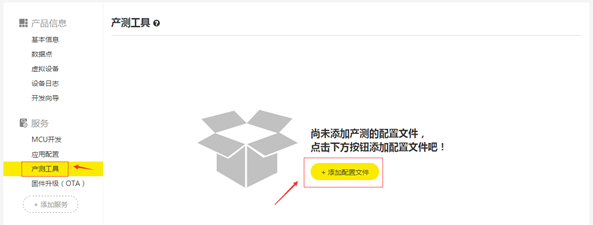
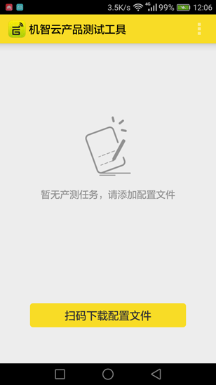
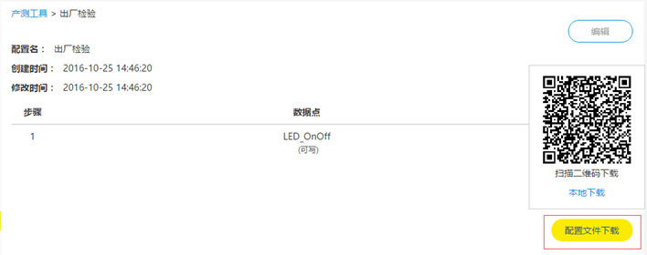
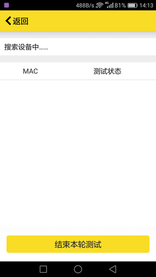
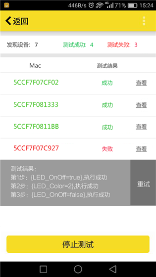
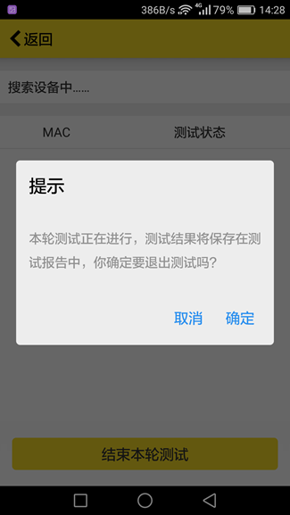
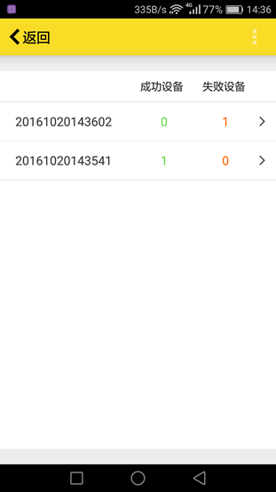
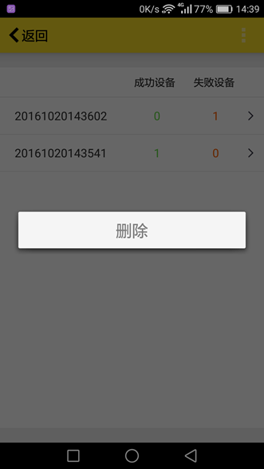
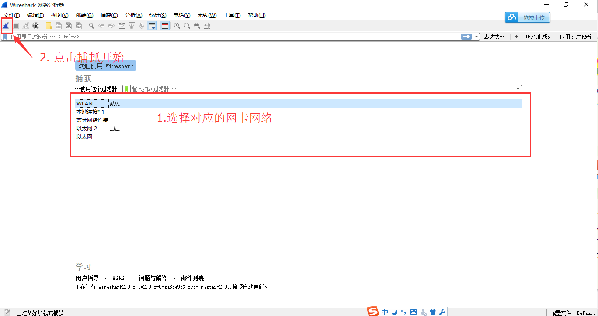
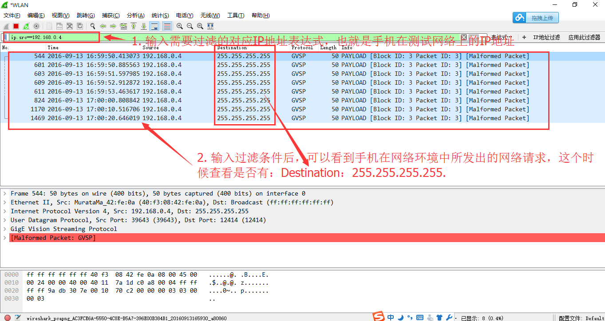

title: End-of-line test tutorial
---

# Overview

End-of-line test plays an important role in the production process, which ensures the quality of the products and enhance the company image. The Gizwits End-of-line test tool provides a convenient and easy-to-use test methodology for MCU and module of mass-produced products to guarantee that the module and MCU can be used normally in large-scale production. 

This document describes how to perform the End-of-line test. For how to enable the End-of-line test mode, please refer to the MCU development resource documentation.

# Get started

## 1. Create test profile

 

After a product is created, click "Add Profile" in the End-of-line Test.

 

After giving a configuration name, click “Add Step” to add the required test steps, where the Data Point column are the defined Data Points of the device. Each click on the "Add Step" will add a step for a Data Point. After the corresponding commands are provided, click Save to generate an End-of-line test profile.

Note: 

When the Data Point of a test step is of a read-only type, such as fault alarm, infrared monitoring, temperature monitoring and other Data Points, you should set up the corresponding device environment first, then trigger the device to generate the corresponding state, so that the End-of-line test will be valid, otherwise it will fail. (e.g., when adding a Data Point of enabling the infrared monitoring, you need to set up the environment where the device is located, in which the infrared monitoring of the device can be enabled).

## 2.Download End-of-line test App

Click “Download End-of-line test App” below the test profile or scan the QR code to download the test App to the phone (only the Android version of the test App is available now).

 
 
## 3. Download test profile
 
 

After launching the test App, clicking Download Profile will pop up the QR code scanner on your phone. Meanwhile, click Download Profile on the test profile page shown in the previous step in the Developer Center, then scan the QR code to get the test profile.

 

 
 
 
UI description

Field	| Description
---|---
File name|	The name of the test profile
Product name|	The name of the device to be tested, followed by the Product Key of the product
Profile version|	The version number of the test profile
Step No, Data Point, Command|	Steps to be performed for the test

## 4. Set up router

4.1 The router allows forwarding of broadcast packets within the LAN. The "AP isolation" option should not be checked.

4.2 The router should use the 2.4GHz band.

4.3 The router should not restrict access to the three ports 2415, 12414, and 12416.

4.4 Before test, you need to configure the router according to the following information:

SSID |	GIZWITS_TEST_1（or GIZWITS_TEST_2）
---|---
Password|	GIZWITS_TEST_PASS
Encryption type|	WPA2PSK

Two routers can be used during the End-of-line test. Set SSID to GIZWITS_TEST_1 and GIZWITS_TEST_2 respectively with the same password. During the test, the module will randomly connect either of two routers to improve the efficiency of End-of-line test.

4.5 The two routers cannot be in cascade mode, and must be independent for test.

# Run test

Set the device to the End-of-line test mode. At this time, the Wi-Fi module of the device will automatically connect to the GIZWITS_TEST_1 or GIZWITS_TEST_2 router. A mobile phone equipped with the test App also needs to be connected to this router.

 

Click Start test on the test App to run the End-of-line test. It will appear a message of searching for devices. Once a device is discovered, it will be tested.

 

At the top of the page, it will show the total number of discovered devices, the pass number of devices and the fail number of devices.

The order of the device groups displayed in the device list is: devices under test, devices to be tested, testing passed, and testing failed. 

Click View, you can see the test details:

 

Click Stop, a dialog box will appear. Click Yes to end the test and the test results will be saved.

 
# Check test report
 

After ending the test, select Test report item in the App menu bar to view the test history. The test report name is the test time, and the test history is listed in descending order (latest first). 

 

In the test report, you can check the number of qualified products and non-conforming products, and their MAC address.

Long press on a test report to delete the item.
 

You can choose to delete all records in the menu bar.

Click the test report item to view the corresponding devices. The non-conforming devices are placed first.

Click View to see the details of each device.

# FAQ

## 1. Does the router used to test need to connect to the Internet?

No, the router can be used without connecting to the Internet.

## 2. What are the possible reasons for the “Testing failed” in the End-of-line test results?

2.1 If "Waiting for the device to be controlled, execution failed" appears, it indicates that the device may not be ready. You can click "Re-run" to restart the test. If this problem occurs again, you can restart the device then test it. If this problem still occurs, it means that the device does not pass the test. 

2.2 If "Step XX ... execution failed" appears, the reason is that the App did not receive data reported by the device actively after issuing the command to the device. You can click Re-run to restart test.

## 3. Why it failed to download the test profile by scanning the QR code?

This operation requires the phone to connect to the Internet that is available. You can scan the QR code later to try it again.

## 4. During the test, the device was successfully connected to the router, but the App could not find the devices for testing.

You need to test whether the network can support UDP broadcast. You can check as follows:

4.1 Install Gizwits Demo App. Download here.

4.2 Connect the mobile phone to the router used to test and view the IP address of the mobile phone in this network. As shown below:

 
 

4.3. Install Wireshark. Download here.

4.4 Start Wireshark and follow the instructions below.

 

4.5. After Wireshark is set up, it shows the live capture. Launch the Gizwits Demo App.

4.6. Set the filters for the output of the captured traffic, as shown below: 

 

4.7. Refer to the settings in the above figures, and wait for a few minutes (you can refresh the device list of the Gizwits Demo App). If you can see the packet with Destination: 255.255.255.255, it indicates that your test network supports UDP broadcast. If not, your network does not support UDP broadcast.

