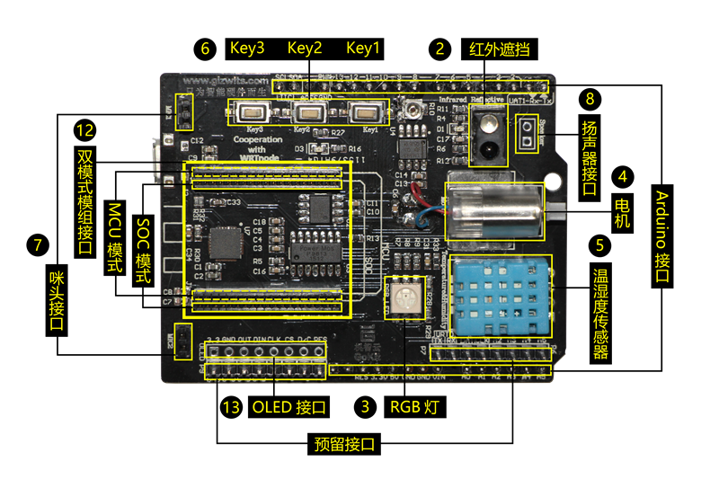
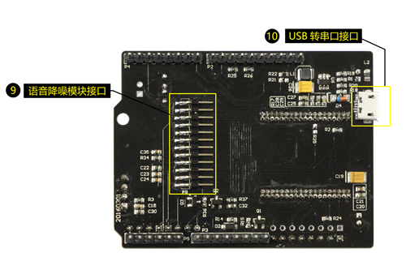
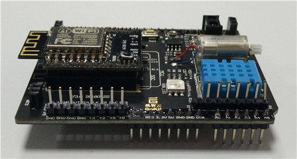

title: Introduction to Gokit3 series development kit
---

# Overview

Gokit3 is the third generation of the Gokit product line, which features the MCU and SoC mode switch. Currently the modules that support the SoC mode include ESP8266 and Hi3518E etc. The modules that support the MCU mode include ESP8266, High-Flying, Mico and Yutone World etc.

The module interface of the function expansion board of Gokit3 adopts the dual-row socket strips design. The single row pin header plug of the module chooses to use either of the two modes of MCU (MCU mode interface) and SoC (SoC mode interface) on the function expansion board of Gokit3 as needed. The function expansion board interface diagram is illustrated in the following figure.

 
 
  

Description:

1. The modules supporting the SoC mode should be plugged into the SoC mode interface of the function expansion board, which should be disconnected to the backplane board for typical use, otherwise the module program will not start up normally.
2. The modules supporting the MCU mode should be plugged into the MCU mode interface of the function expansion board. Otherwise, the module cannot run normally with the backplane board through the serial port.

#  Introduction

## 1. Features
 
 

Gokit3(S) is one of the IoT smart device development kits launched by GizWits to empower traditional hardware to access Internet quickly. After coming online, the data can be exchanged between products and Gizwits IoT Cloud, as well as between manufacturers and end users, achieving intelligent interconnection.

### Characteristics:

1. Adopts Separate type design, i.e. backplane board (useless for SoC mode) + function expansion board + module.
2. Supports MCU mode and SoC mode.
3. The MCU mode supports various Wi-Fi modules and can be replaced on your behalf.
4. Supports the standard edition backplane board (STM32 backplane board) and the maker edition backplane board (Arduino backplane board). 
5. Based on the Gizwits development platform, which is efficient, easy to use and safe.
6. Provides complete open source demo projects and relevant SDKs integration guide.

### Hardware resources:

1. Infrared detector
2. Temperature and humidity sensor
3. RGB LED
4. Variable speed DC drive miniature motor
5. 3 customizable buttons
6. OLED display interface
7. Arduino-compatible 
8. Built-in USB-to-UART debug interface
9. Other reserved interfaces

### Maker edition backplane board

  

### Standard edition backplane board

  

## 2. Difference between SoC mode and MCU mode
 
 

  

### MCU mode

It adopts the separate type design. The Wi-Fi module is only responsible for receiving and transmitting data, which communicates with the MCU via serial port, etc. It needs to perform protocol and peripheral-related development on the MCU.

Summary: The advantage of this scheme is that it is not subject to the limited Wi-Fi module on-chip resources, and has high scalability for applications; the disadvantage is that it needs to adapt to the communication protocol and has high cost.

### SOC mode

It adopts the integral type design. It directly connects the peripheral driver modules to the Wi-Fi module and supports programming on the Wi-Fi SoC, eliminating the need for the internal communication.

Summary: The advantage of this scheme is that it can reduce the application development difficulty and the production cost; the disadvantage is that it is subject to the limited Wi-Fi SoC on-chip resources and thus only a few applications can run on it.

## 3. Future plan for Gokit3

In order to empower developers to develop more types of products and applications based on Gokit, our higher performance SoC, BLE and other modules are currently under development. Please stay tuned on the Gizwits website.
