title: Gokit3 hardware manual
---

# Introduction to Gokit3 development kit 

## 1. Hardware 

Gokit3 features a scalable hardware design. The hardware core includes the function expansion board and ESP8266 Wi-Fi module. Besides, Gokit3 is compatible with standard Arduino interfaces, Hi3518E Wi-Fi modules, voice modules and other related modules.

## 2. Software 

The Gokit3 development kit takes full advantage of the Gizwits IoT Cloud platform, which adopts the IoT development framework with user-defined Data Points, facilitating users to easily develop smart hardware products.

# ESP8266 Wi-Fi module

## 1. Introduction to ESP8266

Espressif’s ESP8266EX delivers highly integrated Wi-Fi SoC solution to meet users’ continuous demands for efficient power usage, compact design and reliable performance in the Internet of Things industry.

With the complete and self-contained Wi-Fi networking capabilities, ESP8266EX can perform either as a standalone application or as the slave to a host MCU. When ESP8266EX hosts the application, it promptly boots up from the flash. The integrated high speed cache helps to increase the system performance and optimize the system memory. Also, ESP8266EX can be applied to any microcontroller design as a Wi-Fi adaptor through SPI/SDIO or UART interfaces.

## 2. Functional diagram of ESP8266

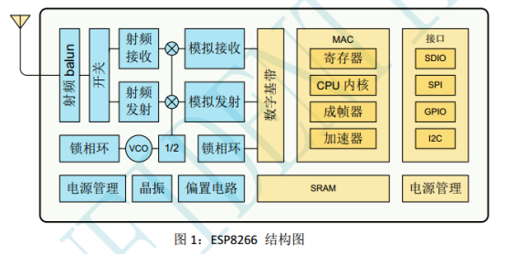  

## 3. ESP8266 features

* 802.11 b/g/n support
* Wi-Fi @2.4 GHz, WPA/WPA2 authentication support
* Small form factor of only 11.5mm*11.5mm 
* Integrated high precision 10-bit ADC
* Integrated TCP/IP stack
* Integrated TR switch, RF balun, LNA, power amplifier and matching network
* Integrated PLL, voltage regulator and power management components
* Output power of 19.5dBm in 802.11b mode
* Antenna diversity support
* Power-off leakage current < 10uA
* Integrated low power 32-bit MCU: can double as an application processor
* SDIO 2.0, SPI, UART
* STBC, 1x1 MIMO, 2x1 MIMO
* A-MPDU, aggregation of A-MSDU and guard interval of 0.4 s
* Wake up, connect and transmit packets in < 2ms
* Standby power consumption < 1.0mW (DTIM3)
* Operating temperature range -40 ~ 125°C

## 4. ESP8266 appearance

Front view

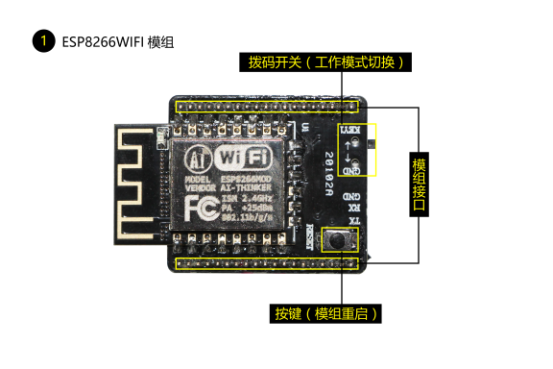  

Back view

  

## 5. ESP8266 pin layout

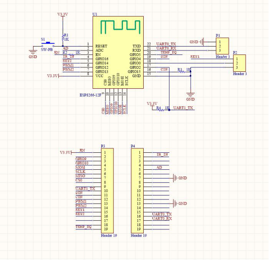   

# Function expansion board of Gokit3

## 1. Introduction

The function expansion board is compatible with a variety of Wi-Fi modules for connecting various peripheral sensors to simulate practical application functions. It has a rich set of interfaces (such as microphone interface, speaker interface, voice noise reduction interface, etc.). ), and is compatible with the standard Arduino interfaces, so that developers can easily complete secondary development on it.

## 2. Function description

No |	Function |	Description
---|---|---
1|	Espressif ESP8266 Wi-Fi module|	Supports STA/AP working mode
2|	Infrared Detector|	Detects if it is blocked
3|	RGB LED|	Programmable full color LED light
4|	Programmable motor|	Programmable, reversible and variable speed motor
5|	Temperature and humidity sensor	|
6|	Three programmable buttons	|
7|	a set of microphone interfaces	|
8|	Speaker interface	|
9|	Voice noise reduction module interface	|
10|	USB-to-UART interface|	It is convenient to power Gokit and print logs
11|	USB-to-TTL  interface for firmware downloading |	Firmware downloading  via USB-to-TTL  converter
12|	Mode switch interface|	Switch to MCU mode  or SoC mode (mode used by Gokit3(S)) as needed
13|	OLED interface|	Other interfaces such as SPI can be reused
	|Reserved interfaces|	For power supply, SWD, UART TTL, and external Arduino

## 3. Function expansion board appearance

Front view

   

Back view

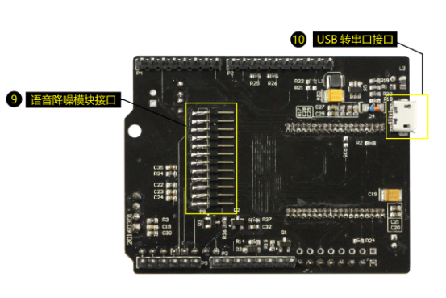  

## 4. Details of Function Expansion Board

### 4.1 Keys

The function expansion board is designed with three programmable keys that the user can use as needed.

The schematic is as follows:

   

### 4.2 Infrared sensor

The function expansion board integrates a single-beam reflective infrared photoelectric sensor ST188, which has strong adaptability to ambient light. It has a pair of infrared transmitting and receiving tubes, and the transmitting tube emits a certain frequency of infrared light. When encountering an obstacle (reflecting surface) in front, the infrared light is reflected back and received by the receiving tube. After processed by the comparator, the red LED lights up, while the signal output interface will output a digital signal (is low). The sensitivity can be adjusted by means of potentiometer knob. The effective detection distance ranges from 2 to 80 cm and the operating voltage is 3.3V-5V. The infrared sensor features low interference and easy-to-use. The comparator uses LM393 and works stably.

The schematic is as follows:

   

### 4.3 Temperature and humidity sensor 

The function expansion board integrates DHT11, which features a temperature & humidity sensor complex with a calibrated digital signal output.  

Thanks to the exclusive digital-signal-acquisition technique and temperature & humidity sensing technology, it ensures high reliability and excellent long-term stability.

This sensor includes a resistive-type humidity measurement component and an NTC temperature measurement component, and connects to a high-performance 8-bit microcontroller, offering excellent quality, fast response, anti-interference ability and cost-effectiveness.

Each DHT11 element is calibrated in the laboratory that is extremely accurate on humidity calibration. The calibration coefficients are stored as programs in the OTP memory, which are used by the sensor’s internal signal detecting process. The single-wire serial interface makes system integration quick and easy. Its small size, low power consumption and up-to-20 meter signal transmission making it the best choice for various applications, including those most demanding ones. The component is 4-pin single row pin package. It is convenient to connect and special packages can be provided according to users’ request.

Related parameters: 

* Temperature Range:-40-80℃ / resolution0.1℃ / error <±0.5℃
* Humidity Range: 0-100%RH /  resolution0.1%RH / error±2%RH
* Temperature Response Time: condition: 1/e(63%)  Min 6s  Max  20s
* Humidity Response Rime: condition: 1/e(63%)25℃, 1m/s in the air <5S

 
The timing diagram of the driver is shown below:

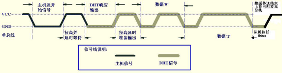   

The schematic is as follows:

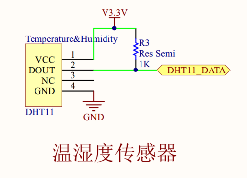   

### 4.4 Micro DC motor 

In order to simulate the actuator in the field, a miniature DC motor is integrated on the function expansion board and driven by L9110.

The L9110 is a two-channel push-pull power amplifier ASIC designed for control and drive motors. The discrete circuits are integrated into a monolithic IC to reduce peripheral device cost and improve overall reliability. The chip has two TTL/CMOS compatible with the level of the input, which offers good anti-interference. The two outputs can directly drive the forward and reverse movement of the motor. It has a large current drive capability. The continuous current of 800mA can pass through each channel with peak current up to 1.5A; it also has a low output saturation voltage drop; the built-in clamping diode can release the reverse surge current of the inductive load, making the drive of the relay, DC motor, stepper motor and the use of the switch power tube safe and reliable. The product is available in a 4-pin single-row pin package.

Pin waveform diagram:

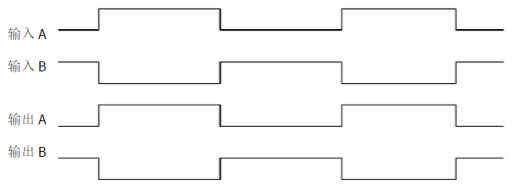   

The schematic is as follows:

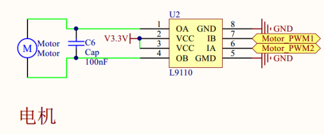   

### 4.5 RGB (tri-color) LED 

An RGB (tri-color) LED indicator is integrated on the function expansion board. The full color control of the LED can be driven by P9813.

The P9813 is a full-color light source LED driver chip that uses a CMOS technique to provide three constant current driver and 256 grayscale modulation output. The double-line transmission (DATA and CLK) and built-in regeneration are adopted to increase the transmission distance. 

Features:

* IC input voltage 5V ~ 6.5V; Built-in LDO, 4.5V regulated output;
* External single-resistor feedback mode, three channel driver, each drive current 0-45mA;
* With input signal verification function;
* Built-in ring oscillator (1.2MHz) supports uninterrupted FREE-RUN modulation output to maintain picture stillness;
* Maximum serial input data clock frequency 15MHz;
* With signal phase-locked regeneration, up to 1024 cascaded point sources at 1MHz data transmission speed;
* The LED drive port has a withstand voltage of 17V.

Timing diagram

   

Note: Since P9813 does not use a standard I2C interface, in order to save IO resource, it is connected to the I2C bus, but it needs to be configured as GPIO to complete the functions of color grading and dimming according to the timing chart.

The hardware schematic is as follows:

   

### 4.6 OLED interface 

Organic Light Emitting Diode (OLED) features self- luminous, backlight not needed, high contrast, thin, wide viewing angle, fast response, flexible panel, wide operating temperature range, simple construction and process, which is considered to be the next generation of flat panel display technology.

The function expansion board provides an OLED interface.

The schematic is as follows:

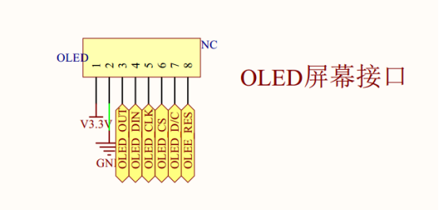  
 
### 4.7 speaker interface

The function expansion board provides a speaker interface.

The schematic is as follows:
 
  

### 4.8 microphone interface

The function expansion board provides a set of microphone interface.

The schematic is as follows:

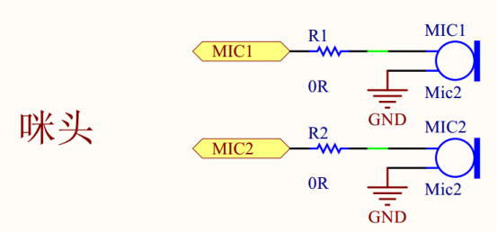   

### 4.9 Standard Arduino interface

The expansion board uses a standard Arduino interface that seamlessly connects the function expansion board to the Arduino or plugs into any standard MCU motherboard compatible with Arduino.

The schematic is as follows:

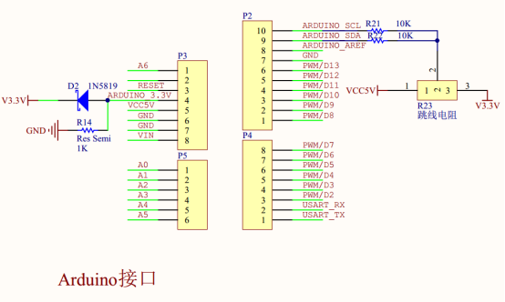  

### 4.10 UART-to-USB interface

The function expansion board reserves a USB interface for debugging and communication. The conversion chip adopts CP2102, which has high integration level. It can integrate USB2.0 full-speed function controller, USB transceiver, crystal oscillator, EEPROM and asynchronous serial data bus (UART). It supports modem full-featured signals without any external USB device.

The schematic is as follows:

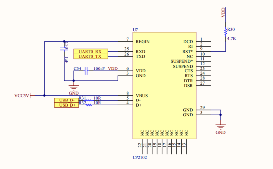  

### 4.11 Wi-Fi module interface

The function expansion board provides a dual mode module interface that can be used to switch to SoC mode (the mode used by Gokit3) or MCU mode as required.

The schematic is as follows:

   

### 4.12 Voice noise reduction module Interface

The function expansion board provides a voice noise reduction module interface.

The schematic is as follows:
 
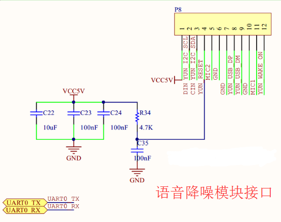  

### 4.13 Reserved interfaces

The function expansion board will expose some of the unused interfaces, which are convenient for developers to extend the application.

The following figure is the reserved interfaces:

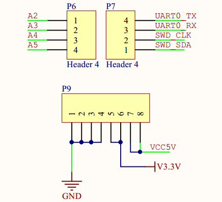   

* The P6 interface is an external interface compatible with Arduino.

* The P7 interface has a set of SWD interfaces (which can be used for module programming) and a set of UART TTL interfaces (for outputting module debug logs).

* The P9 interface has functions of power supply and common ground.

# Support

The Gokit series development kits are offered with Gizwits developer accounts which provide bundled technical support for the Gizwits IoT Cloud platform, including the tutorials and SDKs, community services, and other services that you need.

Gizwits website: http://www.gizwits.com/

Community: http://club.gizwits.com/forum.php

Documentation Center: http://docs.gizwits.com

# Appendix: Gokit3 schematic

http://club.gizwits.com/thread-2889-1-1.html

