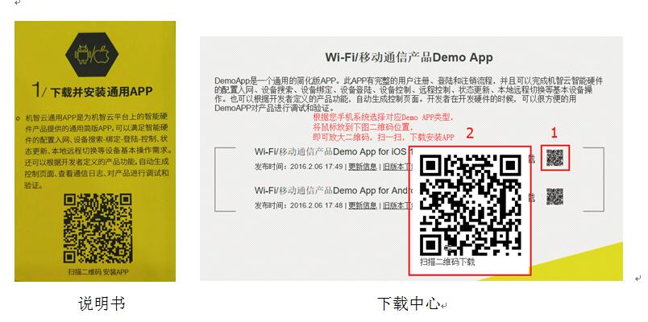
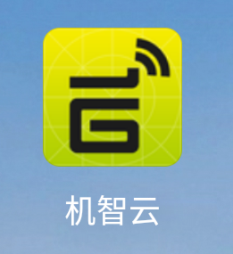
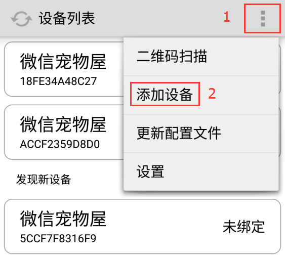
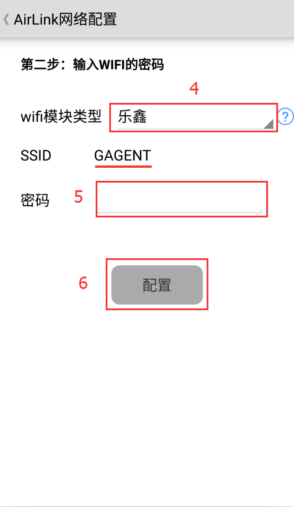
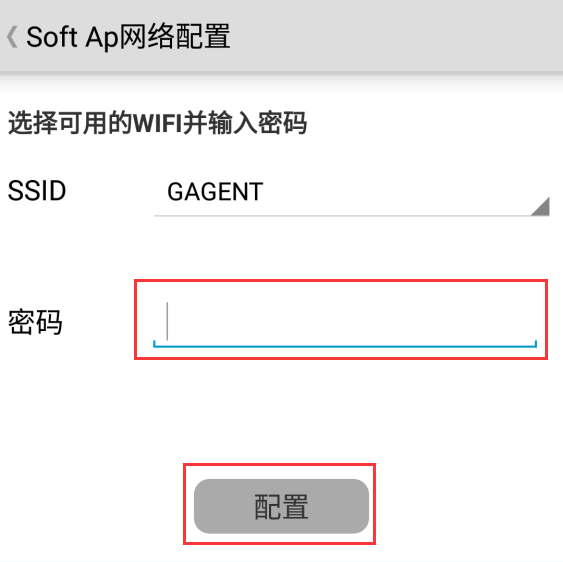
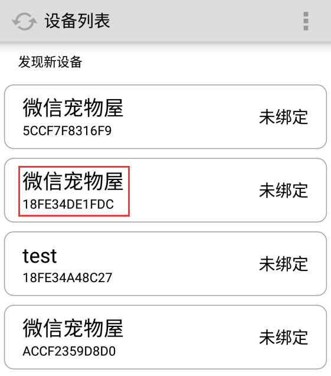
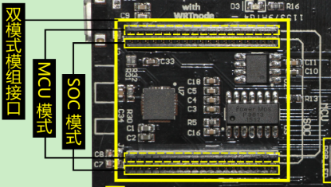
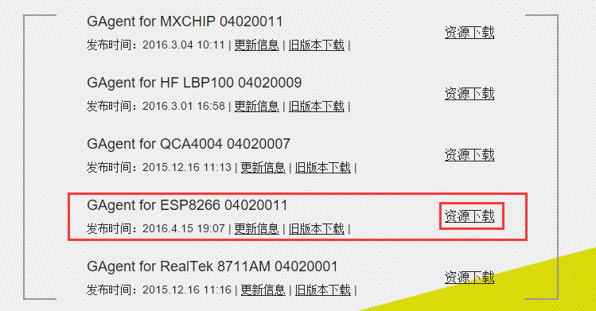

title: Get started with Gokit3(S)
---

# Brief glance

 

First you need to figure out the following information:

To get started with Gokit3(S), see "Introduction to Gokit3(S) Development Kit".

To understand the functions of the keys, see the following table.

Key |	Trigger method	| Function
---|---|---
Reset|	Short press|	Reset Wi-Fi module
Key1|	Short press|	To be customized
Key1|	Long press (3s)|	Reset Wi-Fi module
Key2|	Short press|	Enter SoftAP mode
Key2|	Long press (3s)|	Enter AirLink mode
Key3|	customized|	To be customized

# Download Gizwits Gokit App

To control Gokit3(S), it is recommended to adopt these two ways: use the Gizwits Gokit App or the Gizwits WeChat Official Account (ID: go-kit).

To get the Gizwits Gokit App, choose any one of the following ways:

* 1) Scan the QR code on the manual with WeChat and download the Gizwits Gokit App.
* 2) Download in the Gizwits Download Center.
* 3) Search for “Gizwits” in the App store.

 

Once the installation is successful, you can see the Gizwits Gokit App icon on the screen. Next, you can control Gokit3(S).

  

# Connect to router

Now that you have got Gokit and installed the Gizwits Gokit App, the next step is to connect your Gokit to the router. How to do this? Gokit offers two ways to configure network access: AirLink, SoftAP.

## 1. AirLink 

Airlink is used to configure the network access, the steps of which are the same as those of the Gokit3(S) paper manual, as shown below:

* Power Gokit with a USB cable and start it.
* Connect your phone to a Wi-Fi network and launch the “Io Demo” App. You can choose to log in or skip, then click “My Devices” on the homepage and select “Add Device”.
* Press and hold “KEY2” on Gokit. The green [RGB LED] indicates that the Gokit enters network configuration mode.
* Enter the Wi-Fi access point credentials that you are using on the App and click “Configure” to wait for the device to access the Wi-Fi network.
* Select the module type on the App (please note that it needs to be consistent with the Gokit module type). Click “Next” to wait for the device discovery result and connect the device. Usually the process is completed within 10~120s.

Precautions for configuring network access:

* The Gokit does not support 5G network. Thus the router should operate on 2.4G.
* Please keep your Wi-Fi environment stable.
* Gokit natively supports remote control. You can switch your mobile phone to 2G, 3G, 4G, and then start the App. You can see that your Gokit still exists and works in the same way as the local operation.

### Power Gokit (as shown below)

  

Note: Make sure the phone is connected to an available router which can access the Internet. You need to know the Wi-Fi access point credentials you have used (you will need it later).

Open the Gizwits Gokit App. If you have not used it before, your App should not present any devices (as shown below).

  

### Enable Gokit's AirLink configuration mode

Press and hold the Key2 button for 3 seconds. After the green LED of the function expansion board is illuminated, the Wi-Fi module enters the AirLink configuration mode (as shown below).
 
 

Click on the upper right menu of the App, then choose Add Device (as shown below). Select the Espressif Wi-Fi module and enter your router credentials.

 

 

 
 
Click the Configure button on your App. Wait for no more than one minute, and the App will indicate the successful configuration (as shown below).

 

 

Note: During this time, you can see that Gokit's green light is off, indicating that Gokit3 is connected to your router.

## 2. SoftAP

### Enable Gokit's SoftAP configuration mode

After short press on the Key2 button and the red light on the function expansion board is always on, it indicates that the Wi-Fi module enters the SoftAP configuration mode (as shown below).

  

Go to the Wi-Fi configuration page on your phone (usually in Settings > Wi-Fi).

Select the Wi-Fi hotspot name in the form of "XPG-GAgent-XXXX" whose password is 123456789 (as shown below)

  
 
 

Note: XXXX is the last four digits of the Wi-Fi module's MAC (1FDC as shown above).

Open the Gizwits Gokit App (note that you have to close the App completely from the background and then Start it again)

In the pop-up page (as shown below), select an available Wi-Fi hotspot and enter the corresponding password.

 

Waiting for no more than one minute, the App will indicate the successful configuration (as shown below).

 

Note: If you see the Gokit red light is off, it indicates that Gokit3 has successfully connected to your router.

# Let Gokit light up

After the device is successfully configured, it is located at the device list page by default and is not bound yet (as shown below).

  

After clicking on the unbound device, it will be automatically bound. At this point, the device becomes operable (as shown below).

  

Clicking on the device will bring you to the device's operation page (as shown below). 
On this page, you can control the Gokit in various ways, or you can receive various statuses reported by Gokit.

  

Note:

1. If you have selected Custom in the LED color setting page, you can set the colors of R, G, B separately;
2. If you have selected a specific color in the LED color setting page, you can no longer set the colors of R, G, B;
3. The infrared detection and temperature/humidity reporting belong to user-triggered behaviors, which are triggered on Gokit and then displayed on the App;

Gokit natively supports remote control. You can switch your mobile phone to 2G, 3G, 4G, and then start the App. You can see that your Gokit still exists and works in the same way as the local operation.

# MCU mode of Gokit3(S) 

Gokit3(S) supports the MCU mode in addition to the SoC mode. For the difference between the two, please refer to the section "3.1. Difference between SoC mode and MCU mode" in "Introduction to Gokit3 series development kit". The following illustrates how to use it in the MCU mode.

## 1. First confirm that Gokit3(S) is in SoC mode

Because the firmware can be downloaded normally only in the SOC mode, first determine that the ESP8266 Wi-Fi module is located in the SoC module interface (lower position), as shown below:

  

## 2. Download the GAgent firmware corresponding to ESP8266

When in the MCU mode, the ESP8266 (Wi-Fi module) is only responsible for receiving and transmitting data, so it needs to flash the GAgent firmware to ESP8266. GAgent is an application developed by Gizwits that can run on various communication modules. Using GAgent, you only need to focus on the business logic of the product, and don't care about the communication function, which greatly reduces the development difficulty.

Download the latest version of GAgent here.

Note: Please download the latest version corresponding to ESP8266, as shown below:

  

The firmware downloading in MCU mode is similar to that in SoC mode. For details, please refer to the “Firmware downloading for ESP8266 via serial port".

## 3. Switch the module to MCU mode

After powering off the GoKit3(S), unplug the ESP8266 Wi-Fi module from the SoC mode interface (lower position) and plug it into the "MCU mode interface" (upper position), as shown below:

  

## 4. How to use Gokit3(S) in MCU mode

The operation of Gokit3(S) in MCU mode is the same as that in SoC mode. For the network access configuration, refer to the section “3. Connect to the Router” above.

# Summary

If you want to understand the entire development frameworks of Gizwits, please check Developer Documentation Center:

http://docs.gizwits.com

To check out more development tutorials, visit the Gokit section of Gizwits Community.

Gokit
