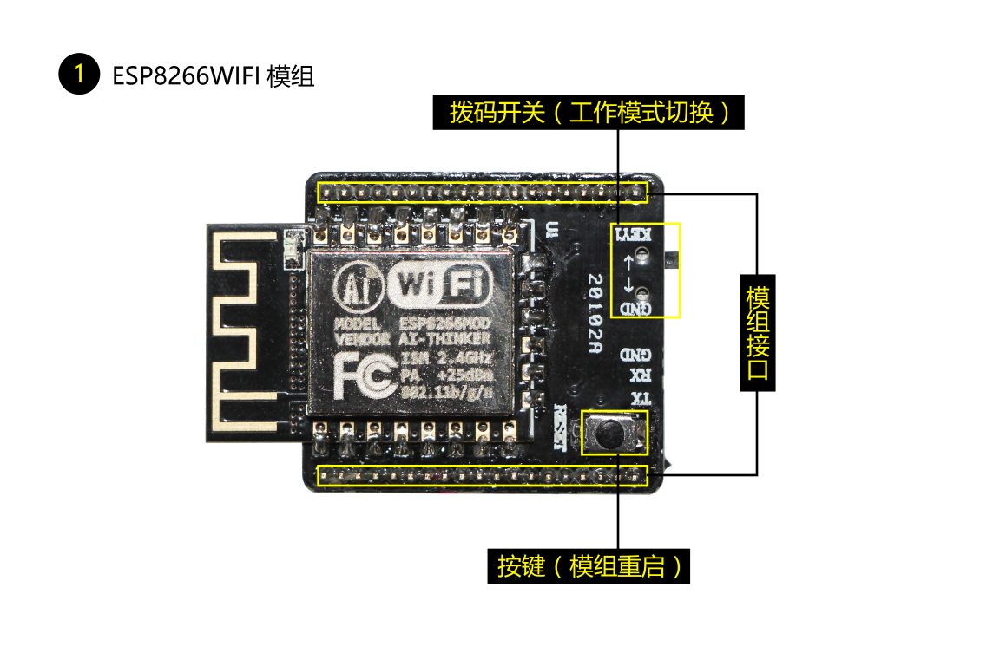
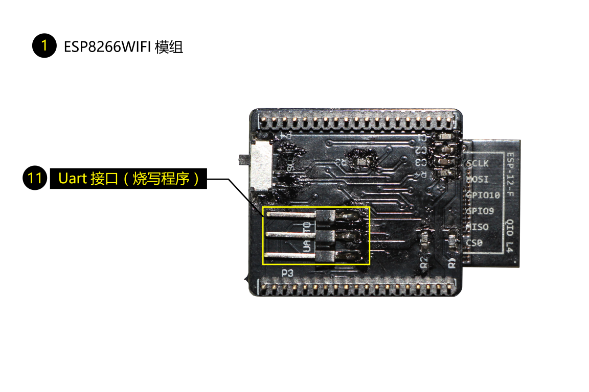

title: Introduction to Gokit3(S) development kit
---

# What is Gokit3(S)

Gokit3(S) is one of the third generation of IoT smart device development kits launched by GizWits to empower traditional hardware to access Internet quickly. After coming online, the data can be exchanged between products and Gizwits IoT Cloud, as well as between manufacturers and end users, achieving intelligent interconnection.

# Hardware structure

Gokit3(S) adopts an integrated SoC scheme with a certain level of extensibility, as shown below:

 

ESP8266: The high-performance Wi-Fi module of Espressif that can directly controls the resources on the function expansion board.

Function expansion board: Compatible with various types of Wi-Fi modules, used to connect various peripheral sensors for simulating practical application functions.

## Function expansion board (front view):

 

## Function expansion board (back view):

  

## Wi-Fi module (front view):

 

## Wi-Fi module (back view):
 
 

# Features

No |	Function |	Description
---|---|---
1|	Espressif ESP8266 Wi-Fi module|	Supports STA/AP working mode
2|	Infrared Detector|	Detects if it is blocked
3|	RGB LED|	Programmable full color LED light
4|	Programmable motor|	Programmable, reversible and variable speed motor
5|	Temperature and humidity sensor	|
6|	Three programmable buttons	|
7|	a set of microphone interfaces	|
8|	Speaker interface	|
9|	Voice noise reduction module interface	|
10|	USB-to-UART interface|	It is convenient to power Gokit and print logs
11|	USB-to-TTL  interface for firmware downloading |	Firmware downloading  via USB-to-TTL  converter
12|	Mode switch interface|	Switch to MCU mode  or SoC mode (mode used by Gokit3(S)) as needed
13|	OLED interface|	Other interfaces such as SPI can be reused
	|Reserved interfaces|	For power supply, SWD, UART TTL, and external Arduino

Note: For detailed hardware schematics, please see the Gokit3.2 Hardware Manual.

# Usage

## SoC mode

SoC is the latest development approach, that is, the combination of the function expansion board and the Wi-Fi module, which is the default mode of Gokit3(S). The shipping firmware is the SoC firmware, which can be used directly, and the usage is the same as Gokit2. It should be noted that the SoC mode cannot employ the backplane board, otherwise it will not operate normally.

The secondary development source code package and schematic diagram are available. 

1. Select “WeChat Pet House for Gokit3(S) ESP8266” to download the ESP8266 SoC source code package.
2. Schematic: http://club.gizwits.com/thread-2889-1-1.html

## MCU mode

You can get the same development approach as Gokit2 through the MCU mode, that is, the combination of backplane board + function expansion board + Wi-Fi module. To use the MCU mode, you need to update the Wi-Fi module firmware. The firmware download address and flash method are as follows:

1. Select “GAgent for ESP8266” to download GAgent firmware file.
2. GAgent firmware flash method.
3. Select “WeChat Pet House for Gokit 2 STM” to download STM32 MCU source code package. 

# Support

## For individual developers

Gokit is free, but only a limited number are available for individual developers. Register in our forum or follow our official WeChat to request for provision.

Website: http://site.gizwits.com/developer/activity/gokit/request

## For organizations

Gizwits has a lot of support programs for organizations, you can contact Gizwits to get Gokit and timely technical support.

Website: http://www.gizwits.com/about-us

