title: Gokit-MCU program with explanation
---

# Detailed communication protocol

## 1. Command format

You first need to understand the conventions of the communication protocol, and the protocol format is:


Description:

1) The header is fixed to 0xFFFF;

2) The length (len) refers to the number of bytes used from cmd to the end of the entire packet;

3) The command word (cmd) indicates the specific command meaning. For details, see the protocol example;

4) The message sequence number (sn) is given by the sender, and returned by the receiver to the sender when responding to the command;

5) Flag (flag), defaults to 0;

6) payload (p0 data area), see p0 data area convention for details;

7) The checksum (checksum) is calculated for len~DATA, summed by byte;

8) All sent commands are ACKed. If not receiving a response within 200 milliseconds, the sender should resend at most 3 times;

9) An integer with more than one byte is encoded in big endian (network byte order);

10) All numbers are in hexadecimal format;

## 2. p0 data area convention

The p0 data area convention has the following clauses:

1) When the module sends a command to the MCU, the p0 command, command flag and the writable data area are carried.

2) The p0 command and the complete data area are carried when the MCU actively reports the status or replies the status query from the module.

3) The data area will automatically merge the Boolean and enumeration variables, and have a strict order, which cannot be changed arbitrarily.


How to understand the convention? Open the "XX - Serial communication protocol for Gizwits IoT Cloud access", you will see the following commands:

1) The Wi-Fi module requests device information;

2) The heartbeat of the Wi-Fi module and the device MCU;

3) The device MCU tells the Wi-Fi module to enter the configuration mode;

4) The device MCU resets the Wi-Fi module;

5) The Wi-Fi module notifies the device MCU of the working state changes of the Wi-Fi module;

6) The Wi-Fi module requests to restart the MCU;

7) Illegal message notification;

8) The Wi-Fi module reads the current state of the device;

9) The device MCU actively reports the current status to the Wi-Fi module;

10) The Wi-Fi module controls the device;

(The rest items are not important and thus omitted)

The p0 data area convention is used to complete the uploading of valid data (4.8, 4.9) and the delivering (4.10). The format of the uploading protocol is: action(1B) + dev_status(11B); the format of the delivering protocol is: action(1B) + attr_flags(1B) + attr_vals(6B); 

Fields of p0 data area	| Description
---|---
action|	Indicates the direction of the "p0 command", i.e., Wi-Fi -> MCU or MCU -> Wi-Fi
dev_status|	Indicates the status of all reported Data Points
attr_flags|	Indicates the valid control-type Data Points
attr_vals|	Indicates the values of the valid control-type Data Points

It is necessary to note the third clause of the p0 data area convention. The data area will automatically merge the Boolean and enumeration variables, and have a strict order, which cannot be changed arbitrarily. 

Above is the explanation of the p0 data area convention. Next, this document goes into details on the MCU program.

# Detailed program

## 1 Code folders

### 1.1 Primary folder
 


Folder/File |	Description
---|---
Gizwits|	Protocol related folders
Hal	|Peripheral driver libraries
Lib	|STM32 driver libraries
Project|	Project files
User|	Code entry folder
Utils|	Utility folder
README.txt|	Gokit3(V) documentation

### 1.2 Code files


The following table is the description of key code files.

File |	Description
---|---
gizwits_product.c	|This file contains product-related processing functions, like gizEventProcess(), and platform-related hardware initialization, such as serial ports, timers, etc.
gizwits_product.h	|This file is the header file of gizwits_product.c, which stores product-related macro definitions such as HARDWARE_VERSION, SOFTWARE_VERSION.
gizwits_protocol.c	|This file is for function definitions of the SDK API.
gizwits_protocol.h	|This file is the header file of gizwits_protocol.c, which contains the function declarations of the SDK API.

### 1.3 APIs

API name |	API function
---|---
void gizwitsInit(void)|	The initialization API for the Gizwits protocol.You can call the API to accomplish the Gizwits protocol-related initialization (including protocol-related timers and serial port initialization).
void gizwitsSetMode(uint8_t mode)|	The parameter mode has three choices of 0, 1, and 2, and other input is invalid.When the parameter is set to 0, it is used for restoring manufacture defaults, which will clear all settings and restore the module to the factory defaults. When the parameter is set to 1 or 2, it is used for SoftAP and AirLink mode switch. 1 for entering the SoftAP mode, and 2 for entering the AirLink mode.
void gizwitsHandle(dataPoint_t *dataPoint)|	The parameter dataPoint is the device Data Point.This function completes the processing of the corresponding protocol data, that is, the related operations of data reporting.
int8_t gizwitsEventProcess (eventInfo_t info, uint8_t data, uint32_t len)|	Parameter info: event queue. Parameter data: data. Parameter len: data length. User data processing function, including Wi-Fi status update events and control-type events. a). Wi-Fi status update events. The events whose name begins with WIFI_ are the Wi-Fi status update events. The parameter data is valid only when the event name is WIFI_RSSI, and its value is RSSI value, its data type is uint8_t, and its value range is 0~7.  b). Control-type events. They are related to the Data Points. This version of the code will print the relevant event information and the relevant values. You only need to implement the specific execution of the command.

## 2. Program implementation principle

__Protocol implementation mechanism:__

After the protocol is parsed, the valid Data Points of the p0 data area generate the corresponding Data Point events, which are used to process the Data Points.

__Description of the conversion of Data Point into event:__

The valid Data Points are determined according to the attr_flags of the p0 data area, which are converted into the corresponding Data Point events, which then are processed in the event handler (gizwitsEventProcess).

## 3. Program initialization

### 3.1 Data structure definitions

Structure: dataPoint_t

Code location: MCU_STM32xxx_source\Gizwits\gizwits_protocol.h

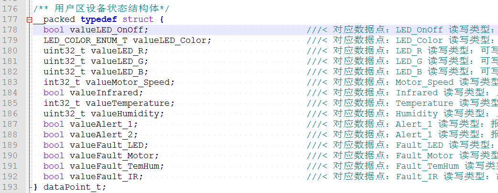

Description: The structure dataPoint_t is used to store the device status of the user area. After you assign a value to the corresponding data field according to the Data Point defined in the cloud, you do not need to care about the data conversion. The data field corresponds to dev_status(11B) of “4.9: The device MCU actively reports the current status to the Wi-Fi module” in the p0 data area convention.

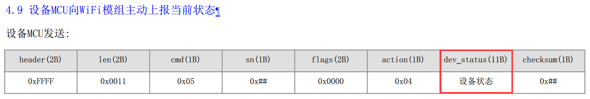

Structure: attrFlags_t, attrVals_t

Code location: MCU_STM32xxx_source\Gizwits\gizwits_protocol.h


The structures of attrFlags_t and attrVals_t correspond to attr_flags(1B) and attr_vals(6B) of "4.10 The Wi-Fi module controls the device" in the p0 data area convention respectively:

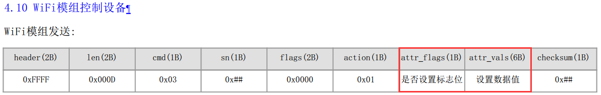 

Structure: devStatus_t

Code location: MCU_STM32xxx_source\Gizwits\gizwits_protocol.h

 

The structure devStatus_t corresponds to dev_status(11B) of "4.9 The device MCU actively reports the current status to the Wi-Fi module" in p0 data area convention:

 

Note:

A. Data structure description

dataPoint_t is the application layer data structure that developers need to understand. (For details, see: "2.7.1 Get read-only data" section).

attrFlags_t, attrVals_t, and devStatus_t are the communication layer data structures that developers need to understand in combination with the communication protocol.

B. Example of bit field:

uint8_t motor_switch:1; is a way of using bit field. Since the uint8_t type data occupies 8 bits of memory space, the motor_switch in the protocol occupies the bit field 0 (the first bit), so uint8_t motor_switch: 1 indicates that 1 bit memory space is used. 

uint8_t reserve:7; Because the minimum unit of memory request in the program is byte, and here we are using bit (8bit = 1byte), so it requires padding for the remaining 7 bits that are less than 1byte (when using n bits, it requires padding for the remaining 8-n bits).

Tip: Bit field cannot be used across bytes, otherwise it causes data read and write errors.

### 3.2 Program main function

Location: main() function in MCU_STM32xxx_source\User\main.c:


Function |	Description
---|---
SystemInit()|	Platform related hardware initialization. It is not a MCU SDK API. The function name may differ on different platforms.
userInit()|	User related initialization, such as peripheral initialization, serial port initialization for print. It is not a MCU SDK API. The function name may differ on different platforms.
gizwitsInit()|	Platform and protocol initialization, such as user timer initialization, serial port initialization for communication. It is a MCU SDK API.
userHandle()|	Callback function for user events. Users can customize the events in this function to complete the corresponding protocol processing. It is not a MCU SDK API. The function name may differ on different platforms.
gizwitsHandle()|	Protocol related main function. It is a MCU SDK API.

### 3.3 User initialization

Next, look at the user related initialization code (location: userInit() function in gizwits_product.c):

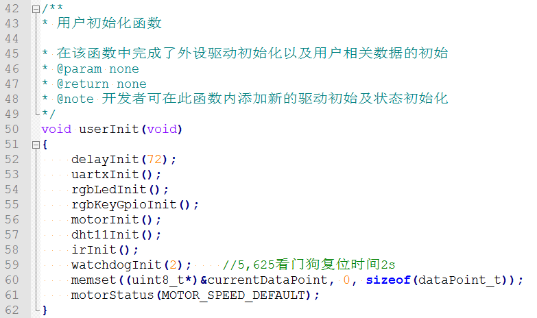


This part completes the hardware driver initialization of the RGB LED, motor, temperature and humidity, infrared sensor and the motor initial state setting. The corresponding driver code is implemented in MCU_STM32xxx_source\Hal.

The code snippet accomplishes the network access configuration. You can update it according to you own needs.

The following is the platform protocol related initialization (location: gizwitsInit() function in gizwits_protocol.c):


The initialization of the timer and serial port is completed (see Sections 2.3.4 and 2.3.5 for details) and the initialization of a ring buffer.

The final is the initialization of a variable of the communication processing module structure, which is a global variable of the communication module:


Definition location: Gizwits\gizwits_protocol.c


For related structures, see the section "2.3.1 Data structure definitions" for details.

### 3.4 Timer

Timer initialization, code location: timerInit() function in MCU_STM32xxx_source\Gizwits\gizwits_product.c


 

Note: Here we define a timer with a period of 1ms. The timing calculation formula is:


 

Timer interrupt handler, code location:

MCU_STM32xxx_source\Gizwits\gizwits_product.c


Note: In this interrupt handler, we have completed the timing accumulation counting with a period of 1ms.

Instructions for use:

Code location: MCU_STM32xxx_source\Gizwits\gizwits_product.h


a. Here we use the timer TIM3 (#define TIMER TIM3);

b. The interrupt callback handler of TIM3 is UTIM3_IRQHandler() (#define TIMER_IRQ_FUN TIM3_IRQHandler);

Tip: To reuse TIMER2, modify the corresponding macros:


 
### 3.5 Serial port

Serial port initialization, location: uartInit() in MCU_STM32xxx_source\Gizwits\gizwits_product.c


 

Serial port interrupt handler, location: MCU_STM32xxx_source\Gizwits\gizwits_product.c

 

Instructions for use:

Code location: MCU_STM32xxx_source\Gizwits\gizwits_product.h


a. Here we use USART2 (#define UART USART2) as the serial port for data communication;

b. Set its baud rate to 9600 (#define UART_BAUDRATE 9600)

c. The serial port interrupt handler of USART2 is USART2_IRQHandler() (#define UART_IRQ_FUN USART2_IRQHandler). In this interrupt handler, we complete the reception of serial data.

Tip: To reuse USART1, modify the corresponding macros:


 
## 4. Configuration mode

Devices need to enter the configuration mode to access Internet and communicate with the cloud. In this example project, the corresponding configuration modes are triggered by a button.

Wi-Fi configuration interface description:

```
/**

* @brief Wi-Fi configuration function

* You can call the function to enable the Wi-Fi module to enter the corresponding configuration mode or reset module.

* @param[in] mode configuration mode choices: 0x0, reset; 0x01, SoftAP mode; 0x02, AirLink mode

* @return Error code

*/

int32_t gizwitsSetMode(uint8_t mode);
```

The interface call location in the program: MCU_STM32xxx_source\User\main.c

A. Enter SoftAP mode: short press on the key2.

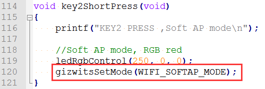

B. Enter AirLink mode: long press on the key2.


 

C. Module reset: Long press on the key1.


 

## 5. Implementation of protocol processing

Location: gizwitsHandle() function in MCU_STM32xxx_source\Gizwits\gizwits_protocol.c:


The following is a detailed description of the protocol handler:

* The first is the initialization of some local variables. The more important is: "protocolHead_t *recvHead = NULL;" It is used to save the parsed protocol header.


* Then it is the retransmission mechanism of the protocol. It is used to determine the timeout of the transmitted protocol data. The retransmission happens after timeout of 200ms, which is repeated at most 3 times:

 

* The program will then fetch a packet of data from the ring buffer, such as 4.9:

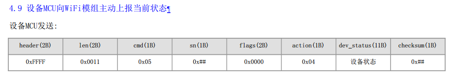

The corresponding code is as follows:


* When getting a whole packet of data, it will go to the following if determination logic to parse the protocol.

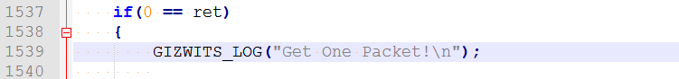

Here it has saved the received protocol header:


* Then is the processing flow of each protocol command:

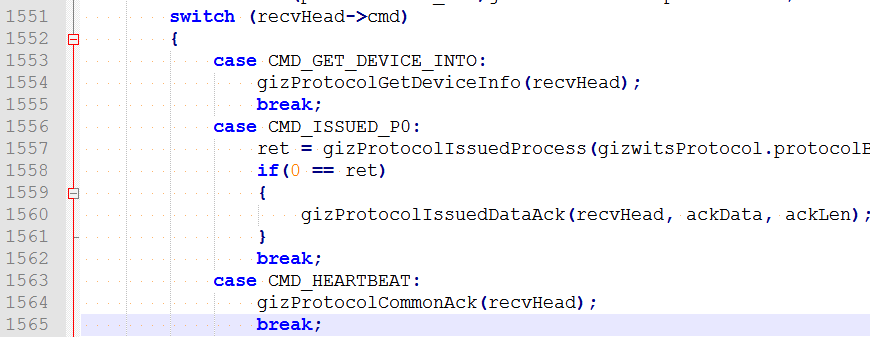

where the relevant protocol processing in "Serial communication protocol for Gizwits IoT Cloud access" is completed, as follows:


For example, 4.8:
 


Its "cmd" value is "0x03", and the corresponding case in the code is "CMD_ISSUED_P0"

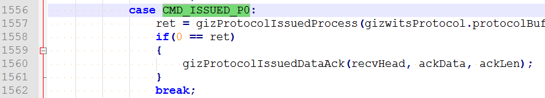

Similarly, the location of the macro definitions corresponding to the other cmd is in Gizwits\gizwits_protocol.h:

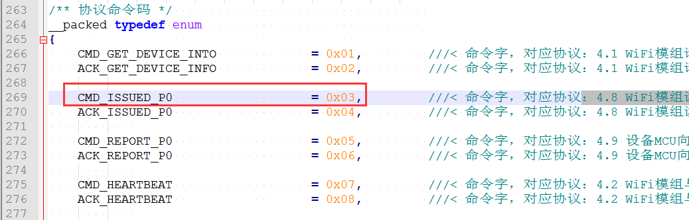

The relevant processing of the p0 protocol is completed in the "gizProtocolIssuedProcess". For details, refer to the sections "2.6 Implementation of control-type protocol" and "2.7 Implementation of reporting-type protocol".

The rest protocol functions are as follows:

Function |	Description
---|---
gizProtocolGetDeviceInfo|	Complete "4.1 The Wi-Fi module requests the device information".
gizProtocolIssuedProcess|	Complete "4.8 The Wi-Fi module reads the current state of the device" and "4.10 The Wi-Fi module controls the device". When the Wi-Fi module receives the relevant protocol data sent from the cloud or the App, it sends the data to the MCU where the protocol data is parsed. Then the relevant protocol data is passed to the secondary function to perform the further protocol processing.
gizProtocolCommonAck|	Send common protocol packet.
gizProtocolModuleStatus|	Complete the processing of “4.5 The Wi-Fi module notifies the device MCU of the working state changes of the Wi-Fi module".
gizProtocolWaitAckCheck|	Clear the ACK protocol packet from the Wi-Fi module after “4.4 The device MCU resets the Wi-Fi module”.
gizProtocolReboot|	Complete "4.4 The device MCU resets the Wi-Fi module ". 
gizProtocolErrorCmd|	Complete "4.7 Illegal message notification".
gizwitsEventProcess|	Execute callback functions for user-defined events. Users can customize events and complete the corresponding processing in the function.

* After the protocol commands are identified, there are some determination statements, which are used to complete the processing of the corresponding protocol commands:


For example, in the p0 protocol processing function (gizProtocolIssuedProcess), after the parse of the control-type protocol, set issuedFlag = 1, as follows:

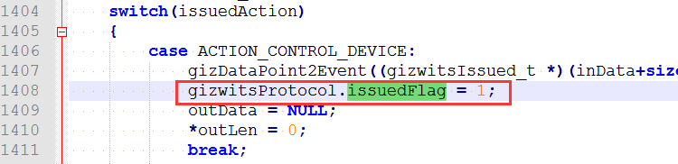

Then the following processing will be performed to call the gizwitsEventProcess function:


In gizwitsEventProcess, the processing of the corresponding control-type events is completed, and other states of issuedFlag are treated the same way.

* After that, there is a data reporting judgment, which mainly executes the gizCheckReport function.

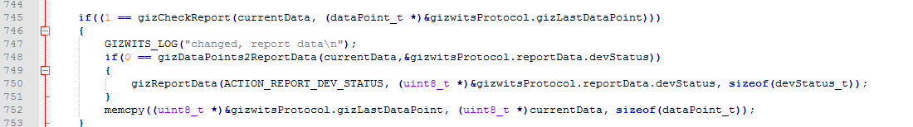

The function gizCheckReport is used to determine the consistency between the current and last reported data. If the reporting condition is met, data reporting will be performed. The report condition should conform to the description in the protocol "4.9 the device MCU actively reports the current status to the Wi-Fi module":

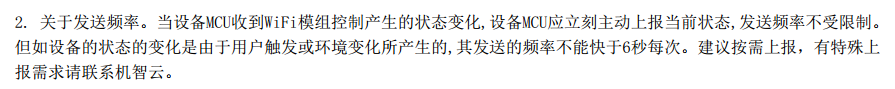

If the reporting condition is met, the data type conversion function gizDataPoints2ReportData (see section "2.8 Gizwits protocol data processing" for details) and the data reporting function gizReportData will be executed.

* The last code snippet is a timing mechanism for data reporting: 


Here is the corresponding description of protocol "4.9 the device MCU actively reports the current status to the Wi-Fi module":


So far we have gone through the detailed explanation of the protocol processing functions.

## 6. Implementation of control-type protocol

The function calls related with the control-type protocol are as follows:


Function description:

Function |	Description
---|---
gizProtocolIssuedProcess|	This function is called by gizwitsHandle to receive relevant protocol data from the cloud or App.
ACTION_CONTROL_DEVICE|	Process control-type protocol
gizDataPoint2Event|	Generate control-type events according to the protocol and complete the conversion of the corresponding data types
gizwitsEventProcess|	Process the generated control-type events (i.e. calling the corresponding driver functions)

### 6.1 Process control-type events

Related code location:

The gizwitsEventProcess() function in MCU_STM32xxx_source\Gizwits\gizwits_product.c:

Function Description:

Complete event processing for writable peripherals.

The relevant code:

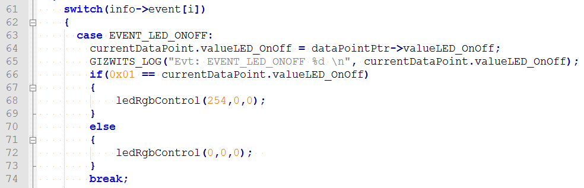
 
### 6.2 Writable data type conversion

After receiving the data that was specially processed from the cloud, it needs to be converted in gizDataPoint2Event.

Conversion function description:

Function	| Description
---|---
gizDecompressionValue|	Complete the compression of the transmitted data. For details, see section 2.8.2 Data decompression and compression.
gizX2Y|	Convert the user area data to the data for transmission. For details, see the section "2.8.1 Data Point type conversion".


Relevant code:


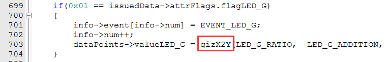
 
## 7. Implementation of reporting-type protocol

The function calls related to the reporting-type protocol are as follows:
 
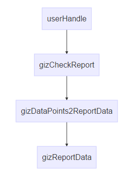

Function description:

Function	| Description
---|---
userHandle|	Get reporting-type data of user area.
gizCheckReport|	Determine whether to report the data of the current state.
gizDataPoints2ReportData|	Complete conversion of user area data to reporting-type data.
gizReportData|	Send the converted reporting-type data to the Wi-Fi module via serial port.

### 7.1 Get read-only data

Related code location:

userHandle() function in MCU_STM32xxx_source\Gizwits\gizwits_product.c

Function description:

This function completes the acquisition of the reporting-type data of the user area. The user only needs to assign the read data to the current device status structure of the user area:
 
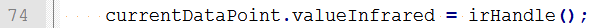

Note: The assigned data is reported to the cloud through gizwitsHandle (see section "2.5 Implementation of protocol processing": Data reporting mechanism of the function gizCheckReport). You do not need to concern yourself with the changes reporting and timing reporting.

### 7.2 Reporting time determination

In order to make the API interface more simplified, more judgments are performed in the protocol processing module. Therefore you only need to update the device status to the protocol processing module, and do not care about when to report. The protocol processing module will handle it automatically. 

Related code location:

The checkReport() function in MCU_STM32xxx_source\Gizwits\gizwits_protocol.c

Function Description:

Determine whether to report the current status according to the protocol. The determination logic is as follows:

1. If it is a control-type data change, immediately reports the current status.
2. If it is a user triggered or environmental change, the time interval of reporting should be at least 6 seconds..

The relevant rules in the protocol are as follows: ("4.9 the device MCU actively reports the current status to the Wi-Fi module")

 

Take the LED On/Off as an example:


 

Note: You can understand this part in combination with the data reporting mechanism in the section "2.5 Implementation of protocol processing”.

### 7.3 Read-only data type conversion

After getting the original data of the user area, the corresponding conversion is performed on the data before being transmitted to the cloud by using gizDataPoints2ReportData.

The relevant functions description:

Function	| Description
---|---
gizCompressValue|	Complete the data compression for transmission. For details, see section “2.8.2 Data decompression and compression”. 
gizY2X|	Convert the user area data to the data for transmission. For details, see the section "2.8.1 Data Point type conversion".

## 8. Gizwits protocol data processing

### 8.1 Data point type conversion

In order to make the device function definition simpler and more straightforward, the user input value is converted into a uint type that the device can recognize. The core formula of the algorithm is: y=kx+m (y: display value; x: transmission value; k: ratio; m: offset)

Take the temperature Data Point of WeChat Pet House project as an example:


Value range: -13 (Ymin) ~ 187 (Ymax), ratio: 1, offset: -13;

The ratio and offset are defined as macros in app\Gizwits\gizwits_product.h:

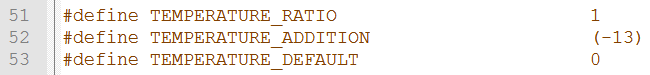

According to the formula: y = kx + m, k = 1; m = -13

Actual transmitted value: x = (y - m) / k

Description of the conversion functions in the program:

A.X2Y conversion:

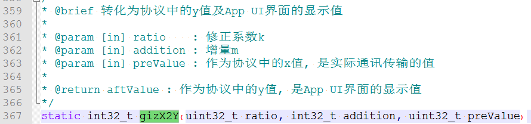
 

B. Y2X conversion:


 
### 8.2 Data decompression and compression
 
For the data interaction between the device and the cloud, some special data types (bool and enum) can be parsed by the cloud only after being specially processed. Therefore, the device must decompress the data when receiving it from the cloud and compress the data when sending it to the cloud.

Gizwits has encapsulated the corresponding processing interface:

Usage |	Interface name
---|---
Decompression of bool and enum type Data Point 	|gizDecompressionValue
Compression of bool and enum type Data Point	|gizCompressValue

Take the RGB LED of WeChat Pet House project as an example. The Data Points are defined in the cloud as follows:

 

The corresponding data format in the document is as follows:


The corresponding macros of the Data Point byte order and bit order are defined as follows:

 

The Data Point is decompressed as follows when it is received (located in the gizDataPoint2Event function): 


The Data Point is compressed as follows when it is transmitted (located in the gizDataPoints2ReportData function):


# Support

## For individual developers

Gokit is free, but only a limited number are available for individual developers. Register in our forum or follow our official WeChat to request for provision.

Community: http://club.gizwits.com/forum.php

Documentation Center: http://docs.gizwits.com/en-us/overview/overview.html

## For organizations

Gizwits has a lot of support programs for organizations, you can contact Gizwits to get Gokit and timely technical support.

Website: http://en.gizwits.com/about-us

WeChat Official Account QR code of Gizwits:


