title: Gokit-SoC program with explanation
---

# Detailed communication protocol

## 1. Know before you go

A. The difference between SoC edition and MCU edition of Gokit program

Since the SoC edition of Gokit program is developed directly on the Wi-Fi module, the concept of MCU is not explicitly involved. Thus no transmission via serial protocol is required, and no protocol encapsulation and decapsulation are needed to be implemented by developers. The focus is on the parsing of "p0 data area".  

B. The relationship between SoC edition and MCU edition of Gokit program

The protocol document generated by Gizwits IoT Cloud is for the MCU edition of Gokit program by default. In fact, the protocol document of the MCU edition can completely be reused for the SoC edition of Gokit program. Therefore, the MCU term in the " XX - Serial communication protocol for Gizwits IoT Cloud access" can be treated as SoC.

## 2. p0 data area convention

The p0 data area convention has the following clauses:

1) When the module sends a command to the MCU, the p0 command, command flag and the writable data area are carried.

2) The p0 command and the complete data area are carried when the MCU actively reports the status or replies the status query from the module.

3) The data area will automatically merge the Boolean and enumeration variables, and have a strict order, which cannot be changed arbitrarily.

How to understand the convention? Open the "XX - Serial communication protocol for Gizwits IoT Cloud access", you will see the following commands:

1) The Wi-Fi module requests device information;

2) The heartbeat of the Wi-Fi module and the device MCU;

3) The device MCU tells the Wi-Fi module to enter the configuration mode;

4) The device MCU resets the Wi-Fi module;

5) The Wi-Fi module notifies the device MCU of the working state changes of the Wi-Fi module;

6) The Wi-Fi module requests to restart the MCU;

7) Illegal message notification;

8) The Wi-Fi module reads the current state of the device;

9) The device MCU actively reports the current status to the Wi-Fi module;

10) The Wi-Fi module controls the device;

(The rest items are not important and thus omitted)

Most of the basic communication protocol has been implemented by Gizwits, so just pay particular attention to the 8th, 9th, and 10th commands.

First see the 10th command as follows: 

Note: For the SoC edition of Gokit program, you do not need to focus on the content of the protocol other than the p0 protocol.

According to the 10th command in the above p0 data area convention, the module sends the p0 command, command flag and the writable data area when issuing the command to the SoC. It can be seen that action (1B) stands for p0 command, attr_flags(1B) represents the command flag, and "attr_vals(6B)" represents the writable data area.

1). The command flag (attr_flags) indicates whether the corresponding Data Point is valid. The flag bit 1 indicates that the corresponding Data Point is valid, and 0 indicates that the corresponding Data Point is invalid. The right-to-left flag bits are:

Flag bit |	Data Point
---|---
bit0|	LED_OnOff
bit1|	LED_Color
bit2|	LED_R
bit3|	LED_G
bit4|	LED_B
bit5|	Motor_Speed

You can see that attr_flags occupies 1 byte (1B), where bit0 represents the validity of LED_OnOff and similarly bit5 represents the validity of Motor_Speed. After the SoC receives the command sent by the Wi-Fi module, you can identify each bit of attr_flags that corresponding to the device Data Point that needs to be controlled.

2). The attr_vals(6B) is the writable data area as defined below:

It can be clearly seen here that the data value (Data Point) is valid only when the corresponding flag bit (attr_flags) is 1. It is necessary to pay special attention to the third clause of the p0 data area convention, that is, the data area will automatically merge Boolean and enumeration variables, and have a strict order, which cannot be changed arbitrarily. In the above example, "byte0" merges the "bool" and "enum" types.

## 3. summary

The p0 data area convention is used to complete the uploading of valid data (4.8, 4.9) and the delivering (4.10). The format of the uploading protocol is: action(1B) + dev_status(11B); the format of the delivering protocol is: action(1B) + attr_flags(1B) + attr_vals(6B); 

Fields of p0 data area	| Description
---|---
action|	Indicates the direction of the "p0 command", i.e., Wi-Fi -> MCU or MCU -> Wi-Fi
dev_status|	Indicates the status of all reported Data Points
attr_flags|	Indicates the valid control-type Data Points
attr_vals|	Indicates the values of the valid control-type Data Points

It is necessary to note the third clause of the p0 data area convention. The data area will automatically merge the Boolean and enumeration variables, and have a strict order, which cannot be changed arbitrarily. 

Above is the explanation of the p0 data area convention. Next, this document goes into details about the SoC program.

# Detailed program

## 1. Code folders

### 1.1 Primary folder
 
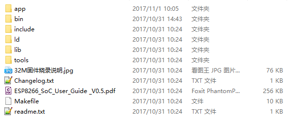

Folder/File |	Description
---|---
app|	User directory (developers’ main concern)
bin|	Firmware build directory that has the firmware build files deposited
include|	Module driver related library
ld|	Dynamic link library
lib|	Project Files
tools|	Related tools
readme.txt|	Project introduction
ESP8266_SoC_User_Guide _V0.5.pdf|	Gokit3S secondary development guide

### 1.2 Code files
 
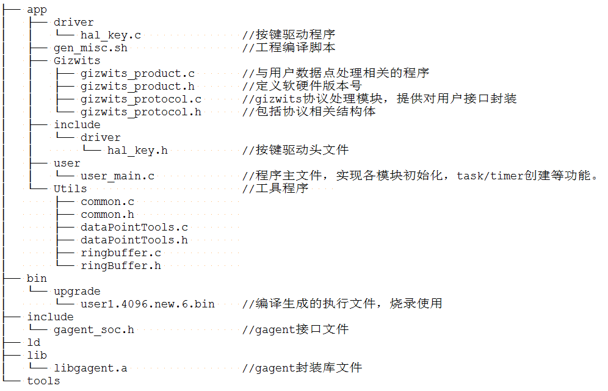

File |	Description
---|---
libgagent.a|	The file is Gizwits device connection protocol library, which is located in the lib directory
gagent_external.h|	This file is the corresponding header file of libgagent.a
gizwits_product.c|	This file is the platform-related processing file, which stores the event processing API, i.e.,  gizwitsEventProcess()
gizwits_product.h|	This file is the header file of gizwits_product.c, which stores product-related macro definitions such as: HARDWARE_VERSION and SOFTWARE_VERSION
gizwits_protocol.c|	This file is the protocol implementation file, which stores the SDK API
gizwits_protocol.h|	This file is the gizwits_protocol.c header file. The protocol-related macro definitions, and the API declarations are all in this file

### 1.3 APIs

API name |	API function
---|---
void gizwitsInit(void)|	The initialization API for the Gizwits protocol.You can call the API to accomplish the Gizwits protocol-related initialization (including protocol-related timers and serial port initialization).
void gizwitsSetMode(uint8_t mode)|	The parameter mode has three choices of 0, 1, and 2, and other input is invalid.When the parameter is set to 0, it is used for restoring manufacture defaults, which will clear all settings and restore the module to the factory defaults. When the parameter is set to 1 or 2, it is used for SoftAP and AirLink mode switch. 1 for entering the SoftAP mode, and 2 for entering the AirLink mode.
void gizwitsHandle(dataPoint_t *dataPoint)|	The parameter dataPoint is the device Data Point.This function completes the related operations of data reporting.
int8_t gizwitsEventProcess (eventInfo_t info, uint8_t data, uint32_t len)|	Parameter info: event queue. Parameter data: data. Parameter len: data length. User data processing function, including Wi-Fi status update events and control-type events. a). Wi-Fi status update events. The events whose name begins with WIFI_ are the Wi-Fi status update events. The parameter data is valid only when the event name is WIFI_RSSI, and its value is RSSI value, its data type is uint8_t, and its value range is 0~7.  b). Control-type events. They are related to the Data Points. This version of the code will print the relevant event information and the relevant values. You only need to implement the specific execution of the command.

## 2. Program implementation principle

__Protocol implementation mechanism:__

After the protocol is parsed, the valid Data Points of the p0 data area generate the corresponding Data Point events, which are used to process the Data Points.

__Description of the conversion of Data Point into event:__

The valid Data Points are determined according to the attr_flags of the p0 data area, which are converted into the corresponding Data Point events, which then are processed in the event handler (gizEventProcess).

## 3. Program initialization

### 3.1 Data structure definitions

Structure: dataPoint_t

Code location: SoC_ESP8266_32M_source\app\Gizwits\gizwits_protocol.h

Description: The structure dataPoint_t is used to store the device status of the user area. After you assign a value to the corresponding data field according to the Data Point defined in the cloud, you do not need to care about the data conversion. The data field corresponds to dev_status(11B) of “4.9: The device MCU actively reports the current status to the Wi-Fi module” in the p0 data area convention.

Structure: attrFlags_t, attrVals_t

Code location: SoC_ESP8266_32M_source\app\Gizwits\gizwits_protocol.h

The structures of attrFlags_t and attrVals_t correspond to attr_flags(1B) and attr_vals(6B) of "4.10 The Wi-Fi module controls the device" in the p0 data area convention respectively:

Structure: devStatus_t

Code location: SoC_ESP8266_32M_source\Gizwits\gizwits_protocol.h

The structure devStatus_t corresponds to dev_status(11B) of "4.9 The device MCU actively reports the current status to the Wi-Fi module" in p0 data area convention:

Note:

A. Data structure description

dataPoint_t is the application layer data structure that developers need to understand. (For details, see: "2.7.1 Get read-only data" section).

attrFlags_t, attrVals_t, and devStatus_t are the communication layer data structures that developers need to understand in combination with the communication protocol.

B. Example of bit field:

uint8_t motor_switch:1; is a way of using bit field. Since the uint8_t type data occupies 8 bits of memory space, the motor_switch in the protocol occupies the bit field 0 (the first bit), so uint8_t motor_switch: 1 indicates that 1 bit memory space is used. 

uint8_t reserve:7; Because the minimum unit of memory request in the program is byte, and here we are using bit (8bit = 1byte), so it requires padding for the remaining 7 bits that are less than 1byte (when using n bits, it requires padding for the remaining 8-n bits).

Tip: Bit field cannot be used across bytes, otherwise it causes data read and write errors.

### 3.2 Program main function

Location: user_init () function in SoC_ESP8266_32M_source\app\user\user_main.c:

Description: This function initializes the two major parts of the GAgent module and the Gizwits protocol module as the program entry. Developers’ main concern is the implementation of gizwitsInit() and userHandle().

Function |	Description
---|---
gizwitsInit()|	The initialization function of protocol parsing module (protocol API)
userHandle()|	Timer callback function (1000ms timing period, time-dependent logic can be implemented here)

### 3.3 User initialization

Location: user_main.c:

This part completes the hardware driver initialization of the RGB LED, motor, temperature and humidity and infrared sensor. The corresponding driver code is implemented in SoC_ESP8266_32M_source\app\driver.

The initialization of the timer is completed (see Sections 2.3.4 for details).

The initialization of the system task is completed (see Sections 2.3.5 for details).

 
### 3.4 Timer

Code location: user_init() function in app\user\user_main.c

Relevant macros definitions:

 

API description:

Callback function description:

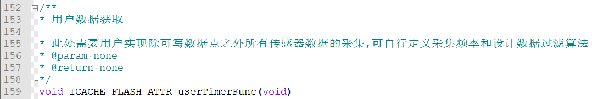

In the userTimerFunc(), the periodic execution of the cycle of 100ms is completed. You can periodically read the peripheral data in the user_handle(), and assign the read data to the global structure variable of the user area:

### 3.5 System task

Code location: gizwitsInit() function in app\user\user_main.c

API description:

Callback function description:

You can customize the system tasks (the message types in system_os_post), and then add the corresponding task handlers (i.e. the corresponding message types in the switch statement) in the system task callback function (gizwitsUserTask).
It should be noted that the task priority cannot be modified at will (there are three priorities, and the priority 0 is reserved for developers):

 
## 4. Configuration mode

Devices need to enter the configuration mode to access Internet and communicate with the cloud by calling the Wi-Fi configuration API. 

Location of Wi-Fi configuration API:

SoC_ESP8266_32M_source\app\Gizwits\gizwits_protocol.h

 

In this example project, the corresponding configuration modes are triggered by a button. The interface call location in the program: 
SoC_ESP8266_32M_source\app\user\main.c

A. Enter SoftAP mode: short press on the key2.

 

B. Enter AirLink mode: long press on the key2.

 

C. Module reset: Long press on the key1.

 

Note: You can implement the configuration mode according to your own needs.

## 5. Implementation of protocol processing

Location: gizIssuedProcess() function in SoC_ESP8266_32M_source\app\Gizwits\gizwits_protocol.c

This function is called by the GAgent module to process the relevant p0 protocol data from the cloud or App.

The following is a detailed description of the protocol handler:

* The first is the initialization of some local variables. The more important is: " gizwitsIssued_t *gizIssuedData", which is used to save the parsed protocol header.

The protocol format corresponds to the command flag "attr_flags" + data value "attr_vals" of the "p0 protocol area" for the command "4.10 The Wi-Fi module controls the device".

 

* Then is the processing flow of each protocol command:

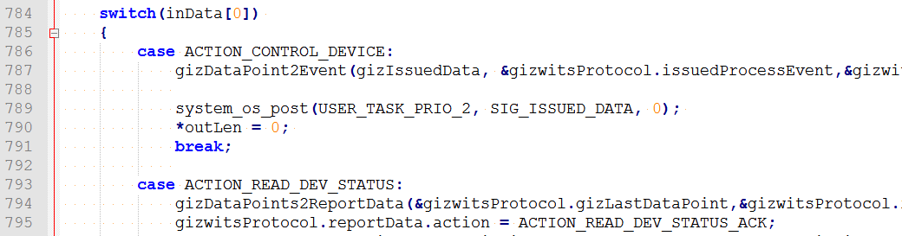 

Since the SoC edition has removed the concept of the serial port protocol compared with the MCU edtion, you only need to understand the 8th and 10th commands in the " XX - Serial communication protocol for Gizwits IoT Cloud access":

8) The Wi-Fi module reads the current state of the device; 

10) The Wi-Fi module reads the current state of the device;

* The following takes the processing of the 8th command as an example:

 

The "action" value is "0x02", and the corresponding case statement in the program is "ACTION_READ_DEV_STATUS".

 

After that, the data type conversion of data reporting is completed (the converted data is stored in the devStatus data bit of gizwitsReport_t):

 

Finally, the data to be reported is output by copying a memory pointer:

 

* The location of the macro definitions corresponding to the action value of other commands is in Gizwits\gizwits_protocol.h

 

So far we have gone through the detailed explanation of the p0 protocol processing functions.

## 6. Implementation of control-type protocol

The function calls related with the control-type protocol are as follows:

 
Function description:

Function |	Description
---|---
gizProtocolIssuedProcess|	This function is called by GAgent to receive relevant protocol data from the cloud or App.
ACTION_CONTROL_DEVICE|	Process control-type protocol
gizDataPoint2Event|	Generate control-type events according to the protocol and complete the conversion of the corresponding data types
gizwitsEventProcess|	Process the generated control-type events (i.e. calling the corresponding driver functions)

### 6.1 Generate control-type events

Related code location:

The gizDataPoint2Event () function in SoC_ESP8266_32M_source\app\Gizwits\gizwits_protocol.c

Function Description:

Complete event generation for writable peripherals. Take the LED On/Off as an example:

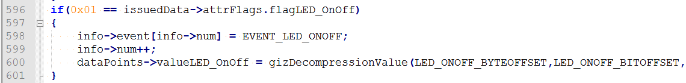 

Here corresponds to the command "4.10 The Wi-Fi module controls the device":

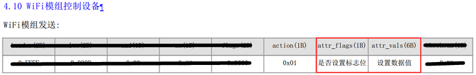 

You have already known that the "issuedData->attr_flags" in the program corresponds to attr_flags(1B) of "4.10 The Wi-Fi module controls the device" in _WeChat Pet House - Serial communication protocol for Gizwits IoT Cloud access.pdf_, in which we can see that the 0th bit of attr_flags is used to control LED switch, that is, as long as the 0th bit is set to 1, it means to switch the LED on or off, the corresponding code snippet is:

 

The next step is the generation of control-type event:

 

And complete the decompression of the data (for details, please refer to the section "2.8.2 Data decompression and compression"):

 

Note: Enumerations (such as EVENT_LED_ONOFF) are used to indicate the meaning of the event intuitively, which can be added and modified by yourself. (Location: SoC_ESP8266_32M_source\app\Gizwits\gizwits_protocol.h)

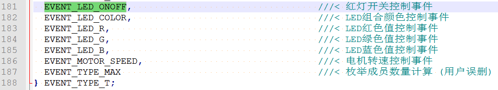
 
### 6.2 Process control-type events

Related code location:

The gizwitsEventProcess() function in SoC_ESP8266_32M_source\app\Gizwits\gizwits_product.c

Function Description:

Complete event processing for writable peripherals.

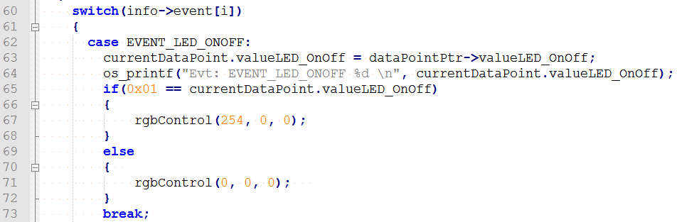 

This code snippet is used to control the LED switch: If the value of the LED switch control bit "issued->attr_vals.led_onoff" is LED_On (0x01), it indicates that the light is turned on. This corresponds to attr_vals(6B) of the "4.10 The Wi-Fi module controls the device" in _WeChat Pet House - Serial communication protocol for Gizwits IoT Cloud access.pdf_, which is the "data bit" as follows:

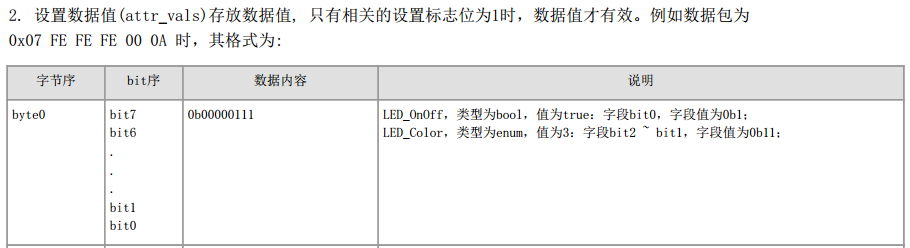 

The 0th bit is used to switch the LED on or off, and the corresponding Data Point defined in the cloud means:

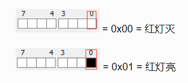

The following code snippet is basically the same as above. As long as you understand the attr_flags(1B) and attr_vals(6B) of "4.10 The Wi-Fi module controls the device" in _XX - Serial communication protocol for Gizwits IoT Cloud access.pdf_, you can programming for the control-type protocol.

### 6.3 Writable data type conversion

After receiving the data that was specially processed from the cloud, it needs to be converted in gizDataPoint2Event.

Conversion function description:

Function	| Description
---|---
gizDecompressionValue|	Complete the compression of the transmitted data. For details, see section 2.8.2 Data decompression and compression.
gizX2Y|	Convert the user area data to the data for transmission. For details, see the section "2.8.1 Data Point type conversion".

Relevant code:

 
 

Special note:

Network byte order conversion

The Data Points for the uint16, uint32 type data should consider using the network byte order conversion (using the exchangeBytes() function for uint16). Take the motor control as an example:

 
## 7. Implementation of reporting-type protocol

The function calls related to the reporting-type protocol are as follows:

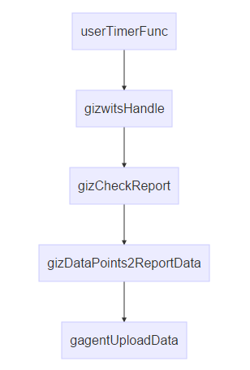 

Function description:

Function |	Description
---|---
userTimerFunc|	Get the data to be reported of the user area
gizwitsHandle|	Invoke the function to report the changes of device data
gizCheckReport|	Determine whether to report the current status 
gizDataPoints2ReportData|	Complete conversion of the user area data to the data to be reported
gagentUploadData|	Send the data to be reported to the Wi-Fi module

### 7.1 Get read-only data

Related code location:

userTimerFunc () function in SoC_ESP8266_32M_source\app\user\user_main.c

Function description:

This function completes the acquisition of the reporting-type data of the user area. The user only needs to assign the read data to the current device status structure of the user area:

 
### 7.2 Reporting time determination

In order to make the API interface more simplified, more judgments are performed in the protocol processing module. Therefore you only need to update the device status to the protocol processing module, and do not care about when to report. The protocol processing module will handle it automatically. 

Related code location:

The gizCheckReport() function in SoC_ESP8266_32M_source\app\Gizwits\gizwits_protocol.c

Function Description:

For whether to report the current status according to the protocol, there are two determination logics as follows:

Logic 1. If it is a control-type data change, immediately reports the current status.

Logic 2. If it is a user triggered or environmental change, the time interval of reporting should be at least 6 seconds.

The relevant rules in the protocol are as follows: ("4.9 the device MCU actively reports the current status to the Wi-Fi module")

 

Code sample for Logic 1.

 

Code sample for Logic 2.

 
### 7.3 Read-only data type conversion

After getting the original data of the user area, the corresponding conversion is performed on the data before being transmitted to the cloud by using gizDataPoints2ReportData.

The relevant functions description:

Function	| Description
---|---
gizDataPoints2ReportData|	Complete the data compression for transmission. For details, see section “2.8.2 Data decompression and compression”. 
gizY2X|	Convert the user area data to the data for transmission. For details, see the section "2.8.1 Data Point type conversion".

## 8. Gizwits protocol data processing

### 8.1 Data Point type conversion

In order to make the device function definition simpler and more straightforward, the user input value is converted into a uint type that the device can recognize. The core formula of the algorithm is: y=kx+m (y: display value; x: transmission value; k: ratio; m: offset)

Take the temperature Data Point of WeChat Pet House project as an example:

Value range: -13 (Ymin) ~ 187 (Ymax), ratio: 1, offset: -13;

The ratio and offset are defined as macros in SoC_ESP8266_32M_source\app\Gizwits\gizwits_product.h

According to the formula: y = kx + m, k = 1; m = -13

Actual transmitted value: x = (y - m) / k

Description of the conversion functions in the program:

A.X2Y conversion:

B. Y2X conversion:

### 8.2 Data decompression and compression
 
For the data interaction between the device and the cloud, some special data types (bool and enum) can be parsed by the cloud only after being specially processed. Therefore, the device must decompress the data when receiving it from the cloud and compress the data when sending it to the cloud.

Gizwits has encapsulated the corresponding processing interfaces:

Usage |	Interface name
---|---
Decompression of bool and enum type Data Point 	|gizDecompressionValue
Compression of bool and enum type Data Point	|gizCompressValue

Take the RGB LED of WeChat Pet House project as an example. The Data Points are defined in the cloud as follows:

The corresponding data format in the document is as follows:

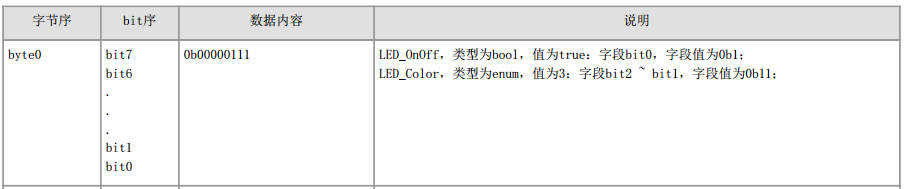

The corresponding macros of the Data Point byte order and bit order are defined as follows:

The Data Points are decompressed as follows when received (located in the gizDataPoint2Event function): 

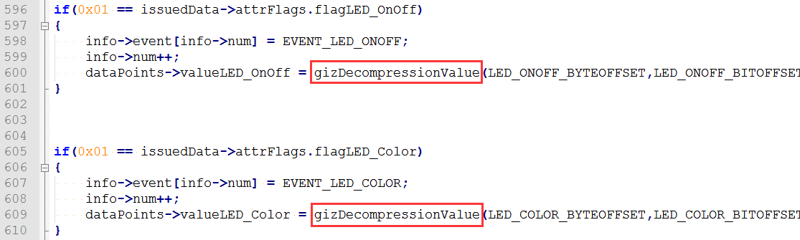

The Data Points are compressed as follows when transmitted (located in the gizDataPoints2ReportData function):

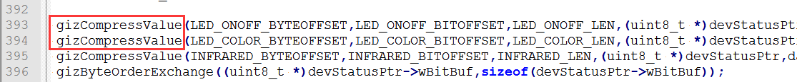

# Support

## For individual developers

Gokit is free, but only a limited number are available for individual developers. Register in our forum or follow our official WeChat to request for provision.

Community: http://club.gizwits.com/forum.php

Documentation Center: http://docs.gizwits.com/en-us/overview/overview.html

## For organizations

Gizwits has a lot of support programs for organizations, you can contact Gizwits to get Gokit and timely technical support.

Website: http://en.gizwits.com/about-us

WeChat Official Account QR code of Gizwits:

