title: Set up Gokit3(S) development environment
---

# Get ready

## 1. Choose your development environment

Gokit3(S) supports two development environments:

1) Use Espressif official ESP8266 development environment (recommended)
2) Use a custom development environment: virtual machine VMware (version 12.0) + Ubuntu OS (14.04 64-bit>), then configure the cross-compiler to compile the source code on Ubuntu.

### 1.1 Using Espressif official development environment (recommended)

1) Download Espressif official development environment installation package

Download here: https://pan.baidu.com/s/1kVn12Iz

Installation package description:


Note:

You need to install the virtual machine VirtualBox (VirtualBox-4.3.12-93733-Win.exe), and then start VirtualBox to load the OS image of the development environment (ESP8266_lubuntu_20141021.ova).

xtensa-lx106-elf.tar.bz2 is a cross-compiler that is used in a custom development environment.

2) Configure VirtualBox

After installing VirtualBox 4.3.12, launch it and go through the following steps:

Step 1: Open the "Preferences" dialog.


Step 2: Select “General” tab to set the Default Machine Folder, for example: D:\vm

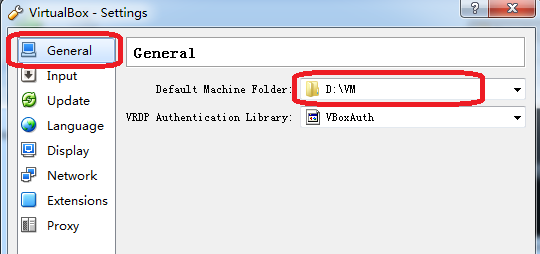 

Step 3: Select the "Import Appliance" option.

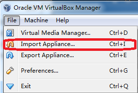 

Step 4: Select the OS image file to load, for example: D:\vm\ ESP8266_lubuntu_20141021.ova

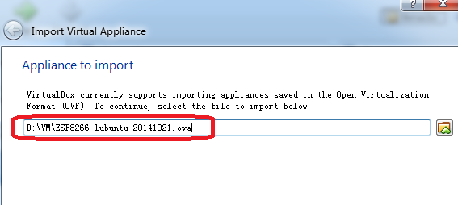 

Step 5: Import the virtual image file.


After importing, you can find the corresponding file D:\vm\ ESP8266_lubuntu_1:

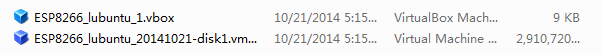 

Step 6: Create a shared folder

Create a new folder named "share" under Windows, so that the file transfer between VirtualBox and Windows is convenient. The operation steps are as follows:

 
 

Step 7: Verify the development environment

Run the script: "./mount.sh"

 

Enter the user password: “espressif” and press Enter.

 

Go into the Gokit3(S) directory (see the section "Gokit3(S) source code compilation").

 

Run the compilation script: ./gen_misc.sh

 

The following messages show that the development environment has been successfully set up.

 

If you have any questions, please check the official instructions of Espressif:

https://github.com/esp8266/esp8266-wiki/wiki/Toolchain

### 1.2 Using a custom development environment

1) Install VMware (version 12.0) + Ubuntu OS, and create a shared directory "D:\share".

2) Configure the development environment

Step 1: Copy xtensa-lx106-elf.tar.bz2 to D:\share (The previously created shared folder) as follows:


 

Step 2: Start Ubuntu and run Terminal in the following order.

 

First enter sudo su to get a root shell, then enter the password and press Enter.

 

Update the package lists from the repositories.

```
apt-get update
```


Install related software libraries:

For 32-bit virtual machine: apt-get install vim git // press Enter all the way through to confirm

For 64-bit virtual machine: apt-get install vim git libc6-dev-amd64 // press Enter all the way though to confirm

Go to the shared folder:

```
cd /mnt/hgfs/share
```


Run the commands in the following order:

```
cp xtensa-lx106-elf.tar.bz2 /opt/
cd /opt/
tar -jxvf xtensa-lx106-elf.tar.bz2  // it is shown below after unpacking
```
 


```
cd /home/$ username // $username is the login username
vim .profile
export PATH=”/opt/xtensa-lx106-elf/bin:$PATH” // append it to the file, save and exit
```


 
```
exit // note that you need to leave the root shell
source .profile // execute this script with the current user privilege
echo $PATH // the following red box indicates that the configuration is correct
```
 


If you have any questions, please check the official instructions of Espressif:

https://github.com/esp8266/esp8266-wiki/wiki/Toolchain

## 2. Gokit3(S) source code

For the SoC source code of Gokit3(S), please refer to the section Generate the source code for SoC scheme in Guide to Gizwits MCU Code Auto-Generator.

 

# Gokit3 (S) source code compilation

1) Unpack the Gokit3(S) source code and copy it to the shared directory:

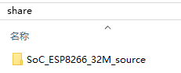 

Note: The source code of the ESP8266 32M module is taken as an example, and 16M and 8M ones are the same.

2) Change the directory of compilation:

```
cd /mnt/hgfs/share/SoC_ESP8266_32M_source/app/
```

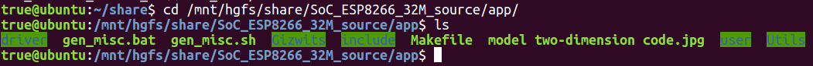

3) Set the compiling script to Unix format to prevent the Windows OS from affecting the script (Note: This method can be used once the script cannot be run):

```
vim gen_misc.sh
:set ff=unix // this is a vim command, not added content
:wq! // this is a vim command, not added content
```

 

4) Run the compiling script:

```
./gen_misc.sh
```

 

Note: As shown in the figure, the compilation is successful.

5) The generated binaries location:

```
share/SOC_ESP8266_32M_source/bin/upgrade
```

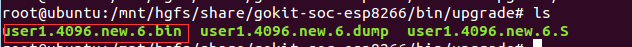 

It shows the following operation result on Windows.

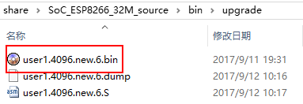

# Gokit3(S) firmware downloading

1 Run the flash download tool
Download the flash download tool "ESPFlashDownloadTool_v3.3.4.exe" at:

https://www.espressif.com/sites/default/files/tools/flash_download_tools_v3.6.4.rar

After downloading, unpack and click to run "ESPFlashDownloadTool_v3.3.4.exe"

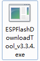 


## 2. Flash configuration

Gokit3(S) firmware has SoC edition and MCU edition. Developers should download the corresponding edition of firmware according to Gokit3(S) mode. For details, please refer to the section "2. Difference between SoC mode and MCU mode" of Introduction to Gokit3(S) development kit.

### 2.1 Gokit3(S) SoC Edition

The firmware file name for the SoC edition is:

user1.4096.new.6.bin

The default save location of the firmware file after compilation is:

share/SOC_ESP8266_xxM_source/bin/upgrade

### 2.2 Gokit3(S) MCU Edition

The firmware file name for the MCU edition is: 

GAgent_00ESP826_04020029_32Mbitcombine.bin

Click here to download

For details, please see the section "5. Using Gokit's MCU Mode" of Introduction to Gokit3(S) development kit.

### 2.3 Confirm flash configuration

The flash options are set as follows:

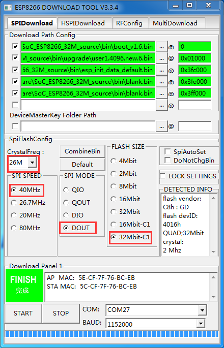

Note:

1) The first three ‘.bin’ files are in the directory 
D:\share\SoC_ESP8266_32M_source\bin, and you can choose the ‘.bin’ files with the corresponding names.
The last .bin file defaults to the SoC edtion of the firmware: 
user1.4096.new.6.bin
Location: 
D:\share\SoC_ESP8266_32M_source\bin\upgrade\user1.4096.new.6.bin
If you are flashing the MCU edition firmware, please choose GAgent_00ESP826_04020029_32Mbitcombine.bin

2) COM is set to the COM number of the TTL-to-USB converter (described below)

3) BAUD is set to 115200 (slow flash speed but high success rate)

## 3. Connect TTL-to-USB converter
 


Connect TTL-to-USB converter to your computer:

 

Find the corresponding serial port number in Device Manager: (here is COM4).

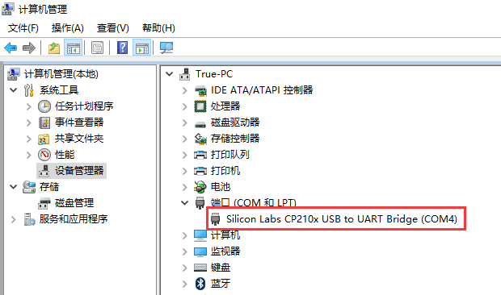 

## 4. Power on Gokit

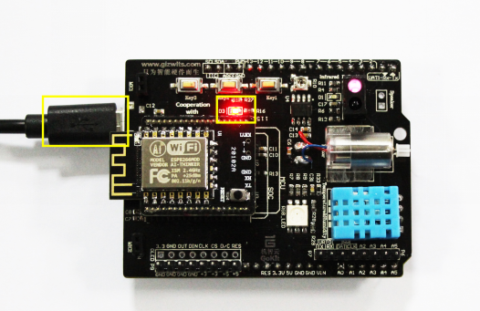 

Note:

Here the Gokit can be connected directly to the power supply via USB. If you want to check the log, connect to the computer (you need to distinguish the COM number).

## 5. Flash firmware

First, toggle the switch as is shown in the following figure to the lower side to enter the download mode.

 

Press the “START” button of the flash download tool and the “Reset” button of the Wi-Fi module to start the flash process:

 

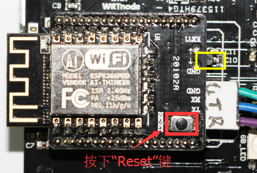

If "FINISH" is displayed, the flash is successful.

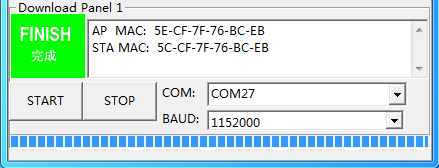 

Note: If it is not successful, first check if COM port number is correct, and set lower BAUDRATE values and try several times.

Next, set the Gokit to working mode by toggling the switch to the upper side.

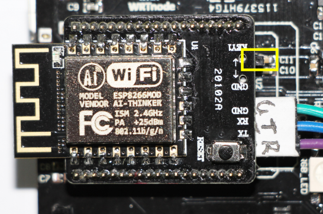

Press the Reset button to restart the module and the program starts working.

 

## 6. Check log

After downloading firmware, you can connect the USB port (i.e. power supply interface) to the computer and check the log printed in the terminal by using Gizwits Serial Port Debugger (baud rate: 115200).

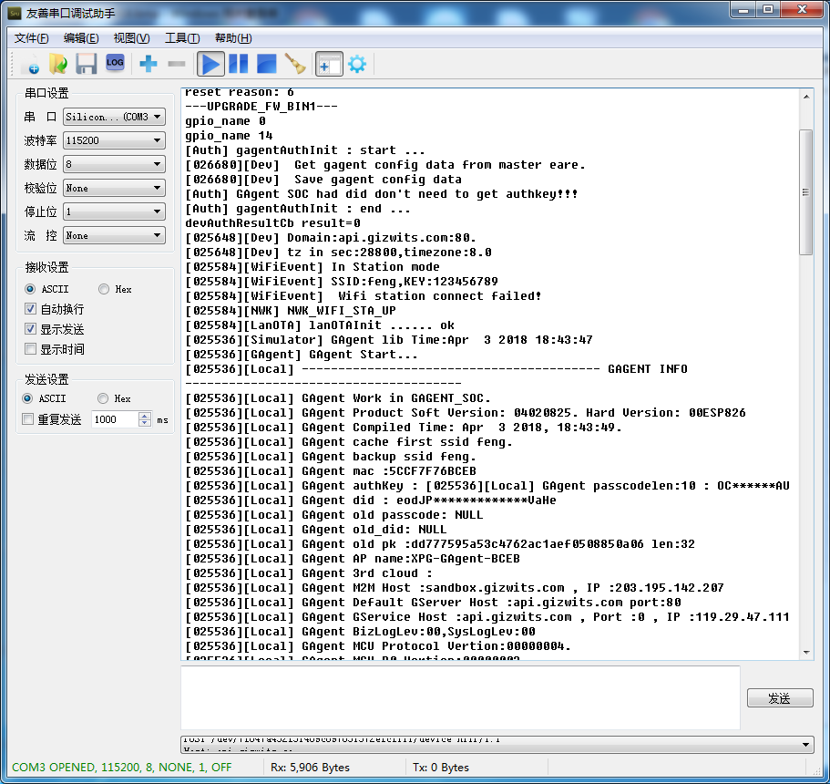 

Note: If the log message is garbled, you can restart Gizwits Serial Port Debugger to work normally.


# Firmware Upgrade (OTA)

The network connectivity to Gizwits IoT Cloud server allows the development board to download and run a new version of the firmware without connection to any development tool.

## 1. Upload firmware file

Log in to the Gizwits Developer Center and find the product that needs to upgrade firmware via OTA. Go to the OTA page as shown below.


Click the "Create new firmware" button and fill out the OTA panel following the indications:

 

Description:

1. The directory where the firmware file is located is bin/upgrade/*bin
2. The Changelog file has been added since the version 03000003. The OTA software version number will be described in the Changelog file.
3. For the version 03000001, please use 040200xx as the version number.
4. The OTA firmware version number must be greater than the version number of the firmware running in the module. 


## 2. Verify the firmware

After the firmware is uploaded, you can see the following page:

 

Clicking the "Verify firmware" button will prompt you the page as shown below.

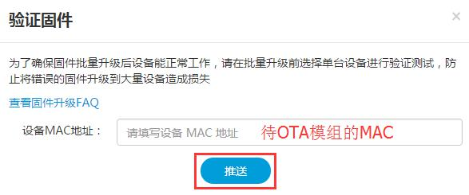 

Type the MAC, click "Push" and wait for the OTA push result.

# FAQ

Q: Why the setting of the custom development environment shared folder is unsuccessful?

A: Run the following commands to reinstall VMware Tools.

```
sudo apt-get autoremove open-vm-dkms open-vm-tools –purge
```

Click on "Virtual Machine" - reinstall VMware Tools – Go to the appropriate directory in the terminal

```
tar -zxvf VMwareTools-10.0.0-2977863.tar.gz
sudo ./vmware-install.pl
```

Then press the Enter key all the way through until the installation is complete.

# Summary

At this point, Gokit3's development environment setup, source code compilation and firmware download have been introduced.

For a deep understanding of the Gokit3's hardware, see:

Gokit3 Hardware Manual

If you want to develop your own program based on the "WeChat Pet House" code example with Gokit3, see:

Gokit3(S) programming manual
