title: Guide to device connection for standalone MCU scheme
---

Click here to download LED lamp sample code for rapid development of MCU scheme.

# Overview

Gizwits IoT Cloud is an open platform dedicated to cloud services for IoT and smart devices. Gizwits IoT Cloud concentrates on providing intelligent cloud services and IoT software and hardware solutions to help traditional device vendors upgrade their products and quickly realize product intelligence. In order to realize the hardware intelligence, in addition to the elaborative work on the hardware itself, each domain of the intelligent cloud platform, mobile Apps, networking modules needs a professional team to support. Gizwits IoT Cloud offers a complete solution that allows vendors and developers to focus solely on their own product hardware to realize hardware intelligence with minimal cost and risk and maximum added value. This document describes the basic process of device connecting to Gizwits IoT Cloud.

# Data interaction between devices and Gizwits IoT Cloud

Take an air conditioner as an example. When the air conditioner manufacturer develops the air conditioner electrical control board, using a Wi-Fi/GPRS module with Gizwits GAgent, the air conditioner will be connected to Gizwits Cloud. The basic data flow between the device and Gizwits IoT Cloud is shown below.

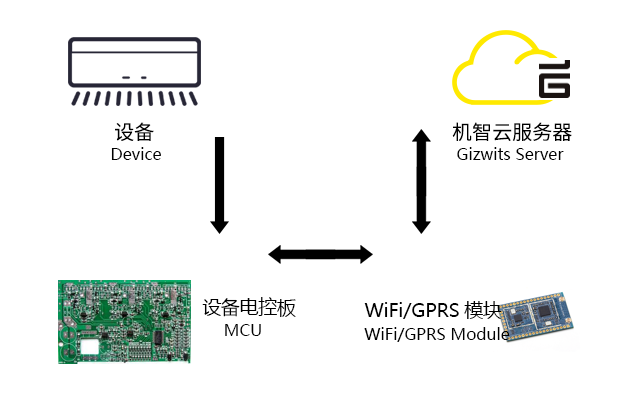
 
# Create product on Gizwits IoT Cloud

Take "Smart Light" as an example to introduce the entire process of connecting a device to Gizwits IoT Cloud.

## 1. Sign up for a Gizwits IoT Cloud developer account

Go to the Developer Center of Gizwits IoT Cloud, and sign up for the developer account following the instructions.

 
## 2. Sign in and create a product 

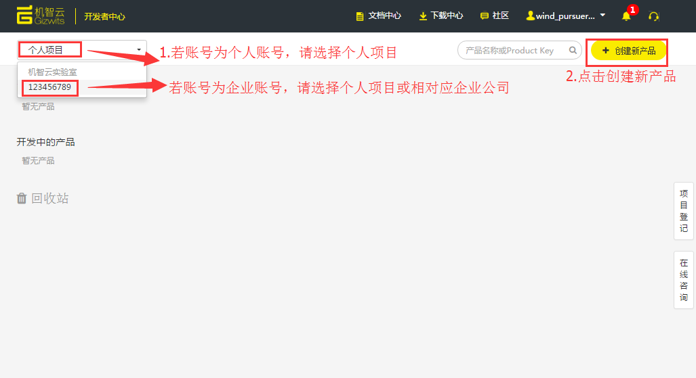
 
## 3. Enter basic product information

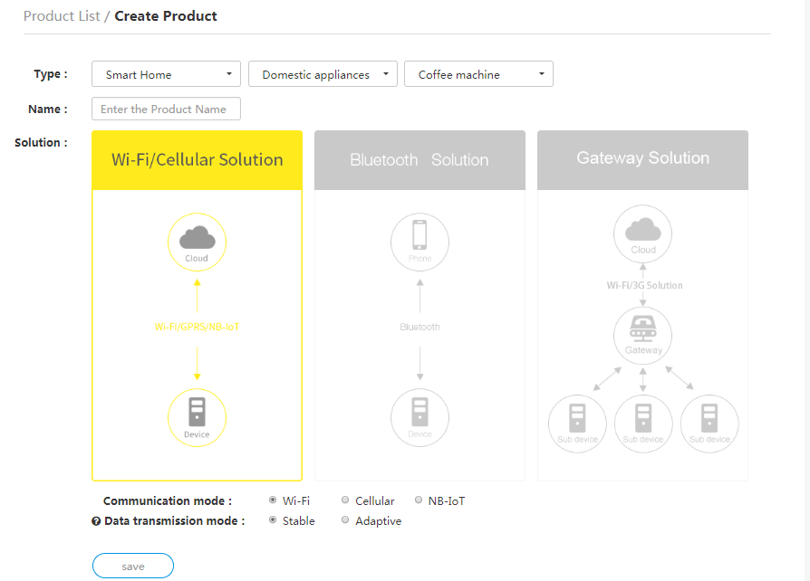
 
## 4. Product overview 

The Smart Light product has been successfully created on Gizwits IoT Cloud, which generated the Product Key and Product Secret for the product. The Product Key needs to be written by the developer to the device MCU (device main control board) , which will notify the Wi-Fi/GPRS module when logging into Gizwits IoT Cloud. Gizwits IoT Cloud will identify the product with the Product Key. The Product Secret is used when Apps connecting to Gizwits IoT Cloud.

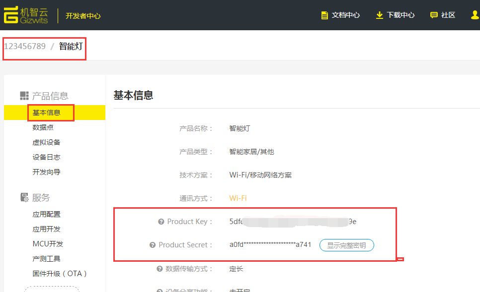
 
# Create Data Points

The Data Point refers to the functionality abstraction of a device product, which describes the product's capabilities and its parameters. After Data Points are created, the data format of the device and the cloud communication can be determined, and the device and Gizwits IoT Cloud can mutually recognize the data exchanged between the device and Gizwits IoT Cloud.

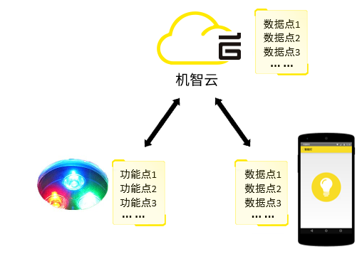
 
## 1. Explore Data Points in detail

The basic content of a Data Point definition includes: display name, identification name, read/write type, data type and remarks. The overview is as follows:

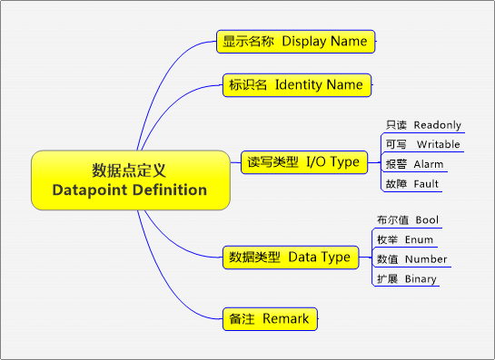
 
1.1 Display name: Customize the Data Point name.

1.2 Identification name: Used for application layer transmission, which is required for client or cloud development and follows variables naming conventions of standard development languages, such as containing English letters, numbers, and underscores, starting with an English letter.

1.3 Read/write type

* Read-only: Indicates that the Data Point cannot be controlled. The data is only to be reported from the device.
* Writable: Indicates that the Data Point is controllable. The Data Point data can be reported from the device side; the cloud/App side can control the Data Point.
* Alarm: Indicates that the Data Point cannot be controlled. The data is only to be reported from the device and needs to be a Boolean value.
* Fault: Indicates that the Data Point is not controlled. The data is only to be reported from the device and needs to be a Boolean value. The cloud will gather the statistics for the Data Points reported by the device, which can be viewed in the Running Status.

1.4 Data Types

* Boolean type: Represents two states: 0, or 1. For a switch states, Boolean data type is recommended. For example, the Gokit development board "Pet House" has a Data Point of "turn on/off the red light".
* Enumeration type: A limited set of defined values for a function (component) having several fixed values. For example, the Gokit development board "Pet House" has a Data Point of "set LED color combination", whose enumeration values are "custom, yellow, purple and pink".
* Numeric type: Represents a numeric range. The value can be negative/decimal, and Gizwits IoT Cloud can automatically converts a negative number to a positive one. For example, the Gokit development board "Pet House" has a Data Point of "set the motor speed" which supports the positive rotation, reverse rotation and speed regulation of the motor. The Data Point value can be defined in: -5 ~ 5.
* Extension type: Only its data length needs to be defined and its data content is customized by the user. It is used when above data types cannot satisfy the complex function requirements. It is not recommended to use this type. The data of this type reported by devices cannot recognized by Gizwits IoT Cloud.

1.5 Remarks: Optional, a piece of text used to describe the function and definition of the current Data Point with no restrictions on the character format. It is only used to improve the readability of a Data Point. If the team collaboration is required, it is recommended to use it.

1.6 Ratio and offset conversion for numeric type Data Points

As mentioned above, when defining numeric type Data Points, the value range includes values that are not uint type, including decimals and negative numbers. Developers familiar with embedded development know that these values are not supported on the device side.

In order to make the Data Point definition simpler and WYSIWYG, Gizwits has developed an algorithm for converting the numeric value input by the user into a uint that can be recognized by devices. The core formula of this algorithm is: y=kx+ m.

y means "display value", which is the final value visible to the user, and is also the value entered by users when the Data Point is defined as Ymin (minimum) and Ymax (maximum).

x means "transport value", which is the value used for transmission in actual commands, and the value received by the cloud/clients. x must be uint format, which also includes Xmin and Xmax.

k stands for the "ratio", which is the ratio of the user input value, which determines the value step.

m means “value offset”. The algorithm offsets the y value by the m value according to the uint format requirement of x-value. The m value defaults to Ymin, ensuring Xmin=0.

Let’s take an electronic thermometer to illustrate the conversion process.

The Data Point value range: -30 (Ymin) ~ 50 (Ymax), ratio: 0.1

According to the formula: y=kx+m, m defaults to Ymin -30.

Xmin = (-30+30) / 0.1 = 0

Xmax = (50+30) / 0.1 = 800

## 2. Product requirement analysis

The product requirement of "Smart Light" is to synchronize the switch state and color combination of the RGB_LED light to the App, and control the light with the App remotely.

## 3. Data Points requirement analysis

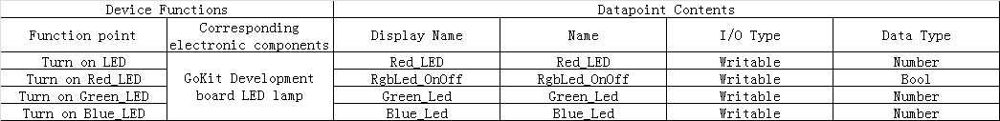

## 4. Create 4 Data Points
 

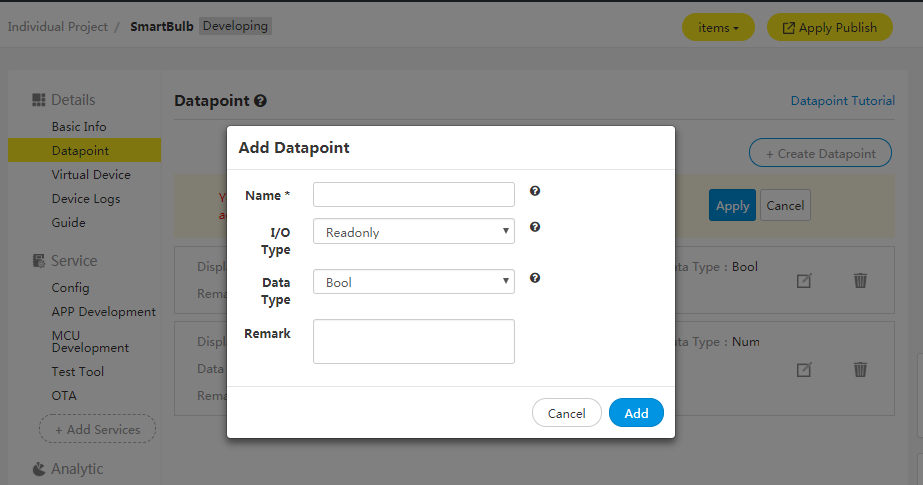

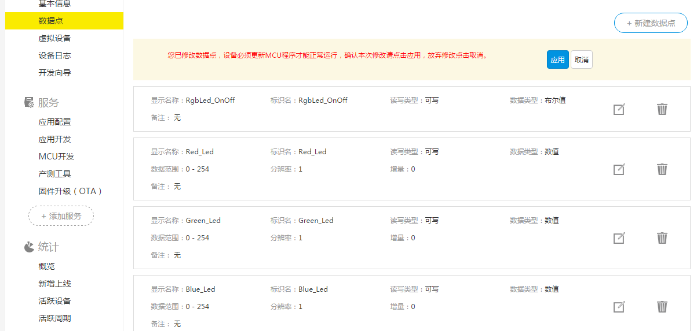 
 
## 5. Modify Data Points
 
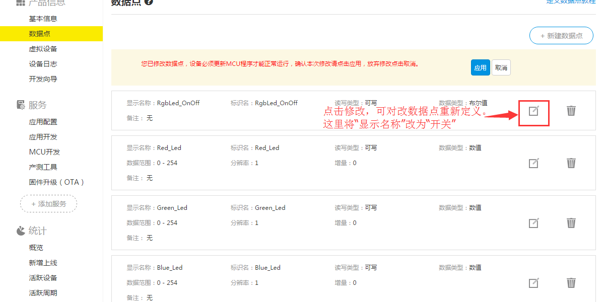

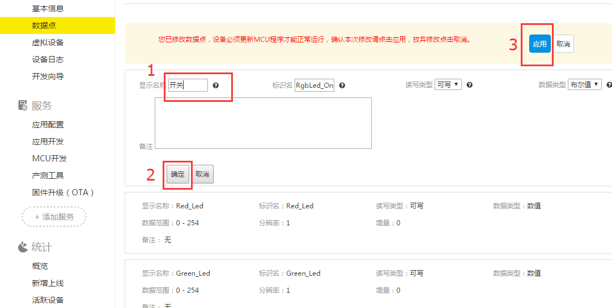

# MCU development for Smart Light

## 1. Generate MCU code automatically

The automatically generated MCU code implements the packet encapsulation and parsing of the Gizwits communication protocol, the conversion logic of sensor data and communication data. All of these functions are integrated into a simple API set. When the device receives data from the cloud or the App, the program converts the data into corresponding events and notifies the application layer. You only needs to add the sensor control function to the corresponding event handler to complete the product development.

Here choose the standalone MCU Scheme. In the hardware platform drop-down list, select STM32f103c8x.

Then Gizwits IoT Cloud will generate the device-side project code for STM32f103c8x.

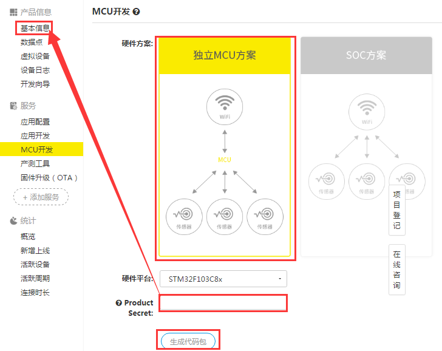

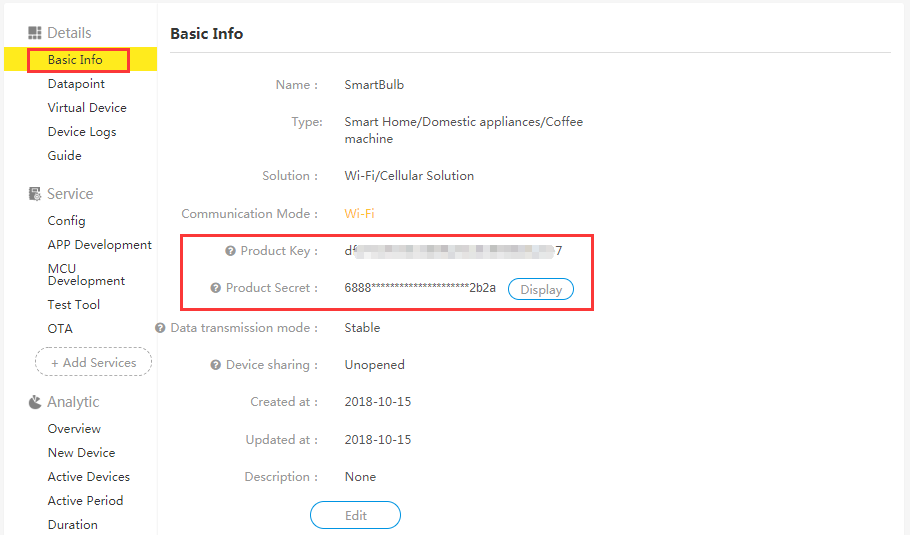

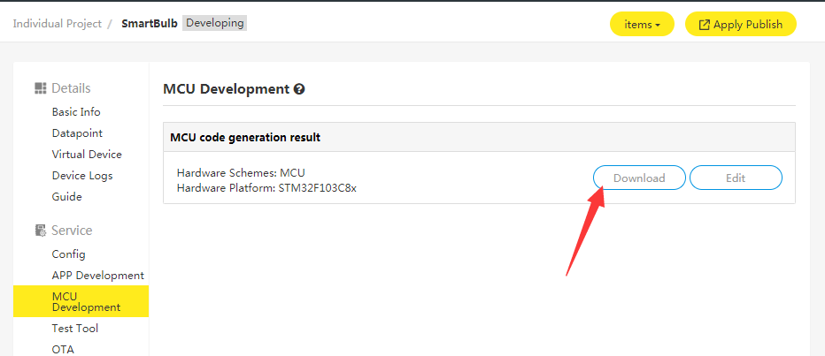

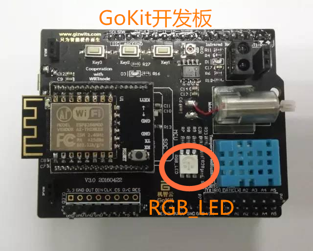 

## 2. Directory structure of MCU code 

As shown in the figure below, the files with comments in black text to the right are for the STM32f103cx8 hardware platform development. The files with comments in green text are for connecting Gizwits IoT Cloud and hardware drivers, such as the serial port driver, the timer driver, the key driver. Developers can write hardware actions directly in gizwits_product.c and gizwits_product.h.

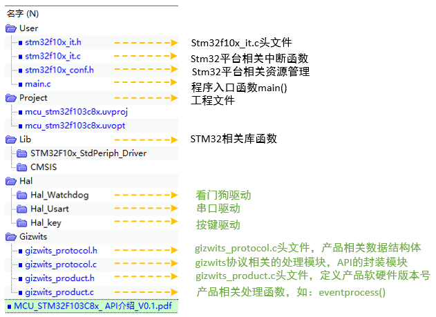

The following table is the description of key code files.
 
File |	Description
---|---
gizwits_product.c	|This file contains product-related processing functions, like gizEventProcess(), and platform-related hardware initialization, such as serial ports, timers, etc.
gizwits_product.h	|This file is the header file of gizwits_product.c, which contains product-related macro definitions such as HARDWARE_VERSION, SOFTWARE_VERSION.
gizwits_protocol.c	|This file is for function definitions of the SDK API.
gizwits_protocol.h	|This file is the header file of gizwits_protocol.c, which contains the function declarations of the SDK API.

The following table is the introduction to the SDK API.

API |	Description
---|---
void gizwitsInit(void)	|The Gizwits protocol initialization API. Users can call this API to complete the protocol-related initialization (including protocol-related timers and serial port initialization).
void gizwitsSetMode(unit8_t mode)	|The parameter mode[in] only accepts 0, 1, and 2 and other input is invalid. When the parameter is set to 0, the module will load manufacture defaults. When the parameter is set to 1, the module will enter SoftAP mode. When the parameter is set to 2, the module will enter AirLink mode.
void gizwitsHandle(dataPoint_t *dataPoint)	|Parameter dataPoint[in] is for Data Points. This function is responsible of processing the protocol data relating to data reporting. 
int8_t gizwitsEventProcess(eventInfo_t *info,uint8_t *data,uint32_t len)	|The user data processing function, handling Wi-Fi status update events and control-type events. Parameter info[in] is for the event queue. Parameter data[in] is for the data. Parameters len [in] is the data length. a) The Wi-Fi status update events start with WIFI_. The parameter data is only valid for WIFI_RSSI, whose value is RSSI, the type is uint8_t, and the range is 0~7. b) The control-type events are related to the Data Points. This version of the SDK will print the relevant event information and users only need to perform the specific execution of the control-type protocol.

## 3. Development process 

### 3.1 Main program

Location：main() function in main.c

 
Description:

Function |	Description
---|---
SystemInit()	|Platform related hardware initialization. It is not a MCU SDK API. The function name may differ on different platforms.
userInit()	|User related initialization, such as peripheral initialization, serial port initialization for print. It is not a MCU SDK API. The function name may differ on different platforms. 
gizwitsInit()	|Platform and protocol initialization, such as user timer initialization, serial port initialization for communication. It is a MCU SDK API.
userHandle()	|Callback function for user events. Users can customize the events in this function to complete the corresponding protocol processing. It is not a MCU SDK API. The function name may differ on different platforms.
gizwitsHandle()	|Protocol related main function. It is a MCU SDK API.

### 3.2 Port RGB_LED driver

From the MCU code directory structure, there is no RGB_LED driver in the automatically generated MCU code. We can go to the Download Center of Gizwits Developer Center to download other projects containing the RGB_LED driver and port the driver to your own project. Take the WeChat Pet House RGB_LED driver as an example as following.
 

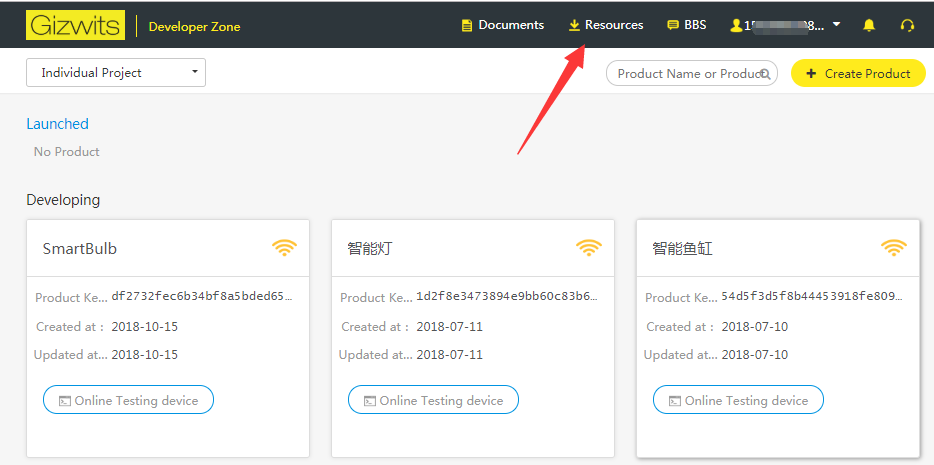

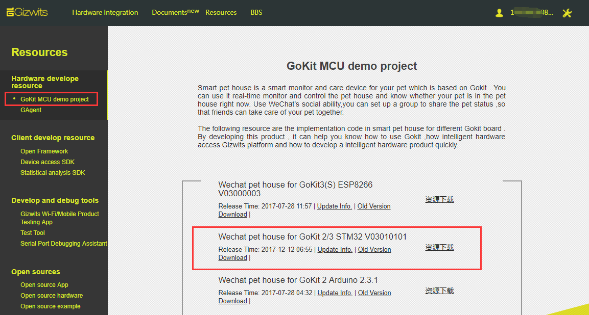
 
Unpack the WeChat Pet House project package we just downloaded, and go into the following directory. You can see that there is a Hal_rgb_led driver folder. Copy the folder to your own auto-generated MCU driver directory.
 
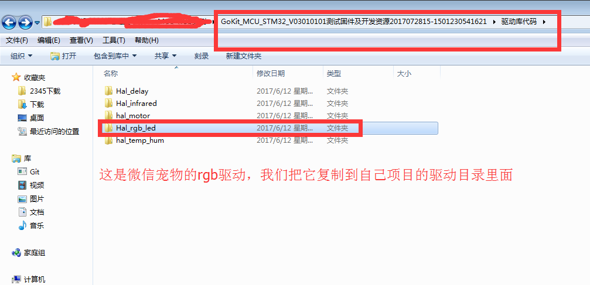

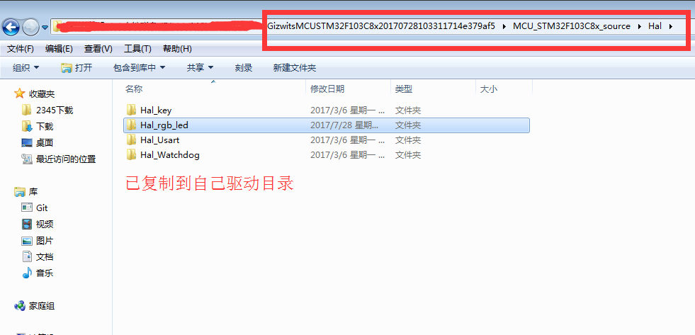

Go back to your own MCU code project and add the rgb_led driver file to the driver directory.
 

Add #include "Hal_rgb_led/Hal_rgb_led.h" to main.c and gizwits_product.c
 

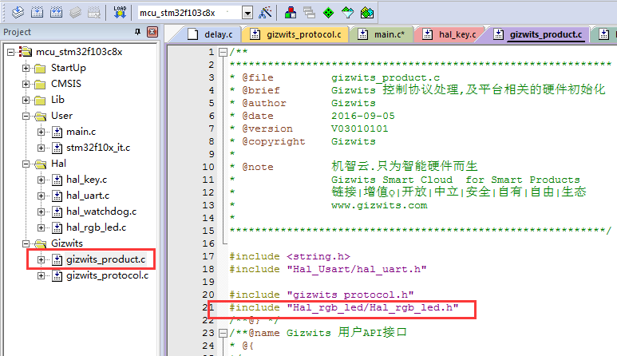

### 3.3 User initialization

Location: userInit() function in main.c

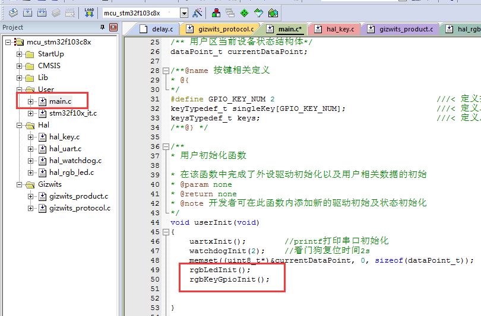
 
### 3.4 Wi-Fi module reset/connection

The device needs to enter the configuration mode to be connected to the network and communicate with the cloud. In the project, the MCU SDK is triggered through pressing the keys to enter the corresponding configuration mode. Here, we choose to make the module enter the AirLink mode and the LED will light up.

A. Enter SoftAP mode: short press on key2.

B. Enter AirLink mode: long press on key2. The blue LED will light up.

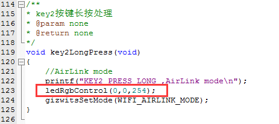

C. Reset module: long press on key1.

 
### 3.5 Process control-type protocol from the Cloud/App

The following figure is the flowchart of function calls related to control-type protocol.
 
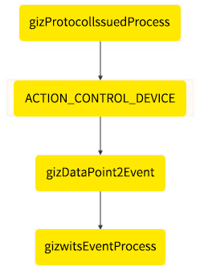

Function |	Description
---|---
protocolIssuedProcess	|The function is called by gizwitsHandle, receiving the protocol data issued from the Cloud or App side. It can be ignored as it is handled by the MCU SDK.
ACTION_CONTROL_DEVICE	|Process the control-type protocol. It is handled by the MCU SDK. Developers can refer to its code for further understanding. 
gizDataPoint2Event	|Generate the control-type events according to the protocol and perform data type conversion. It is handled by the MCU SDK. Developers can refer to its code for further understanding. 
gizwitsEventProcess	|Handle the generated control-type events including the corresponding driver function implementation. It needs to be implemented by developers.

The related code location: gizwitsEventProcess() function in …\Gizwits\gizwits_product.c 

Description: Handle the events for writeable peripherals.

Sample code:

 
### 3.6 Report device states

The following figure is the flowchart of function calls related to reporting device states.

 

Function	| Description
---|---
userHandle	|Get the data to be reported from the user area. It need to be implemented by developers.
gizCheckReport	|Determine whether to report the current status data. It can be ignored as it is handled by the MCU SDK.
gizDataPoints2ReportData	|Complete the conversion of user area data to the data to be reported. It can be ignored as it is handled by the MCU SDK.
gizReportData	|Send the converted data to the Wi-Fi module through the serial port. It can be ignored as it is handled by the MCU SDK.

The related coce location: userHandle() function in …\User\main.c

Description: This function gets the data to be reported from the user area. Developers only need to read and assign the data to the current device state data structure in the user area. Then the data structure is reported to the cloud through the gizwitsHandle, and developers does not need to pay attention to the device’s state changes as well as its periodic report.

### 3.7 Compile and download the firmware to the main control board of Gokit3 

# Debug

## 1. Install Gizwits Debugging App

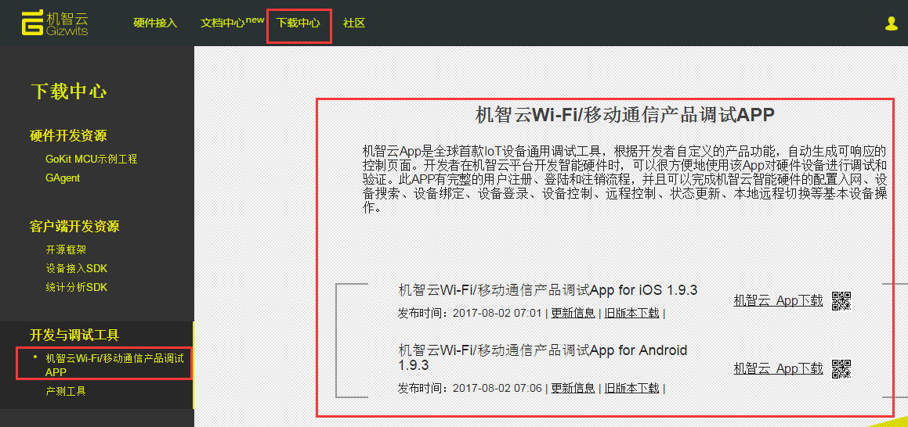 

## 2. Launch Gizwits Debugging App, sign up and login

 
 
## 3. Configure network access for Wi-Fi module
 
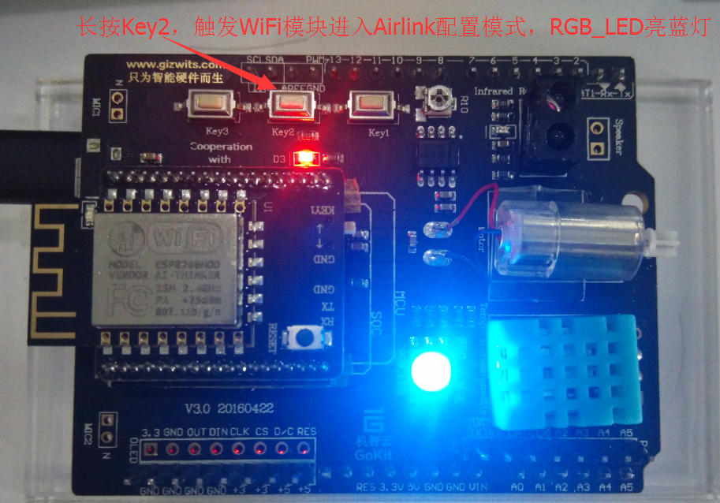 

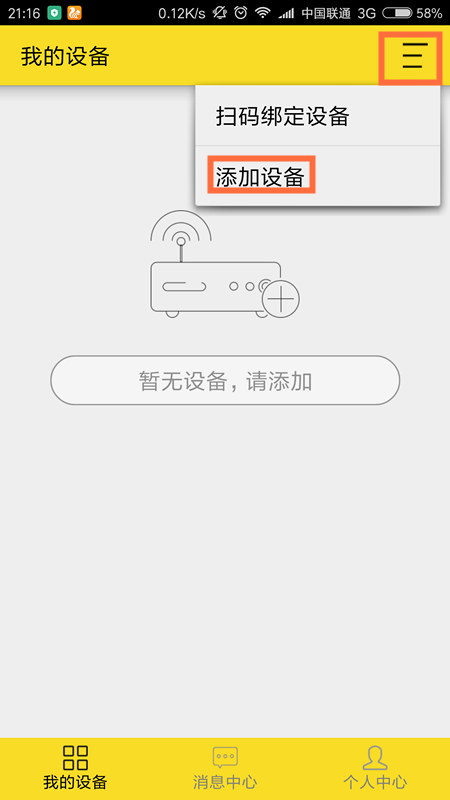 

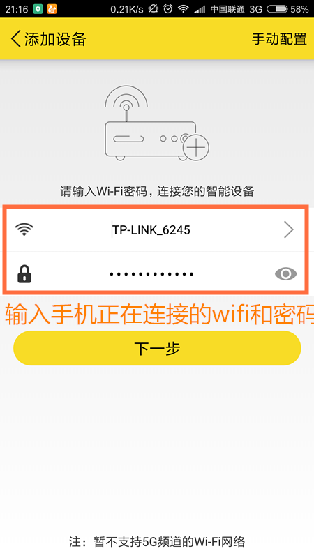 
 
## 4. Select the device in App

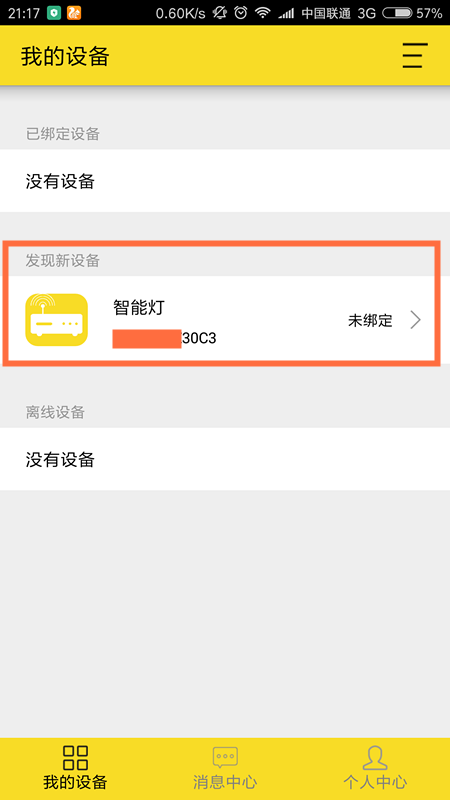 

## 5. Send and receive device data in App

 
 
## 6. Check communication log in Gizwits IoT Cloud

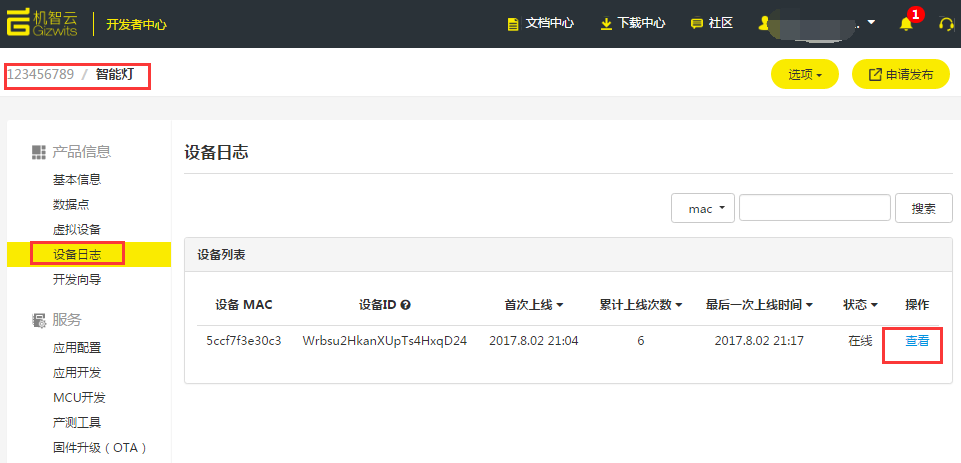 

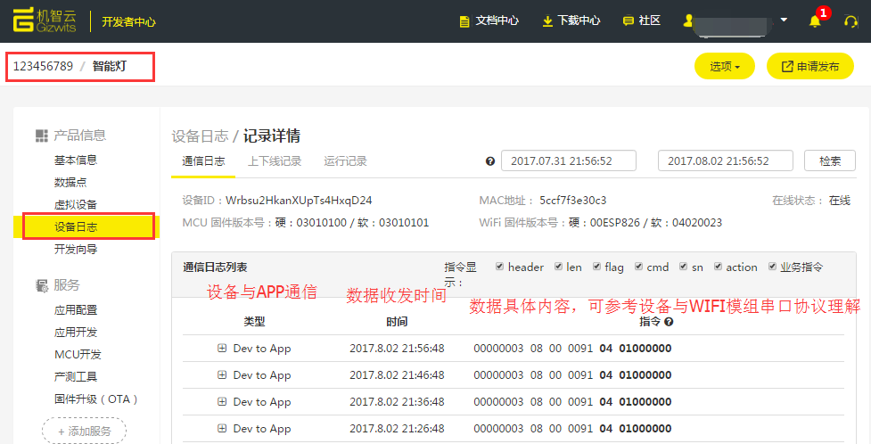 
 
# Product release 

After the product is deployed in the production environment, Gizwits will allocate a separate cloud operating environment for your devices for free, keeping your devices connected for 24/7. You will enjoy more free value-added services provided by Gizwits, including statistical analysis for your smart devices, data presentation and various meticulous technical support services.

How to request for the product release? The specific steps are as follows:

1. Go to the product details page. Click the Request for Release button next to the product name.

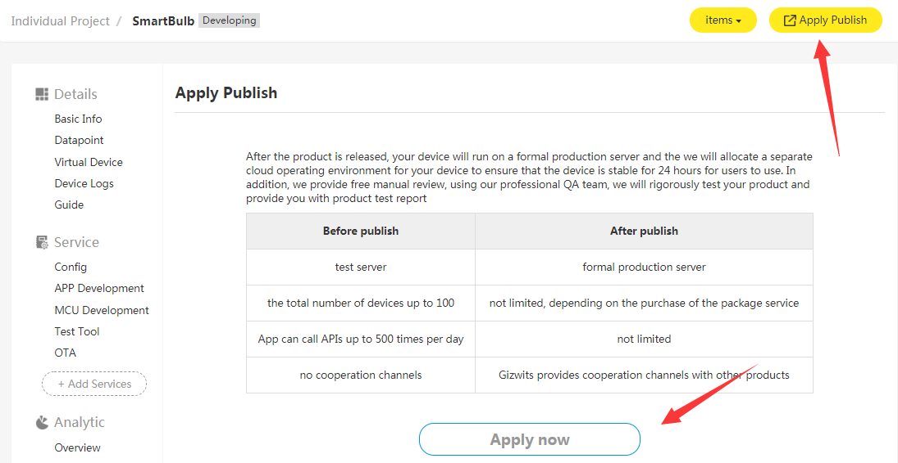 
 
2. Click Apply Now button. Fill out the application form as is.

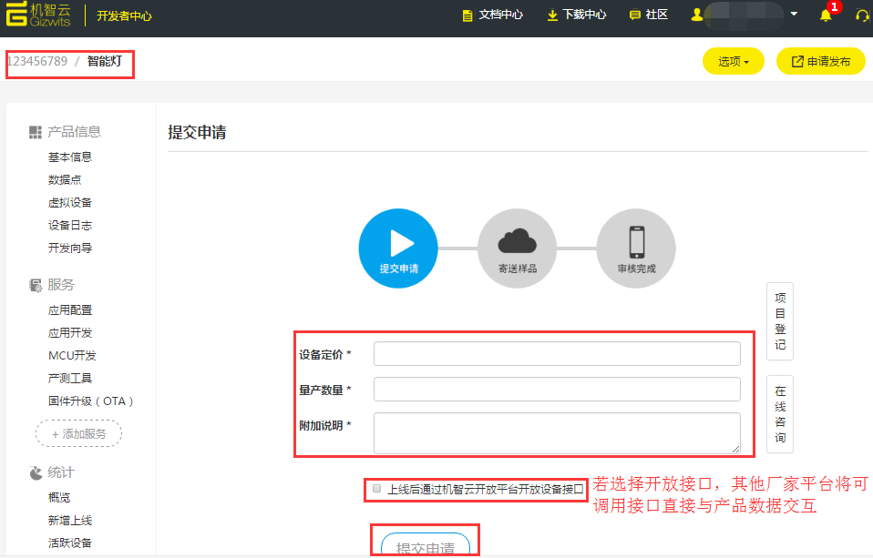 

3. Click the Submit button to jump to the submission success page. Gizwits will provide you with manual review and strict testing for free. After the approval by Gizwits, the back-end server support will be provided free of charge according to the mass production plan you submitted.

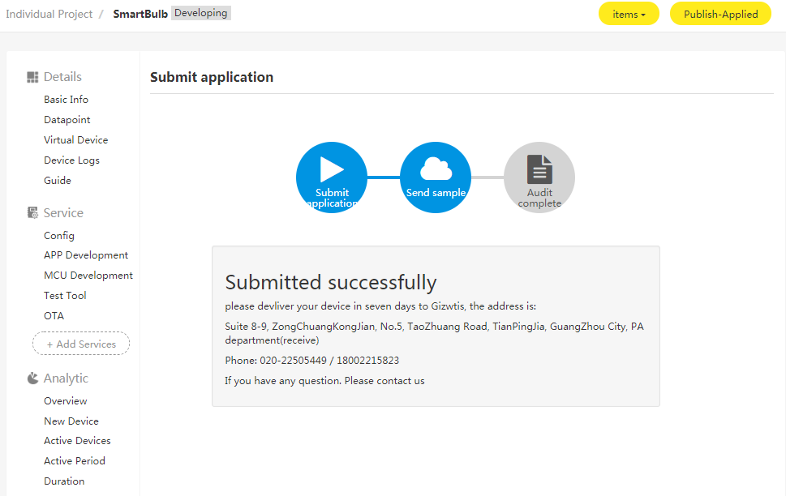 
 
# End-of-line test

End-of-line test is an important part of the production process to assure the product quality and enhance the product image. The Gizwits End-of-line test tool provides a convenient and quick module and MCU testing method for mass-produced products, which ensures that the modules and MCUs can be used normally. Your product must be deployed first before using the End-of-line test tool. The product creator can ask Gizwits for release. Gizwits will provide you with manual review and rigorous testing for free. For details, click here.
