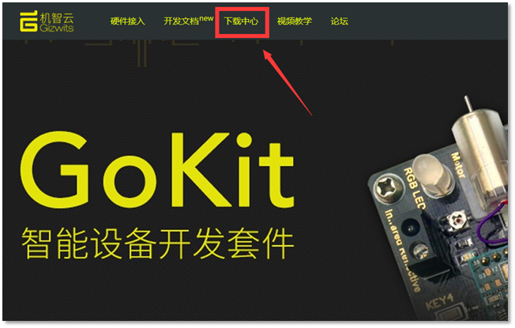
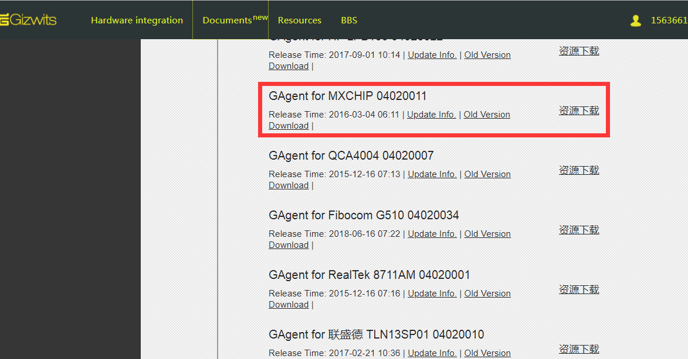
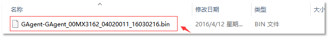
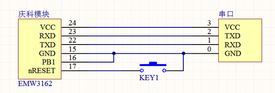
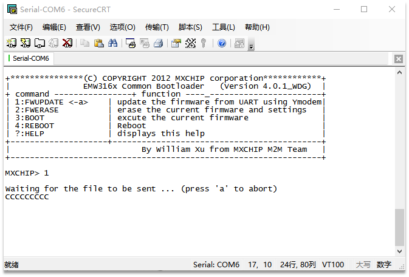
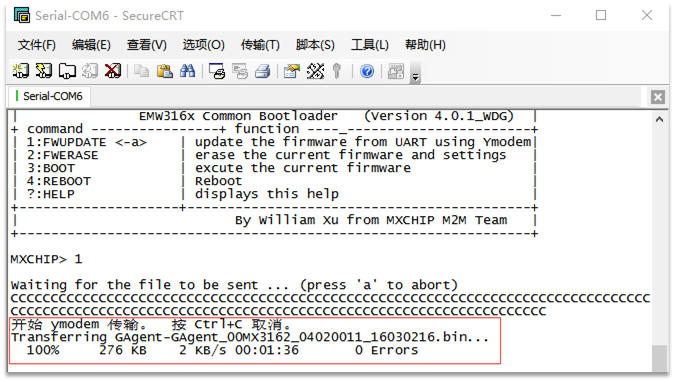

title: Firmware downloading for MXCHIP via serial port
---

# Overview

This document describes how to perform firmware downloading on MXCHIP module via serial port. When downloading firmware for the module, please follow the steps below, otherwise an unknown error will occur.

# Procedure

## 1. Download the firmware package for MXCHIP

 
## 2. Confirm the downloaded firmware file

The file that has a bin extension is what we need.

## 3. Connect the module to PC

Connect the MXCHIP module to a USB-to-TTL converter according to the following schematic. Note that pin PB1 needs to be set to LOW as an input. Here it is connected to ground directly. KEY1 is used for the external reset function.

## 4. Configuration of the firmware download tool

### 4.1 Confirm serial port parameters

After connecting the above USB-to-TTL converter to the PC, you can see the corresponding COM port through the "My Computer" -> "Administration" -> "Device Manager" -> "Port (COM and LPT)".

 
### 4.2 Download the serial port tool SecureCRT

Download it here: http://pan.baidu.com/s/1dECLxYD

Unzip the package and start SecureCRT. Clicking Quick Connection will bring up the serial port configuration dialog.

 
Select Serial for the Protocol. Set the Port to the COM above, Baud rate to 115200, Data bit to 8, Stop bit to 1, Parity to None, and finally click Connect.

## 5. Firmware downloading

### 5.1 Enter flash mode

Step 1. After the MXCHIP module is connected to your PC, reset the MXCHIP module (Press the KEY1 shown in the schematic of section 3 and release it) or power on the module again.

Step 2: If the following message appears in the SecureCRT workspace, it indicates that the module enters the flash mode. If it is displayed as mojibake, reopen Quick Connection to configure the serial port settings or restart SecureCRT. If the following information does not appear, please confirm that the device is connected correctly.

### 5.2 Flash firmware

Step 1. Type 1 and press Enter key.

Step 2: When the window prints "CCC...." continuously, select "Transfer" -> "Send Xmode(N)" in the menu bar, and choose the firmware file downloaded in section 2, then click Send.

After waiting for a while, it will display the above message which indicates that the firmware downloading is successful.
