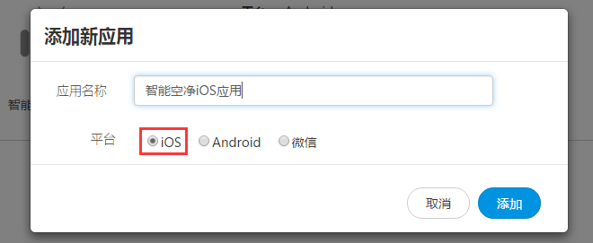
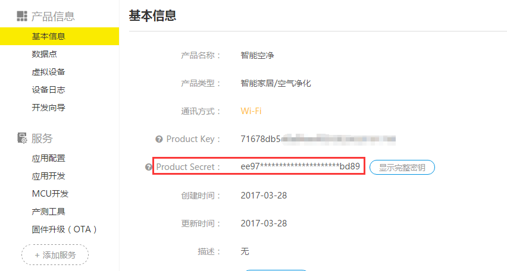
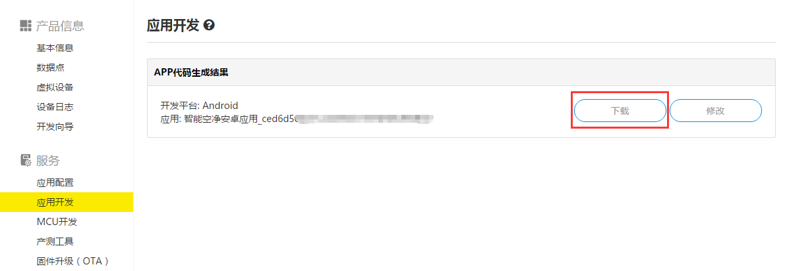
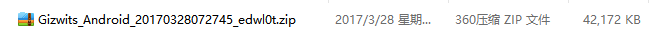

title: Gizwits App Code Auto-Generator
---

# Overview

In order to lower the barrier for the development of smart hardware App and reduce the investment in development resources, Gizwits has further developed the App open source code that implements the complete functions based on the Gizwits App Framework. After creating corresponding Data Points on the product project, Gizwits IoT Cloud generates an App reference code of the corresponding product according to the defined Data Points.

The automatically generated App code modularly integrates the necessary functions of a smart hardware App, mainly including:

1. User module: user registration, password recovery, third party anthentication (Wechat, QQ)
2. Network access configuration (Arilink+SoftAP)
3. Device discovery and list
4. Device control
5. Push notification: After the device raises the alarm, the alarm information is pushed to the App. The main push platforms we use are Jiguang Push and Baidu Push.

After developers download the source code, they only need to optimize the UI and design the control logic and device control interface. The control page of the source code implements the standard flow of device control using Gizwits App SDK. During the secondary development of the App, you only need to optimize related code according to the process to complete the control App of your own product.

Gizwits App Code Auto-Generator currently supports Andriod, iOS, and APICloud.

# User Guide

## 1. Create an application

1.1. After creating the product and Data Points in the Gizwits Developer Center, choose “Application Configuration”.

Note that the naming of Data Points cannot be a common programming language keywords, such as switch, static, enum, native, etc. Otherwise, the generated code will be incorrect!

1.2. Choose “New Application” on the Application Configuration page

1.3. Create an Android application and an iOS application separately.

 
 
## 2. Generate code

2.1. Check the product secret and copy it to the clipboard.

2.2. Click “Application Development”, select the Android application you just created, paste the product secret you copied, and click “Generate Code Package”.

2.3. After a while, you can download the source code.

2.4. The downloaded source code is a compressed file. After decompression, you can see the related source code.

2.5. For the guide to the source code, please refer to the appendix "source code explanation" after decompression!

# See Also

See [Gizwits App Code Auto-Generator](http://docs.gizwits.com/en-us/AppDev/AppCodeAutoGenerator.html) to learn about the functionality of the automatically generated App code.

See "Gizwits App Framework" to grasp

* [Gizwits App Framework for iOS](http://docs.gizwits.com/en-us/AppDev/iOSFramework.html)
* [Push notification integration for iOS App](http://docs.gizwits.com/en-us/AppDev/iOSPushNotification.html)
* [Third-party authentication and re-skin for iOS App](http://docs.gizwits.com/en-us/AppDev/iOSAuthReSkin.html)
* [Quick start with iOS App development](http://docs.gizwits.com/en-us/AppDev/iOSDevQuickStart.html)
* [Gizwits App Framework for Android](http://docs.gizwits.com/en-us/AppDev/AndroidFramework.html)
* [Push notification integration for Android App](http://docs.gizwits.com/en-us/AppDev/AndroidPushNotification.html)
* [Third-party authentication and re-skin for Android](http://docs.gizwits.com/en-us/AppDev/AndroidAuthReSkin.html)
* [Quick start with Android App development](http://docs.gizwits.com/en-us/AppDev/AndroidDevQuickStart.html)
* [Gizwits App Framework for APICloud](http://docs.gizwits.com/en-us/AppDev/APICloudFramework.html)

See "App Development SDK" to develop your IoT App

* [Gizwits App SDK for Android](http://docs.gizwits.com/en-us/AppDev/AndroidSDKA2.html)
* [Gizwits App SDK for iOS](http://docs.gizwits.com/en-us/AppDev/iOSSDKA2.html)
* [Gizwits App SDK for APICloud](http://docs.gizwits.com/en-us/AppDev/APICloudSDK.html)
* [Data transparent transmission](http://docs.gizwits.com/en-us/AppDev/TransparentTransmission.html)
* [Get Gizwits App SDK debug log](http://docs.gizwits.com/en-us/AppDev/SDKLogCapture.html)
* [SDK error codes](http://docs.gizwits.com/en-us/AppDev/SDKErrorCodes.html)

More application development guides

* [FAQ of mobile application development](http://docs.gizwits.com/en-us/AppDev/AppDevFAQ.html)
* [Gizwits Device Sharing](http://docs.gizwits.com/en-us/AppDev/DeviceSharing.html)
* [Set up third-party authentication with the provider of choice](http://docs.gizwits.com/en-us/AppDev/ThirdpartyAuth.html)
