title: Gizwits D3 Engine tutorial
---

# Overview

## Who can use Gizwits D3 Engine?
 
Gizwits enterprise developers, who purchased the GDCS service pack.

## What is Gizwits D3 Engine?

D3 Engine is short for Dynamic Data Director Engine. 

Gizwits D3 Engine is a development engine for data processing. D3 Engine is able to flexibly define data input, consolidate device and user data with external third-party data, and support script parsing and custom data input to meet the data processing needs of different type developers. The main features are as follows:

1) Diverse data sources: support multiple custom data sources, third-party public data and even data input from your ERP system.

2) Powerful rules processing: Supports flexible multiple conditional combinations based on decision tree algorithms.

3) Flexible output: In addition to App push notification, Email, SMS and other services, it also support callback service and storage service. The storage services provides data services for various applications through data computing and open API services, reducing the development costs of various applications and performance risk in the face of massive data.

# Set up Gizwits D3 Engine

Target users: Enterprise developers

Step 1: Log in to the Gizwits [Developer Center]:https://dev.gizwits.com/en/developer/, go to the product that needs to use D3 Engine. If you have any questions, please send an email to club@gizwits.com;

Step 2: Click [Add Service], go to the [Add Service] page and find [D3 Engine];

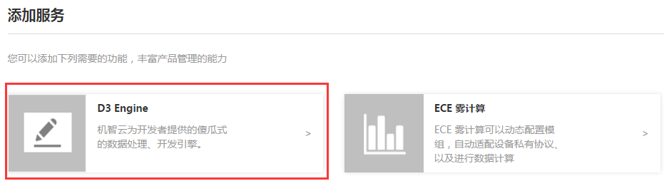 

Step 3: Choose D3 Engine and click [Apply] button to wait for Gizwits to verify your request;

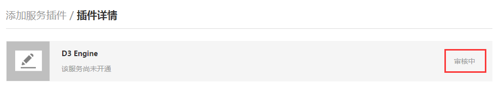  

Step 4: After the verification passes, you can see the D3 Engine in the service list; click [D3 Engine] to use it.

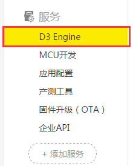 
 
# Gizwits D3 Engine usage 

## 1. Project list

Go to the D3 Engine page and the project list page for this product is shown by default.

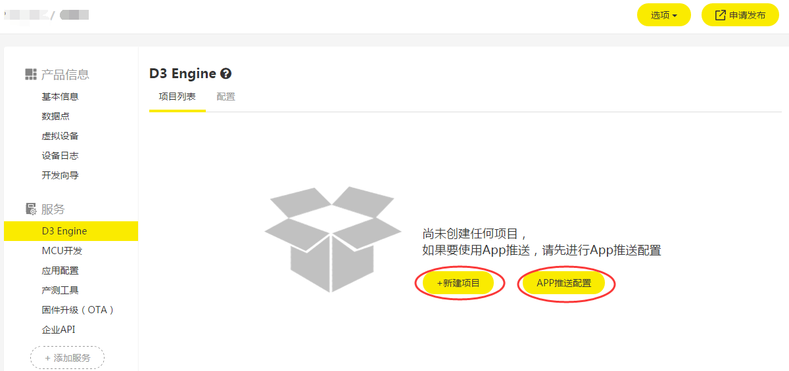  

When the project list is empty, the page displays as shown above.

[New Project]: Click to show the New Project page.

[App Push Configuration]: Click to show the App Push Configuration page.
 
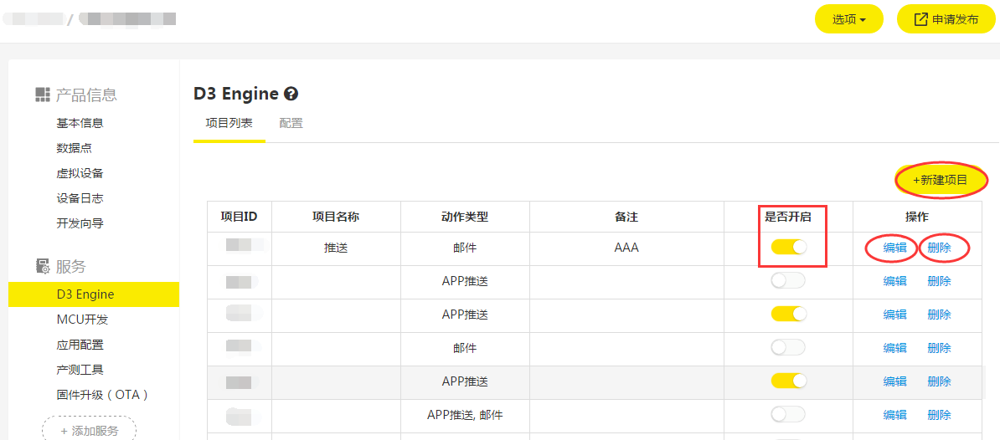  

When the project list is not empty, the page displays as shown above. This page shows all the projects created by the product (the projects created by interface calling are not included). The fields are Project ID, Project name, Action type, Comment, Enabled, and so on.

[New Project]: Click this button to show the New Project page to create a new project for the product;

[Edit]: Click to edit the project;

[Delete]: Click to delete the project;

[Enabled]: Whether the project is enabled. After the project is created successfully, it is enabled by default. The project will not be triggered after disabling it.

## 2. Configuration

Go to the D3 Engine page, the [Project List] page of this product appears by default. Then click [Configure] to show the App Push Configuration page.

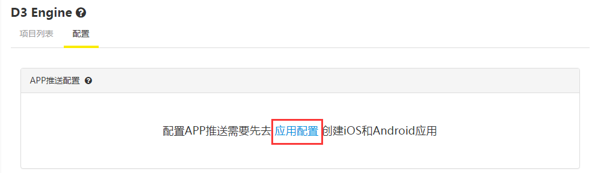  

When the current product has no binding application, the page displays as shown above.

[Application Configuration]: Click to jump to the application configuration page to create a new application.

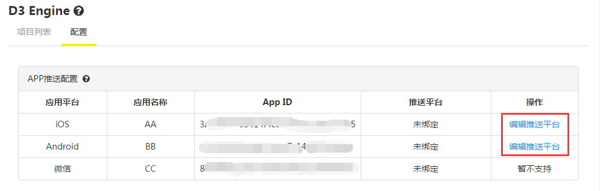  

When the current product has bound applications, the page displays as above figure, listing all the applications bound to the product.

Currently it supports push notification for iOS and Android App, while it does not support WeChat App.

[Configure Push Service]: Click to show the configuration page of the third party push notification service for your App.

## 3. Configure push notification service

This page can be used to bind Baidu push notification service or Jiguang push notification service to your App.

App platform: iOS or Android (set when creating the App and WeChat App is not supported).

Push platform: Currently only Baidu push notification service and Jiguang push notification service are supported.

Key and Secret: Key and Secret provided by Baidu push notification service or Jiguang push notification service.

Certificate type: production certificate or development certificate. For the iOS application, you must select the certificate type (and the corresponding certificate should be uploaded to Baidu or Jiguang push notification platform according to the selected certificate type). The Android application does not need a certificate.

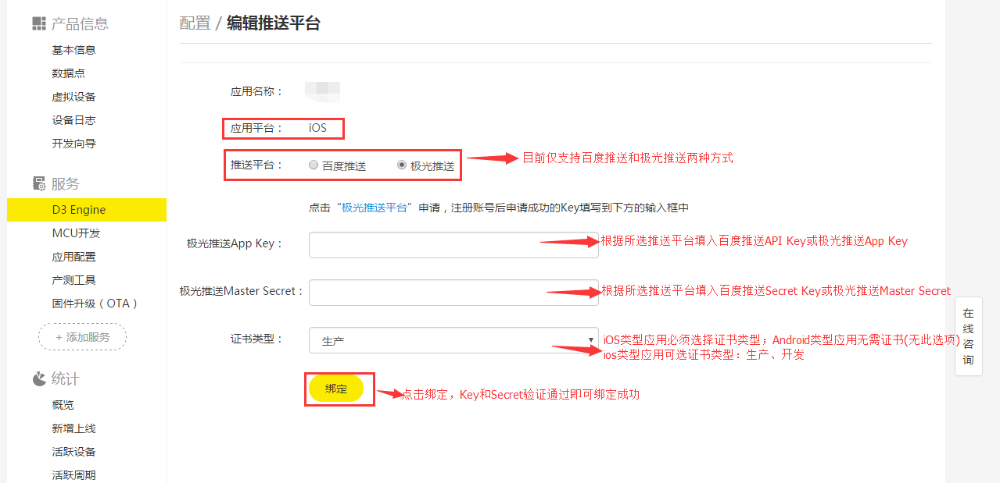  

After the successful input of API Key, Secret Key for Baidu push notification service or App Key and Master Key for Jiguang push notification service, it shows as follows:

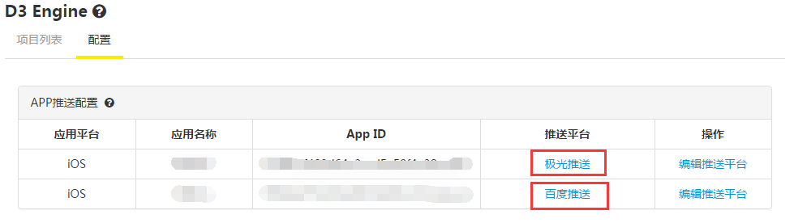  

You can click Configure Push Service again to perform unbinding or modification operation.

## 4. Create/Edit project

[Go back]: Click this button to return to the project list page;

[Save]: Click to save the currently edited project (there will be an error when unable to save);

[Toolbox]: The project components, different types of nodes. You can drag and drop them to the right blank area. There are three types of nodes: input nodes, process nodes, action nodes;

[Editing area]: The project editing area. You can drag and drop nodes in the toolbox to this area to perform project creation and modification operations;

[Three icons in the bottom right corner]: They are used to zoom out/in and restore the page to default (only applies to the project editing area);

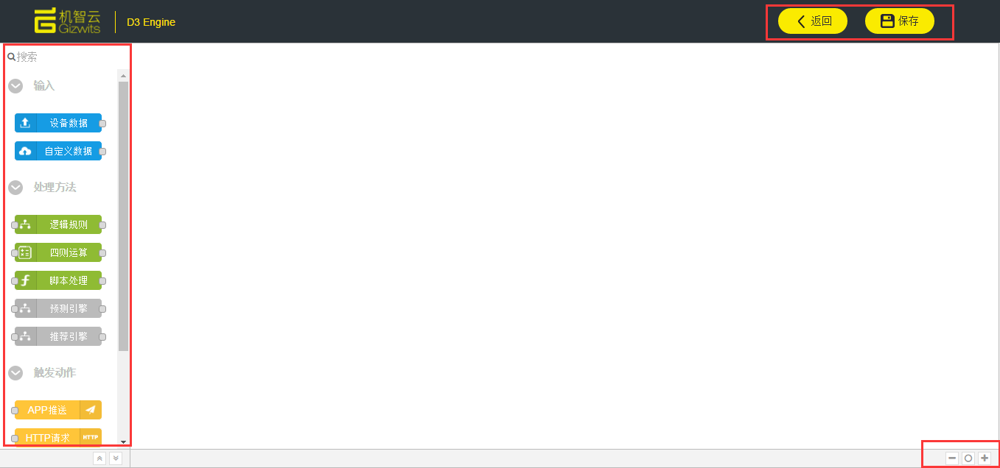 

## 5. Input nodes

### Device Data

Use the data of the device connected to Gizwits IoT Cloud as input. The device alarm or fault option is displayed in the dropdown list when there are created alarm or fault data points.

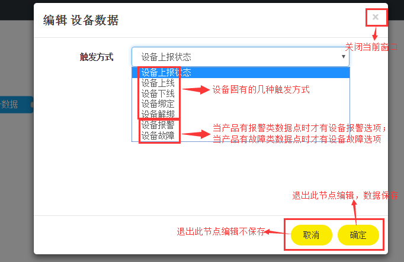  

### Custom Data

Use data in a custom JSON format as input.

 

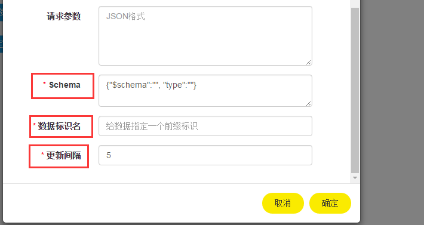 
 

Schema: Describes the structure of the fields contained within a JSON string. It can be generated by using the tool: http://jsonschema.net/

JSON identifier: Used to reference the response of the corresponding request.

Update interval: Set to no less than 5s. D3 Engine caches the custom data and reacquires it every update interval.

## 6. Process nodes

### Logical Rule

Add a logical rule. The comparison operators can be data points or custom variables.

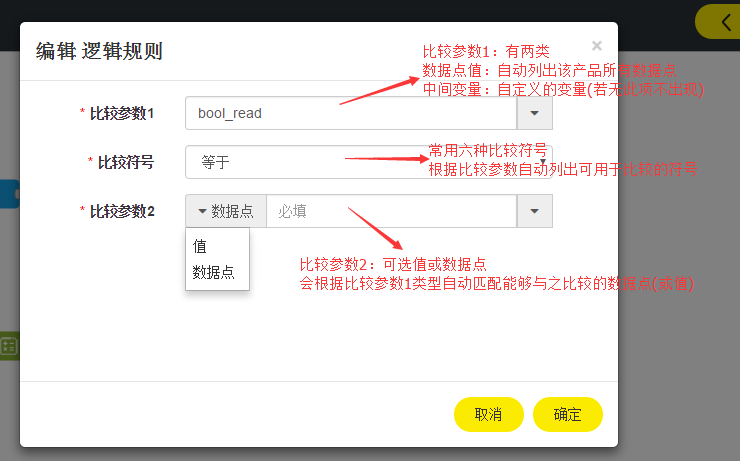  

### Arithmetic Rule

Add variables to an arithmetic expression. The arithmetic expression can only be performed on data points of numeric type. Please give the arithmetic expression an identifier (do not use Chinese).

 
 
## 7. Action nodes

### App Push

When a rule is triggered successfully, the App users bound to the device can be configured to receive a push notification.

Here you can define the title, content (variables can be used), application name and message type of the push notification as well as the time period in this node.

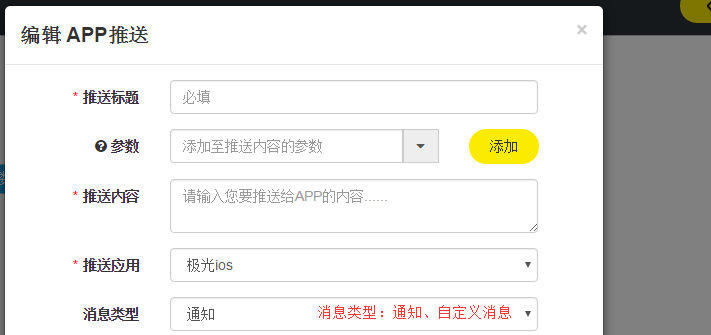 

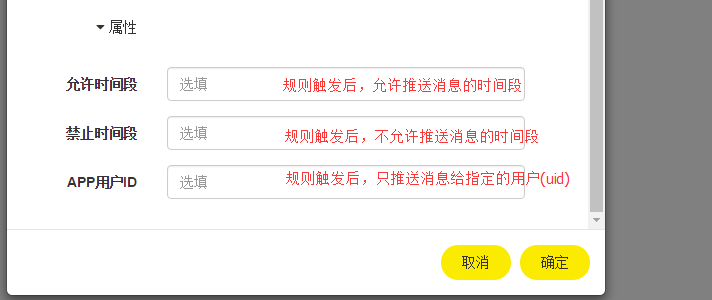  
 

### HTTP Request

When a rule is triggered successfully, HTTP requests can be sent to an API which is specified with the following parameters in this node.

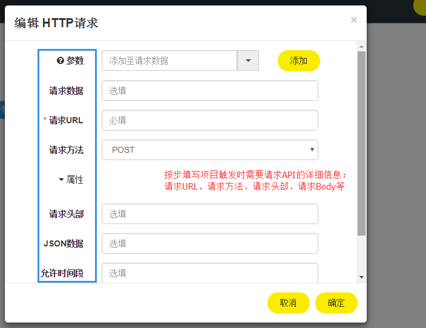  

### Email

When a rule is triggers successfully, the specified Email box will receive a push notification. The subject, content, and recipients of the message can be defined in this node.

  

### SMS 

When the rule is triggered successfully, the mobile phone of an App user bound to the device can be configured to receive a SMS message. You can choose to obtain the API Key and SMS template ID from the SMS service provider Yunpian to define this node. Besides, you can expand the property section of this page to customize the message reception time period.

 

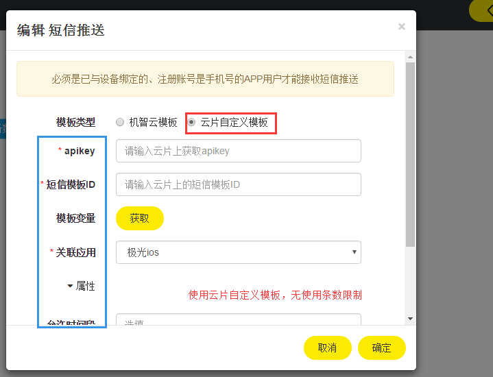  
 

### Control Device

When a rule is triggered successfully, a device can be configured to change its state. The content field is set in JSON format and supports both Raw and KV formats.

 

## 8. Examples

Product name: Air Purifier

Data Points:

* Air quality (air_quality): enumeration type, excellent, good, satisfactory, and polluted.
* Temperature (temperture) numerical type, -128~128
* Consumable 1(consumable1): numerical type, 0~100
* Consumable 2 (consumable1): numerical type, 0~100

### Example 1

Scenario: When the device comes online, push a notification to the App user and send an email to xxxx@126.com.

Step 1: Open the New Project page of the [Air Purifier] product.

Step 2: Drag the [Device Data] node to the project editing area.

  

Step 3: Double-click the [Device Data] node to edit, and click [OK] to save.

  

Step 4: Drag the [App Push] node to the project editing area.

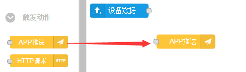  

Step 5: Double-click the [App Push] node to edit (define the parameters such as the title, content, time period, etc.), and click [OK] to save.

Step 6: Drag the [Email] node to the project editing area, and double-click to edit (define the sender, content, subject, etc.), and click [OK] to save.

Step 7: Link the three nodes together.

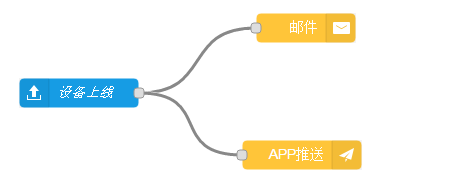  

Step 8: Click the [Save] button in the upper right corner and the project is created successfully.

### Example 2

Scenario: When the air quality is satisfactory and the average value of consumables 1 and consumables 2 is less than 30, push a notification to the App user.

Step 1: Drag the [Device Data] node to the project editing area.

  

Step 2: Double-click the [Device Data] node to edit. Select the Device data reporting for the Event type, and click [OK] to save.

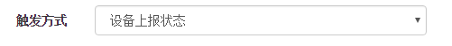  

Step 3: Drag the [Logical Rule] node to the project editing area.

Step 4: Double-click the [Logical Rule] node to edit, and click [OK] to save.

Go to the [Logical Rule] edit box. Set the first comparison operand to the Data Point(air quality). Set the comparison operator to Equal. Set the second comparison operand to the constant Satisfactory from the drop-down list, and click [OK] to save. 

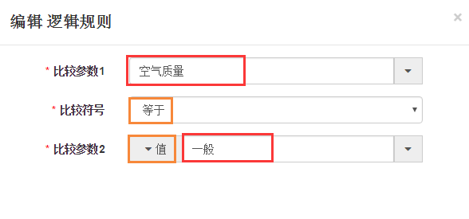  

Step 5: Drag the [Arithmetic Rule] node to the project editing area.

Step 6: Double-click the [Arithmetic Rule] node to edit, click [OK] to save.

This step defines an intermediate variable Avg = (Consumable 1 + Consumable 2)/2

For the [Arithmetic expression] field, follow the steps below:

1. Click the left parenthesis in the operator list.
2. Select "Consumables 1" from the [Parameters] drop-down list, and click Add.
3. Click the addition operator in the operator list.
4. Select "Consumables 2" from the [Parameters] drop-down list, and click Add.
5. Click the right parenthesis in the operator list.
6. Click the division operator in the operator list.
7. Enter the number 2.

Give the intermediate variable a name in [Variable Name] (for example, Avg).

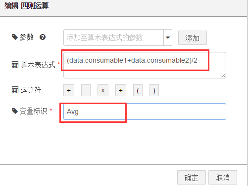  

Step 7: Drag another [Logical Rule] node to the project editing area. Double-click to edit, and click [OK] to save.

Go to the [Logical Rule] edit box. Set the first comparison operand to the intermediate variable (Avg) defined in the previous step. Set the comparison operator to less than. Set the second comparison operand to the constant 30, and click [OK] to save.

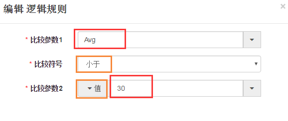  

Step 8: Drag the [App Push] node to the project editing area, double-click to edit, and click [OK] to save. 

Step 9: Link the five nodes together.

  

Step 10: Click [Save] button in the upper right corner and the project is created successfully.

