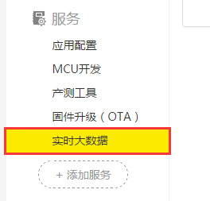
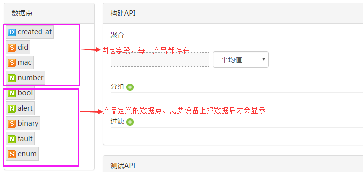
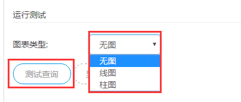
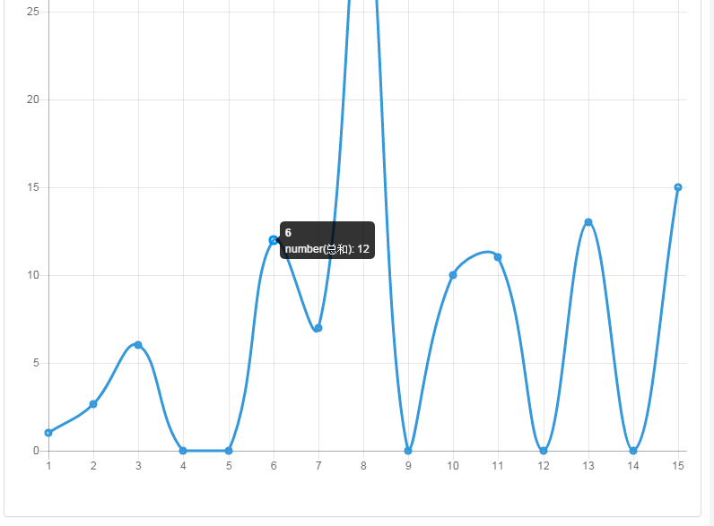
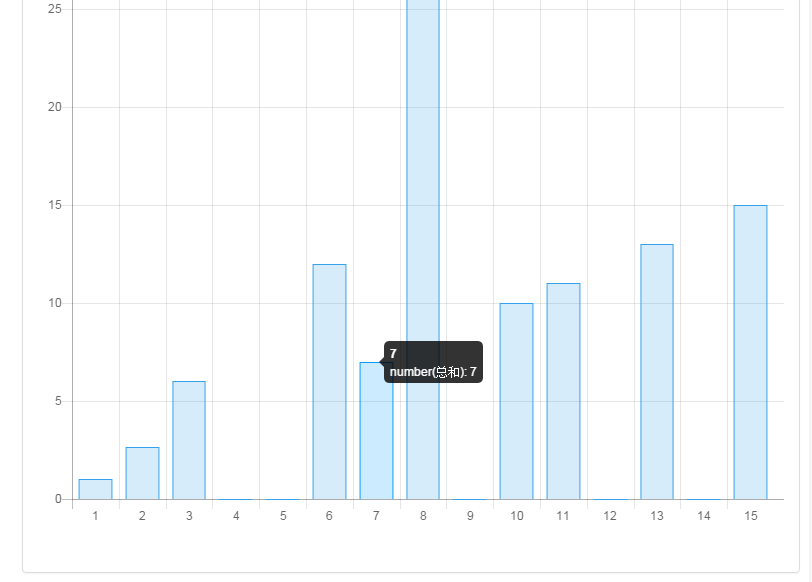
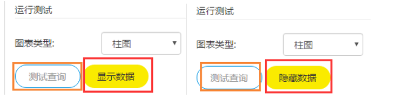
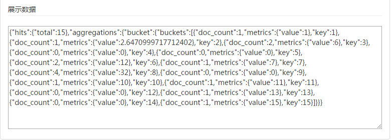
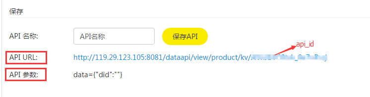

title: Gizwits Real-time Big Data Analytics tutorial
---

# Overview

## 1. Functionality

The Gizwits Real-time Big Data Analytics APIs are built by using a drag-and-drop approach, which is used to perform real-time big data analytics on product Data Points.

## 2. Set up Gizwits Real-time Big Data Analytics

Step 1: Log in to Gizwits Developer Center and go to the product that needs to use [Real-time Big Data Analytics] (Applies to Gizwits enterprise developers only);

Step 2: Click [Add Service], and find [Real-time Big Data Analytics];

  

Step 3: Click [Real-time Big Data Analytics], click the [Apply] button, and wait for Gizwits to verify your request;

  

Step 4: After the verification passes, you can see [Real-time Big Data Analytics] in the service list; click [Real-time Big Data Analytics] to use it.

 
 
# Build APIs of Real-time Big Data Analytics

## 1. API list

Go to the [Real-time Big Data Analytics] page and the API list page of the current product shows by default.

  

When the API list is empty as shown above, click [+New API] or [Create] to jump to the API builder page.

  

When the API list is not empty as shown above, it shows all the APIs created of the product, including API identifier, name, enabled, operations, and so on.

[+New API]: Click to jump to the API builder page;

[Enabled]: Whether the API is enabled. It is enabled by default after the API is successfully created. The API cannot be called after disabled (otherwise, it shows {"err_msg": "the viewid requested is disabled.","err_code":1006});

[Detail]: Click to jump to the API builder and test page to update;

[Delete]: Click to delete the API. It cannot be restored after deletion.

## 2. Data Point nodes

* Data Points support four data types: D (time stamp), S (character type), N (integer / float type), B (Boolean).
* created_at, did, mac are fixed fields, which apply to all products, and other fields are Data Points defined by yourself for the product.

  

When no data is reported by a device of the product, the Data Points defined by youself cannot be loaded except for the fixed fields.

 
 
## 3. Build API

(1) Aggregation API

Drag the Data Point nodes that participate in an aggregation operation into the aggregation input box, so as to calculate the average, minimum, maximum, and sum.

* Aggregation API only supports aggregation of one Data Point; 
* The Data Point of an aggregation API cannot be empty;
* Aggregation operation only supports the data types of N (integer/float) and B (Boolean).

  

(2) Grouping API

Drag the Data Point nodes that participate in a grouping operation into the group input box.

* Only one grouping field is supported, which can be empty;
* The grouping field can be any defined Data Point;
* The group type is subject to the type of the corresponding grouping field. The timestamp type grouping field only supports the time range grouping (hourly, daily, weekly, monthly), the integer type grouping field only supports the numeric range grouping (the minimum resolution value is 1), and the character and Boolean type grouping fields only support the grouping by a single value rather than a range;
* When testing the API, charts can be displayed only after a group is selected.

(3) Filtering API

Drag the Data Point nodes to be filtered to the filter input box.

* Support multiple conditions, which can be empty;
* The filtering field can be any defined Data Point;
* The operator type is subject to the data type of the filtering field. Character or Boolean type only supports Equal (=) operation;
* Constant values or expressions can be used to create a filter. The value can be empty; the expression is enclosed in ${}, where parameter values are passed in API calls.

## 4. Test API

(1) Run test with charts

After building the Aggregation API, Grouping API, and filtering API, select [Chart Type] and click [Test] button.

 
 

No chart: No chart displayed when the grouping field is empty.

Line chart: Line chart can be displayed only if a grouping filed is provided. The line chart is as follows:

  

Bar chart: Bar chart can be displayed only if a grouping filed is provided. The bar chart is as follows:

 
 

(2) Run test with data values

After building the Aggregation API, Grouping API, and filtering API, click [Test] button, and then click [Display Data] button.

Note: After changing API conditions, you must first click [Test], then click [Show Data] to display the updated result. [Display Data] button is only used to toggle data to be displayed or hidden.

 
 
Display data:

  

Hide data: Clicking [Hide Data] button will hide the box where data is displayed.

(3) Save

After the API is built and tested, you can save this API for the next direct call.

Type the API name (up to 32 characters) and click [Create API] to generate the API URL and API parameters. At this point, the API is created successfully. You can view this API in the API list as well as edit, enable, disable, or delete it.

  

# Call APIs of Real-time Big Data Analytics

## 1. Calling method

The APIs are invoked using HTTP GET.

The URL called is ‘http://119.29.123.105:8081/dataapi/view/product/kv/{api_id}'.

Where {api_id} is the API identifier, see the "API Identifier" column in the API list. Each API has a unique api_id. When a query requires input parameters, the input parameters are formatted in JSON and passed in the form of 'URL?data=JSON'.

 
 
## 2. Authorization headers

Name |	Value	| Description
---|---|---
X-Gizwits-ProductKey|	{product_key}|	Product Key 
X-Gizwits-Timestamp|	{timestamp_in_seconds}|	The current Unix Epoch timestamp, in seconds, but please note that the difference between the submitted timestamp and standard time must be within 10 minutes, otherwise the authorization will fail.
X-Gizwits-Signature|	{lower(MD5({product_secret} + X-Gizwits-Timestamp))}|	This value is the calculated signature. The algorithm is as follows: concatenate the lowercase of {product_secret} and {timestamp_in_seconds} into a single string, then calculate its MD5, which then is converted into a lowercase hexadecimal string, such as "71a78a1dd33df9e77d23a7f1171ab40", where {product_secret} is the product secrete value.

## 3. Calling frequency

Each product can call the APIs up to 10 times per minute (i.e., 10 requests/minute).

## 4. Sample

For example, the parameters of a API call are as follows:

* API identifier: AVi-5CkZNrnIcV85KPNd
* Product Key: 08f3e460b05b4500b9c3e698c6f241b8
* Product Secret: 2862c8c599fc47b2869aaf4c3efaf35e
* The current time is: August 8, 2016 10:05:07 (Beijing time)
* There is a query parameter mac with a value of c8934046a16d

  

