title: Guide to Gizwits ECE fog computing
---

# Overview

## 1. What is Gizwits ECE fog computing?

The Gizwits fog computing can be thought of as the computing on the device side, which empowers the cloud to meet some data process requirements that cannot be satisfied in the cloud. For example, a device is required to collect sensor data 50 times per second. It is impossible to transmit the data to the cloud in real time and then process it. Instead, it is more suitable for the device to perform necessary data process, transmit the processing result to the cloud, or directly convert the analysis result of the data into an action, which thereby improves the real-time performance.

The Gizwits ECE fog computing mainly integrates the device communication module with mobile phones by using the compiled language (C language) in combination with the scripting language (Lua script). The script is used to configure the adaptation policies in the cloud, which are then push to devices or mobile phones. After receiving the new adaptation policies, the device executes the adaptation policies immediately. The adaptation policy is responsible for the transport layer protocol adaptation, service layer protocol adaptation, and data process method.

## 2. Values

Gizwits ECE fog computing is able to reduce development costs and shorten development cycle.

* Scripts are configured in the cloud that will dynamically change module behaviors;
* Advance the ability of self-adaptation for data communication on various types of devices;
* Advance the automatic conversion capability of protocols for various types of devices;
* Advance the ability to implement and execute data process algorithms on the device side.

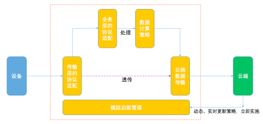 

## 3 Terms

### 3.1 ECE

ECE is the abbreviation of Edge Computing Engine, which means the edge computing engine.

### 3.2 PK

PK is the abbreviation of Product Key, which is the unique number of a product created in the Gizwits Developer Center. Each type of products shares the same Product Key.

### 3.3 Protocol script

A protocol script performs the conversion between the product custom protocol and the Gizwits protocol to facilitate devices to access Gizwits IoT Cloud easily.

### 3.4 Communication configuration

The communication configuration is used to set the communication parameters (baud rate, etc.) of serial communication.

### 3.5 Mini Application

A Mini Application is used to set the data communication method (packet format, encryption type, etc.), data processing (calculate the maximum/ minimum value, etc.), and the device behavior parameters (sampling frequency, heartbeat time, etc.).

### 3.6 Lua script

Lua is an embedded scripting language that is configurable and extensible.

# Scenarios

## 1. Target users

Gizwits ECE fog computing serves enterprise developers, while it is not open to individual developers.

## 2. Communication Configuration

Set the communication interface's parameters, such as serial port number, baud rate, data packet format, and verification type in order for the module and device to send and receive data normally.

### 2.1 Scenario description

Scenario 1: Baud rate conversion

Convert the original serial port number of a device from COM3 to COM4 through Lua script, and convert the baud rate from 9600 to 38400.

Go to the ECE fog computing service. In the [Communication Configuration], type the prepared script (as shown below, the device serial port number is converted from COM3 to COM4, the baud rate is converted from 9600 to 38400), and click [Push] , then set the push address.

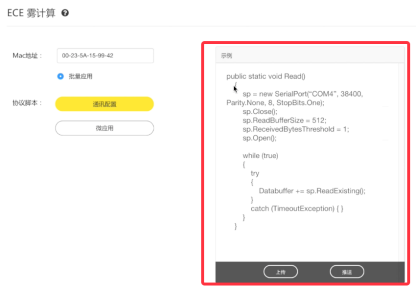  

At this point, we can see that when the program starts up (as shown below), the serial port number opened is COM3, and the baud rate is 9600. Then receive the message push from the cloud during the run. After receiving the message, the module will restart the serial port and open COM4 according to the set parameters, and its baud rate is 38400.

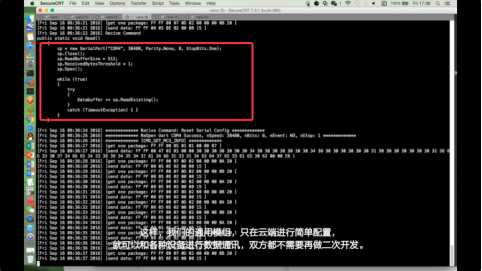  

In this way, Gizwits general-purpose modules can perform data communication with various devices only by simple configuration in the cloud, and neither side needs to do secondary development.

### 2.2 Process
 
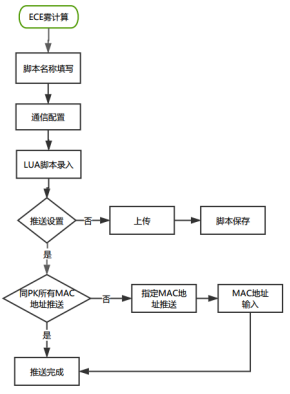 

Process description:

1. The Lua script of communication configuration provides users with a script sample header. You can add, modify, and clear the script. Currently, the script only keeps the latest version;
2. The communication configuration can dynamically change the communication parameters;
3. Upload: If you don't want to push the script after it is prepared, you can upload the script to the cloud. If you neither push nor upload the script, it script will not be saved. 
4. The communication configuration can only be push to modules with the specified MAC addresses or all MAC addresses of the specified PK. After clicking Push, the script will also be uploaded to the cloud for saving.

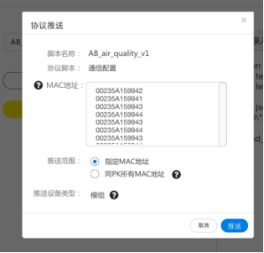 
 
## 3. Mini Application 

Mini Application refers to the format conversion of data acquired by the device, the behaviors of the device (e.g., setting the frequency at which the device collects the temperature) and the post-processing of the data (e.g., calculating the maximum, minimum, and average values of the temperature).

### 3.1 Scenario description

Scenario 1: Business layer protocol conversion

Convert the raw binary data collected by the device into a JSON string and then report it to the cloud.

Go to the ECE fog computing service. In the [Mini Application], type the protocol conversion script (as shown below), and then click [Push] to set the push address.

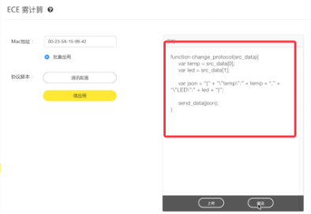  

You can see that the original binary data is output at first (as shown in the figure below). After receiving the script sent by the cloud, the module outputs the formatted JSON string.

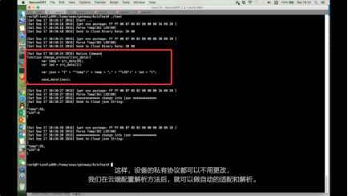  

In this way, you can continue using the device's proprietary protocol without modification. After the interpreting method is configured in the cloud, it can perform automatic adaptation and interpretation.


Scenario 2: Add a device behavior

When the temperature exceeds 70 degrees, turn on the red light to report an alarm.

Go to the ECE fog computing service. In the [Mini Application], type the action script (as shown below), and then click [Push] to set the push address.

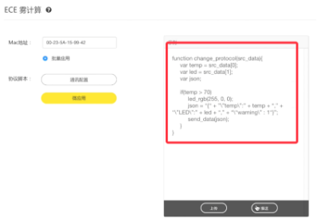  

From the log (as shown below), you can see that the module has received the script.

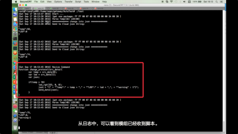  

At this point, we use a heat gun to heat the sensor (as shown below), you can see that after the temperature is more than 70 degrees, the device turn on the red light.

  

In this way, more features of the device can be easily added or changed later, without upgrading the firmware.


Scenario 3: Advanced data calculation

Let the device perform more efficient and complex data calculation, and convert the calculation result into JSON format and upload it to the cloud.
 
Assume that the temperature sampling frequency of the device defaults to once every 5 seconds. In order to get more sampling points, we set the new sampling frequency of the device to once every100 milliseconds. After 5 seconds, calculate the average, maximum, minimum and variance with the collected data and then report them to the cloud.

In both cases, the data is reported once every 5 seconds, but the latter is more data-worthy.

Go to the ECE fog computing service. In the [Mini Application], type the script of device behavior settings and data analysis (as shown below), and then click [Push] to set the push address.

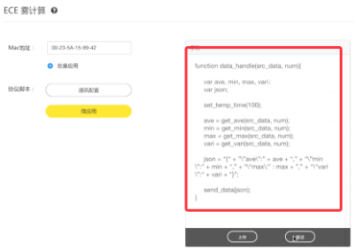  

You can see that the device collects the temperature once every 5 seconds (as shown in the figure below) and uploads it. After receiving the configuration script of the cloud, the device changes the temperature sampling frequency to once every 100 milliseconds, then calculates the result and reports it to the cloud.

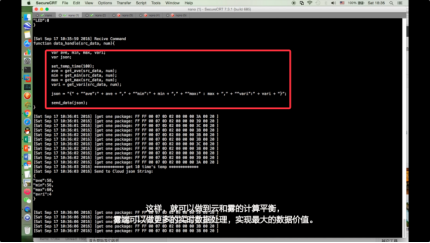  

In this way, the balance of cloud computing and fog computing can be achieved, and the fog end can do more real-time data processing to yield maximum data value.

### 3.2 Push process of Mini Application for module
 
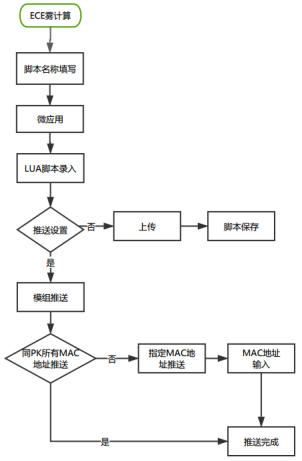 

Process description:

1. The Mini Application Lua script provides users with a script sample header. You can add, modify, and clear the script. Currently, the script only keeps the latest version;
2. Mini Applications can be used for automatic adaptation and interpretation of business layer protocols, adding or modifying device behaviors, and allowing devices to perform more efficient and complex data calculations;
3. Upload: If you don't want to push the script after it is prepared, you can upload the script to the cloud. If you neither push nor upload the script, it script will not be saved. 
4. The Mini Application can be push to modules or mobile phones;

The Mini Application can be push to modules with the specified MAC addresses or all MAC addresses of the specified PK. 
After clicking Push, the script will also be uploaded to the cloud for saving. 

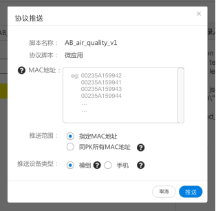 

### 3.3 Push process of Mini Application for mobile phone
 
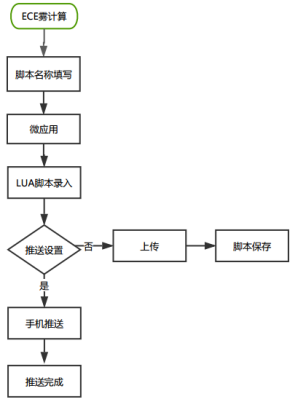 

Process description:

1. Same as [2.3.2 Push process of Mini Application for module] 1, 2, 3;
2. Mini Application can be push to modules or mobile phones:

* On a device, it can also be applied only to devices that are bound by the current mobile phone user under this Product_Key;
* If the push targets are mobile phones, neither the push range nor the MAC address is required;
* After clicking Push, the script will also be uploaded to the cloud for saving.

 
 
# Specification

## 1. Script name

The script name is required and user-defined, which can be up to 64 characters: [A-Z], [a-z], underscore (_), [0-9], and cannot start with a number. The script is unable to be push without a name that is used to:

* Help users to make a note of what the script is intended for when coming back to the ECE service page through the custom name.
* Serve as the file name when the script is pushed; 

Currently, only the latest version is saved for the script.

## 2. MAC address

You can input at least one MAC address, and up to 50. Also, note that you can only have one entry on each line for each MAC address. When the scroll bar is shown on the right, it allows you to scroll up and down to go through all MAC entries, which will be saved after push.

The MAC address input function supports copy, paste, and delete.

The MAC address can be up to 12 characters: [A-Z], [a-z], [0-9]. The input operation is as follows:

 

# Script template

After selecting an option for the protocol script types, the Lua script template is automatically generated. You should complete the script code below "--to do" rather than modify the script template itself.

## 1. Script template for Communication Configuration

The script template for Communication Configuration is as follows.

```
----------luaComInit----------
--to do

----------luaComInit end----------
```

Description: Set the parameters (Baud rate, etc.) of serial communication.

## 2. Script template for Mini Application

The script template for Mini Application is split into several modules, each of which has a specific module template, where the corresponding module implementation should be added below the "--to do". The following Mini Application modules are currently supported:

### 2.1 Initialization module

The script template for initialization module is as follows:

```
----------luaInit----------
--to do

----------luaInit end----------
```

Description: Initialize the Lua environment, such as the application memory size.

### 2.2 Common functions module

The script template for common functions module is as follows:

```
----------luaUtils----------
--to do

----------luaUtils end----------
```

Description: The common functions implemented by youself can be called by other Micro Application modules. If there is a function used by only one Mini Application module, put it in the corresponding module rather than in this module, otherwise it may cause other Mini Application modules to run out of memory and fail to execute.

### 2.3 App data handling module

The script template for App data handling module is as follows:

```
----------luaHandleDataFromApp----------
--to do

----------luaHandleDataFromApp end------
```

Description: Process the service data sent from App.

### 2.4 Device data handling module

The script template for device data handling module is as follows:

```
----------luaHandleDataFromDev----------
--to do

----------luaHandleDataFromDev end------
```

Description: Process the business data sent by the device.

# FAQ

## 1. Which wireless communication protocols does the ECE service support?

Currently supports Wi-Fi, Bluetooth, and GPRS products.


## 2. Can I see push history?

Push history is currently not supported. Each time the script upload or script push saves only the latest script. Push history will be available in the future.

## 3. Can the Lua script template be customized?

No, the script template is fixed and used to identify which script type it belongs to.


## 4. What should I do if the MAC address input is incorrect?

After you click Push button, the cloud will check the MAC addresses. If the MAC address input is incorrect, a pop-up window will prompt you. You only needs to go back to the push configuration page, where the wrong MAC addresses are highlighted in red font, and delete or update them.


## 5. Will the module or mobile phone provide feedback when it receives the Lua script successfully?

Currently the module or mobile phone cannot provide the feedback on whether it receives the Lua script successfully, while only gives feedback to the user on whether the push is successful.


## 6. Does it support the script file upload?

No, it does not support script file upload currently, which will be available in the future.

