title: Integration with Amazon Echo
---

# 1. Overview

This document describes how to connect Amazon Echo to Gizwits IoT Cloud and control Gokit devices.

## 1.1 Integration process

Collaboration diagram:

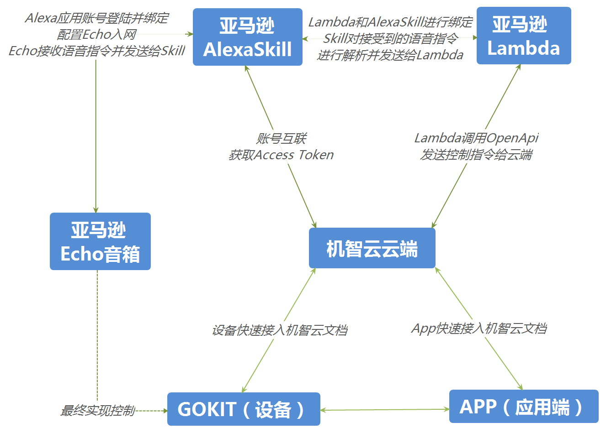  
 

* Gizwits IoT Cloud: Gizwits IoT Cloud exposes a significant range of functionality via Gizwits Open API, which provides enterprise and individual developers with services such as fast device onboarding, provisioning, authentication, configuration, remote monitoring, task scheduling, and advanced data analytics. 
* Alexa: Alexa is Amazon’s cloud-based voice service that provides a set of built-in capabilities, referred to as skills that enable customers to use voice to interact with devices in a more intuitive way. For example, Alexa's abilities include playing music from multiple providers, answering questions, providing weather forecasts, and querying Wikipedia. 
* Alexa Skill: The Alexa Skills is a collection of self-service APIs, tools, documentation, and code samples that makes it fast and easy for you to add skills to Alexa. ASK enables designers, developers, and brands to build engaging skills and reach customers through tens of millions of Alexa-enabled devices. With ASK, you can leverage Amazon’s knowledge and work in the field of voice design.
* AWS Lambda: AWS Lambda is a computing service provided by Amazon. Users can write application code in languages supported by AWS Lambda (that is, Node.js, Java, Go and C# and Python) and reach out to other AWS services as needed (Ex. AWS IoT, logger). AWS Lambda lets the user manage the resources required by the computing, such as memory, computation time, etc.

Integration Principle: 

You can control Gizwits devices by calling Gizwits Open API with the Access Token returned when registering for your Gizwits Gokit App user account. Now that Gizwits Open API is also opened to Amazon users, who are able to link the Alexa Skill to their Gizwits Gokit App user accounts and call Gizwits Open API with corresponding Access Token required by Lambda so as to control devices via Open API.  

Sequence diagram:

 
 
## 1.2 Need-to-Know

1. You need to apply for the Product Interconnection Service (Applicant: Gizwits enterprise developers, who purchased GDCS service package)
2. You need to be familiar with "Device connection to Gizwits" and "App connection to Gizwits" and are able to complete the entire process.

## 1.3 Development prerequisites

* Hardware: Amazon Echo, Gizwits Gokit device
* Software: Gizwits Gokit App
* Others: Gizwits developer account, Amazon developer account, Amazon AWS Lambda account
 
# 2. Configuration in Gizwits IoT Cloud

Highlights: 

* Apply for Gizwits Product Interconnection Service
* Configure Gizwits Product Interconnection Service

## 2.1 Device connection

Follow Device Connection to Gizwits in the Document Center to connect the device to get the device did.

## 2.1 App development

Follow App Connection to Gizwits in the Documentation Center to get the App ID.

## 2.3 Configure Product Interconnection Service
 
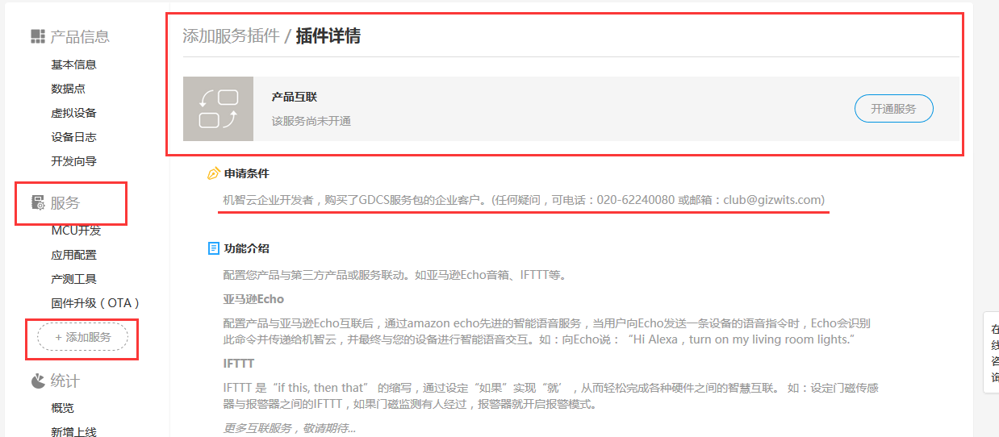 

Log in to Gizwits Developer Center and go to the product that needs to use the Product Interconnection Service. Choose Services - Add Services, and find the Product Interconnection Service. Click the [Apply] button, and wait for Gizwits to verify your request. 

After the verification passes, you can see [Product Interconnection Service] in the service list; click [Product Interconnection Service] to use it. 

Jump to the Product Interconnection Service page. Select the Amazon Echo tab and enter the App ID obtained in the above section, then click Configure.

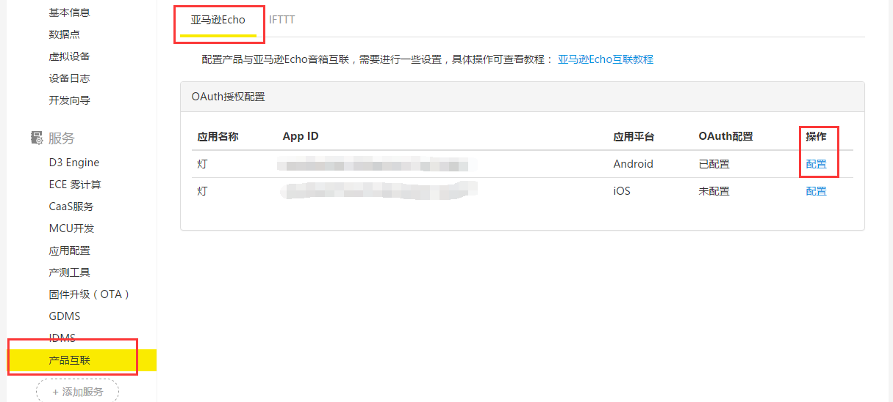  

Set the Client Name and Redirect URL of Alexa Skill.

 
 
# 3. Alexa Skill

Highlights: 

* Configure the voice control logic of Alexa Skill.
* Configure the association between Alexa Skill and Lambda.
* Configure the association between Alexa Skill and Gizwits developer account.

## 3.1 Interaction Model

1) Log in to the Amazon Developer Center.

  
 
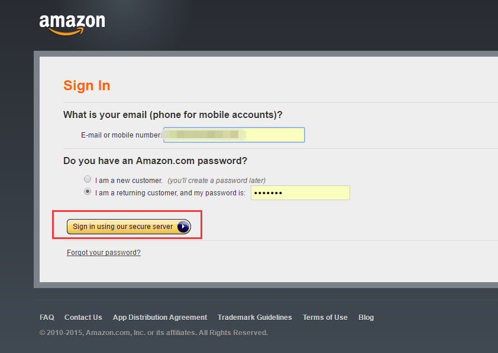 

2) Go to the Developer Console, click on the tab ALEXA, and click Get Started in Alexa Skills Kit.

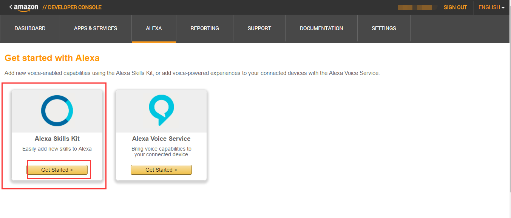  

3) Click Add a New Skill.

 
 
4) 

1. Skill Information: Provide basic information.
2. Interaction Model: Choose an interaction model.
3. Configuration: Specify the endpoint for your skill. Alexa sends requests to this endpoint when users invoke your skill. 
4. Test: Test most functionality in a skill, including dialogs, progressive responses (with limitations), and entity resolution during development.
5. Publishing: Provide publishing information for your skill.
6. Privacy & Compliance: Some settings on privacy.

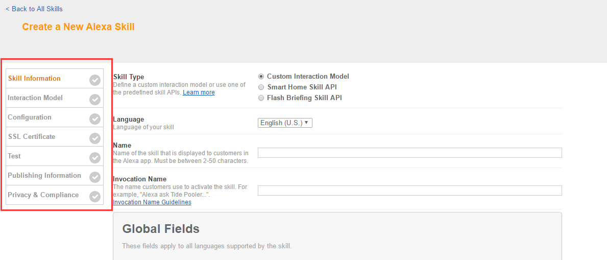 


5）Fill out Skill Information pane.

1.	Skill type: Choose Custom Interaction Model.
2.	Name: Name of the skill that is displayed to customers in the Alexa App. Type “Control Gokit” here.
3.	Invocation Name: Users say a skill's invocation name to begin an interaction with a particular custom skill. Type “Ameba Controller” here. For details, see Invocation Name Guidelines.
https://developer.amazon.com/appsandservices/solutions/alexa/alexa-skills-kit/docs/choosing-the-invocation-name-for-an-alexa-skill

Then click Next.

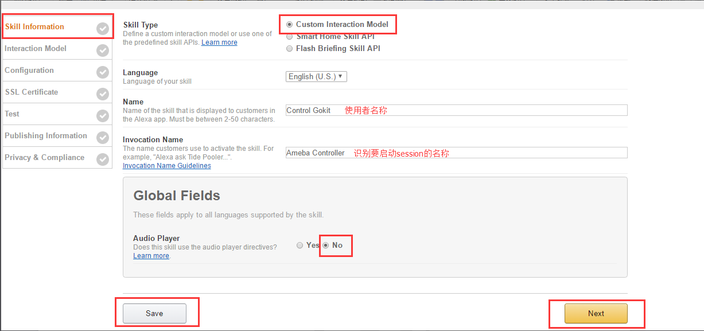 
 
### 3.1.1 Intent Schema

Intent Schema defines an intent that represents an action that fulfills a user's spoken request in JSON format.

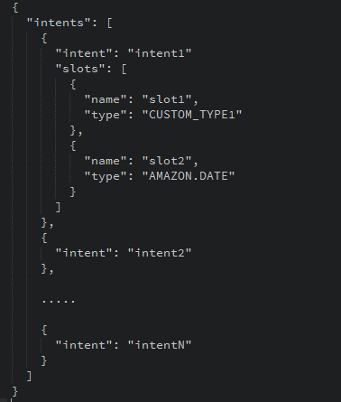 
 
One skill can have multiple intents. To define the voice interface, you map users' spoken input to the intents your cloud-based service can handle. Intents can optionally have arguments called slots that represent variable information in the request.

There are two slot types:

* Custom slot type: A custom slot type defines a list of representative values for the slot. You need to define the type and its values.
* Built-in slot type: The Alexa Skills Kit provides a library of built-in intents, which begin with the AMAZON namespace. These are intents for common actions that you can choose to implement in your custom skill without providing any sample utterance, such as AMAZON.DATE, AMAZON.NUMBER, and AMAZON.US_CITY.

For details, click here:

https://developer.amazon.com/appsandservices/solutions/alexa/alexa-skills-kit/docs/defining-the-voice-interface


Set the Intent Schema as follows:

 
 
The Intent name is “ControlLight”, which has a Slot “LightState” of custom slot type “LIGHT_STATE”.

Then it pops up a window for us to input the slot type and its possible value. Type “LIGHT_STATE” for “Enter Type” and “on”, “off” for “Enter Values”, then click “Save”.

 
 
### 3.1.2 Sample Utterances

The sample utterances are set of likely spoken phrases mapped to the intents. Enter one utterance per line as follows:

```
ControlLight Turn {LightState} the light
ControlLight Turn the light {LightState}
```

The intent name is followed by a blank or tab, then followed by the user's sentence. For the first line, it means that when the user says "Turn on the light", it will invoke the ControlLight intent.

Then, press "Next".

 
 
## 3.2 Configuration

Select Configuration in the left navigation pane. Specify the endpoint for your skill. Alexa sends requests to this endpoint when users invoke your skill. You can choose to host your service as an AWS Lambda function or as a web service. Now, we need to skip this step and then come back after creating a AWS Lambda function.

 
 
# 4. Account Linking 

Use Account Linking to create a link between the Alexa user and the user account in Gizwits.

Copy the Redirect URLs in the following picture to the Redirect URL field on the Product Interconnection Service page of Gizwits, where “Client Name” can be set to “Alexa”. Copy the Client ID and Client Secret values on the Product Interconnection Service page of Gizwits to the Client Id and Client Secret fields in the following picture respectively as unique public string used to identify the client requesting for authorization. 

* Authorization URL (https://oauth.gizwits.com/oauth/authorize) is used to get login credentials.
* Access Token URL (https://oauth.gizwits.com/oauth/token) is used to get access_token.

 
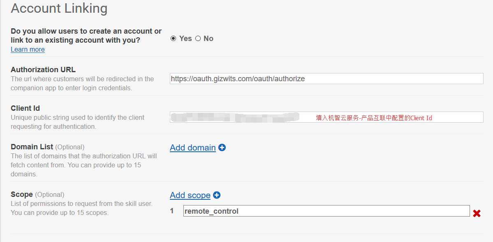 

  

Input Privacy Policy URL as needed, then click Next.

 
 
# 5. AWS Lambda

Highlights:

* Create a Lambda Function for the Alexa Skill
* Write code in AWS Lambda function to handle the voice directives received and replied by Alexa Skill
* Write code with Gizwits Open API to access Gizwits IoT Cloud to control your device


If you do not already have an account on AWS, go to Amazon Web Services and create an account.

Log in to the AWS Management Console and navigate to AWS Lambda.

  

Click the region drop-down in the upper-right corner of the console and select US East (N. Virginia) supported for Alexa skills.

 
 

Select Services – Lambda.

 
 
## 5.1 Create a Lambda Function for the Alexa Skill

If you have no Lambda functions yet, click Get Started Now. Otherwise, click Create a Lambda Function.

To start with sample code in Node.js or Python, click Blueprints, and select alexa-skills-kit-color-expert from the Alexa Skills Kit blueprints.

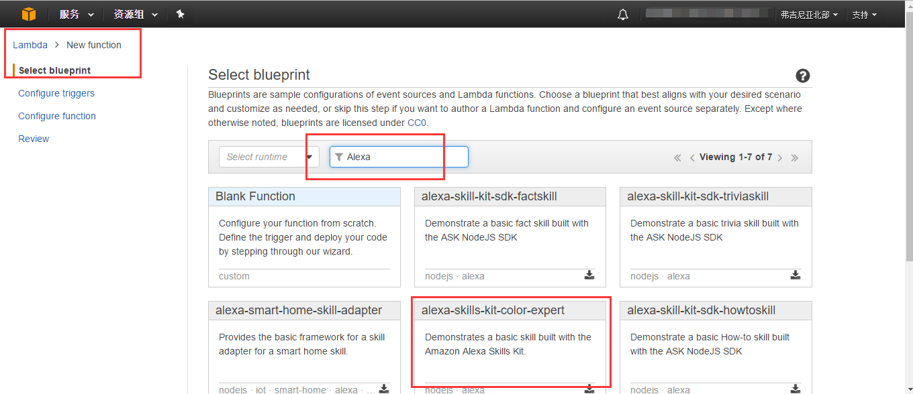 
 


Choose Configure triggers. On this page, you can set the event that triggers the Lambda function. Click the dotted box in the middle, and a list of pre-defined services will appear. Here we select “Alexa Skills Kit” and click Next.

 
 

Choose Configure function. On this page, we need to provide the code related content. There are three fields:

* "Name" is used to identify this Lambda function, here we input "ControlLight".
* "Description" is used to indicate the purpose of this Lambda function. 
* "Runtime" sets the programming language to be used. You can also change the programming language used here.

  

In the Lambda function code, set the Code entry type. You can choose to write the code directly or upload the code. Here we select Edit code online.

Here first keep the sample code and we will come back and update the code.

  

Next set the Lambda function handler and role.

For "Handler", keep the default value.

As "Role" is related to the permission of the Lambda function, we can set the permission of the Lambda function in order to prevent the Lambda function from using services that should not be used. In the drop-down list of “Role”, choose “Create a custom role”.

 
 

A new page will pop up and take you to the AWS IAM settings page, where set the "Role Name" to "control_light". Then click on "View Policy Document". Click "Edit" for the permissions of this role. 

The edit the permissions of this role, you can see the default value is only for log permission. Since we need to use the AWS IoT permission, so we update it as follows.

  

Then click “Allow”.

  

Then the page closes and we go back to the previous Lambda function page. You can see that the fields for "Role" and "Existing Role" already have values.

  

For the Advanced settings, keep the default values, then click "Next".

  

On the Review page, click “Create function”.

 
 

Now you have completed the setup. Please note that the string "ARN - arn:aws:lambda:us-east-1:xxxxxxxxxx" in the upper right corner is the endpoint of this Lambda function, which will be used in Alexa Skill settings page.

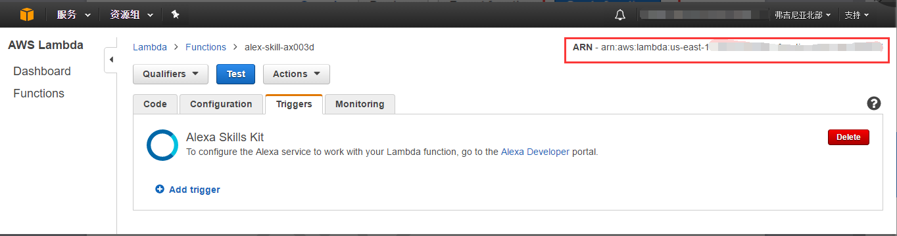 

 
## 5.2 Write the Lambda code for the Alexa Skill

Go back to the AWS Lambda page, and choose the Code tab.

  

The onIntent function determines which intent handler will be used to process the intent request of "ControlLight" and dispatch to the function light_control.

  

In the light_control function, we can get the slot information of the intent. Here the slot we want to get is "LightState".

Get the slot value of the intent and assign it to the variable switch_action. Then, if the switch_action is equal to on, pass True to the switch_action_fun function.

 
 

Then call Gizwits Open API to control the device. For details, please refer to the Open API guide.

# 6. Set up your Amazon Echo

Highlights:

* Get your Amazon Echo connected to Wi-Fi network.
* Apply Alexa Skill to your Amazon Echo.
* Link Alexa Skill to Gizwits Gokit App user account.

## 6.1 Get your Amazon Echo connected to Wi-Fi network

Navigate to http://alexa.amazon.com/spa/index.html in your PC browser to set up your Amazon Echo.

Or use Alexa App to set up your Amazon Echo.

To download the Alexa app, go to the app store on your mobile device and search for "Alexa app." Then select and download the app.

Log in with your Amazon account, go to the Alexa Settings page, and select your device.

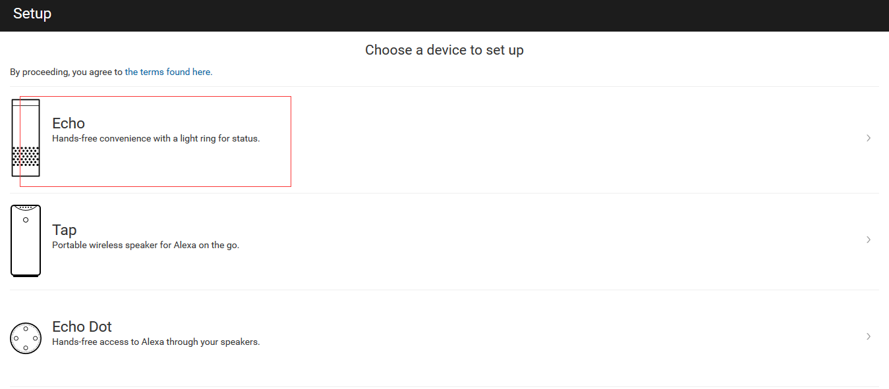  

Choose the language you use.

  

Click Connect to Wi-Fi.

  


Make sure your Echo device is plugged into a power outlet. When the light ring turns orange, click Continue.

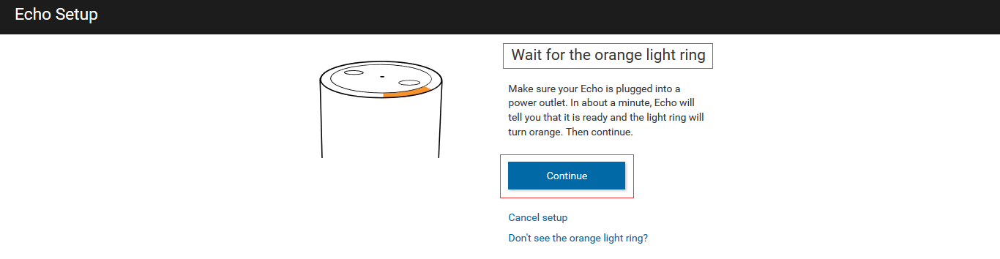  

Go to the Wi-Fi settings on your PC and select the network of the format Amazon-XXX to connect your PC to Echo.

  

After the following page appears, click Continue.

  

 
 

Select your Wi-Fi network and enter the network password (if required).

  

After your device connects to your Wi-Fi network, a confirmation message appears. Then click Continue. 

 
 
## 6.2 Link the Alexa Skill to Gizwits Gokit App user account

Click Skills and jump to Your Skills page by clicking All Skills in the upper right corner. Choose Control GOKIT.

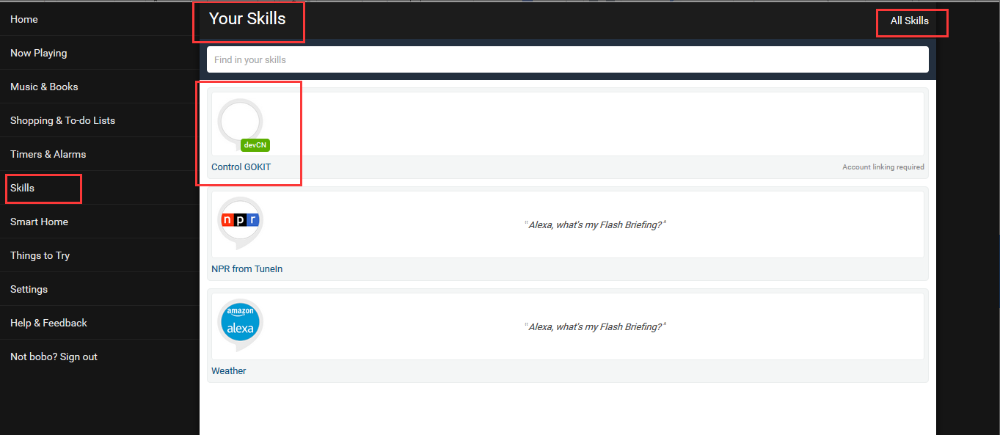  

Click Enable.

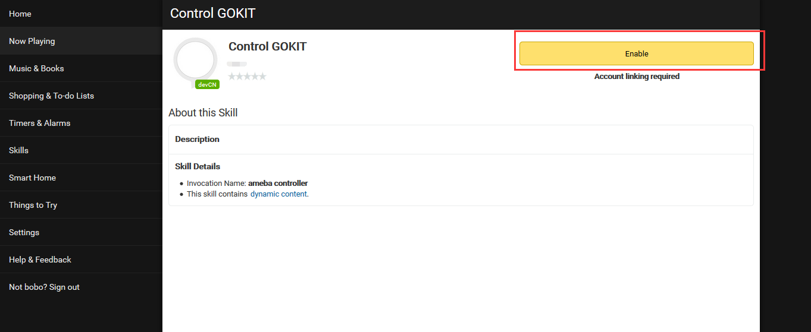  

Click Link Account.

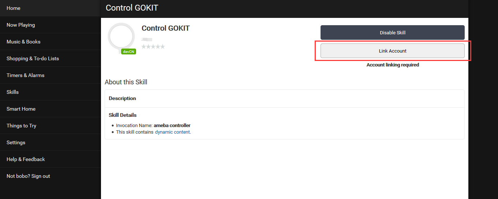  

Now jump to the login page, where you need to input the username and password registered with Gizwits Gokit App. Then click Sign in.

 

 
Then click Yes on the following page and the success message will appear as follows.
 
 

 

Go back to the Control GOKIT page and find that the Link Account button has disappeared, indicating that the Alex Skill was linked to Gizwits Gokit App user account successfully.

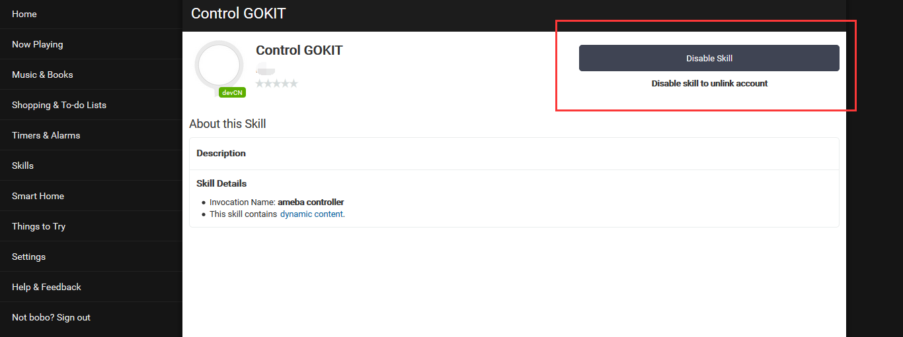 
 
# 7. Test and publish Alexa Skill

Highlights:

* Confirm whether Alexa Skill communicates with Lambda and Gizwits successfully.
* Confirm whether the voice control logic is correct.
* How to publish the skill.

## 7.1 Integrate Alexa Skill with Lambda

Go back to the Alexa page and click Configuration section. Enter the AWS Lambda ARN in the North America box. AWS Lambda ARN can be viewed in the upper right corner of the Lambda Function.

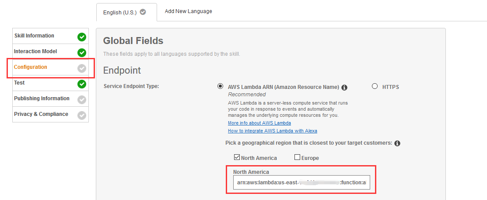 

  
 
## 7.2 Test your Alexa Skill

On the Test page, you can test your skill by using the Voice Simulator.

In Voice Simulator, you can test how Alexa will speak a response entered in plain text or SSML tags by clicking Listen button.

  

In Service Simulator, you can enter a plain text to simulate the words said by users, and let Alexa pretend to hear the message. Here input "Turn on the light", then click "Ask Control Gokit".

This message will be handled by Alexa and sent to the Lambda function. After processed by the Lambda function, the result will be returned. If the result is returned successfully, you can ask Alexa to control your Gokit.

You can listen to this result by clicking “Listen” in the bottom right corner.

 
 
## 7.3 Publish Alexa Skill

Once you have completed testing on your device, please complete the Description and Publishing information tab, and then submit the skill for certification.

 

 
 
 

If it passes Amazon's testing and certification process, it will become available to Alexa end users.

The skill is available in "Skills > Your Skills" page of the Alexa App. You can then enable the skill and test its functionality by asking Alexa.

  

If you encounter any problems during the publish process, contact Gizwits and we will help you.

# 8. Support

## For individual developers

Gokit is free, but only a limited number are available for individual developers. Register in our forum or follow our official WeChat to request for provision.

Community: http://club.gizwits.com/forum.php

Documentation Center: http://docs.gizwits.com/hc/

## For organizations

Gizwits has a lot of support programs for organizations, you can contact Gizwits to get Gokit and timely technical support.

Website: http://www.gizwits.com/about-us

WeChat Official Account QR code of Gizwits:

 

