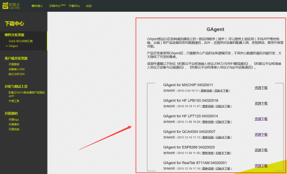
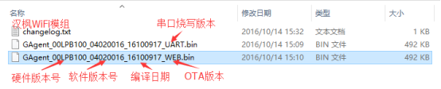
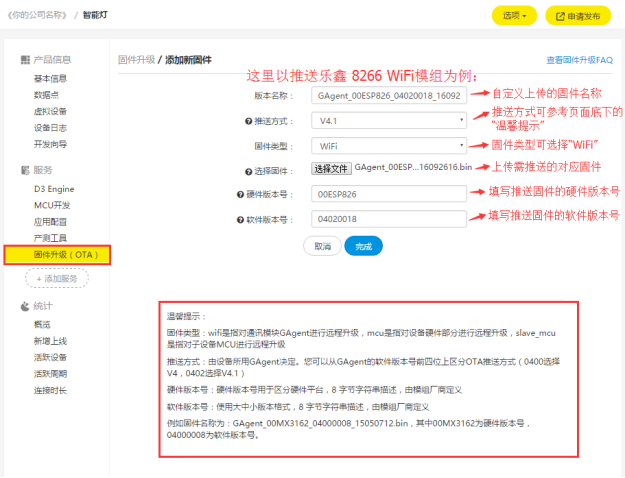
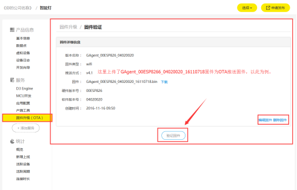
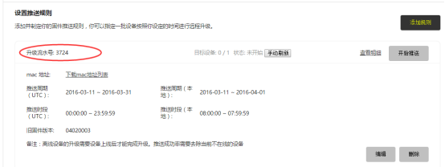
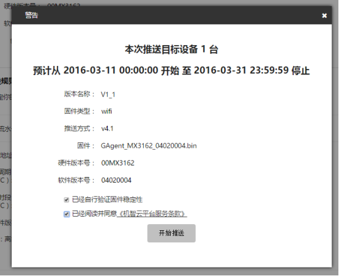
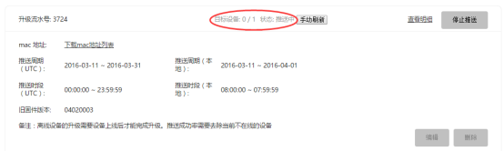
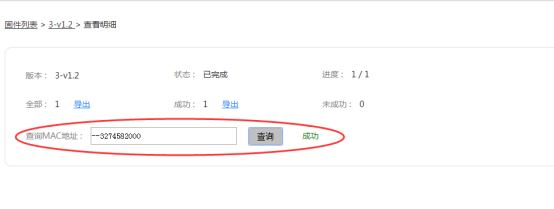

title: Guide to GAgent OTA 
---

# Overview

OTA refers to Over-the-Air Technology. When devices are connected to the cloud, it will receive an OTA upgrade notification and then can complete the firmware upgrade via HTTP. The Gizwits OTA service mainly provides the following functions:

* OTA notification service, which is an offline upgrade. When a new version of the device's firmware is released, the OTA notification service will push the upgrade notification to the device.
* OTA transparent transmission service, which is an online upgrade. The device firmware is transparently transmitted to the device through the M2M messaging service.
* Support multiple pushes for one product.
* Support upgrade for Wi-Fi module/MCU
* Support user-defined upgrade. You can push the upgrade notification per MAC address, region, and old firmware version.
* Support scheduled push. You can define push date and push time.
* Support OTA progress statistics

# OTA process

OTA service for Wi-Fi products is available on Gizwits Developer Center and involves five steps: upload firmware, verify firmware, create rules, start push, and check result.

## Upload firmware

Note: For the Guide to MCU OTA, see here.

For example, the module firmware of a device is: GAgent_00ESP826_04020019_16101715.bin, where the hardware version number is 00ESP826, and the software version number is 0040019.

Step 1: Go to the Firmware Upgrade (OTA) module and click [Create New Firmware].
 
 

 

Step 2: Download the GAgent firmware (Since the MCU firmware is provided by developers, for the MCU OTA, skip this step).

 

Note: For OTA of any High-Flying Wi-Fi module, you should use the web edition firmware. For OTA of ESP8266 Wi-Fi module, you should use the firmware file whose name does not contain combine. As shown below:

 

  

Step 3: Provide the firmware information.

The firmware series is identified by hardware version number + the first 4 digits of software version number + the firmware type. The firmware is identified by hardware version number + the last 4 digits of software version number + the firmware type. OTA upgrade needs to be performed within the same firmware series.

* Version name: Customized, composed of letters, numbers and underscores.
* Firmware type: Support Wi-Fi and MCU. Choose Wi-Fi for GAgent OTA.
* Push method: Support V4 and V4.1. For the push method, refer to the Tips.

Note: Since the firmware of most of devices currently supports push method v4.1, this document only explains the v4.1 push method.

* Upload firmware: Upload the firmware you need to upgrade, such as: GAgent_00MX3162_04020004.bin (For Wi-Fi module, use bin file. For MCU, use bin/hex file)
* Hardware version number: The uploaded firmware hardware version, must have 8 characters.
* Software version number: The uploaded firmware software version, must be 8 characters.

 

  
 

Step 4: Click Finish, and the firmware state now is unverified.

## Verify firmware

For security, OTA push can be done only if the firmware is verified. The firmware type Wi-Fi and MCU have the same firmware verification process. Before upgrading devices in large quantities, you need to select a single device to upgrade and verify the stability of the upgraded device. If there is no abnormality, the firmware becomes verified, indicating that a bulk OTA upgrade can be performed.

The firmware verification process is as follows:

Step 1: Re-confirm that the uploaded bin file and information are correct (The unverified firmware information can be edited).

Step 2: Connect the test device to the cloud and ensure that it is online.

Step 3: Enter the details page of the unverified firmware, click [Verify Firmware], and the following page appears:

 

  
 

Step 4: Type the MAC address of the online test device in the input box, and find the target device to start the upgrade.

  

Step 5: After the test device is successfully upgraded, prompt you to confirm whether the device works. At this point, in order to be cautious, please do a stability verification on the upgraded device to ensure that the upgraded device works properly. If there is no abnormality, please check the confirmation box manually.

 
 
## Create a push rule

By creating different push rules, a product can get multiple push notifications. The push date and time can also be customized.

Step 1: In the firmware list, click the verified firmware name, and go to the [Push Firmware] page, and click [Add Rule].

  

Step 2: Add the push conditions. Push conditions can be specified based on device location or device MAC.

1. Device location: type the location of target devices, such as “Guangdong Province - Guangzhou City” or specify the MAC addresses of target devices (one MAC address per line).
2. Firmware version: Select the firmware version of target devices to be upgraded.
3. Target devices: Refresh to display the intersection of condition 1 and condition 2, which is the number of target devices.
4. Push date (UTC): Set the push date range
5. Push time (UTC): Set the push time range.

Note:

1. Gizwits will send OTA push notifications once a day to the target devices which are online during the specified push date and push time. After receiving the push notification, the device actively downloads the firmware.
2. Once a device is powered on, it will actively ask Gizwits IoT Cloud if a firmware push is available. If the device meets the specified push conditions, it will actively download the firmware.
3. UTC time: Coordinated Universal Time. On the Add push conditions page, it will automatically present the local (Beijing) push time corresponding to the specified UTC time.

  

Step 3: Click [Save] to generate a push rule with a unique notification ID.

 
 
## Start push

Step 1. After creating a push rule, click the [Start Push] button.

  

Step 2: Confirm again and check the relevant agreement. At this point, the firmware push has been sent out and the status of the corresponding push rule will change. 

Note: The target devices field shows the number of devices upgraded successfully and the total number of target devices.

  

Step 3: The devices online and offline will perform OTA upgrade automatically to the latest firmware and report the upgrade result to the cloud.

## Check result

Step 1: After the push is completed, refresh the push rule page and its status changes to "Completed".

  

Step 2: Check result

Click the [View Details] to view the upgrade details of the individual device and you can export the upgrade result of all target devices.
 
 
