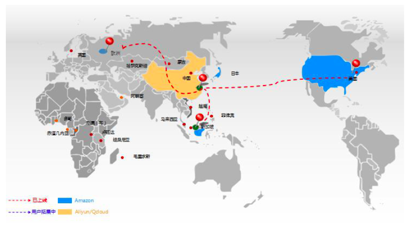
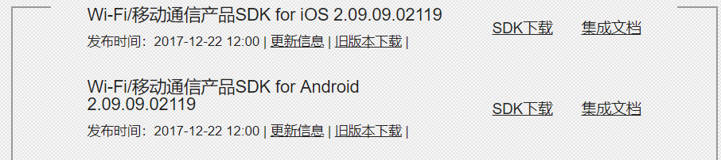
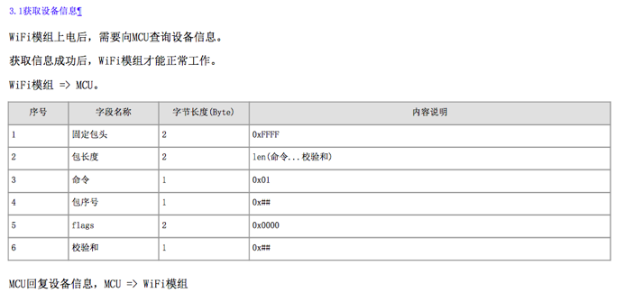
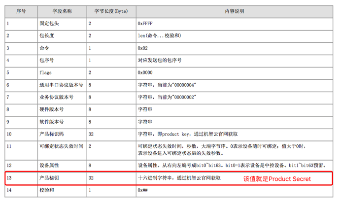
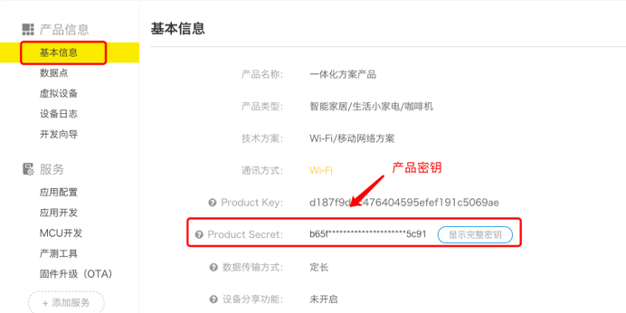

title: Global Network of Gizwits
---

# Overview

In order to facilitate our customers to tap into overseas markets and better offer the convenience brought by Gizwits IoT Cloud to developers, Gizwits provides standalone deployment abroad to reduce network delay for the devices sold abroad due to the great geographic distance to China and achieve a better interactive experience.

Currently, Gizwits overseas deployment nodes are distributed in the eastern United States and central Europe (Frankfurt), where AWS cloud computing services are used. As shown below:

  
 

* US East node coverage: North America, South America;
* European node coverage: Europe.

For the response speed report of each node, please refer to the Gizwits Global Network Report (this document mainly introduces the global deployment solution of Gizwits to developers).


# Get started

## Required module firmware

Currently the modules that support global deployment are as follows:

 
 

The firmware versions in the above figure and the newer ones running on Wi-Fi modules can employ the global deployment solution, however, it is recommended to use the latest version of the firmware to develop globally dispersed devices.

If you are unable to confirm whether the module's firmware supports global deployment or not, consult Gizwits FAE for more information.

## Required Gizwits App SDKs

The Gizwits App SDKs in the following figure and the newer ones support global deployment.

 
 
## Synchronization for product configuration

For the global deployment, you need to contact Gizwits technical support team to provide the corresponding information for the product as follows.

Setting	Sample
Product name	
Product Key	d187f9……
Android APPID	943d59……
iOS APPID	000593……
Your account name	Myemail@xxx.com


Get Product Name and Product Key as shown below:

 
 

Get Android and iOS APPID as shown below:

 
 
# Device development

To support global deployment, your devices need to run a supported firmware. In addition, the device MCU needs to reply its Product Secret per the protocol "3.1 Obtaining Device Information", which is as follows:

 

 
 

The product key required in the above figure is obtained as follows:

 
 
# App development

The App development for the global deployment has two schemes:

* Scheme 1 (World edition): One App edition runs everywhere.
* Scheme 2 (Regional editions): Three App editions are needed according to the deployment regions of Gizwits.

Let's first introduce the App startup function used in Scheme 1.

## Andriod App

Startup function:

```
public void startWithAppID(Context context, String appID, String appSecret, List<String>
specialProductKeys, ConcurrentHashMap<String, String> cloudServiceInfo, boolean
autoSetDeviceDomain)
```

Parameters:

Parameter |	Description
---|---
context|	Context object
appID|	The product appID. Get it in the Developer Center.
appSecret|	The appSecret for APPID. Get it in the Developer Center.
specialProductKeys|	The productKey list of products to be filtered, string array. This parameter is required and cannot be set to NULL to enable global deployment.
cloudServiceInfo|	The domain information of server to be used. The default value of this parameter is null, and the Gizwits App SDK will set the domain name of the Gizwits IoT Cloud for the App according to the geographic location of the user's mobile phone. If you want to use the domain name of a private cloud service, provide information in the format: {"openAPIInfo": "xxx", "siteInfo": "xxx", "pushInfo": "xxx" }, where openAPIInfo and siteInfo are required, and pushInfo is optional. If the port numbers are not provided, the Gizwits App SDK will use the default service ports. In this case, write the domain name like this: api.gizwits.com. If you specify a port, you need to specify both the HTTP and HTTPS ports. In this case, write the domain name like this: api.gizwits.com:81&8443
autoSetDeviceDomain|	Whether to enable the automatic setting of the device domain name. The default value of this parameter is false, that is, the automatic setting is disabled. If the parameter value is true, the automatic setting of the device domain name is enabled. In this case, the device in Micro Cycle will be connected to the cloud service currently used by the App.

Note: There is no relation between cloudServiceInfo and autoSetDeviceDomain. When autoSetDeviceDomain is set to true, after the Gizwits App SDK is started, the App needs to connect to the Internet, so that the Gizwits App SDK can visit the cloud to obtain the relationship between the APPID of the current App and the ProudctKey list. The App only has permission to modify the domain name of a device when the device ProductKey is associated with the App APPID. Therefore, when the App needs to support global deployment, the ProudctKey parameter is required, which is used by the Gizwits App SDK to check the association between the APPID and the ProductKey.

__The right moment for the App to change the device domain name__

When the device and App are connected to the same LAN and the App finds that the domain name of the device is different from that of the App, the App will send its domain name information to the device through TCP to tell the device to update. 

## iOS App

Startup function: 

```
+(void)startWithAppID:(NSString*)appID appSecret:(NSString*)appSecret specialProductKeys:(NSArray*)specialProductKeys cloudServiceInfo:(NSDictionary *)cloudSeviceInfo autoSetDeviceDomain:(BOOL)autoSetDeviceDomain;
```

Parameter |	Description
---|---
appID|	The product appID. Get it in the Developer Center.
appSecret|	The appSecret for APPID. Get it in the Developer Center.
specialProductKeys|	The productKey list of products to be filtered, NSString array. This parameter is required and cannot be set to nil to enable global deployment. 
cloudServiceInfo|	The domain information of server to be used. The default value of this parameter is null, and the Gizwits App SDK will set the domain name of the Gizwits IoT Cloud for the App according to the geographic location of the user's mobile phone. If you want to use the domain name of a private cloud service, provide information in the  format: { "openAPIInfo": "xxx", "siteInfo": "xxx", "pushInfo": "xxx"}, where openAPIInfo and siteInfo are required, and pushInfo is optional. If the port numbers are not provided, the Gizwits App SDK will use the default service ports. In this case, write the domain name like this: api.gizwits.com. If you specify a port, you need to specify both the HTTP and HTTPS ports. In this case, write the domain name like this: api.gizwits.com:81&8443
autoSetDeviceDomain|	Whether to enable the automatic setting of the device domain name. The default value of this parameter is false, that is, the automatic setting is disabled. If the parameter value is true, the automatic setting of the device domain name is enabled. In this case, the device in Micro Cycle will be connected to the cloud service currently used by the App.

The cloudServiceInfo and autoSetDeviceDomain of iOS App are the same as the ones of Android App.

## Scheme 1: World edition

Scheme 1 allows the Gizwits App SDK to automatically change the connected server domain name according to the time zone. The startup function is invoked as follows:

For Android App:

```
GizWifiSDK.sharedInstance().startWithAppID(this, AppID, AppSecret, ProductKeyList(), null, true);
```

For iOS App:

```
[GizWifiSDK startWithAppID:APPID appSecret:APPSECRET specialProductKeys: ProductKeyList cloudServiceInfo:nil autoSetDeviceDomain:YES];
```

* Advantages: Only one edition of the App is needed to deploy globally.
* Disadvantages: The Gizwits App SDK automatically changes the corresponding server according to the time zone. When the App is not in the same time zone of the device, the App will connect to another server, which may result in the original App account and the device not being found by the App.

## Scheme 2: Regional editions


Scheme 2 offers three App editions based on the deployment regions of Gizwits.

There are three major deployment regions of Gizwits: China, US East and European.

Similarly, The App is also has three editions corresponding to these three major regions respectively: China Edition, US East Edition and European Edition.

These three App editions are the same except for the startup function. Take iOS App as an example:

Startup function of China Edition:

```
[GizWifiSDK startWithAppID:APP_ID appSecret:APP_SECRET specialProductKeys:[GosCommon sharedInstance].productKey cloudServiceInfo:@{@"openAPIInfo" : @"api.gizwits.com" , @"siteInfo": @"site.gizwits.com", @"pushInfo": @"push.gizwitsapi.com"} autoSetDeviceDomain:YES];
```

Startup function of US East Edition:

```
[GizWifiSDK startWithAppID:APP_ID appSecret:APP_SECRET specialProductKeys:[GosCommon sharedInstance].productKey cloudServiceInfo:@{@"openAPIInfo" : @"usapi.gizwits.com" , @"siteInfo": @"ussite.gizwits.com", @"pushInfo": @"us.push.gizwitsapi.com"} autoSetDeviceDomain:YES];
```

Startup function of European Edition:

```
[GizWifiSDK startWithAppID:APP_ID appSecret:APP_SECRET specialProductKeys:[GosCommon sharedInstance].productKey cloudServiceInfo:@{@"openAPIInfo" : @"euapi.gizwits.com" , @"siteInfo": @"eusite.gizwits.com", @"pushInfo": @" eupush.gizwits.com
"} autoSetDeviceDomain:YES];
```

* Advantages: Users download the corresponding App edition according to their location, and the devices have the fixed servers to connect to, which will run stalely. The App and the device are not required to switch between the servers.
* Disadvantages: More complex to develop and release three App editions.


# FAQ

## 1. Now that the App has the push notification function. What should I do when using the global deployment solution?

After Gizwits synchronizes the configuration information of the product on the domestic and overseas servers, you need to log in to the overseas editions of Gizwits Developer Center with the same user account to find the corresponding product, and request to use D3 Engine, then create the same rules as the ones in the domestic edition of Gizwits Developer Center.

Overseas editions of Gizwits Developer Center:

Europe: http://eusite.gizwits.com/en-us/developer/

US East: http://ussite.gizwits.com/zh-cn/developer/

## 2. If I found that an App has permission to change the domain name of a device whose ProductKey is not associated with the App APPID, what should I do?

Answer: Use the Gizwits App SDK version released after August 14, 2017, that is, the SDK version starting from 2.07.07.2, which has added the device domain change restriction.

Restriction description: After the Gizwits App SDK is started, the App needs to connect to the Internet, so that the Gizwits App SDK can visit the cloud to obtain the relationship between the APPID of the current App and the ProudctKey list. The App only has permission to modify the domain name of a device when the device ProductKey is associated with the App APPID. 


## 3. If the App has enabled the domain name change function, but I found that the devices in the LAN cannot automatically switch to the corresponding server according to the App request, what should I do?

a. Confirm whether the ProductKey parameter of the startup interface is passed and its value should not be empty.
b. Confirm whether the App can connect to the Internet, because the Gizwits App SDK starting from version 2.07.07.2 needs to visit the cloud to confirm the association between APPID and Productkey to change the device domain name.
c. Visit the Gizwits Developer Center to check if the APPID is associated with ProductKey.


## 4. If a device in the device list flashes when testing devices deployed globally, (i.e., disappears and reappears), what is the reason?

Check whether there are several Apps which have permission to set the device domain name in the same LAN, and these Apps connected to different servers.

When testing devices deployed globally, Apps in the same LAN must be connected to the same server. Otherwise, several Apps will switch the server which the device is connected to, thus the problem arises.


## 5. It worked well when logging in and binding device with the user account created in the World Edition App. Later, it fails to login the App with an error the account does not exist or the password is incorrect. What is the reason?

Confirm which server of Gizwits the App was connected to when you sign up for the user account before, and which server of Gizwits the App is connected to when the error occurs. The reason is that the above two servers are not identical. It will work normally after the App switches to the original server to reconnect again.


