title: Guide to MCU OTA (3.1)
---

Attachment: [documentation and source code](http://docs.gizwits.com/assets/pdf/GOKIT-OTA3.1.rar) 

# 1. Overview

The MCU OTA is used to perform MCU firmware upgrade over the air. This guide comes with an OTA demo for STM32F103C8T6 where the original software version number of the MCU firmware is 01, and the new software version number is 02. Consider the scenario where the mass-production has begun, it is impossible to flash a new firmware to each device again. Thus you have to use the MCU OTA.

The STM32F103C8T6 (Gokit 2) flash space is organized as follows: Bootloader, FLAG, APP, APP_BAK.
 
  
 
* Bootloader: Stores the bootloader firmware, which runs first after the MCU is powered on.
* FLAG: Stores the relevant flag bits for the upgrade. Both the bootloader and the APP partition need to operate this area.
* APP partition: Stores user application firmware.
* APP_BAK partition: Temporary storage of the new firmware delivered by the cloud, which is a transitional storage area for firmware upgrade. 

You can download and find the source code of Bootloader and APP. With some compilation settings the source code of Bootloader can be compiled without changing the code and the generated binary file can be written in the MCU. The OTA related source code of the APP can be copied to the automatically generated source code for MCU scheme using Gizwits MCU Code Auto-Generator, then compiled and the generated binary file can be written in the MCU, which will support OTA.

The following are the detailed porting steps for the Bootloader and APP partitions.

# 2.Bootloader partition

## 2.1 Bootloader flowchart

The main responsibility of the Bootloader is to copy the firmware in the APPBAK partition to the APP partition when there is an upgrade task. Of course, a lot of work needs to be done during this period, such as failover. The specific process is illustrated in the following figure. 

It should be noted that during the firmware copy after passing the MD5 check, if the MCU has a fault (including sudden power failure), it should perform the reset operation (the FLAG data is not destroyed), which will rerun the Bootloader in order to avoid being left with bricked devices as a result of failed OTA upgrades.

  
 
## 2.2.Bootloader compilation settings

To programming the Bootloader per the flowchart, we need to configure the Keil project accordingly. It should be noted that the generated Bootloader binary size should not exceed 11KB. The Keil compiler needs to be configured as follows:

2.2.1 Set the start address for the Bootloader firmware per the flash layout, as shown below:

   

2.2.2 Make the above flash address setting take effect.

   

2.2.3 Set Download Function to Erase Sector, and use ST-Link Debugger to start download.

  

  

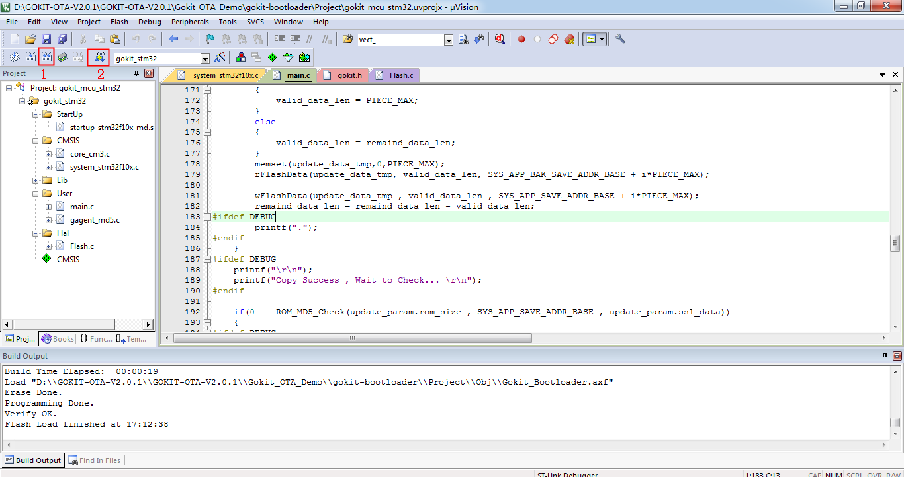   
 
 
# 3. APP partition

## 3.1 Receive firmware

After programming the Bootloader, proceed to write the code for the APP partition. You should pay attention to the hardware version number and the software version number for the APP firmware. The software version number is used as an important reference point for upgrade. To complete the APP code, you only need to add the function of receiving the new firmware from the cloud based on the source code of Gokit WeChat Pet House project. 

Important notice: In order to perform a successful application jump from the Bootloader, the interrupt vector address of the application firmware should be relocated. The default interrupt vector address offset for the STM32 standard library is 0x0, but the actual interrupt vector address offset of the APP partition is 0x3000. If not relocated, the APP partition can also be loaded and run normally, but will not handle interrupts. Therefore, we need to set the interrupt vector address offset based on the start address of the actual APP partition. The flowchart is as follows:

  

## 3.2 App compilation settings

Similarly, due to the limited flash space, we need to impose a strict limit on the firmware size of the APP partition. In this scenario, the maximum firmware size we can allow for Gokit is 26KB. The new firmware size used to upgrade is also limited up to 26KB.

3.2.1 Set the start address for the APP firmware.

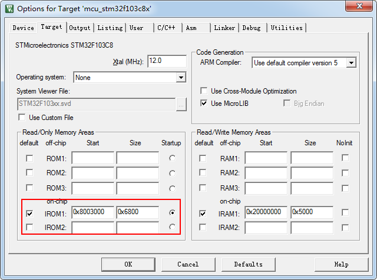  

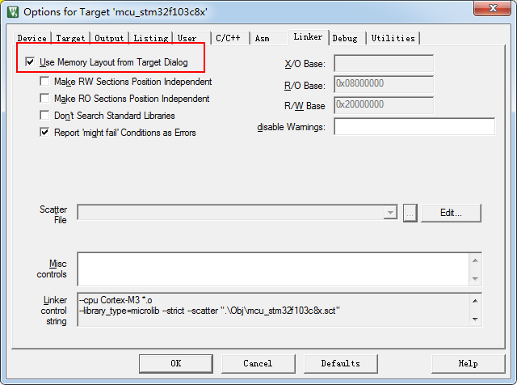   
 

3.2.2 Use ST-Link Debugger for Keil to download firmware
 
  

3.2.3 Adjust the APP firmware size by setting the optimization level.

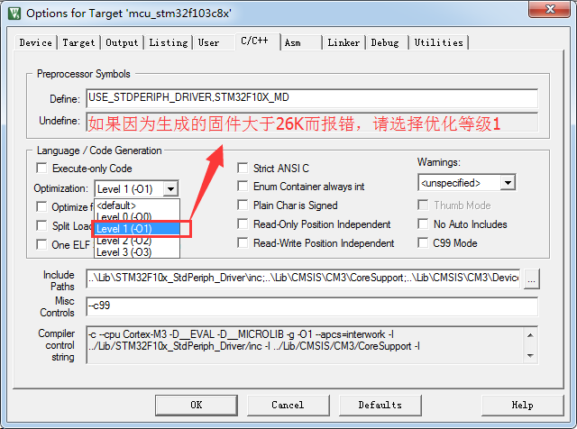   

3.2.4. Set the output .bin file location after build (needs to upload the .bin file to Gizwits IoT Cloud for OTA)

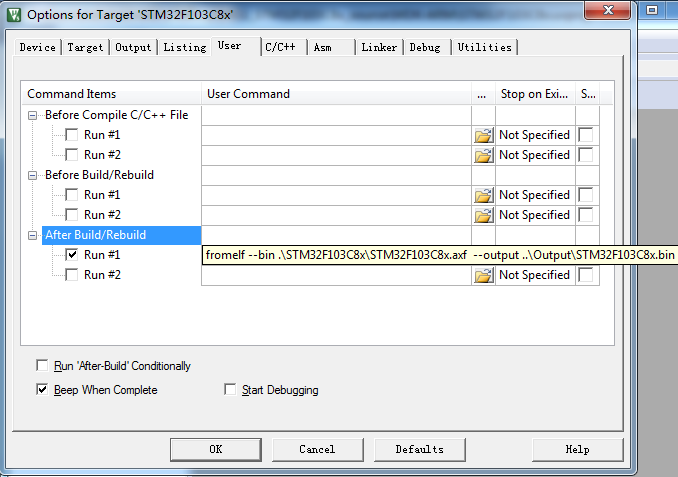   

3.2.5 Set Download Function to Erase Sector.

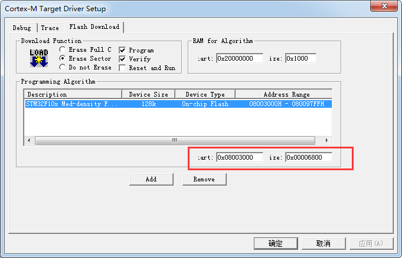   

3.2.6 Add hal_flash.c and gagent_md5.c to the project. Click the build button of Keil to expand the project directory, you can see hal_flash.h and gagent_md5.h

  
 
## 3.3 OTA function porting of App

3.3.1 Set the interrupt vector address offset.
 
  

3.3.2 To implement the OTA function, simply copy the code snippet in the red box of each picture to the automatically generated source code for MCU scheme using Gizwits MCU Code Auto-Generator. 

  

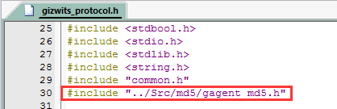  

  

  

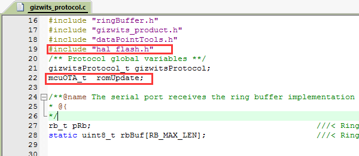  

  

  

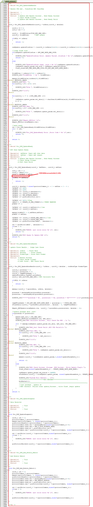  

    
 
 
3.3.3 Compile and download.

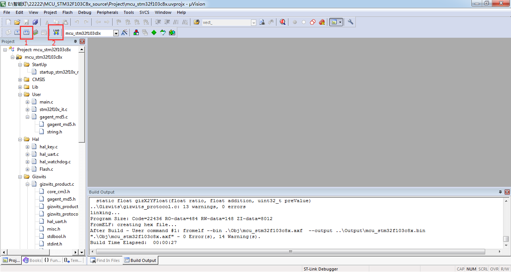  

# 4. MCU OTA verificatoin

4.1 After downloading the firmware with ST-Link for the first time, the MCU log is as shown in the figure.

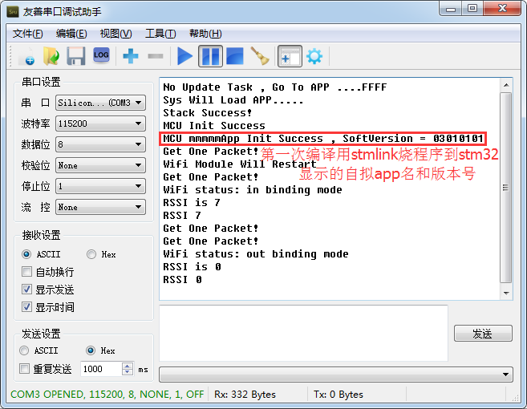   

4.2 Get started with OTA. First connect the device to Gizwits IoT Cloud.

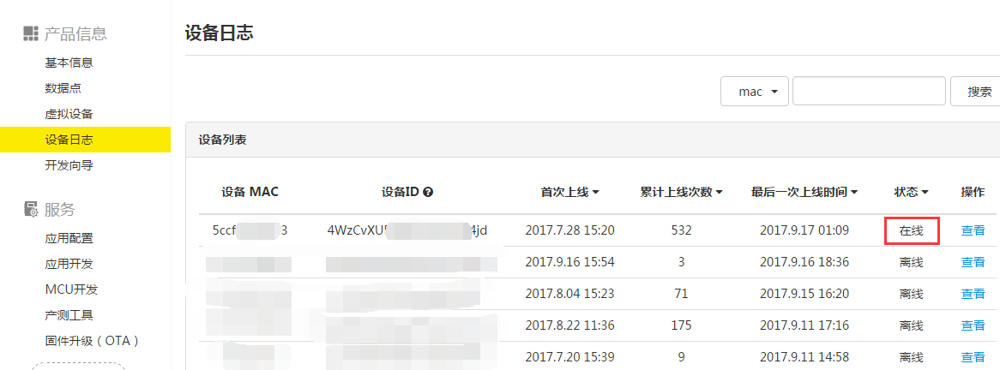   

4.3 The version of software should be modified in the new firmware because the OTA will not be executed if the software version in cloud is lower than the one which is currently running in the development board. Upload the generated .bin file.

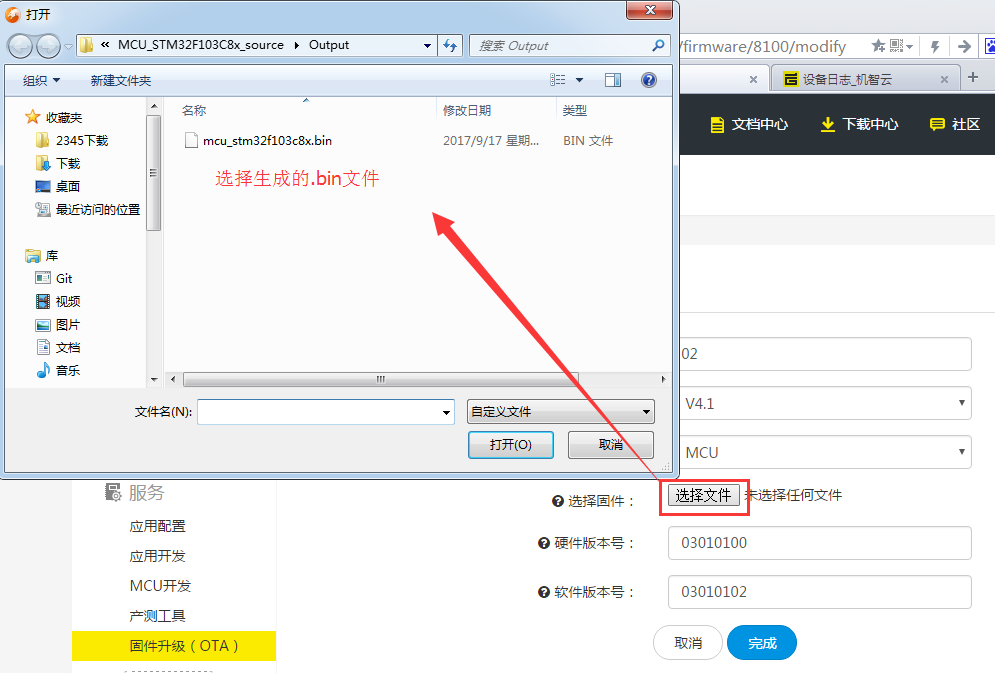  
 
4.4 Complete OTA.
 
  

This document mainly describes the porting process of the OTA function. For the detailed process of MCU OTA (e.g., the MCU startup process of checking for OTA tasks, OTA flash partitions, etc.), see the attatched documentation.
