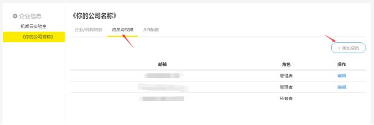
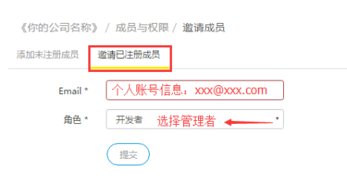
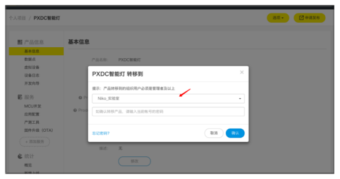

title: Promote personal type product to enterprise type product 
---

Personal products cannot use the Enterprise API, D3 Rules Engine and other functions, so it is recommended that enterprise users choose to register for an enterprise developer account and create enterprise type products.

Since many users are not aware of the above, they often register for an individual developer account at the Gizwits Developer Center, or create personal type products with an enterprise developer account. In these cases, the enterprise users need to promote the personal type product to an enterprise type product.

# Promote personal type project of individual developer account to enterprise type project of enterprise developer account

## 1. Register for an enterprise developer account

An individual developer account cannot be directly converted into an enterprise developer account. Therefore, products of the individual developer account can be transferred to an enterprise developer account. If you only have an individual developer account, you need to sign up for an enterprise developer account to complete the product transfer. Please log in to the Gizwits IoT Cloud, click register for a developer account. According to the registration process, select the enterprise developer type.

## 2. Grant administrator permissions to your individual developer account

Use your enterprise developer account to log in to Gizwits Developer Center, and grant administrator permissions to your individual developer account. As shown below.

 
 
## 3. Select the product to be transferred

Use your individual developer account to log in to Gizwits Developer Center and select the product you want to transfer. As shown below.

## 4. Choose an enterprise type project as a receiver

Choose an enterprise type project as a receiver, and then enter the password of the current account to confirm the operation.

# Promote personal type project to enterprise type project in the same enterprise developer account

## 1. Select the product to be transferred

Use the enterprise developer account to log in to Gizwits Developer Center and select the product that needs to be transferred. As shown below.

 
## 2. Choose an enterprise type project as a receiver

Choose an enterprise type project as a receiver, and then enter the password of the current account to confirm the operation.

 

