title: Control Gokit using Google Home
---

# 1. Overview

* This tutorial describes the third control manner used by users to control Gokit other than the App and WeChat: Google Home.
* Google Home：Google Home is a voice-activated speaker powered by the Google Assistant. Use voice commands to enjoy music, get answers from Google and manage everyday tasks. Google Home is compatible with Android and iOS operating systems, and can control compatible smart devices such as Chromecast or Nest.
* Google Assistant: The Google Assistant is an artificial intelligence-powered virtual voice assistant developed by Google that can be integrated with various devices and operating systems to allow users to communicate with devices in a smooth voice manner. It can also be used in third-party applications and services, such as streaming music services, taxi services, and more. 
* Action：Actions are applications that extend the functionality of the Google Assistant. Actions can be invoked by users through Google Home speaker or Android smartphone to control Internet of Things (IoT) devices and interact with your own applications.
* Gizwits has published an Action called "Gokit" on Google Assistant to control Gokit.

Action name	| Functions
---|---
Gokit|	Turn on/off Gokit LED and change Gokit LED light color.
Gokit|	Start or stop Gokit motor

# 2. Development prerequisites

## Hardware

* Gokit2 or Gokit3 , you can buy it at https://59680395.taobao.com/
* Google Home
* Smart phone that supports Android6.0+
* iPhone with user account registered in US

## Software

* Gizwits Gokit App

iOS | Android
---|---
  | 

* Google Home App (version 1.26.93937 or later) or Google App (version 7.7 or later) 

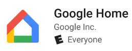

 

For Android, download it from Google Play.

For iOS, download it from Apple App Store in US.

## User accounts

* Gizwits user account (Sign up in Gizwits Gokit App)
* Google user account

# 3. Get your Gizwits Gokit connected to Wi-Fi network

Launch the Gizwits Gokit App, register with your phone and log in. Go to “My Devices” page, and click “No device, please add”.

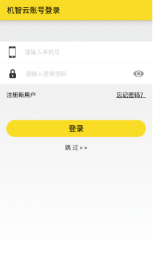

  

Select the Wi-Fi module type of your Gokit. Select the Wi-Fi SSID you want to connect and enter the password, then click “Next”. Make RGB light turn green with long press on key2 of your Gokit, then click “Next”.

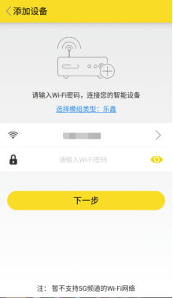

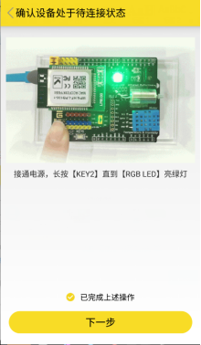 

The “Connecting your device to network” page appears. After a while, the “My Devices” page displays. In the “New Devices” pane, there is an unbound device “WeChat Pet House”, whose MAC address is "ACCF2378C44A". Click on the device.

Note: If the configuration times out, check if the router uses the 2.4GHz band and is able to connect to the Internet. If no new device is discovered, please check if the product key in your Gokit MCU program matches the one in your Gokit factory default settings.

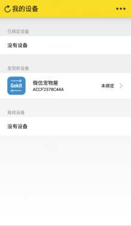

Go to the device control page and click “Switch light On/Off”. If the Gokit lights up, it indicates that the configuration is successful. Then return to “My Device” page and you will find that the device is already in the “Bound Devices” pane. It means that your Gokit is successfully bound.

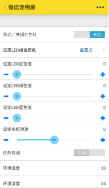

# 4. Set up Google Home and link Action to your Gizwits Gokit App account

## 4.1 Get your Google Home connected to Wi-Fi network

### 4.1.1 Set up Google Home via Google Home App (Android)

Plug in Google Home and its white breath light will light up (If not, press and hold the microphone mute on the back of the device for a while).

Install Google Home App. Log in to the Google Home App and go to the Home page. Click on the button at the top right corner. Then jump to the "Devices" page, where you will find your Google Home, click SET UP to enter the next page.

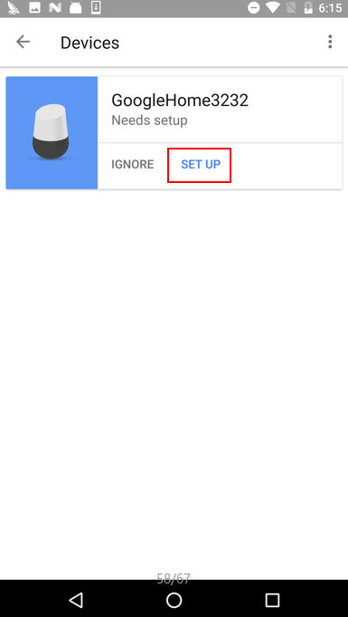  

Go to the Google Home setup page, click CONTINUE, and wait for your smart phone to connect to Google Home's AP hotspot automatically.

  

After a while, the phone is connected to the hotspot of GoogleHome3232.k. Click on PLAY TEST SOUND, and Google Home will play a sound to make sure you're setting up the right device. 

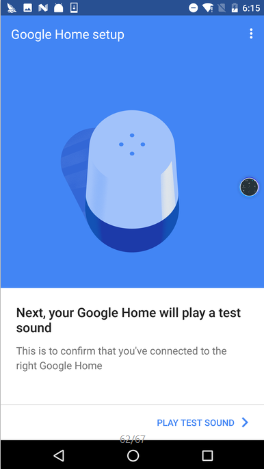  

When you hear the sound, tap I HEARD IT, otherwise tap TRY AGAIN. Then type your Google Home name and tap CONTINUE.

  

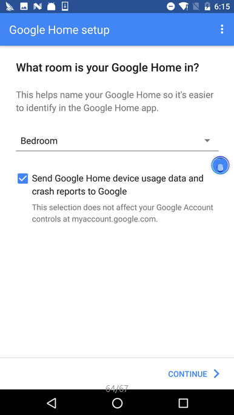

In this page, choose the Wi-Fi network you want to connect your Google Home to. Here you can choose to get the Wi-Fi password from your this mobile phone, or enter the password manually. After entering the password, click “CONTINUE” and the prompt for successful configuration displays.

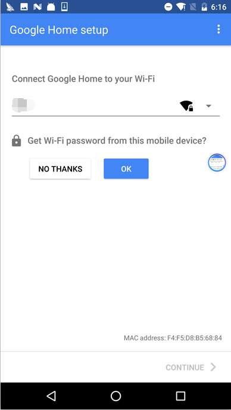

  

After setting some basic parameters of Google Home, go back to the Home page and you will see your Google Home device.

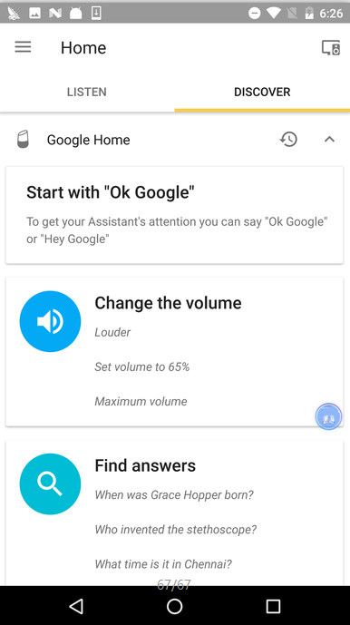
 
### 4.1.2 Set up Google Home via Google Home App (iOS)

For how to set up your Google Home with iOS device, click here.

https://support.google.com/googlehome/answer/7029485?hl=en&ref_topic=7196250&co=GENIE.Platform%3DiOS&oco=0

## 4.2 Invoke Action and link Action to Gizwits Gokit App user account

### 4.2.1 Invoke Action using Google Home 

Keep the Google Home microphone on and say “OK, Google. Talk to Gokit” to Google Home. After that, the DISCOVER page will pop up the Gokit terms and policies. Swipe left from the right of your DISCOVER screen to find the Link to Gokit box, and click “LINK”.

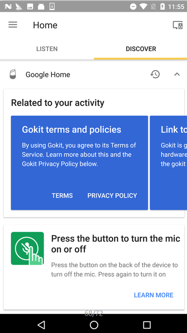

  
### 4.2.2 Invoke Action using smart phone

Go to the Google page. Long press the Home key will bring up the Google Assistant conversation box, where you can input “Talk to Gokit” in the form of text or voice. Then a “Link Gokit to Google” box is replied. Click it to link Action to Gizwits Gokit App user account.

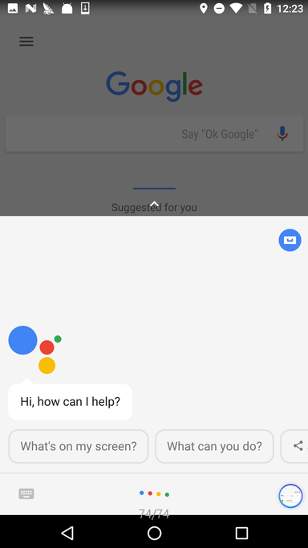

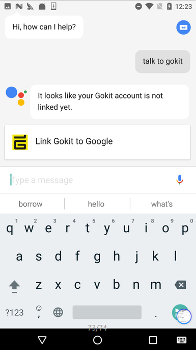
  

### 4.2.3 Link Action to Gizwits Gokit App user account

Now jump to the login page, where you need to input the username and password registered with Gizwits Gokit App. Then click Sign in.

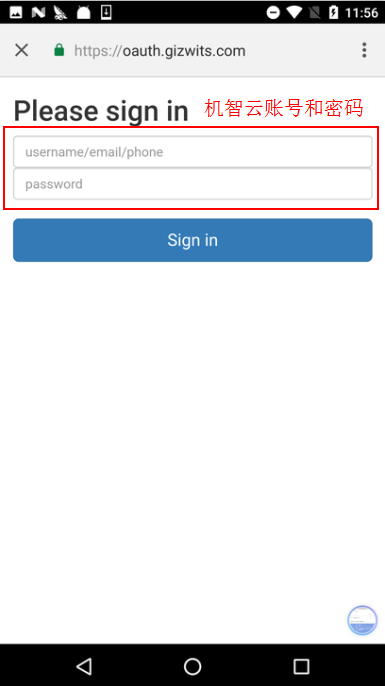

  
# 5. Appendices

## 5.1 How to control Gokit with "Gokit" Action

* Utterance sample: OK Google, talk to Gokit and turn on the light
* OK Google -> Used to wake up Google Home (Hey Google is also applicable. They are not needed for Smart phone)
* Talk to Gokit -> Used to invoke the Action
* turn on the light-> Command to control the Gokit

Voice command |	Response of Google Home |	Intended effect
---|---|---
OK Google, talk to Gokit|	Welcome to Gokit. I will now receive commands for your device. If you need more help, say help.	|Wake up Google Home.
OK Google, talk to Gokit and help	|You can say turn on the light or motor to control the sensor on Gokit.	|Google Home provides users brief help information and keeps a back-and-forth conversation with the user.
OK Google, talk to Gokit and turn on the light	|The light is on.	|Gokit LED is on.
OK Google, talk to Gokit and turn off the light	|The light is off.	|Gokit LED is off
OK Google, talk to Gokit and turn the light to red	|The light is red.	|Gokit LED light turns red.
OK Google, talk to Gokit and turn the light to green	|The light is green.	|Gokit LED light turns green.
OK Google, talk to Gokit and turn the light to blue	|The light is blue.	|Gokit LED light turns blue.
OK Google, talk to Gokit and turn on the motor	|The motor is on.	|Gokit motor is running.
OK Google, talk to Gokit and shut down the motor	|The motor is off.	|Gokit motor has stopped.

