title: Control device using Gizwits Open API
---
# Overview

This guide explains how to leverage postman on the PC side to work with Gizwits Open API provided by Gizwits on the cloud side, and walk you through user login, device binding, and device remote control etc. via HTTP requests. 

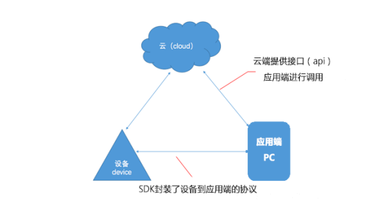
 
# Prerequisites

* Device: Developer Center - Personal Project - Virtual Device
* Software: Postman
* Other: developer account of Gizwits
* Reference document: Open API guide
* Helper links:
	* [Unix timestamp](http://tool.chinaz.com/Tools/unixtime.aspx)
	* [MD5 encryption](http://tool.chinaz.com/Tools/md5.aspx)

# Product Creation in Gizwits IoT Cloud

## 1. Create a product

After the registration is completed, log in to the Gizwits Developer Center and click on the "Create Product" menu in the upper right corner. Create a new product called "Openapi" on the next page and choose "Wi-Fi/Mobile network access", then complete product creation, as shown below:

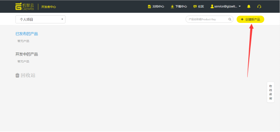

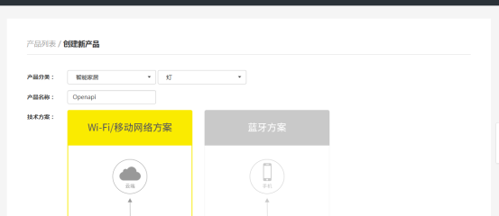
 
 
## 2. Create Data Points

### 2.1 Introduction to Data Points

Data Point: An abstraction of the functionality of a device product that describes the product's functionality and its parameters. After the Data Point is created, the data format of the communication between the device and the cloud is determined, and the device and Gizwits IoT Cloud can mutually identify the data that the device interacts with the Gizwits IoT Cloud. For more details, see "Data Point tutorial" in the upper right corner of the Developer Center Data Points page, which helps you create Data Points that belong to your own product, as shown below:

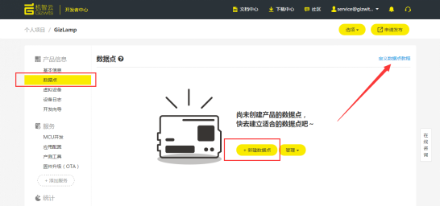
 
### 2.2 Create Data Points

Take the project "Openapi" as an example to briefly describe the relationship between cloud Data Points and product function points. Project "Openapi" is supposed to implement the function that turns on and off a light remotely. You need to create a “Boolean” writable Data Point in the cloud to work out it, as shown below:

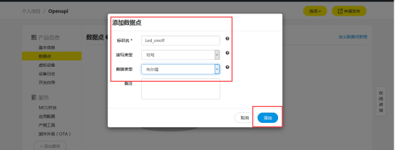
 
After adding the Data Point, click "Apply" as shown in the figure below to complete entire Data Point creation work for the product.

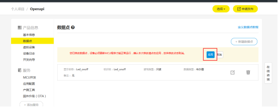
 
### 2.3 Application configuration

Take the "Openapi" personal project as an example, click on Service - Application Configuration - Add New Application, as shown below:

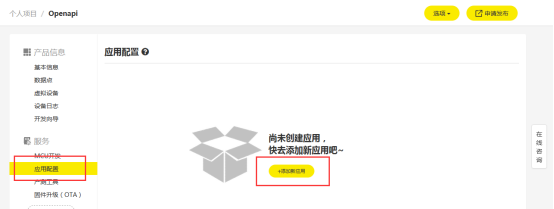
 
After filling in the application name which can be cusomizable, select Android for the platform, click Add, as shown below:

 
Then a new application will appear. Note that App ID is an important parameter to be used by the subsequent HTTP request, as shown below:

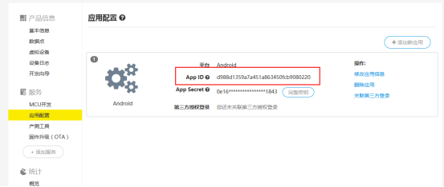
 
## 3. Postman installation and import

1) Go to the official website to download the latest postman client.

Postman official website: https://www.getpostman.com

2) After the registration is done, there only exists Postman own Echo in the left collections pane. You need to click “import” in the upper left corner, or follow the Open API documentation in the documentation center to proceed. For example, you can fill in such fields like url, header, key and value in the body according to the request type. 

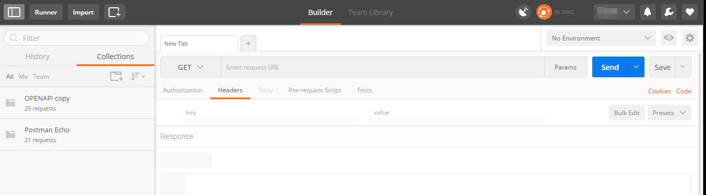
 
3) Choose to import the prepared requests, as shown below:

 
Fill in the Import From Link tab:

https://www.getpostman.com/collections/d6c5981977683526877f

Then click “import” and the folder shown below will appear:

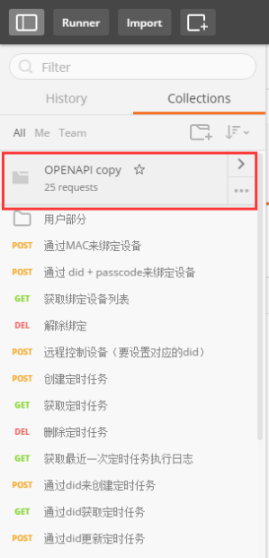
  
## 4. Use Postman for HTTP requests

Steps:

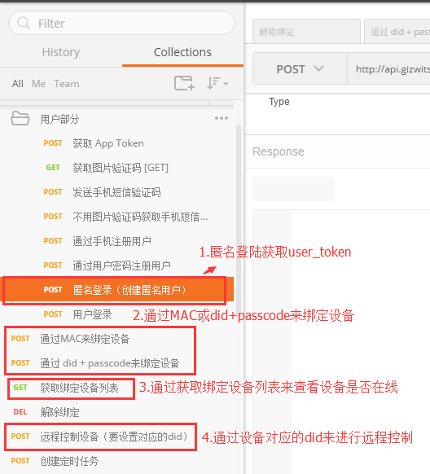
 
### 4.1 Obtaining User_token via anonymous login POST request

First, use the anonymous login with POST request to obtain the Token. App ID can be found in section 2.3) Application configuration. Set the App ID in the Headers page, and phone_id in the Body page. Then click “Send” to send request, the result will pop up in the bottom box. If you get User_token in the Body, the request is successful, as shown below:
 

 
### 4.2 Obtain did and passcode of virtual device

Go to the Personal Project - Virtual Device, click “start virtual device”, get the virtual device did and passcode as shown below:

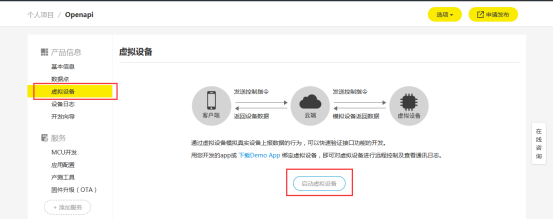

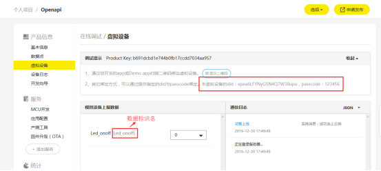
 
### 4.3 Bind device through POST request with did and passcode

Choose to use the POST request with did and passcode to bind the device. Set App ID and User_token obtained earlier in Headers, and above did and passcode in Body. If returning success, the binding is successful, as shown below:

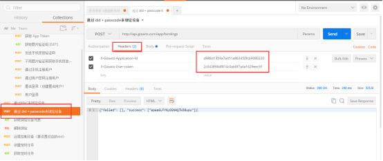

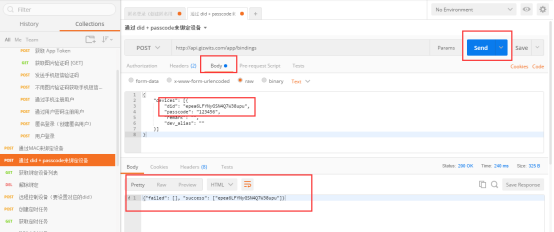
 
 
### 4.4 Bind device through POST request with MAC (Note: this step can be skipped if above step is successful)

Choose to use the POST request with MAC to bind the device. Pass the App ID and User_token obtained earlier in the Headers. The Timestamp is a Unix timestamp (its expiration time is 5 minutes). You can get Signature using MD5 encryption method {MD5 (product_secret+X-Gizwits-Timestamp).lower()}. Pass the product_key and the device MAC in the Body, then click “send”. If the action is successful, you will find that the device is online as shown below:

Note: The links for obtaining Timestamp and Signature are

* [Unix timestamp](http://tool.chinaz.com/Tools/unixtime.aspx)
* [MD5 encryption](http://tool.chinaz.com/Tools/md5.aspx)

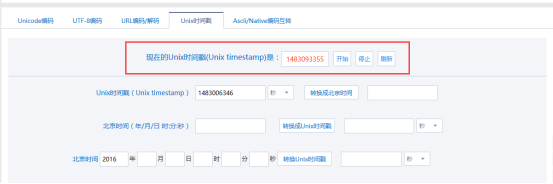

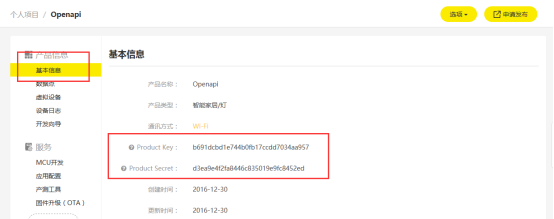

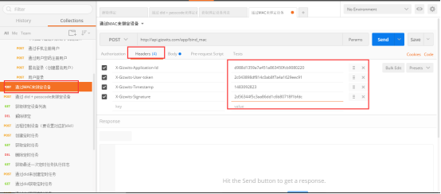

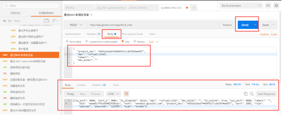
 
 
 
### 4.5 List bound devices through GET request to check device online/offline state 

Choose “Get request for listing bound devices”. Pass App ID and User_token in the Headers. Click “Send”, then a JSON string will be returned. The value of "is_online" is true to indicate that the device is online, as shown below:

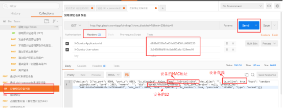
 
### 4.6 Control device remotely through POST Request

Choose “Control devices remotely through POST Request”. Pass the App ID and User_token in the Headers, device ID (did) at the end of Url and the Data Point name and its value in the Body with JSON format. Click “Send”, and return empty to indicate success, as shown below:

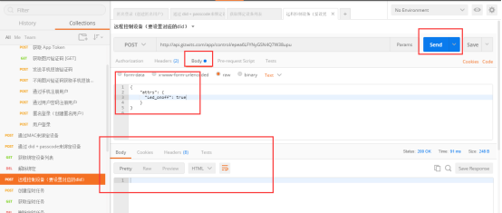
 
 
### 4.7 Verify whether the device is under control

Return to the personal project, and you can find that the Boolean Data Point named Led_onoff of the virtual device has been set to true according to the communication log, as shown below:

