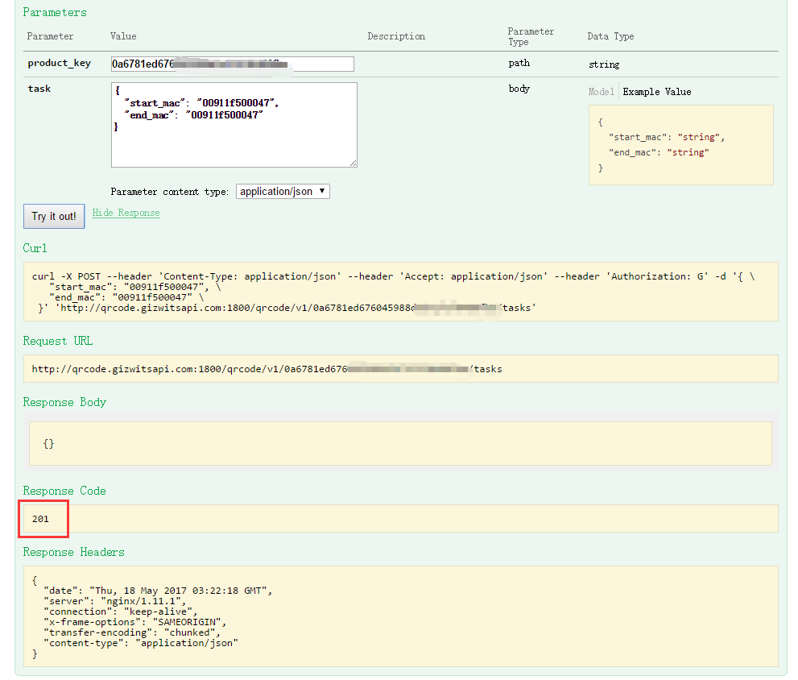
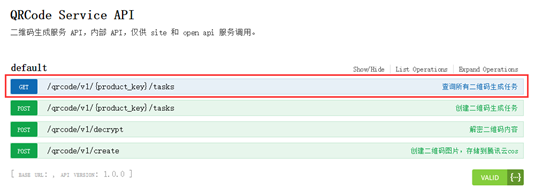
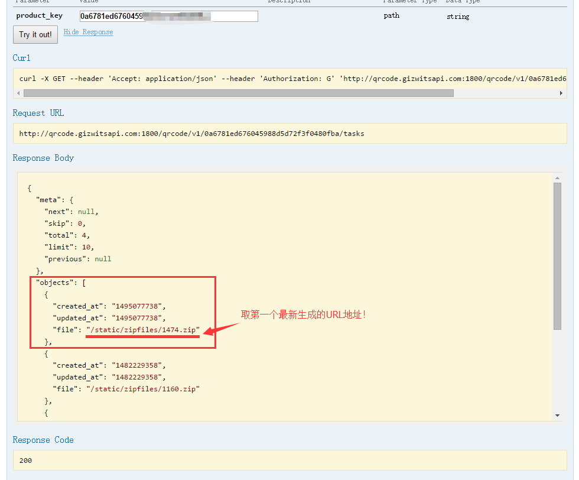
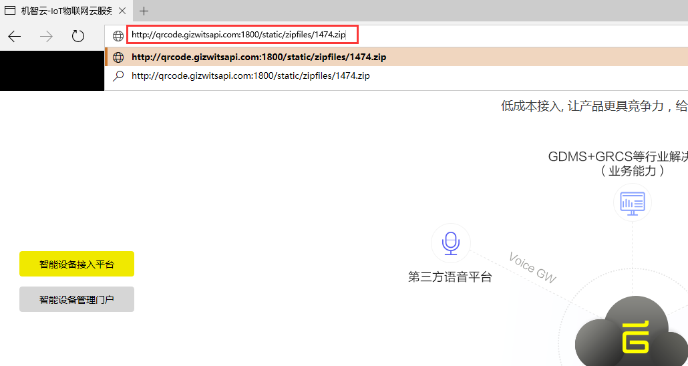
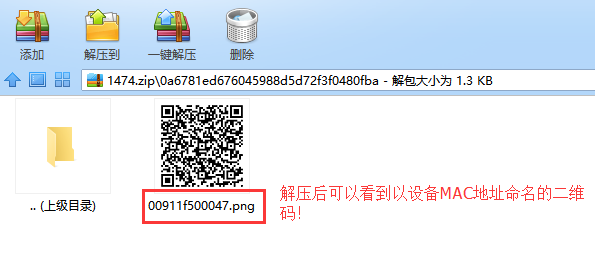

title: Generating device QR code for App binding
---

# Overview

A QR code scanning API for App binding is reserved in the Gizwits App SDK, which can be used to directly bind devices by App through scanning the GPRS devices (or Wi-Fi devices). This article describes how to generate the device QR code through the API.

# Steps

## 1. Navigate to the QR Code Generation Website

Open this URL in your browser http://qrcode.gizwitsapi.com:1800/doc/

## 2. Enter the authorization code 

Click "Authorize" in the upper right corner, enter "G" in the dialog box that pops up, and click the "Authorize" button.

 
 
## 3. Enter PK and MAC Address

Open the “Create QR Code Generation Task” API.

 
 
Enter product_key and the MAC address sequence used to generate QR code.

 
 
## 4. Generate QR code

Click “Try it out!” to create a generation task. If it returns 201, the QR code is generated successfully.

 
 
## 5. Query the generated QR code

Open the "Query All QR Code Generation Tasks" API.

 
 
Enter product_key, click "Try it out!" to query the generation task.

 
 
The generated results include the relative path of the file download URLs.

 
 
## 6. Download the QR code

In the browser, enter the full URL (http://qrcode.gizwitsapi.com:1800/+ URL in the figure above) to download the generated QR code images. 

The download URL in this case is: 

http://qrcode.gizwitsapi .com:1800/static/zipfiles/1474.zip

 
 
The downloaded QR code is packaged in a zip file, as shown below.

 
 
## 7. Binding device using App

After decompressing QR code zip file, you can use the Gizwits debugging App to directly scan the QR code and bind the device.

 
 
In the App development, you need to call the device binding API through QR code in the Gizwits App SDK. QR code scanning can be implemented through a third-party framework (such as zxing). You can refer to the Gizwits open source framework code. The specific device binding API call in SDK is as follows, taking Android as an example:

```
//Call device binding API
GizWifiSDK.sharedInstance().bindDeviceByQRCode(user id,user token,QR code);
//Callback for device binding
GizWifiSDKListener sdkListener=new GizWifiSDKListener() {
    @Override
    public void didBindDevice(GizWifiErrorCode result, String did) {
        super.didBindDevice(result, did);
	//Callback for successful binding
    }
}
```
