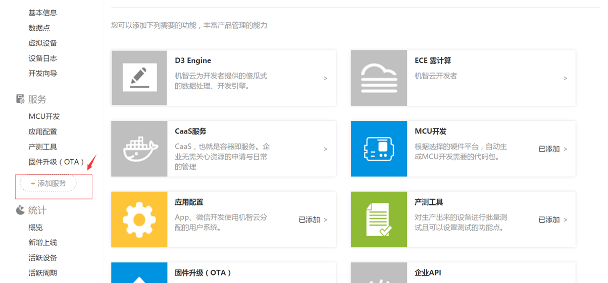
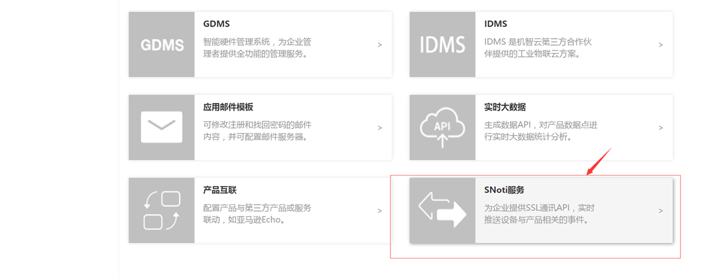
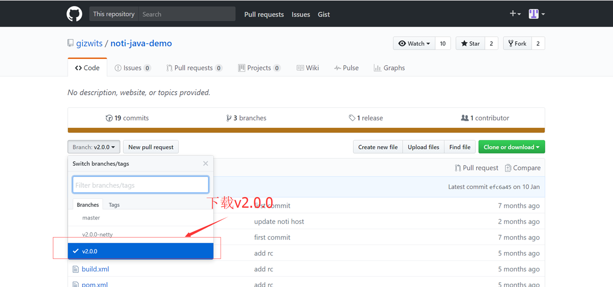
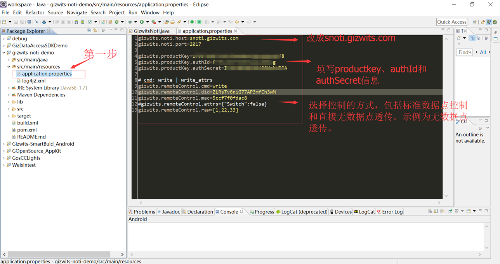
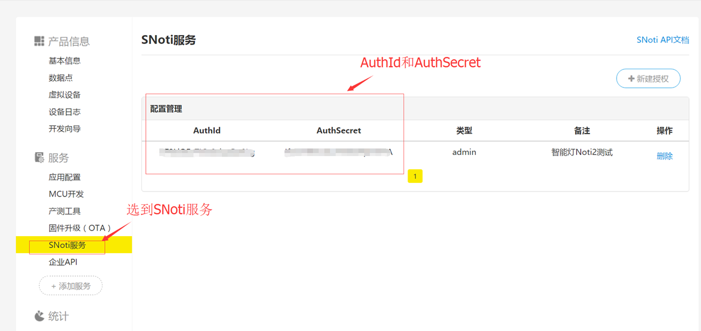
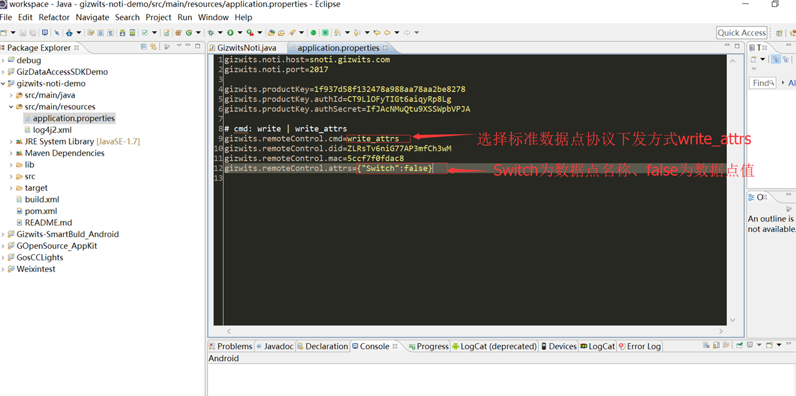
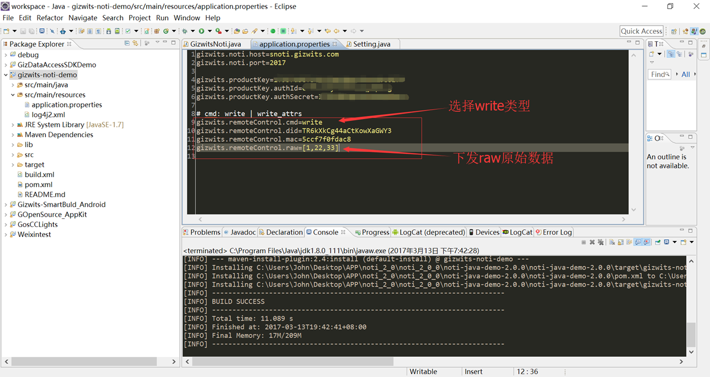
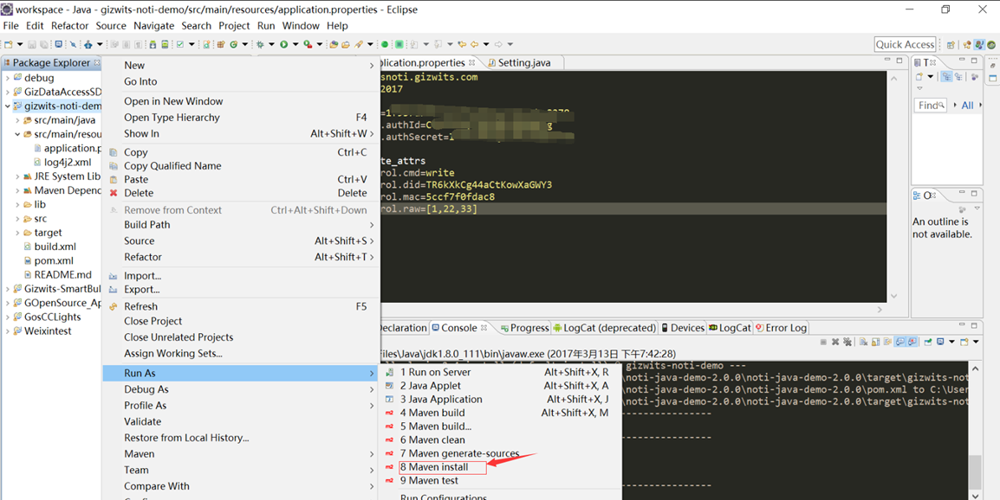
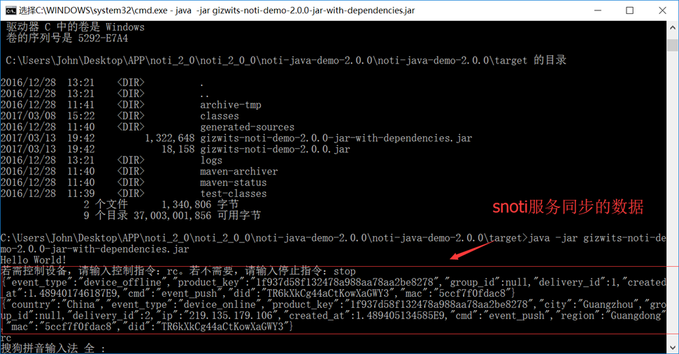
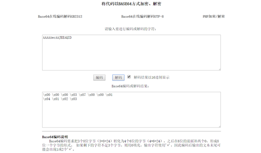

title: Real-time data synchronization demo for SNoti service 
---

# 1. Overview
SNoti provides enterprises with an SSL communication API for pushing device-related events in real time and controlling the corresponding devices.

Note: Before using the SNoti service, you must first apply for the SNoti service access and set the whitelist.


 
# 2. Set up development environment

## 2.1. Download Eclipse and JDK

Download link:
Http://jingyan.baidu.com/article/bea41d435bc695b4c41be648.html

## 2.2. Install JDK

Installation process:
Http://jingyan.baidu.com/article/d7130635194f1513fcf47557.html

## 2.3. Install Eclipse

Installation process:
Http://jingyan.baidu.com/article/d7130635194f1513fcf47557.html

# 3. SNoti service Access

## 3.1. Access request

If you decide to use SNoti for your product, you need to contact Gizwits technical support and provide the following information for the product, including product key and product name.

 
 


 
## 3.2. Create credentials


 
# 4. Run the demo

## 4.1. Download SNoti demo source code

SNoti demo source code download link:  

https://github.com/gizwits/noti-java-demo/tree/v2.0.0-netty

Gizwits provides two sets of SNoti demo source code:

* V2.0.0-netty has a framework with its own dependency libraries.
* V2.0.0 has no framework, which will be explained below. Download it as shown below:

 

## 4.2. Update settings in the source code



Find AuthId and AuthSecret as follows:


 
## 4.3. Control device

Note: 

1. If you attempt to test the virtual device on Gizwits official website, the MAC address should be assigned with virtual:site
2. If you need to access SNoti servers in US East region, the domain name should be changed to ussnoti.gizwits.com
3. The JSON data of issued control instructions follows UTF-8 format

### 4.3.1. Issue control instructions in V4 product data point format



Types of writable data points include: Boolean, enumeration, numeric, and extended type. The format is "name1": value1, of which "name1" refers to the name of the data point, and value1 refers to the value of the data point. The value might be true/false (bool), a Unicode encoded string such as \u62bd(enum), a number or byte array (such as [23,2,3], for extended type). See the following examples:

* a. Boolean type, e.g. attrs={"Switch":false}
* b. Enumeration types, e.g. attrs={"Mode":"Sleep Mode"}//If issuing the enumeration type data point value with its original text string directly, it will fail. Thus, check if the format of the delivered text is UTF-8. If not, please send it after conversion. Take attrs={"Mode":"休眠模式"} as an example, since the delivered JSON data "休眠模式" is not in UTF-8 format, it should be converted to attrs={"Mode":"&#x4F11;&#x7720;&#x6A21;&#x5F0F;"}. 

Following online UTF-8 encoder is recommended:

http://tool.chinaz.com/tools/utf-8.aspx


 
* c. Numeric type, e.g. attrs={"Motor_Speed": 5}
* d. Extended type, e.g. attrs={"extension":[1,2,3,4,5,6,7,8,9,0]}

### 4.3.2. Issue control instructions in V4 product custom format (for transparent transmission without data points)

(1) Issue SNoti control instructions



The format for sending raw data looks like this: raw={1,22,33}
Note: the binary data should be converted to a byte array. If you want to send 010203, it should be

```
{
"raw": [1, 2, 3]
}
```

In general, a protocol payload is a hexadecimal array, such as [0x00, 0x00, 0x1a, ...].

Here you need to convert it into a decimal array. For example, the payload of decimal 123 is supposed to be raw=[123]

(2) Device reports its state
After the device receives a control instruction issued by the cloud, the device actively reports its current state.

FF FF 00 09 05 00 00 00 04 01 02 03 18

Because the data received is transparently transmitted, it is base64 encoded, and you have to decode it yourself. 
 


Online base64 decoder link:

 http://www1.tc711.com/tool/BASE64.htm

## 4.4. Run Maven project

(1) Right-click the project, select Run As->Maven Install, and then click Run.



(2) Run cmd.exe and open the target directory. Run java -jar gizwits-noti-demo-2.0.0-jar-with-dependencies.jar



(3) Input rc to issue a control instruction. Check the cloud communication log to see if it succeeds.

Figure 1: The project uses V4 product data point format to issue a control instruction


Figure 2: The project uses V4 product custom format (transparent transmission without data points) to issue a control instruction


 
(4) The device actively reports its current state.

FF FF 00 09 05 00 00 00 04 01 02 03 18

Because the data received is transparently transmitted, it is base64 encoded, and you have to decode it yourself.


Base64 decoding as follows


 
# 5. Reference guide

SNoti API:
http://docs.gizwits.com/en-us/Cloud/NotificationAPI.html
