title: Control device using Gizwits Web Socket API
---
# Overview

Remote device control with JavaScript in Web page is implemented by calling the open API and Web Socket API of Gizwits. Gizwits Open API accomplishes operations such as anonymous user login, device binding, and listing bound devices. While Web Socket API accomplishes operations such as user login, device online and offline notification, data exchange between the browser and the cloud (data transparent transmission), heartbeat, and invalid message notification. 

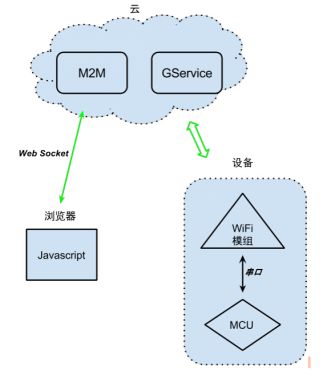
 
When the device is successfully connected to the cloud, you can use the following process to control the device:

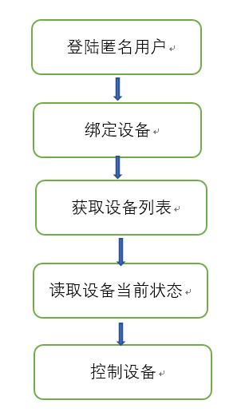
 
# Preparation

Call Gizwits Open API to log in as an anonymous user and bind devices.

## 1. Get phone_id

phone_id can be the unique identifier of user's phone. Otherwise when you already have your own user system and don't want users to sign up for a Gizwits account again, you can use this API to create a corresponding Gizwits anonymous account for each of your users. In this case, phone_id can be the unique identifier of the user in your system. For example, when integrating with WeChat application, phone_id can be set to the openid of the WeChat user.

## 2. Create user

http://swagger.gizwits.com/doc/index/openapi_apps#/用户管理/post_app_users

### 2.1. Set the appid

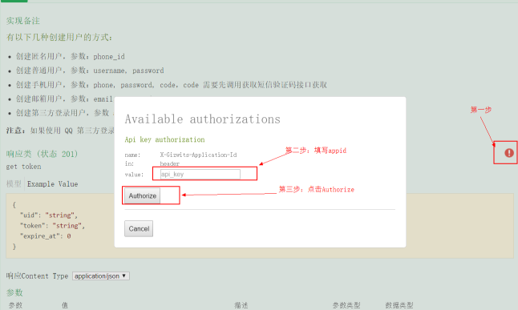
 
### 2.2. Set the body


 
### 2.3. Log in as an anonymous user and get a token


 
## 3. Binding device

POST request URL:

http://swagger.gizwits.com/doc/index/openapi_apps#/绑定管理/post_app_bind_mac

### 3.1. Set the appid

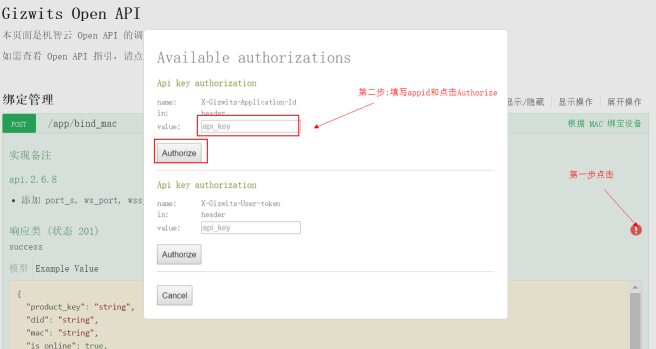
 
### 3.2. Enter the returned token when logged as an anonymous user


 
### 3.3. Set Timestamp, Signature and Body parameters


 
Note: 

* Timestamp helper link, http://tool.chinaz.com/Tools/unixtime.aspx
* MD5 helper link, http://tool.oschina.net/encrypt?type=2

As shown below:

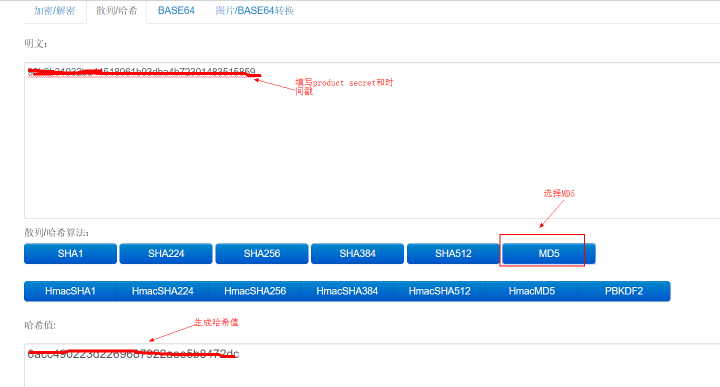
 
# Control device using Web Socket API

## 1. SDK for Web Socket API 

Its link is as follows:

https://github.com/gizwits/gizwits-wechat-js-sdk

## 2. Run index.html

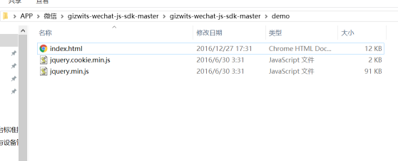
 
## 3. Control device using Web Socket API

https://gizwits.github.io/gizwits-wechat-js-sdk/v0.2.0.html


# Control device in two ways

## 1. Data Point Protocol v4

### 1.1. Initialize Gizwits WS Object

The request parameters are:

Param |	Description	| Value
------ | ------ | ------
apiHost|	Gizwits Open API domain	|api.gizwits.com
commType	|Data Point Protocol v4	|attrs_v4
wechatOpenId	|OpenID of WeChat user (i.e. phone_id)	|String
gizwitsAppId	|Gizwits application identifier|	String

Initialize as follows:


 
### 1.2. Get a bound device list

If you want to obtain the bound device list, first confirm whether the user (i.e. openid) has bound the devices to be controlled.

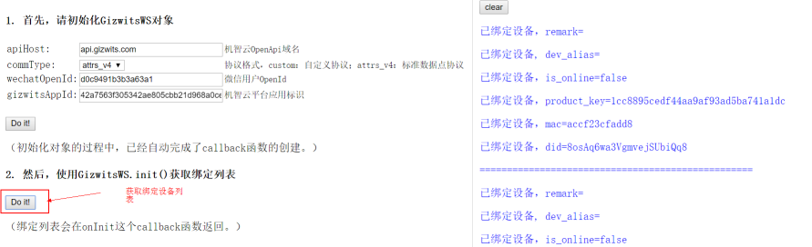
 
### 1.3. Create a Web Socket Connection

Select a device to control, and create a Web Socket connection.

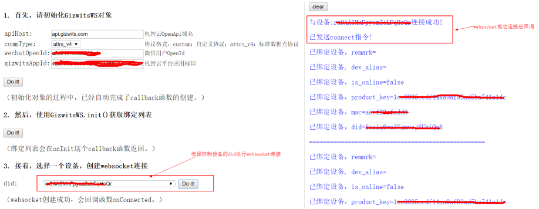
 
### 1.4. Read the current state of the device

Select the connected device and read the current state of the device.


 
### 1.5. Control device

Select the connected devices and issue command.

For example, send the command {"Swicth":true} as follows:

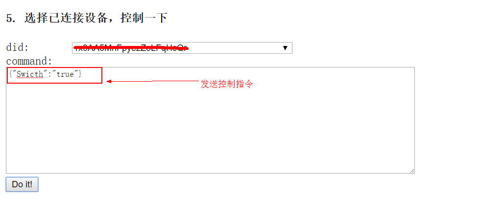
 
* If you want to set the value of the extension type field binary to hexadecimal value 616263, each byte of the binary string is converted to an integer type element of an array after padding the extension type field to the given length.
* Set the Boolean type field to true or false.

```
{
    "boolean":true,
    "binary": [97,98,99,0,0,0,0,0,0,0]
}
```

Control the virtual device:

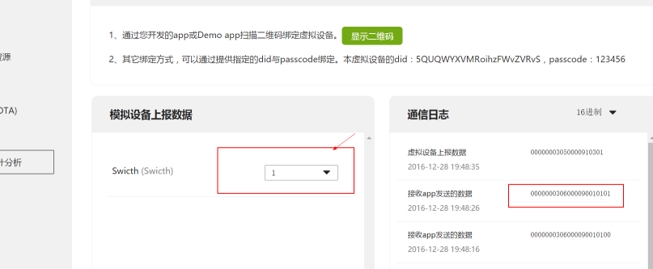
 
## 2. Raw Data Protocol v4

The Raw Data Protocol v4 is also called transparent transmission protocol without Data Points.

### 2.1. Initialize Gizwits WS Object

The request parameters are:

Param |	Description	| Value
------ | ------ | ------
apiHost	|Gizwits Open API domain	|api.gizwits.com
commType	|Custom format protocol	|custom
wechatOpenId	|OpenID of WeChat user (i.e. phone_id)	|String
gizwitsAppId	|Gizwits application identifier	|String

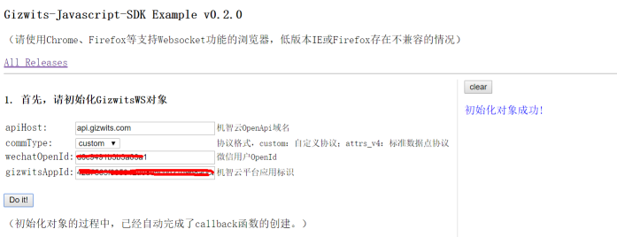
 
### 2.2. Get a bound device list

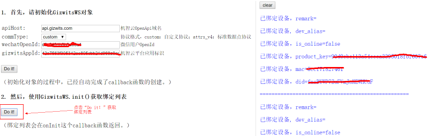

### 2.3 Create a Web Socket connection

Select a device to control, and create a Web Socket connection.

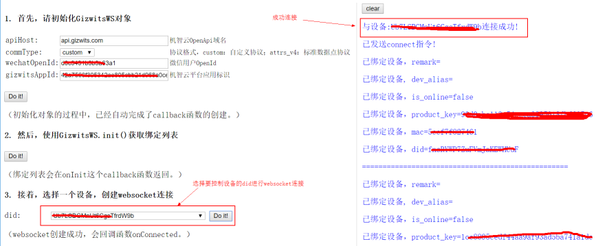
 
### 2.4. Read the current state of the device

Select the connected device and read the current state of the device:

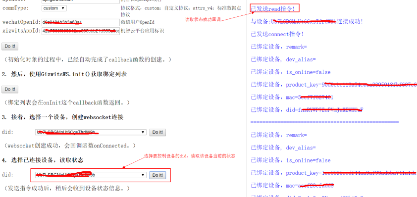
 
### 2.5. Issue command

Select the connected device and issue the command: [0,0,0,3,9,0,0,144,1,0,1,2,3,4] (Note: The command payload is an integer, of which 0,0,0,3 is for header, 9 for len, 0 for flag, 0,144 for cmd, 1 for action, 0, 1, 2, 3, 4 for business command), as follows:

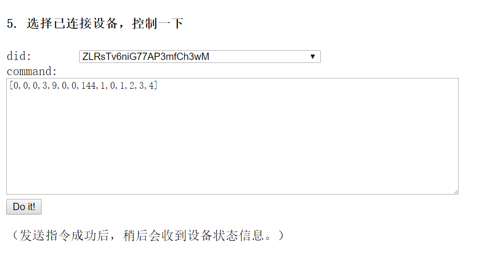
 
The virtual device receives the command as follows:

FF FF 00 0B 03 1E 00 00 01 00 01 02 03 04 37

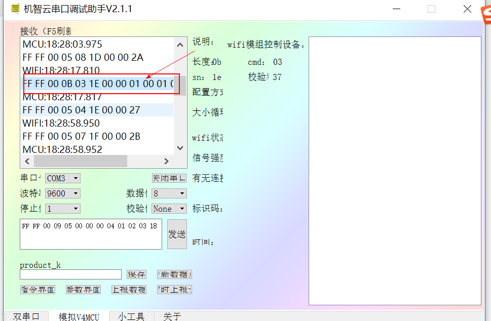

