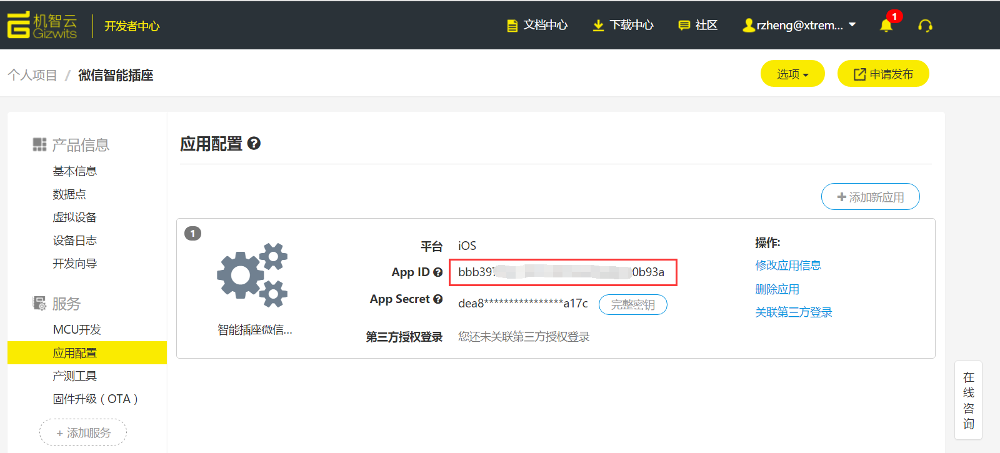
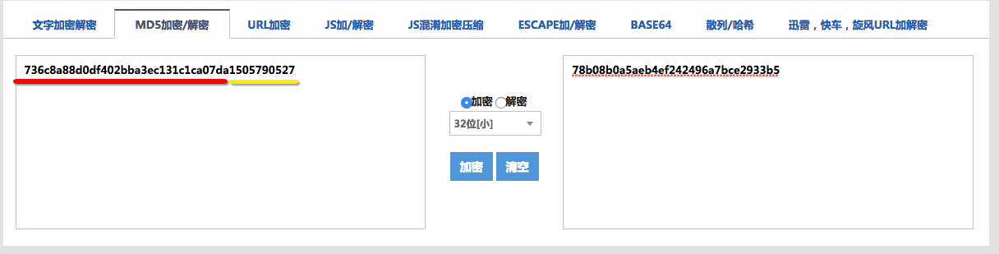

title: Gizwits Open API
---

* Ctrl + F on a Windows, is the keyboard shortcut for quick search.
* Command+F on a Mac, is the keyboard shortcut for quick search.

# Overview

Gizwits is an open IoT device management platform that provides enterprise and individual developers with services such as fast device onboarding, provisioning, authentication, configuration, remote monitoring, task scheduling, and advanced data analytics. 

Gizwits exposes a significant range of functionality via Open API. 

The Open API lets developers securely authenticate users with custom applications so they can control the Gizwits powered devices associated with their accounts.

# APIs

The following are several sets of API lists that specify the structure of the data that is exchanged between your applications and the Gizwits Cloud.

* User Management：Manage user registration, login, password reset etc.

API List  |  Description
------ | ------
get_app_users|Get user information
post_app_users|Create a new user
put_app_users|Update user information
post_app_login|User login
post_app_request_token|Request an access token
post_app_reset_password|Request to password reset
post_app_sms_code|Get and verify a SMS verification code
get_app_verify_codes|Get an image verification code
post_app_verify_codes|Verify an image verification code
put_app_verify_codes|Verify a SMS verification code

* Message Center：Get, mark as read and delete system messages etc.

API List  |  Description
------ | ------
get_app_messages|Get a message list
put_app_messages|Mark as read or delete a message

* Binding Management：Bind/unbind user and devices.

API List  |  Description
------ | ------
post_app_bind_mac|Bind a device by its MAC address
delete_app_bindings|Unbind devices
get_app_bindings|Get a list of bound devices
post_app_bind_latest|Bind a device by its QRCode
put_app_bindings_did|Update binding information
get_app_did_bindings|Get guest users information for a given device

* Device Remote Monitoring: Get device current status, reported raw data, online&offline status records, and control it remotely etc.

API List  |  Description
------ | ------
get_app_devdata_did_latest|Get latest status of a given device
get_app_datapoint|Get the definition of product datapoint
get_app_devices_did|Get details of a given device
get_app_devices_did_raw_data|Get communication log and online&offline status records of a device|
post_app_control_did|Control a given device remotely

* Device Sharing: Users share their own bound device to other users to bind, and unbind other users' binding to their own devices, etc. 

API List  |  Description
------ | ------
get_app_sharing|Get a list of sent and received sharing invitations
post_app_sharing|Create a sharing invitation
delete_app_sharing_id|Cancel/retract a sharing invitation
put_app_sharing_id|Accept/reject a sharing invitation
get_app_sharing_code|Get sharing invitation information of a given QRCode
post_app_sharing_code|Accept a sharing invitation by a given QRCode
put_app_sharing_idalias|Update a guest or owner alias of a given invitation
post_app_sharing_did_transfer|Transfer ownership of a device to a guest

* Device Grouping: Group multiple devices so that send an instruction to control multiple devices incoming a group at once.

API List  |  Description
------ | ------
get_app_group|Get all user groups
post_app_group|Create a group
delete_app_group_id|Delete a device group
put_app_group_id|Update group information
get_app_group_id_devices|Get devices information of a given group
post_app_group_id_devices|Add devices into a group
delete_app_group_id_devices|Remove devices from a group
post_app_group_id_control|Control all devices in a given group

* Devices Linkage: Set up rules of devices linkage that will be triggered by some devices to control other devices. 

API List  |  Description
------ | ------
get_app_rules_params|Get datapoints of all products can be used by rules 
get_app_rules|Get rules list for devices linkage
post_app_rules|Create a rule of devices linkage
delete_app_rules|Delete a rule of devices linkage
put_app_rules|Update a rule of devices linkage

* User Scenario: Predefine a series of device actions according to a scenario that will be triggered when needed.

API List  |  Description
------ | ------
get_app_scene|Get all scenarios
post_app_scene|Create a scenario
delete_app_scene_id|Delete a scenario
put_app_scene_id|Update a scenario information
get_app_scene_id_task|Get task execution status of a given scenario
post_app_scene_id_task|Perform a scenario task

* Task Scheduling Management: Addition, deletion, modification, etc. of device task scheduling.

API List  |  Description
------ | ------
get_app_devices_scheduler|Get a list of scheduled tasks
post_app_devices_scheduler|Create a scheduled task
delete_app_devices_scheduler|Delete a scheduled task
put_app_devices_scheduler|Update a scheduled task

* Common Task Scheduling: Schedule tasks for individual devices, device groups, and scenarios.    

API List  |  Description
------ | ------
get_app_common_scheduler|Get a common scheduled task
post_app_common_scheduler|Create a common scheduled task
delete_app_common_scheduler|Delete a common scheduled task
put_app_common_scheduler|Update a common scheduled task

* Advanced Data API: Retrieve aggregated values of daily maximum, average, etc. for the numeric data reported by devices.

API List  |  Description
------ | ------
get_app_bindings|Get an aggregated value of a given device

* System Information: Check the current version of Open API and retrieve a list of all possible errors.

API List  |  Description
------ | ------
get_status|Get service status
get_errors|Get error status code list

# Specification

## Using HTTP API

Gizwits Open API exposes a significant range of functionality via a RESTful API set, which can be accessed via any client using standard HTTP.

Recommended HTTP Clients：

* GUI  client PostMan
* Command-line client curl

## HTTP Request Headers

### X-Gizwits-Application-Id

X-Gizwits-Application-Id referred to as AppID, is a unique identifier applied to the Gizwits platform. When issuing a HTTP request, your request must include this header parameters.

On the product page of the developer center, click the "Application Configuration" menu in the left column to create an application and get an AppID as well:


 
### X-Gizwits-User-token

X-Gizwits-User-token referred to as UserToken, represents the user context during the API interaction.

UserToken has a validity period. By default, it expires after 7 days.

UserToken can be obtained through user registration or login request. UserToken is the token field returned in the response, and expire_at field is the timestamp of UserToken expiration:

```
{
  "uid": "29db4f0d806e451a84264ba3da64d9de",
  "token": "86a0ee91548f4971832e371811702316",
  "expire_at": 13894002020
}
```

A new UserToken is generated when login request is issued every time. Either the new UserToken or the old one can be used.

Because most of the Gizwits Open API are user-related, the call sequence of APIs is as follows generally:

1. Check if there is a local UserToken, and if it expires
2. If there is no UserToken or UserToken expired, issue the user login request, get and save the returned UserToken
3. Use the UserToken to call other APIs

## Encrypting Parameters

* Use 32-bit encryption uniformly
* Lower: lowercase
* Upper: uppercase

Example：

lower (md5(product_secret + X-Gizwits-Timestamp ))

Select md5, 32 bits [small] for encryption, fill in product_secret and X-Gizwits-Timestamp, without the "+" sign, as shown below


 
# Online debugger

We provide online API debugging tools. The corresponding debug link is given in each API description.

The following example illustrates the usage of API debugging tools via user login:

* Click  user login to enter the API debugging page
* There is a red exclamation mark on the right side of the API. After clicking it, a dialog box pops up prompting for the required header information.
* The API needs to enter the X-Gizwits-Application-Id, get the AppID according to the previous instructions and fill it in, click "Authorize" to authorize
* The page is automatically refreshed and the exclamation mark turns blue, indicating that the required header information has been filled in (filled does not necessarily indicate that the value is correct. If the value is incorrect, the corresponding result will be returned in the response)
* Enter the parameter value in the input box (click the Example Value yellow box to the right of the parameter to enter the sample JSON quickly)
* Click the "Try" button to complete the API request
* The request completes, displaying the equivalent curl statement of local call, request URL, response body, response code, and response header

# User Management

## Create a user

Debug console

There are several ways to create new users:

* Anonymous registration, creating a user with a unique phone_id
* User name&password registration, create a user by username and passowrd
* Mobile phone registration, create users via phone, password and code (SMS verification code). About SMS verification code acquisition, please refer to the following section.
* Email registration, create users via email and password
* Third-party authentication, creating a user through src, uid, and token in authData. Currently supports Tencent QQ, Sina Weibo, Baidu, WeChat, Facebook, Twitter, Google+, Amazon

Third-party authentication notes:

* For Google and Amazon third-party authentication, token in authData needs to start with "Bearer"
* For QQ and Twitter third-party authentication, it needs to fill API_KEY and API_Secret in Developer Center
* Facebook, Twitter, Google, Amazon third-party authentication can only be used in the Eastern United States and Europe regions

Password strength requirements:

* The password length is not less than 8 characters
* The password should be combination of three of four types of characters, which are uppercase, lowercase, numbers, special symbols

Request method and URL

```
POST
http://api.gizwits.com/app/users
```

Request paramters

Params | Data Type |  Required  |  Param Type | Description
-----|-----|-----|-----|-----
X-Gizwits-Application-Id  |  string | Yes |header|  appid
phone_id    |string | No|  body  |  Anonymous identity, the request parameter for anonymous registration
username  |  string|  No | body|    User name, the request parameter for user name&password registration 
password   | string | No | body  |  Password, the request parameter for username&password registration, mobile registration, email registration
email   |string | No|  body  |  Email Address, the Request Parameter for Email registration 
phone   |string | No|  body   | Mobile phone number, the request parameter for mobile phone registration
code  |  string|  No | body|    Verification code, SMS verification code, request parameter for mobile registration
lang  |  string | No | body |   Language:en,zh-cn
src| string|  No | body |   Platform type: qq, sina, baidu, wechat, twitter, facebook, google, amazon
uid |string|  No | body  |  returned uid from third-party authentication platform 
token |  string|  No|  body |   returned token from third-party authentication platform 

Response Parameters

Params | Data Type |  Description
-----|-----|-----
uid| string | Unique user id
token  | string | User token
expire_at  | integer| Token expiration time (timestamp)

Example Response

```
{
  "token": "f8324047f20144f6914e7be19304f943",
  "uid": "f082f4e235974cfeb6a1b40a6024f47e",
  "expire_at": 1504772734
}
```

## Get user information

Debug console

Request method and URL

```
GET
http://api.gizwits.com/app/users
```

Request paramters

Params | Data Type |  Required  |  Param Type | Description
-----|-----|-----|-----|-----
X-Gizwits-Application-Id |   string|  Yes |header|  appid
X-Gizwits-User-token  |  string|  Yes| header | User token

Response Parameters

Params | Data Type |  Description
-----|-----|-----
username   | string|  User name
phone   |string | Phone number
email  | string|  Email address
name   | string | Name
gender  |string | Gender，M：Male, F：Female, N：Unknown
birthday |   string | Birthday，date format：YYYY-MM-DD or MM-DD
address| string  |Address
lang   | string|  Language version,en, zh-cn
remar  | string | Remark
uid |string | Unique user id
is_anonymous    |boolean |Is anonymous user or not

Example Response

```
{
    "username": "gizwits",
    "uid": "f082f4e235974cfeb6a1b40a6024f47e",
    "phone": "18888888888",
    "birthday": "2017-01-01",
    "address": "guangzhou",
    "lang": "zh-cn",
    "remark": "remark",
    "name": "gizwits",
    "is_anonymous": false,
    "gender": "M",
    "email": "club@gizwits.com"
}
```

## Update user information

Debug console

There are several corresponding ways to update user information for different registration types:

* Convert anonymously registered users to regular users: Enter username, password
* Convert anonymously registered users to mobile users: Enter phone, password, code (returned by obtaining the verification code API)
* Change Password: Enter old_pwd, new_pwd
* Modify phone number: Enter phone, code (returned by obtaining the verification code API)
* Modify basic information: name, gender, birthday, address, language version, remarks

Request method and URL

```
PUT
http://api.gizwits.com/app/users
```

Request paramters

Params | Data Type |  Required  |  Param Type | Description
-----|-----|-----|-----|-----
X-Gizwits-Application-Id  |  string|  Yes| header|  appid
X-Gizwits-User-token   | string | Yes| header|  User token
username   | string | No | body  |  Username for converting an anonymous user to a regular user
password   | string | No | body  |  Password for converting an anonymous user to a regular user
phone  | string  |No  |body  |  Mobile phone number for converting an anonymous user to a mobile registered user
code   | string | No | body  |  Verification code for converting an anonymous user to a mobile registered user
old_pwd |string|  No | body|    Old password, used to change the password
new_pwd |string | No  |body |   New password, used to change the password
email  | string | No | body |   Registered email for converting an  anonymous user to a registered user
name   | string  |No | body   | Name
gender | string | No | body |   Gender, M: Male, F: Female, N: Unknown
birthday   | string | No  |body  |  Birthday, date format: YYYY-MM-DD or MM-DD
address |string | No | body  |  address
lang    |string | No | body  |  Language version en, zh-cn
remar  | string|  No|  body  |  Remark

Response Parameters

Params | Data Type |  Description
-----|-----|-----
updatedAt  | string|  Update time(UTC time)

Example Response

```
{
  "updatedAt": "2017-01-01T08:32:56.996638"
}
```

## User login

Debug console

Anonymous and third-party authentication users invoke the creating user API to log in.

Request method and URL

```
POST
http://api.gizwits.com/app/login
```

Request paramters

Params | Data Type |  Required  |  Param Type | Description
-----|-----|-----|-----|-----
X-Gizwits-Application-Id  |  string | Yes| header | appid
username    |string | Yes| body  |  User name，can be the user's username/email/phone
password   | string|  Yes| body |   Password
lang    |string|  No | body  |  Language version

Response Parameters

Params | Data Type |  Description
-----|-----|-----
uid |string | Unique user id
token  | string  |User token
expire_at  | integer| Token expiration time (timestamp) 

Example Response

```
{
  "token": "f8324047f20144f6914e7be19304f943",
  "uid": "f082f4e235974cfeb6a1b40a6024f47e",
  "expire_at": 1504772734
}
```

## Request an access token

Debug console

The token parameter obtained by the API is mainly used as a request parameter when the SMS verification code API and the image verification code API are invoked.

Request method and URL

```
POST  
http://api.gizwits.com/app/request_token
```

Request paramters

Params | Data Type |  Required  |  Param Type | Description
-----|-----|-----|-----|-----
X-Gizwits-Application-Id   | string  |Yes| header  |appid
X-Gizwits-Application-Auth|  string | Yes| header  |MD5_32-bit encryption(appid + appsecret)

Response Parameters

Params | Data Type |  Description
-----|-----|-----
uid |string | Unique user id
expired_at  | integer |Token expiration time (timestamp)

Example Response

```
{
  "token": "f8324047f20144f6914e7be19304f943",
  "expired_at": 1504772734
}
```

## Request to password reset

Debug console

Only those users who have set email or phone can reset the password.

* Reset your password via email, just provide email, password reset link is sent to the email address
* Reset the password via phone, provide phone number, new_pwd, code (returned by calling get SMS verification code API)

Request method and URL

```
POST
http://api.gizwits.com/app/reset_password
```

Request paramters

Params | Data Type |  Required  |  Param Type | Description
-----|-----|-----|-----|-----
X-Gizwits-Application-Id   | string | Yes |header | appid
email  | string | No | body |   Registered e-mail
phone  | string|  No | body  |  Registered phone number
new_pwd |string | No | body |   New password
code  |  string|  No  |body  |  Verification code

Response Parameters

No

## Get and verify a SMS verification code

Debug console

The main uses of the SMS verification code are:

* Registration for mobile phone user
* Password reset for mobile phone user
* Other sensitive actions that you think require a SMS verification code
The API can obtain and verify the verification code:
* Obtaining SMS verification code only needs phone number
* Verifying SMS verification code needs phone number and code

About foreign mobile phone number

* To send a SMS verification code to a foreign mobile phone number, follow the format: +{country code}{mobile phone number}. Assume that an U.S. phone number (country code is 1) is 4246531234, then the phone should be filled as "+14246531234"
* The list of country codes can be obtained here.

The SMS verification code is invalid immediately after the code is verified correctly. The default validity period is 24 hours.

Request method and URL

```
POST
http://api.gizwits.com/app/sms_code
```

Request paramters

Params | Data Type |  Required  |  Param Type | Description
-----|-----|-----|-----|-----
X-Gizwits-Application-Id  |  string|  Yes |header | appid
X-Gizwits-Application-Token   | string|  Yes| header  |App token, obtained by request an access token API
phone  | string | Yes |body  |  Phone number
code   | string  |Yes| body  |  Verification code

Response Parameters

No

## Get an image verification code

Debug console

The returned captcha_url is the URL of the image captcha and the image is displayed to the user.

Request method and URL

```
GET
http://api.gizwits.com/app/verify/codes
```

Request paramters

Params | Data Type |  Required  |  Param Type | Description
-----|-----|-----|-----|-----
X-Gizwits-Application-Id  |  string | Yes |header | appid
X-Gizwits-Application-Token   | string | Yes |header | App token, obtained by request an access token API

Response Parameters

Params | Data Type |  Description
-----|-----|-----
captcha_url| string | URL of the image captcha
captcha_id | string | ID of the image captcha

Example Response

```
{
  "captcha_url": "http://api.gizwits.com/captcha/image/22d9cdc8edb13fd19f770afbed45351831403b5d/",
  "captcha_id": "22d9cdc8edb13fd19f770afbed45351831403b5d"
}
```

## Verify an image verification code

Debug console

Verify the image captcha obtained by get image verification code API, if it is entered correctly, a SMS verification code will be sent. 

Request method and URL

```
POST
http://api.gizwits.com/app/verify/codes
```

Request paramters

Params | Data Type |  Required  |  Param Type | Description
-----|-----|-----|-----|-----
X-Gizwits-Application-Id  |  string|  Yes |header|  appid
X-Gizwits-Application-Token  |  string | Yes| header  |App token, obtained by request an access token API
captcha_id | string  |Yes |body  |  ID of the image captcha
captcha_code  |  string | Yes |body |   Value of the image captcha
phone  | string | Yes |body   | Phone number

Response Parameters

No

## Verify a SMS verification code

Debug console

Request method and URL

```
PUT
https://api.gizwits.com/app/verify/codes
```

Request paramters

Params | Data Type |  Required  |  Param Type | Description
-----|-----|-----|-----|-----
X-Gizwits-Application-Id   | string | Yes |header | appid
X-Gizwits-Application-Token   | string | Yes| header | App token, obtained by request an access token API
phone   |string | Yes |body  |  Phone number
sms_code   | string  |Yes| body  |  Verification code

Response Parameters

No

# Message Center

## Get a message list

Debug console

Get user's messages, such as sharing information, messages pushed by D3 rules.
Request method and URL

```
GET
https://api.gizwits.com/app/messages?type=1&limit=20&skip=0
```

Request paramters

Params | Data Type |  Required  |  Param Type | Description
-----|-----|-----|-----|-----
X-Gizwits-Application-Id  |  string|  Yes |header|  appid
X-Gizwits-User-token    |string | Yes |header | User token
type   | integer| Yes |query |  Message type，1：device sharing message
limit |  integer| No  |query  | The number of returned items   
skip   | integer| No | query |  Indicates the number of skipped messages, indirectly indicating the number of pages.

Response Parameters

Params | Data Type |  Description
-----|-----|-----
total |  integer| Total number of messages
limit  | integer| The number of returned items   
skip   | integer| Number of skipped messages
previous   | string | Request address for previous page
next   | string | Request address for next page
id | string|  Message ID
created_at | string|  Message creation time (UTC time)
updated_at | string | Message update time (UTC time)
type  |  integer| Message type, 1: Device sharing message
status | integer| Message status, 0 unread, 1 read, 2 delete
content |string  |Information content

Example Response

```
{
  "meta": {
    "total": 50,
    "limit": 1,
    "skip": 0,
    "previous": "/app/messages?skip=5&type=1&limit=1",
    "next": "/app/messages?skip=7&type=1&limit=1"
  },
  "objects": [
    {
        "status": 0,
        "created_at": "2017-09-11T11:41:23Z",
        "updated_at": "2017-09-11T11:41:23Z",
        "content": "您给 188****888 共享了设备 微信宠物屋!",
        "type": 1,
        "id": "59b676638c7d500018a9ed98"
     },
  ]
}
```

## Mark as read or delete a message

Debug console

Mark user messages as read and delete messages.

Request method and URL

```
PUT
https://api.gizwits.com/app/messages/{id}?status=1
```

Request paramters

Params | Data Type |  Required  |  Param Type | Description
-----|-----|-----|-----|-----
X-Gizwits-Application-Id  |  string | Yes |header  |appid
X-Gizwits-User-token  |  string|  Yes| header | User token
id | integer |Yes |path |   Message ID
status | integer |Yes| query |  Message status, 1 read, 2 delete

Response Parameters

No

# Binding Management

After a device is bound to a user, there is a corresponding "binding role" relationship between the device and the user.

Binding roles are divided into four types, first bind users: special; owner user: owner; guest user: guest; normal user: normal

## Role scenarioes description:

* When the device is not shared and the device is not bound by any user. An A user is bound to the device. The A user becomes a special user. When a B user is bound to the device. The user B becomes a normal user.
* Let the A user be a special user and the B user be a normal user. When the A user releases the binding and the B user becomes a special user, there is no "binding role" relationship between the A user and the device.
* Let the A user be a special user and the B user be a normal user. The product turns on device sharing. The A user shares the device with the C user. Whether or not the C user accepts it, the A user becomes the owner user, and the B user becomes the guest user.
* When sharing is turned on and the device does not have any user bindings. An A user is bound to the device. The A user becomes owner user and other users cannot bind the device.
* Assume the A user as owner and C user has not bound the device. The A user shares the device with the C user, and the C user accepts the sharing. A user is still the owner and C is the guest.
* Assume the A user as owner and B user as guest. The A user unbinds the device. There is no "binding role" relationship between A or B users and the device.
* Other users cannot share the device except the owner user, there is only one owner for each device.

## Binding device

You can bind the device in two ways:

* Bind the device with product_key and MAC address
* Bind the device with a QRCode. The content of QRCode is encrypted product_key and MAC, so it is essentially the same as the above one. 

## Bind a device by its MAC address

Debug console

Bind the user to the device.

Request method and URL

```
POST
http://api.gizwits.com/app/bind_mac
```

Request paramters

Params | Data Type |  Required  |  Param Type | Description
-----|-----|-----|-----|-----
X-Gizwits-Application-Id  |  string|  Yes| header|  appid
X-Gizwits-User-token   | string  |Yes| header  |User token
X-Gizwits-Timestamp |string | Yes| header | Request timestamp, The difference with the server time cannot exceed 5 minutes
X-Gizwits-Signature |string | Yes| header|  Signature, calculated as lower(md5(product_secret + X-Gizwits-Timestamp))
product_key |string  |Yes |body  |  Product_key
mac |string | Yes| body   | Device mac address
remark | string|  No  |body  |  Remark
dev_alias  | string | No | body |   Device alias
set_owner  | integer| No | body  |  Whether it is set to owner, it is only valid for products with device sharing enabled; 0 (default): not set as owner, 1: set as owner

Response Parameters

Params | Data Type |  Description
-----|-----|-----
product_key |string | Product_key
did| string | Device ID
mac |string | Device mac address
is_online |  boolean| Whether online or not
passcode  |  string | Device passcode
host   | string  |Server domain name
port  |  integer| MQTT port number for M2M
port_s | integer| MQTT SSL port number for M2M
ws_port |integer| Websocket port number
wss_port  |  integer| Websocket SSL port number
remark | string | Device remark
is_disabled |boolean| Whether to log out or not
type   | string | Device type, Single Item Device: normal, Central Control Device: center_control, Central Control Sub Device: sub_dev
dev_alias   |string|  Device alias
dev_label  | Array[string] |  List of device tags, currently used for devices control via voice API
role   | string | Binding role, Special user: special, Owner user: owner, Guest user: guest, Normal user: normal

Example Response

```
{
    "product_key": "4214bf2d79694a259232431b6f2ef46b",
    "did": "gKufzxZwYeyd3Skbsb6mza",
    "mac": "accf2350d446",
    "is_online": false,
    "passcode": "JHHOOIWJBA",
    "host": "m2m.gizwits.com",
    "port": 1883,
    "port_s": 8883,
    "ws_port": 8080,
    "wss_port": 8880,
    "remark": "备注信息",
    "is_disabled": false,
    "type": "normal",
    "dev_alias": "设备别名",
    "dev_label": [],
    "role": "special"

}
```

## Unbind devices

Debug console

Unbind the bound devices by users.

Request method and URL

```
DELETE
https://api.gizwits.com/app/bindings
```

Request paramters

Params | Data Type |  Required  |  Param Type | Description
-----|-----|-----|-----|-----
X-Gizwits-Application-Id  |  string|  Yes |header|  appid
X-Gizwits-User-token   | string  |Yes| header  |User token
devices |Array |  Yes| body  |  Devices array to be unbound
did |string | Yes| body  |  Device ID

Response Parameters

Params | Data Type |  Description
-----|-----|-----
success |Array[string]  | Devcies that are unbound successfully
failed | Array[string]  | Devcies that are unbound unsuccessfully

Example Response

```
{
    "failed": [],
    "success": [
        "xAAcCYawLFD9JfMysqYf7d",
        "WCWGkbS4Ttynzwx9brzpEa"
    ]
}
```

## Get a list of bound devices

Debug console

Request method and URL

```
GET
https://api.gizwits.com/app/bindings
```

Request paramters

Params | Data Type |  Required  |  Param Type | Description
-----|-----|-----|-----|-----
X-Gizwits-Application-Id  |  string|  Yes| header|  appid
X-Gizwits-User-token  |  string|  Yes| header | User token
limit |  integer| No | query  | The number of returned items   
skip  |  integer| No | query  | Indicates the number of skipped records, indirectly indicating the number of pages.
show_disabled  | integer| No  |query |  Whether to display the device that has been logged out, 1: Display, 0: Do not display
show_proto_ver | integer |No | query |  Whether to display the device communication protocol version, 1: Display, 0: Do not display

Response Parameters

Params | Data Type |  Description
-----|-----|-----
devices |Array |  A group of bound devices
product_key| string | Product_key
did |string  |Device ID
mac |string|  Device MAC address
is_online |  boolean |Whether online
passcode   | string | Device passcode
host   | string | Server domain name
port  |  integer |MQTT port number for M2M
port_s  |integer| MQTT SSL port number for M2M
ws_port |integer| Websocket port number
wss_port   | integer| Websocket SSL port number
remark  |string | Device remark
is_disabled |boolean |Whether is logged out
type   | string|  Device Type, Single Item Device: normal, Central Control Device: center_control, Central Control Sub Device: sub_dev
dev_alias   |string  |Device alias
dev_label  | Array[string]  | List of device tags, currently used for devices control via voice API
proto_ver  | string | Protocol version number, '01', '01_01', '03', '04' 
wifi_soft_version |  string | WiFi version number
is_sandbox  |boolean |Whether connecting the sandbox environment
role  |  string  |Binding role, Special user: special, Owner user: owner, Guest user: guest, Normal user: normal

Example Response

```
{
    "devices": [
      {
          "product_key": "55af63815cc34788aeeb9451a2454412",
          "did": "7r7u8XPkCRLGVYTYrtjoCB",
          "mac": "virtual:site",
          "is_online": false,
          "passcode": "123456",
          "host": "sandbox.gizwits.com",
          "port": 1883,
          "port_s": 8883,
          "ws_port": 8080,
          "wss_port": 8880,
          "remark": "备注信息",
          "is_disabled": false,
          "type": "normal",
          "dev_alias": "设备别名",
          "dev_label": [],
          "proto_ver": "04",
          "wifi_soft_version": null,
          "is_sandbox": true,
          "role": "special"
      },
      {
          "product_key": "4214bf2d79694a259232431b6f22f46b",
          "did": "gKufzxZwYeyd3Skbsb6mza",
          "mac": "accf2350d447",
          "is_online": false,
          "passcode": "JHHOOIWJBA",
          "host": "m2m.gizwits.com",
          "port": 1883,
          "port_s": 8883,
          "ws_port": 8080,
          "wss_port": 8880,
          "remark": "备注信息",
          "is_disabled": false,
          "type": "normal",
          "dev_alias": "设备别名",
          "dev_label": [],
          "proto_ver": "04",
          "wifi_soft_version": "04000006",
          "is_sandbox": true,
          "role": "special"
      }
    ]
}
```

## Bind a device by its QRCode

Debug console

Only the QR code generated by Gizwits QR code generation service can be used to invoke this API (Here is the tutorial). 

Request method and URL

```
POST
https://api.gizwits.com/app/bind_latest
```

Request paramters

Params | Data Type |  Required  |  Param Type | Description
-----|-----|-----|-----|-----
X-Gizwits-Application-Id  |  string | Yes| header | appid
X-Gizwits-User-token   | string|  Yes |header | User token
qr_content | string | Yes |body |   The string obtained by scanning the QR code
set_owner   |integer| No  |body  |  Whether to set as owner, only valid for products with device sharing enabled; 0 (default): not to set as owner, 1: set as owner

Response Parameters

No

## Update binding information

Debug console

Users can modify aliases and notes of the bound devices.
The same device can be bound by multiple users. Each user can set aliases and notes for the device without conflict.

Request method and URL

```
PUT
https://api.gizwits.com/app/bindings/{did}
```

Request paramters

Params | Data Type |  Required  |  Param Type | Description
-----|-----|-----|-----|-----
X-Gizwits-Application-Id  |  string | Yes |header | appid
X-Gizwits-User-token   | string | Yes |header | User token
did |integer| Yes| path  |  Device ID
remark|  string|  No | body   | Device remark
dev_alias |  string|  No | body   | Device alias
dev_label |  Array[string]   |No  |body|    List of device tags, currently used for devices control via voice API

Note: Fill in at least one of the body parameters.

Response Parameters

Params | Data Type |  Description
-----|-----|-----
remark  |string | Device remark
dev_label   |Array[string] |  List of device tags, currently used for devices control via voice API
dev_alias  | string | Device alias

Example Response

```
{
    "remark": "备注",
    "dev_label": [
        "标签1",
        "标签2"
    ],
    "dev_alias": "设备别名"
}
```

## Get guest users information for a given device

Debug console

View user information of those who accepted device sharing invitation.

Request method and URL

```
GET
https://api.gizwits.com/app/{did}/bindings
```

Request paramters

Params | Data Type |  Required  |  Param Type | Description
-----|-----|-----|-----|-----
X-Gizwits-Application-Id  |  string|  Yes| header | appid
X-Gizwits-User-token   | string|  Yes |header | User token
did |string|  Yes| path |   Device ID

Response Parameters

Params | Data Type |  Description
-----|-----|-----
username   | string | Account username, the middle 4 letters are replaced with *
phone  | string | Account phone, the middle 4 digits are replaced with *
created_at | string|  The time the guest user accepted the sharing invitation (UTC time)
uid |string|  Guest user's UID
email |  string | Account email, 4 characters before @  are replaced with *

Example Response

```
[
    {
        "username": "2****2",
        "phone": null,
        "created_at": "2017-09-19T07:12:32Z",
        "uid": "c0a85d0773e24f15a6853f3148c82313",
        "email": null
    }
]
```

## Unbind a guest user

Debug console

The owner removes the binding relationship between a guest user and the device.

Request method and URL

```
DELETE
https://api.gizwits.com/app/{did}/bindings
```

Request paramters

Params | Data Type |  Required  |  Param Type | Description
-----|-----|-----|-----|-----
X-Gizwits-Application-Id  |  string | Yes |header  |appid
X-Gizwits-User-token  |  string | Yes |header  |User token
did |string  |Yes| path  |  Device ID
uid |string|  No|  query   |Guest user uid, cannot be yourself 

Response Parameters

No

# Device Remote Monitoring

## Get latest status of a given device

Debug console

The API obtains the last reported data point value of the device within 24 hours.

Request method and URL

```
GET
https://api.gizwits.com/app/devdata/{did}/latest
```

Request paramters

Params | Data Type |  Required  |  Param Type | Description
-----|-----|-----|-----|-----
X-Gizwits-Application-Id |   string | Yes |header|  appid
did |string | Yes| path   | Device ID

Response Parameters

Params | Data Type |  Description
-----|-----|-----
did |string  |Device ID
updated_at  |string | Last update time
attr   | object | Data points and their values

Example Response

```
{
  "did": "WCWGkbS42tynzwx9brzpEa",
  "updated_at": 1505809000,
  "attr": {
    "alert_full": 0,
    "alert_shutdown": 0,
    "mode": "制冷",
    "fan_swing": 0,
    "switch": 0,
    "fan_speed": "低风",
    "fault_roomtemp": 0,
    "room_temp": -10,
    "set_temp": 16,
    "off_timing": 0,
    "on_timing": 0
  }
}
```

## Get the definition of product datapoint

Debug console

API restrictions

* The association between AppID and product_key exists
* AppID is super AppID

Request method and URL

```
GET
https://api.gizwits.com/app/datapoint?product_key={product_key}
```

Request paramters

Params | Data Type |  Required  |  Param Type | Description
-----|-----|-----|-----|-----
X-Gizwits-Application-Id   | string | Yes| header | appid
product_key |string|  Yes |path   | Product product_key

Response Parameters

Params | Data Type |  Description
-----|-----|-----
name  |  string | Product name
entities   | Array |  [EntityItem]
protocolType  |  string|  Fixed value: standard
product_key |string | Product_key
packetVersion|   string|  Fixed value: 4
ui | inline_model_7  |Mobile phone client UI definition
EntityItem  |—————— | ——————
id  |integer |Fixed value: 0
name |  string  |Fixed value: entity0
display_name  |  string | Fixed value: Gizwits  development kit
attrs  | Array  | [AttrItem] 
inline_model_7 | —————— | ——————
object  |inline_model_1  |
sections  |  Array |  UI section list: [SectionItem]
AttrItem  |  —————— | ——————
id  |integer| Data point order
name   | string|  Data point label name
display_name  |  string | Data point display name
desc |   string|  Fixed value:…..
type   | string | Read/write type, W: Read/write, R: Read only, N: Alarm, E: Fault
data_type  | string | Data type, bool: Boolean; 'uint8', 'uint16', 'uint32': numeric; enum: enumeration; binary: extended type
uint_spec |  inline_model_4|  This field is available when data_type is uint8/uint16/uint32
enum  |  Array  | This field is available when data_type is enum
position   | inline_model_5 | Byte and bit description
inline_model_1  |—————— | ——————
version |integer |Fixed value: 4
showEditButton | boolean| Fixed value: false
SectionItem| ——————|  ——————
elements  |  Array|   [ElementItem]
inline_model_4  |——————|  ——————
min |integer |Minimum value
max |integer| Maximum value
ratio  | number | Resolution k
addition   | integer |Increment
inline_model_5 | —————— | ——————
bit_offset | integer| Bit index, fixed to 0 if it’s variable-length protocol
len |integer |length
unit  |  string|  Units, 'bit’, ‘byte’
byte_offset| integer| Byte index, fixed to 0 if it’s variable-length protocol
ElementItem |—————— | ——————
title  | string|  Data point display name
key |string | entity0.{data point distinguished name }
type    |string|  ‘QBooleanElement’, ‘QFloatElement’, ‘QRadioElement’, ‘QMultilineElement’, ‘QLabelElement’
keyboardType  |  string|  Keyboard type, fixed value, "NumbersAndPunctuation"
maxLength  | integer| This field is available when the type is QMultilineElement. The maximum length, which is 2 times the defined length of the data point.
items |  Array |  This field is available when the type is QRadioElement, enumerated value list 
boolValue  | boolean| This field is available when the type is QBooleanElement, fixed value: false 
bind   | string | This field is available when the type is QFloatElement, fixed value: floatValue:float
maximumValue   | number  |This field is available when the type is QFloatElement, the maximum value
minimumValue  |  number | This field is available when the type is QFloatElement, the minimum value
value   |integer |This field is available when the type is QFloatElement, fixed value: 0
object | inline_model_6  | 
inline_model_6  |——————  |——————
action | string | Fixed value: entity0
bind   | Array[string]  | Fixed value: entity0.{data point distinguished name }
perm  |  string | Read/Write type: W: Read/Write, R: Read Only, N: Alarm, E: Fault 
unit_spec |  inline_model_2 | This field is only available for type QFloatElement
inline_model_2 | —————— | ——————
max| integer |Maximum value
step  |  integer |Step value
min |integer |Minimum value

Example Response

```
{
  "name": "宠物屋",
  "entities": [
    {
      "id": 0,
      "display_name": "机智云开发套件",
      "attrs": [
        {
          "display_name": "开启/关闭红色灯",
          "name": "LED_OnOff",
          "data_type": "bool",
          "position": {
            "bit_offset": 0,
            "len": 1,
            "unit": "bit",
            "byte_offset": 0
          },
          "type": "status_writable",
          "id": 0,
          "desc": "....."
        }
      ],
      "name": "entity0"
    }
  ],
  "protocolType": "standard",
  "product_key": "268162799f764b999f834b5a02eb894d",
  "packetVersion": "0x00000004",
  "ui": {
    "object": {
      "version": 4,
      "showEditButton": false
    },
    "sections": [
      {
        "elements": [
          {
            "boolValue": false,
            "object": {
              "action": "entity0",
              "bind": [
                "entity0.LED_OnOff"
              ],
              "perm": "W"
            },
            "type": "QBooleanElement",
            "key": "entity0.LED_OnOff",
            "title": "开启/关闭红色灯"
          }
        ]
      }
    ]
  }
}
```

## Get details of a given device

Debug console

Request method and URL

```
GET
https://api.gizwits.com/app/devices/{did}
```

Request paramters

Params | Data Type |  Required  |  Param Type | Description
-----|-----|-----|-----|-----
X-Gizwits-Application-Id   | string| Yes| header | appid
X-Gizwits-User-token    |string | Yes| header  |User token
did |string|  Yes| path  |  Device ID

Response Parameters

Params | Data Type |  Description
-----|-----|-----
product_key |string | Product_key
did |string | Device ID
mac |string | Device MAC address
is_online  | boolean| Whether online
passcode   | string | Device passcode
host   | string | Server domain name
port   | integer| MQTT port number of M2M
port_s | integer| MQTT SSL port number for M2M
ws_port |integer| Websocket port number
wss_port  |  integer |Websocket SSL port number
remark  |string  |Device remark
is_disabled| boolean| Whether is logged out
type   | string  |Device Type, Single Item Device: normal, Central Control Device: center_control, Central Control Sub Device: sub_dev
dev_alias  | string | Device alias
dev_label  | Array[string] |  List of device tags, currently used for devices control via voice API
role    |string | Binding role, Special user: special, Owner user: owner, Guest user: guest, Normal user: normal

Example Response

```
{
  "remark": "",
  "ws_port": 8080,
  "did": "gKufzxZwYeyd3Skbsb6mzz",
  "port_s": 8883,
  "is_disabled": false,
  "host": "m2m.gizwits.com",
  "product_key": "4214bf2d79694a259232431b6f2ef46a",
  "port": 1883,
  "mac": "accf2350d446",
  "role": "guest",
  "is_online": false,
  "passcode": "JHHOOIWJBY",
  "wss_port": 8880
}
```

## Get communication log and online&offline status records of a device 

Debug console

Used to query the device's communication log and online and offline status records for any two days in the last 7 days.

### Input type (type)

1. Communication log query, type field value is cmd
2. Online and offline status records query, the type field value is online

### Output type (type)

* meta:

1. Communication log query, type field value is cmd
2. Online and offline status records query, the type field value is online

* objects:

1. The type field value of the data returned by the communication log query: app2dev (app-to-device communication), dev2app (device-to-app communication)
2. The type field value of the data returned by the online and offline query: dev_online (online), dev_re_online (re-login before the offline process is completed), and dev_offline (offline)

### The end timestamp end_time

1. Must be less than or equal to the current system timestamp
2. Must be greater than the start timestamp.
3. The difference between the end timestamp and the start timestamp must be less than 48 hours

Request method and URL

```
GET
https://api.gizwits.com/app/devices/{did}/raw_data?type={type}&start_time={start_time}&end_time={end_time}
```

Request paramters

Params | Data Type |  Required  |  Param Type | Description
-----|-----|-----|-----|-----
X-Gizwits-Application-Id  |  string | Yes |header  |appid
X-Gizwits-User-token    |string|  Yes| header | User token
did |string | Yes |path |  DeviceID
type |   string | Yes |query |  cmd: communication log；online：online and offline record
start_time | integer| Yes| query  | Start timestamp, in seconds
end_time  |  integer| Yes| query  | End timestamp, in seconds
skip   | integer |No | query  | Number of skipped items, number of skip items + number of returned items must be <= 5000, default is 0
limit query |integer| No| query  | The number of returned items, should be <=1000, the default is 20
sort   | string | No | query |  Sorting type, dese: descending order; ase: ascending order. The default is descending order

Response Parameters

Params | Data Type |  Description
-----|-----|-----
sort   | string | Sorting type, dese: descending order; ase: ascending order.
limit  | integer| The number of returned items
end_time   | integer |The end timestamp
did |string | Device ID
skip  |  integer| Number of skipped items
start_time | integer |The start timestamp
total   |integer |The number of query results
type   | string | The type of the meta. Query type, cmd: communication log; online: online and offline record
type   | string|  The type of the objects. Type: app2dev: app-to-device communication; dev2app: device-to-app communication; dev_online: online; dev_re_online: login again before completing the offline process; dev_offline: offline
ip | string | IP address of the data reporter
payload_bin| string|  Payload
timestamp  | integer |Time for reporting data
source | string | This field is only available for app2dev type. The trigger type, d3: D3 trigger by rules engine; client: reporting data by clients
uid |string | This field is only available for app2dev type. User ID
appid  | string | This field is only available for app2dev type. APP ID

Example Response

```
{
  "meta": {
    "sort": "desc",
    "limit": 20,
    "end_time": 1505871861,
    "did": "WCWGkbS4Ttynzwx9brzpEa",
    "skip": 0,
    "start_time": 1505750399,
    "total": 17,
    "type": "cmd"
  },
  "objects": [
    {
      "ip": "10.104.222.219",
      "payload_bin": "000000030b0000910400000010000000",
      "type": "dev2app",
      "timestamp": 1505871342.875
    },
    {
      "ip": "127.0.0.1",
      "payload_bin": "0000000309000090010200000010",
      "type": "app2dev",
      "timestamp": 1505871743.564,
      "source": "d3"
    },
    {
      "uid": "c0a85d0773e24f15a6853f3148c80a33",
      "timestamp": 1505871743.2,
      "ip": "183.233.131.216",
      "payload_bin": "000000030400009002",
      "source": "client",
      "appid": "17f5eabb5782434da65fffdc87e605bf",
      "type": "app2dev"
    }
  ]
}
```

## Control a given device remotely

Debug console

Control the device from the cloud.

### Raw instructions (raw):

The default format is a decimal array. The binary_coding parameter can be set as hex and base64.

If you want to send a payload of binary 011000010110001001100011, after every byte of the binary string is converted to a decimal, you will get an array: [97,98,99];

If you want to send a payload of hexadecimal 616263, after every byte of the binary string is converted to a decimal, you will get an array: [97,98,99].

```
{
  "raw": [97,98,99]
}
```

### Data point (attrs): 

Device products must have defined data points. If you want to set the value of the extended field binary to hexadecimal 1234567, you need to pad the extended field to the given length.

The default type of the extended field is hex16, and base64 can be used to set the binary_coding parameter as well.

```
{
  "attrs": {
    "binary": "1234567000"
  }
}
```

Request method and URL

```
POST
https://api.gizwits.com/app/control/{did}
```

Request paramters

Params | Data Type |  Required  |  Param Type | Description
-----|-----|-----|-----|-----
X-Gizwits-Application-Id  |  string | Yes |header | appid
X-Gizwits-User-token   | string | Yes |header | User token
did |string | Yes| path  |  Device ID
raw |Array[integer] | No | body|    Raw instructions
attrs  | object | No | body  |  

Note: Fill in at least one of the body parameters

Response Parameters

No

# Device Sharing

After the device sharing function is enabled, there are two binding roles: Owner and Guest.

### There are two main ways to share devices:

* Normal device sharing
* Sharing devices via QR code

### Sharing scenarios

#### Normal device sharing
* The Owner selects a device to share, and invokes the create a sharing invitation API to create a sharing invitation
* Both the Owner and Guest receive a device sharing message
* The receiver invokes the query sharing invitation API to query the received invitation
* The receiver call accept the sharing invitation API to accept the invitation and the receiver becomes Guest
* Both the Owner and Guest receive a message after the device sharing invitation is accepted

#### Sharing devices via QR code

* The Owner selects a device to share, and invokes the create a sharing invitation API to create a sharing invitation
* The qr_content in the response has the QR code information, and the Owner displays the QR code image to the receiver 
* The receiver scans the QR code, obtains the invitation code, calls the get sharing invitation information of a given QR code API, and views the shared content.
* Call the accept a sharing invitation by a given QRCode API, accept the sharing invitation, and the receiver becomes Guest 
* Both the Owner and Guest receive a device sharing message

#### Cancel device sharing

* Owner invokes the cancel/retract a sharing invitation API, cancels invitation sent out, and recalls accepted invitation
* If the Guest user has not accepted it, the Owner will receive a cancelation message of device sharing
* The guest user's binding to the device is cancelled. At the same time, both the Owner and Guest receive a cancelation message of device sharing.

#### Ownership transfer

* The Owner invokes the transfer ownership of a device to a guest API and fills in the information of the device to be transferred and ID of the user to be the owner
* The original Owner user unbinds the device. The original Guest user becomes the new Owner.

## Create a sharing invitation

Debug console

This API can only be called by master account of the device.

* If the type is normal sharing, use one field of uid/username/email/phone, which is the receiver information;
* If the type is QR code sharing, the uid, username, email, and phone are set with empty values, if the setting does not take effect;
* Normal sharing is expired for 24 hours, and the QR code sharing is expired for 15 minutes. 
* For QR code sharing, the client generates the QR code image locally after receiving the returned QR code content.

Request method and URL

```
POST
https://api.gizwits.com/app/sharing
```

Request paramters

Params | Data Type |  Required  |  Param Type | Description
-----|-----|-----|-----|-----
X-Gizwits-Application-Id  |  string | Yes |header | appid
X-Gizwits-User-token  |  string | Yes |header | User token
type  |  integer |Yes |body  |  Sharing type, 0: Normal sharing, 1: QR code sharing
did| string|  No | body |   Device ID
uid| string|  No | body  |  Normal sharing type, receiver user ID
username |   string | No | body |   Normal sharing type, receiver username
email  | string | No | body  |  Normal sharing type, receiver email address
phone  | string | No|  body |   Normal sharing type, receiver mobile number
duration   | integer| No | body |   Sharing duration, the length of time the device can be used after the guest accepts sharing. Unit: minutes. The minimum is 1 minute, the maximum is 1440 minutes 

Response Parameters

Params | Data Type |  Description
-----|-----|-----
id | string | Sharing record ID for normal sharing
qr_content  |integer| QR code image content, only for the QR code sharing

Example Response

```
{
    "qr_content": "type=share&code=60a6cacabe4046f4aa25ac1f79d81a4f",
    "id": null
}
```

## Get a list of sent and received sharing invitations

Debug console

Request method and URL

```
GET
https://api.gizwits.com/app/sharing?sharing_type={sharing_type}
```

Request paramters

Params | Data Type |  Required  |  Param Type | Description
-----|-----|-----|-----|-----
X-Gizwits-Application-Id |   string  |Yes| header|  appid
X-Gizwits-User-token   | string | Yes |header | User token
sharing_type |   integer |Yes |query|   Sharing type, 0: Devices I want to share, 1: Devices shared to me
status | string | No | query  | Sharing status, 0: unread sharing invitation, 1: Accepted sharing invitation, 2: Refused sharing invitation, 3: Cancelled sharing invitation
did| string|  No  |query|   Specified device did, only the owner user can query the sharing information of the specified did
limit  | integer |No|  query |  The number of returned items, default is 20
skip  |  integer| No | query |  The number of skipped items, default is 0

Response Parameters

Params | Data Type |  Description
-----|-----|-----
total |  integer |The total number
limit |  integer |The number of returned items
skip   | integer |The number of skipped items
previous  |  string | Request address of previous page
next   | string  |Request address of next page 
id | integer| Sharing record ID
type  |  integer |Sharing type, 0: Normal sharing, 1: QR code sharing
uid |string | User ID
username   | string|  User name, middle 4 letters are replaced with * 
user_alias | string | User alias
email |  string|  User email address, 4 characters before @  are replaced with * 
phone |  string|  User's mobile phone number, the middle 4 digits are replaced with *
did| string | Device ID
product_name  |  string | Product name
dev_alias  | string | Device alias
status|  integer |Sharing status, 0: unread sharing invitation, 1: Accepted sharing invitation, 2: Refused sharing invitation, 3: Cancelled sharing invitation
created_at  |string|  Sharing creation time (UTC time)
updated_at  |string | Sharing status update time (UTC time)
expired_at | string | Sharing expiration time (UTC time)

Notes:

* If sharing_type is 0, it means the queried sharing invitations had been sent out as an Owner and the returned users’ information is about Guests.
* If sharing_type is 1, it means the queried sharing invitations had been received as a Guest, and the returned users’ information is about Owner.

Example Response

```
{
  "meta": {
    "previous": null,
    "skip": 0,
    "total": 1,
    "limit": 20,
    "next": null
  },
  "objects": [
    {
      "status": 0,
      "username": "G****s",
      "uid": "f082f4e235974cfeb6a1b2346024f47e",
      "did": "gKufzxZwYeyd3Skbsb6mza",
      "created_at": "2017-07-21T09:46:56Z",
      "updated_at": "2017-07-21T09:46:56Z",
      "email": "G****s@gizwits.com",
      "phone": null,
      "dev_alias": "设备别名",
      "id": 10411,
      "user_alias": "gizwits",
      "type": 0,
      "product_name": "微信宠物屋",
      "expired_at": "2017-07-22T09:46:56Z"
    }
  ]
}
```

## Cancel/retract a sharing invitation

Debug console

Sharing invitation via QR code cannot be retracted

Request method and URL

```
DELETE
https://api.gizwits.com/app/sharing/{id}
```

Request paramters

Params | Data Type |  Required  |  Param Type | Description
-----|-----|-----|-----|-----
X-Gizwits-Application-Id   | string | Yes |header|  appid
X-Gizwits-User-token    |string | Yes| header | User token
id | integer |Yes| path |   Sharing record ID

Response Parameters

Params | Data Type |  Description
-----|-----|-----
id | integer| Sharing record ID

Example Response

```
{
    "id": 10471
}
```

## Accept/reject a sharing invitation

Debug console

Sharing invitation via QR code cannot be retracted

Request method and URL

```
PUT
https://api.gizwits.com/app/sharing/{id}
```

Request paramters

Params | Data Type |  Required  |  Param Type | Description
-----|-----|-----|-----|-----
X-Gizwits-Application-Id   | string|  Yes| header|  appid
X-Gizwits-User-token   | string | Yes| header | User token
id  |integer| Yes |path |   Sharing record ID
status | integer| Yes |query  | Accept/reject a sharing invitation，1：Accept，2：Reject

Response Parameters

Params | Data Type |  Description
-----|-----|-----
id  |integer| Sharing record ID

Example Response

```
{
    "id": 10471
}
```

## Get sharing invitation information of a given QRCode

Debug console

Device owner cannot use this API

Request method and URL

```
GET
https://api.gizwits.com/app/sharing/code/{code}
```

Request paramters

Params | Data Type |  Required  |  Param Type | Description
-----|-----|-----|-----|-----
X-Gizwits-Application-Id   | string | Yes |header  |appid
X-Gizwits-User-token  |  string|  Yes| header  |User token
code  |  integer |Yes |path  |  Shared QR code content

Response Parameters

Params | Data Type |  Description
-----|-----|-----
owner  | string | Device owner information, mobile phone number/Email/username/uid
product_name  |  string | Product name
dev_alias |  string|  Device alias
expired_at | string | Sharing expiration time (UTC time)

Example Response

```
{
  "owner": "G****s",
  "product_name": "微信宠物屋",
  "dev_alias": "设备别名",
  "expired_at": "2017-08-21T12:22:58Z"
}
```

## Accept a sharing invitation by a given QRCode

Debug console

Device owner cannot use this API

Request method and URL

```
POST
https://api.gizwits.com/app/sharing/code/{code}
```

Request paramters

Params | Data Type |  Required  |  Param Type | Description
-----|-----|-----|-----|-----
X-Gizwits-Application-Id  |  string|  Yes| header|  appid
X-Gizwits-User-token  |  string | Yes |header | User token
code   | integer |Yes| path |   Shared QR code content

Response Parameters

No

## Update a guest or owner alias of a given invitation

Debug console

Request method and URL

```
PUT
https://api.gizwits.com/app/sharing/{id}/alias?user_alias={user_alias}
```

Request paramters

Params | Data Type |  Required  |  Param Type | Description
-----|-----|-----|-----|-----
X-Gizwits-Application-Id   | string | Yes |header | appid
X-Gizwits-User-token    |string|  Yes| header | User token
id | integer |Yes |path   | Sharing record ID
user_alias | string|  Yes| query  | 

Response Parameters

No

## Transfer ownership of a device to a guest 

Debug console

Request method and URL

```
POST
https://api.gizwits.com/app/sharing/1/transfer?uid=1
```

Request paramters

Params | Data Type |  Required  |  Param Type | Description
-----|-----|-----|-----|-----
X-Gizwits-Application-Id   | string|  Yes| header|  appid
X-Gizwits-User-token   | string | Yes| header | User token
did |string | Yes  |  | Device ID
uid |string|  Yes |query  | New owner User ID

Response Parameters

No

# Device Grouping

Common scenarios of device grouping:

1. Classify multiple devices into a single physical space, such as a room or living room. It is easy to manage.
    + Firstly invoke the create a group API to create a group and enter the group name.
    + To add/delete devices in the group in batches after successful creation, invoke the add devices into a group API and the remove devices from a group API.
    + View all the devices under a group by calling the get devices information of a given group API.
2. Unified control of multiple devices of the same product, such as: switch on/off all lights in the hallway.
    + Firstly invoke the create a group API to create a group and enter the group name and product PK.
    + To add/delete devices in the group in batches after successful creation, invoke the add devices into a group API and the remove devices from a group API.
    + Batch control of devices by sending commands to the devices within a device group by invoking the control all devices in a given group API. 

## Get all user groups

Debug console

Request method and URL

```
GET
https://api.gizwits.com/app/group
```

Request paramters

Params | Data Type |  Required  |  Param Type | Description
-----|-----|-----|-----|-----
X-Gizwits-Application-Id  |  string|  Yes| header|  appid
X-Gizwits-User-token|    string|  Yes| header  |User token

Response Parameters

Params | Data Type |  Description
-----|-----|-----
created_at  |string|  Device group creation time (UTC time)
updated_at  |string | Device group update time (UTC time)
product_key |string | Product product_key, the group with single product key will have a value
group_name  |string  |Device group name
verbose_name  |  string|  Product name, the group with single product key will have a value 
id  |string|  Device group ID

Example Response

```
[
  {
    "created_at": "2017-09-22T09:57:44Z",
    "updated_at": "2017-09-22T09:57:44Z",
    "product_key": "4214b12d79694a259232431b6f2ef46a",
    "group_name": "分组名称1",
    "verbose_name": "微信宠物屋",
    "id": "59c4de98dc348f001a08feba"
  },
  {
    "created_at": "2017-09-22T09:58:18Z",
    "updated_at": "2017-09-22T09:58:18Z",
    "product_key": "",
    "group_name": "分组名称2",
    "verbose_name": "",
    "id": "59c4deba8c7d50001ba06df3"
  }
]
```

## Create a group

Debug console

Request method and URL

```
POST
https://api.gizwits.com/app/group
```

Request paramters

Params | Data Type |  Required  |  Param Type | Description
-----|-----|-----|-----|-----
X-Gizwits-Application-Id   | string|  Yes |header|  appid
X-Gizwits-User-token |   string|  Yes| header | User token
product_key| string|  No  |body  |  Product PK, enter this parameter for a group with single PK
group_name | string|  Yes| body  |  Device group name

Response Parameters

Params | Data Type |  Description
-----|-----|-----
id  |string | Device group ID

Example Response

```
{
  "id": "59c4deba8c7d50001ba06df3"
}
```

## Delete a device group

Debug console

Request method and URL

```
DELETE
https://api.gizwits.com/app/group/{id}
```

Request paramters

Params | Data Type |  Required  |  Param Type | Description
-----|-----|-----|-----|-----
X-Gizwits-Application-Id    |string | Yes |header|  appid
X-Gizwits-User-token  |  string|  Yes| header  |User token
id  |string | Yes| path  |  Device group ID

Response Parameters

No

## Update group information

Debug console

Request method and URL

```
PUT
https://api.gizwits.com/app/group/{id}
```

Request paramters

Params | Data Type |  Required  |  Param Type | Description
-----|-----|-----|-----|-----
X-Gizwits-Application-Id   | string | Yes| header|  appid
X-Gizwits-User-token   | string | Yes| header  |User token
id | string  |Yes |path   | Device group ID
group_name|  string|  Yes|body |   Device group name

Response Parameters

No

## Get devices information of a given group

Debug console

Request method and URL

```
GET
https://api.gizwits.com/app/group/{id}/devices
```

Request paramters

Params | Data Type |  Required  |  Param Type | Description
-----|-----|-----|-----|-----
X-Gizwits-Application-Id  |  string | Yes| header|  appid
X-Gizwits-User-token  |  string|  Yes| header | User token
id | string | Yes |path  |  Device group ID

Response Parameters

Params | Data Type |  Description
-----|-----|-----
did |string | The device ID under this group
type    |string | Device Type: Normal Device: noramal; Central Control Device: center_control; Central Control Sub Device: sub_dev
verbose_name |   string|  Product name, the group with single PK will have a value
dev_alias |  string|  Device alias
product_key| string|  Product product_key, the group with single PK will have a value 

Example Response

```
[
  {
    "did": "WCWGkbS4Ttynzwx9brzpEa",
    "type": "normal",
    "verbose_name": "微信宠物屋",
    "dev_alias": "设备别名",
    "product_key": "4234bf2d79694a259232431b6f2ef46a"
  }
]
```

## Add devices into a group

Debug console

Request method and URL

```
POST
https://api.gizwits.com/app/group/{id}/devices?show_detail={show_detail}
```

Request paramters

Params | Data Type |  Required  |  Param Type | Description
-----|-----|-----|-----|-----
X-Gizwits-Application-Id |   string | Yes| header  |appid
X-Gizwits-User-token  |  string | Yes |header | User token
id  |string | Yes| path |   Device group ID
show_detail |integer| No  |query |  Return error information, 1: return detail error information, 0 (default): Not return detail error information
dids    |Array|   Yes |body |   An array of device IDs that need to be added to the group

Response Parameters

Params | Data Type |  Description
-----|-----|-----
failed | Array |  Unsuccessfully added devices ID array
detail | Array |  Fail reason for addition, this field will be returned only when show_detail is set with 1.
success |Array |  Successfully added devices ID array 
did |string|  Unsuccessfully added device ID
error_message  | string|  Error message
error_code  |integer |Error code
detail_msg | string | Error detail message

Example Response

```
{
  "failed": [
      "WCWGkbS4Ttynz123czpEa"
    ],
  "detail": [
      {
        "did": "WCWGkbS123cynzwxrzpEa",
        "error_message": "device not found!",
        "error_code": 9014,
        "detail_msg": null
      }
    ],
  "success": [
    "XD3GkbS21tynzwx9brzpEa"
  ]
}
```

## Remove devices from a group

Debug console

Request method and URL

```
DELETE
https://api.gizwits.com/app/group/{id}/devices
```

Request paramters

Params | Data Type |  Required  |  Param Type | Description
-----|-----|-----|-----|-----
X-Gizwits-Application-Id  |  string | Yes| header | appid
X-Gizwits-User-token   | string  |Yes |header  |User token
id | string  |Yes |path  |  Device group ID
dids   | Array |  Yes| body  |  ID array of devices to be removed

Response Parameters

Params | Data Type |  Description
-----|-----|-----
failed | Array  | Unsuccessfully added devices ID array 
success| Array |  Successfully added devices ID array
did| string|  Unsuccessfully added device ID 

Example Response

```
{
  "failed": [],
  "success": [
    "WCWGkb234tynzwx9brzpEa"
  ]
}
```

## Control all devices in a given group

Debug console

Control all devices in a group from cloud, the API can only control the devices in a group with single PK.

### Raw instructions (raw):

The default format is a decimal array. The binary_coding parameter can be set as hex and base64.
If you want to send a payload of binary 011000010110001001100011, after every byte of the binary string is converted to a decimal, you will get an array: [97,98,99];
If you want to send a payload of hexadecimal 616263, after every byte of the binary string is converted to a decimal, you will get an array: [97,98,99].

```
{
  "raw": [97,98,99]
}
```

### Data point (attrs): 

Device products must have defined data points. If you want to set the value of the extended field binary to hexadecimal 1234567, you need to pad the extended field to the given length:
The default type of the extended field is hex16, and base64 can be used to set the binary_coding parameter as well.

```
{
  "attrs": {
    "boolean":true,
    "binary": "1234567000"
  }
}
```

Request method and URL

```
POST
https://api.gizwits.com/app/group/{id}/control
```

Request paramters

Params | Data Type |  Required  |  Param Type | Description
-----|-----|-----|-----|-----
X-Gizwits-Application-Id  |  string|  Yes| header | appid
X-Gizwits-User-token   | string|  Yes |header | User token
id | string | Yes |path   | Device group ID
raw |Array[integer] | No  |body   | Raw instructions
attrs  | object|  No | body  |  

Response Parameters

Params | Data Type |  Description
-----|-----|-----
did |string |  ID of the device under the group
result | boolean |Whether the control is successful, true: successful; false: failed

Example Response

```
[
  {
    "did": "WCWGkbS4Tty123x9brzpEa",
    "result": true
  },
  {
    "did": "gKufzxZw43dd3Skbsb6mzz",
    "result": false
  }
]
```

# Devices Linkage

You can create rules for devices linkage to automatically control the state change of one or more devices when the status of other devices is changed.

Devices with such a functionality need to be bound to the same user. Devices under different products need to be associated with each other at first.
After a devices linkage rule is created, it can be modified or deleted at any time.

Click to see detail tutorial

## Get datapoints of all products that can be used by rules

Debug console

You can query the data points of all products bound to the appid by this API.

Request method and URL

```
GET
https://api.gizwits.com/app/rules/params?product_key={product_key}
```

Request paramters

Params | Data Type |  Required  |  Param Type | Description
-----|-----|-----|-----|-----
X-Gizwits-Application-Id  |  string|  Yes |header|  appid
X-Gizwits-User-token  |  string | Yes| header  |User token
product_key| string | Yes |query  | Multiple PK are separated by “,”. When the field is empty, all PKs bound to the appid are used by default. When the used PK is not bound to the appid, it is invalid.

Response Parameters

Params | Data Type |  Description
-----|-----|-----
display_name   | string | Data point display name
enum   | Array  | Enumeration value
type   | string | Data type, numeric: int; boolean: bool; enumeration: enum; extended: binary
name   | string | Data point name

Example Response

```
{
  "4214b435f9694a259232431b6f2ef46a": [
    {
      "display_name": "开关",
      "enum": [],
      "type": "bool",
      "name": "switch"
    },
    {
      "display_name": "倒计时开机",
      "enum": [],
      "type": "int",
      "name": "on_timing"
    },
    {
      "display_name": "倒计时关机",
      "enum": [],
      "type": "int",
      "name": "off_timing"
    }
  ]
}
```

## Get rules list for devices linkage

Debug console

Request method and URL

```
GET
https://api.gizwits.com/app/rules?limit=20&skip=0
```

Request paramters

Params | Data Type |  Required  |  Param Type | Description
-----|-----|-----|-----|-----
X-Gizwits-Application-Id  |  string|  Yes |header | appid
X-Gizwits-User-token   | string | Yes| header | User token
limit  | integer |No  |query   |The number of returned items   
skip   | integer| No | query   |Indicates the number of skipped items, indirectly indicating the number of pages

Response Parameters

Params | Data Type |  Description
-----|-----|-----
remark | string | Rule remarks
name   | string | Rule name
did |string | Device ID
interval  |  integer| Minimum trigger interval (unit: seconds)
product_key| string | Product PK
rule_id| integer| Rule ID
event  | string | Trigger mode
event_attr | object | When the trigger mode is alert/fault, [RulesEventAttr]
input  | Array  | Required device data in rules [RulesInput]
condition |  Array |  Rules condition [RulesCondition]
output | Array |  Rules action [RulesOutput]
RulesEventAttr|  —————— | ——————
attr_name |  string | The data point at which an alarm/fault occurred
value  | string|  Occurrence/cancellation of alarm/fault, 1 means occurrence, 0 means cancellation 
RulesOutput |—————— | ——————
did |string  |Controlled device ID
type  |  string|  Trigger type, devctrl: control device; delay: delay
attrs  | object | Control device using data point mode
raw |Array  | Raw instructions
delay  | integer| Delay time, unit: second
RulesInput | ——————|  ——————
did |string | The source device ID in the rule
prefix  |string | The prefix used to reference the data point value of this device in the condition and output
product_key |string|  The corresponding product PK of the source device in the rule
RulesCondition  |—————— | ——————
opt |string | Comparison operators, optional values are: >, >=, <, <=, ==, != (Note: Only numeric values can be compared)
right |  string | Right operand of comparison
left  |  string | Left operand of comparison

Example Response

```
{
    "rules": [
        {
            "remark": "",
            "name": "打开开关，三灯100值",
            "did": "WCWGkbS4Ttynzwx9brzpEa",
            "interval": 0,
            "product_key": "4214bf2d123194a259232431b6f2ef46a",
            "event": "data",
            "output": [
                [
                    {
                        "did": "WCWGk43ftynzwx9brzpEa",
                        "type": "devctrl",
                        "attrs": {
                            "LED_R": 100,
                            "LED_G": 100,
                            "LED_B": 100
                        }
                    }
                ],
                [
                    {
                        "did": "WCWGk43ftynzwx9brzpEa",
                        "type": "devctrl",
                        "attrs": {
                            "fan_swing": 1
                        }
                    }
                ]
            ],
            "input": [
                {
                    "did": "WCWGk43ftynzwx9brzpEa",
                    "prefix": "device1",
                    "product_key": "4214bf2d123194a259232431b6f2ef46a"
                },
                {
                    "did": "WCWGk43ftynzwx9brzpEa",
                    "prefix": "device2",
                    "product_key": "4214bf2d123194a259232431b6f2ef46a"
                }
            ],
            "rule_id": 8826,
            "condition": [
                [
                    {
                        "opt": "==",
                        "right": "1",
                        "left": "device1.switch"
                    }
                ]
            ]
        }
    ]
}
```

## Create a rule of devices linkage

Debug console

### product_key and did

When the trigger mode is online/offline/alert/fault/data, the device that generates the corresponding event is specified by this trigger mode. The specified device is designated as the master device.

### event parameter

Indicates the trigger mode of the rule. The meanings of the optional values are as follows:

* Online : Device goes online
* Offline : Device goese offline
* Alert : An alarm occurred on one alarm data point of the device
* Fault : A fault occurred on one fault data point of the device
* Data : Device reported status

### event_attr parameter

When the trigger mode is alert/fault, this parameter specifies the data point at which this alarm/fault occurs and its occurrence/recovery

```
"event_attr": {
    "attr_name": "datapoint_alert",  // the data point at which this alarm/fault occurs
    "value": "1" // Occurrence/cancellation of alarm/fault, 1 means occurrence, 0 means cancellation
}
```

Notes:

* The "occurrence" of the alarm/fault mentioned here means that the value of the alarm/fault data point was reported as 0 last time, and is reported as 1 this time, then the alarm/failure occurs.
* The “recovery” of the alarm/fault mentioned here means that the value of the alarm/fault data point was reported as 1 last time, and is reported as 0 this time, then the alarm/failure recovers.
* Other situations are not of “occurrence” and “recovery”

### input parameter

Specifies the device data to be used in the rule. Each object in the array represents data of one device. Ignore this parameter when you do not need to use the device data:

```
[{
    "product_key": "pk1", // Product key of the device
    "did": "did1",        // Device did
    "prefix": "device1"   // The prefix used to reference the data point value of the device in the condition and output. If this parameter is set to device1, then device1.datapoint1 indicates referring to the data point datapoint1 of the device device1 
}]
```

### condition parameter

Specify the conditions to be satisfied by the trigger rule. The conditions in the array will be checked on a group-by-group basis in the cloud processing. When any group of conditions is met, the output action is triggered.

```
[
    [{
        "left": "device1.datapoint1",// Left operand of comparison, the type of the operand needs to be the same as the type of the right operand 
        "opt": "==", // Comparison operators, optional values are: >, >=, <, <=, ==, != (Note: Only numeric values can be compared) 
        "right": "1" // Right operand of comparison, the type of the operand needs to be the same as the type of the left operand. When using a constant, note that "1" represents the number 1, and "'1'" or "\"1\"" is the string "1" 
    }],
    [{//Each array represents a group of conditions. When all the conditions in the group are met, the group is met 
        "left": "device1.datapoint1",
        "opt": "==",
        "right": "1"
    },{
        "left": "device2.datapoint2",
        "opt": ">",
        "right": "25"
    }]
]
```

### output paramter

Specify what needs to be done when the conditions are met. All groups of actions are performed in the cloud at the same time. Each group does not affect each other.

### Raw instructions (raw):

The default format is a decimal array. 
If you want to send a payload of binary 011000010110001001100011, after every byte of the binary string is converted to a decimal, you will get an array: [97,98,99];

If you want to send a payload of hexadecimal 616263, after every byte of the binary string is converted to a decimal, you will get an array: [97, 98, 99].

```
{
  "raw": [97,98,99]
}
```

### Data point (attrs): 

Device products must have defined data points. If you want to set the value of the extended field binary to hexadecimal 1234567, you need to pad the extended field to the given length:

```
{
  "attrs": {
    "binary": "1234567000"
  }
}
```

### Output parameter example：

```
[
    [{ // Each array represents a set of output actions, which are executed sequentially. When the previous action fails to execute, the following actions will not be executed 
        "type": "devctrl",   // output type, devctrl indicates to control device
        "did": "did1",       // device did to be controlled
        "attrs": {           // key-value format
            "datapoint1": 1, // set datapoint1 value as 1
            "datapoint2": 25,
            "datapoint3": "黄色"
        }
    },{
        "type": "delay", // output type, delay
        "delay": 5       // Delay time, unit: second
    },{
        "type": "devctrl",
        "did": "QxP6E9qFwwzsqKb2UYf4uw",
        "raw": [1, 2, 3] // raw format
    }],
    [{
        "type": "devctrl",
        "did": "QxP6E9qFwwzsqKb2UYf4uw",
        "attrs": {
            "datapoint1": 1,
            "datapoint2": 25,
            "datapoint3": "黄色"
        }
    }]
]
```

Request method and URL

```
POST
https://api.gizwits.com/app/rules
```

Request paramters

Params | Data Type |  Required  |  Param Type | Description
-----|-----|-----|-----|-----
X-Gizwits-Application-Id  |  string|  Yes| header|  appid
X-Gizwits-User-token  |  string | Yes |header  |User token
remark  |string | No | body  |  Rule remarks
name  |  string | Yes| body |   Rule name
did |string | Yes| body   | Device ID
interval |   integer |No | body |   Minimum trigger interval (unit: seconds)
product_key| string|  Yes| body  |  Product PK
event  | string | Yes| body |   Trigger mode
event_attr | object | No | body |   When the trigger mode is alert/fault, [RulesEventAttr]
input |  Array |  Yes| body |   Required device data in rules [RulesInput]
condition |  Array  | Yes |body  |  Rule condition[RulesCondition]
output | Array |  Yes| body |   Rule action [RulesOutput]
RulesEventAttr|  ——————|  No|  body |   ——————
attr_name |  string|  No | body |   The data point at which this alarm/fault occurred
value  | string|  No | body|    Occurrence/cancellation of alarm/fault, 1 means occurrence, 0 means cancellation 
RulesOutput |—————— | Yes| body |   ——————
did| string | Yes |body |   Controlled device ID
type  |  string|  Yes| body  |  Trigger type, devctrl: control device; delay: delay
attrs |  object | No |body |   Control device using data point mode
raw |Array|   No | body |   Raw instructions
delay  | integer| No | body |   Delay time, unit: second
RulesInput | ——————|  Yes| body|    ——————
did| string | Yes| body |   The source device ID in the rule
prefix | string  |Yes |body  |  The prefix used to reference the data point value of this device in the condition and output
product_key |string | Yes| body|    The corresponding product PK of the source device in the rule
RulesCondition | —————— | Yes| body  |  ——————
opt| string|  Yes| body  |  Comparison operators, optional values are: >, >=, <, <=, ==, != (Note: Only numeric values can be compared)
right |  string | Yes| body|    Right operand of comparison
left   | string | Yes| body |   Left operand of comparison

Response Parameters

Params | Data Type |  Description
-----|-----|-----
rule_id |integer| Rule ID

Example Response

```
{
  "rule_id": 1213
}
```

## Delete a rule of devices linkage

Debug console

Request method and URL

```
DELETE
https://api.gizwits.com/app/rules/{rule_id}
```

Request paramters

Params | Data Type |  Required  |  Param Type | Description
-----|-----|-----|-----|-----
X-Gizwits-Application-Id    |string|  Yes| header|  appid
X-Gizwits-User-token   | string|  Yes| header | User token
rule_id |integer| Yes| path  |  ID of the rule to be deleted

Response Parameters

Params | Data Type |  Description
-----|-----|-----
rule_id |integer |Rule ID

Example Response

```
{
  "rule_id": 1234
}
```

## Update a rule of devices linkage

Debug console

Request method and URL

```
PUT
https://api.gizwits.com/app/rules/{rule_id}
```

Request paramters

Params | Data Type |  Required  |  Param Type | Description
-----|-----|-----|-----|-----
X-Gizwits-Application-Id  |  string | Yes| header|  appid
X-Gizwits-User-token   | string | Yes |header  |User token
remark  |string | No  |body   | Rule remarks
name   | string|  Yes| body |   Rule name
did |string  |Yes |body|    Device ID
interval  |  integer| No | body   | Minimum trigger interval (unit: seconds)
product_key| string|  Yes |body   | Product PK
rule_id |integer |Yes| body |   Rule ID
event  | string | Yes| body |   Trigger mode
event_attr|  object | No | body  |  When the trigger mode is alert/fault, [RulesEventAttr]
input | Array  | Yes |body  |  Required device data in rules [RulesInput]
condition  | Array |  Yes| body |   Rules condition [RulesCondition]
output | Array  | Yes| body  |  Rules action [RulesOutput]
RulesEventAttr|  ——————|  No  |body  |  ——————
attr_name |  string  |No | body   | The data point at which an alarm/fault occurred
value |  string | No  |body    |Occurrence/cancellation of alarm/fault, 1 means occurrence, 0 means cancellation 
RulesOutput| —————— | Yes |body |   ——————
did |string  |Yes| body |   Controlled device ID
type   | string | Yes |body  |  Trigger type, devctrl: control device; delay: delay
attrs |  object | No | body |   Control device using data point mode
raw |Array |  No|  body  |  Raw instructions
delay  | integer| No  |body |   Delay time, unit: second
RulesInput | ——————|  Yes| body |   ——————
did |string|  Yes |body |   The source device ID in the rule
prefix | string | Yes| body |   The prefix used to reference the data point value of this device in the condition and output
product_key| string|  Yes| body |   The corresponding product PK of the source device in the rule
RulesCondition  |—————— | Yes| body|    ——————
opt |string | Yes |body|    Comparison operators, optional values are: >, >=, <, <=, ==, != (Note: Only numeric values can be compared)
right  | string|  Yes|body  |  Right operand of comparison
left  |  string  |Yes |body  |  Left operand of comparison

Response Parameters

Params | Data Type |  Description
-----|-----|-----
rule_id |integer| Rule ID

Example Response

```
{
  "rule_id": 1234
}
```

# User Scenario

## Get all scenarios

Debug console

Request method and URL

```
GET
https://api.gizwits.com/app/scene
```

Request paramters

Params | Data Type |  Required  |  Param Type | Description
-----|-----|-----|-----|-----
X-Gizwits-Application-Id  |  string | Yes |header|  appid
X-Gizwits-User-token   | string  |Yes |header | User token

Response Parameters

Params | Data Type |  Description
-----|-----|-----
id | string | Scenario ID
scene_name | string|  Scenario name
created_at  |string | Scenario creation time (UTC time)
updated_at  |string|  Scenario update time (UTC time)
remark | string | Scenario remarks 
task_type  | string | Scenario task type: "delay": Delayed task, "device": Control a single device task, "group": Control the device group task (only control the group with a single product_key)
did |string | Device did, for a single control task
product_key |string|  Product key, for the non-delayed task
group_name  |string | Device group name, for the device group task
raw |string|  For non-delayed task, raw instructions, base64 encoding
attrs  | object | For non-delayed task, data point control commands, fill in order number for enumeration data point, fill in base64 encoded string for extended data point 
dev_remark|  string|  Device remarks, for device control task
time   | integer |Delay time for delayed task in seconds, maximum: 3600 seconds
group_id   | string | Device group ID for the device group task
verbose_name   | string | Product name for non-delayed task
dev_alias |  string | Device aliase for device control task

Example Response

```
[
  {
    "remark": "备注",
    "tasks": [
      {
        "task_type": "device",
        "did": "WCWGkbS4Ttynzw123rzpEa",
        "product_key": "4214bf2d79321259232431b6f2ef46a",
        "group_name": "",
        "raw": "",
        "attrs": {
          "switch": true
        },
        "dev_remark": "",
        "time": 0,
        "group_id": "",
        "verbose_name": "微信宠物屋",
        "dev_alias": ""
      }
    ],
    "created_at": "2017-09-25T10:09:07Z",
    "updated_at": "2017-09-25T10:09:07Z",
    "scene_name": "场景名",
    "id": "59c8d5c3234d50001a21c872"
  }
]
```

## Create a scenario

Debug console

### Raw instructions (raw):

The default format is base64. The binary_coding parameter can be set as hex.  
If you want to send a payload of 010203, after encoding you will get: AQID;

```
{
  "raw": "AQID"
}
```

### Data point (attrs):

Device products must have defined data points. If you want to set the value of the extended field binary to hexadecimal 1234567, you need to pad the extended field to the given length:
The default type of the extended field is hex16, and base64 can be used to set the binary_coding parameter as well.

```
{
  "attrs": {
    "boolean":true,
    "binary": "1234567000"
  }
}
```

Request method and URL

```
POST
https://api.gizwits.com/app/scene
```

Request paramters

Params | Data Type |  Required  |  Param Type | Description
-----|-----|-----|-----|-----
X-Gizwits-Application-Id  |  string | Yes |header  |appid
X-Gizwits-User-token  |  string|  Yes |header  |User token
scene_name  |string | Yes| body  |  Scenario name
remark | string | No  |body  |  Scenario remarks
task_type |  string | Yes |body  |  Scenario task type: "delay": Delayed task, "device": Control a single device task, "group": Control the device group task (only control the group with a single product_key) 
time   | integer| No|  body |   Delay time for delayed task in seconds, maximum: 3600 seconds
did |string | No|  body  |  Device did, for a single control task
group_id |  string | No | body  |  Device group ID for the device group task
attrs  | object | No|  body |   For non-delayed task, data point control commands, fill in order number for enumeration data point, fill in base64 encoded string for extended data point
raw |string | No  |body|    For non-delayed task, raw instructions, base64 encoding

Response Parameters

Params | Data Type |  Description
-----|-----|-----
id | string | Scenario ID

Example Response

```
{
  "id": "59c8d5c38c7d50001a21c872"
}
```

## Delete a scenario

Debug console

Request method and URL

```
DELETE
https://api.gizwits.com/app/scene/{id}
```

Request paramters

Params | Data Type |  Required  |  Param Type | Description
-----|-----|-----|-----|-----
X-Gizwits-Application-Id  |  string|  Yes |header|  appid
X-Gizwits-User-token |   string | Yes| header | User token
id | string  |Yes| path |   Scenario ID

Response Parameters

No

## Update a scenario information

Debug console

Request method and URL

```
POST
https://api.gizwits.com/app/scene/{id}
```

Request paramters

Params | Data Type |  Required  |  Param Type | Description
-----|-----|-----|-----|-----
X-Gizwits-Application-Id   | string | Yes| header  |appid
X-Gizwits-User-token |   string | Yes |header | User token
id  |string | Yes| path |   Scenario ID
scene_name | string | Yes| body  |  Scenario name
remark  |string | No  |body   | Scenario remarks
task_type |  string | Yes |body |   Scenario task type: "delay": Delayed task, "device": Control a single device task, "group": Control the device group task (only control the group with a single product_key)
time   | integer| No | body  |  Delay time for delayed task in seconds, maximum: 3600 seconds
did |string | No|  body   | Device did, for a single control task
group_id  |  string | No |body |   Device group ID for the device group task
attrs  | object|  No | body   | For non-delayed task, data point control commands, fill in order number for enumeration data point, fill in base64 encoded string for extended data point
raw |string | No | body  |  For non-delayed task, raw instructions, base64 encoding

Response Parameters

No

## Get task execution status of a given scenario

Debug console

Request method and URL

```
GET
https://api.gizwits.com/app/scene/{id}/task
```

Request paramters

Params | Data Type |  Required  |  Param Type | Description
-----|-----|-----|-----|-----
X-Gizwits-Application-Id  |  string | Yes |header|  appid
X-Gizwits-User-token  |  string | Yes| header | User token
id  |string  |Yes| path   | Scenario ID

Response Parameters

Params | Data Type |  Description
-----|-----|-----
status | integer| Scenario task execution status, 0: In progress; 1: Execution completed; 2: Execution failed; 3: Task not executed

Example Response

```
{
  "status": 1
}
```

## Perform a scenario task

Debug console

Request method and URL

```
POST
https://api.gizwits.com/app/scene/{id}/task
```

Request paramters

Params | Data Type |  Required  |  Param Type | Description
-----|-----|-----|-----|-----
X-Gizwits-Application-Id   | string | Yes |header | appid
X-Gizwits-User-token  |  string|  Yes |header | User token
id | string | Yes |path  |  Scenario ID

Response Parameters

No

* If return successfully, start to perform scenario task

# Task Scheduling Management

Scheduled tasks are divided into the following categories:

* One-time tasks
* Weekly scheduled recurring tasks
* Daily scheduled recurring tasks

The enabled status of each scheduled task can be set. Only those scheduled tasks that are enabled can be executed.

All APIs under scheduling task management use UTC time

Scheduling task management API can only set scheduled tasks for a single device

## Get a list of scheduled tasks

Debug console

Request method and URL

```
GET
https://api.gizwits.com/app/devices/{did}/scheduler?limit=20&skip=0
```

Request paramters

Params | Data Type |  Required  |  Param Type | Description
-----|-----|-----|-----|-----
X-Gizwits-Application-Id  |  string|  Yes| header | appid
X-Gizwits-User-token   | string|  Yes |header | User token
did |string|  Yes| path  |  Device ID for the scheduled task
limit |  integer |No | query  | The number of returned items  
skip   | integer |No  |query   |Indicates the number of skipped items, indirectly indicating the number of pages.

Response Parameters

Params | Data Type |  Description
-----|-----|-----
id  |string | Task ID
created_at | string  |Task creation time(UTC time)
product_key |string | Product PK 
did |string|  Device ID of the scheduled task
raw |string | Raw instructions 
attrs |  object  |
date  |  string | Execution time for one-time task
time   | string | Scheduled task execution time, accurate to minute, format xx:xx, eg: 02:30
repeat |string | Whether to repeat, "none", "mon", "tue", "wed", "thu", "fri", "sat", "sun"
days  |  Array |  Date list for repeat, for example [1, 15] repeats on the 1st and 15th of each month
start_date  |string | The start date of scheduled task execution, starting at 0:00, format xxxx-xx-xx, eg 2016-09-01
end_date  |  string | The end date of scheduled task execution, ending at the end of the day, format xxxx-xx-xx, eg 2016-10-01
enabled| boolean| Whether it is enabled, if it is not enabled, it will not be triggered at the set time. The default is enabled.
remark  |string | Task remarks

Example Response

```
[
  {
    "remark": "备注",
    "repeat": "none",
    "end_date": "2017-09-26",
    "did": "LWHWrRAnzRbxtv9cyuNFSY",
    "created_at": "2017-09-26T06:36:47",
    "enabled": true,
    "days": [],
    "product_key": "b6777e0a343b422b8c474254e016b4dc",
    "id": "59c9f57f8c7d50001963992c",
    "raw": "",
    "attrs": {
      "bool": true
    },
    "time": "15:00",
    "date": "2017-09-26",
    "start_date": "2017-09-20"
  }
]
```

## Create a scheduled task

Debug console

### Creating one-time tasks

* repeat is set with none
* date and time must be filled in, and note that date and time are UTC time when performing scheduled tasks

### Create weekly occurring scheduled tasks

* repeat is a repeating days of each week, separated by multiple commas; For example, if a task is executed every Monday, it is set to “mon”, if executed every Monday and Wednesday, it is set to “mon, wed”;
* When repeat is a repeating days of each week, the optional values are: mon,tue,wed,thu,fri,sat,sun
* time must be filled in, and note that the week and time for performing scheduled tasks are UTC time
* start_date and end_date can be filled in optionally, which indicate the date range for scheduled tasks to perform

### Create daily occurring scheduled tasks

* repeat is set with day
* days is set with the date list for the task excution; For example, if the task is executed on the 1st of each month, set to [“1”]; if executed on the 1st, 15th of each month, set to [“1”, “15”]
* time must be filled in, and note that days and time are UTC time when performing scheduled tasks
* start_date and end_date can be filled in optionally, which indicate the date range for scheduled tasks to perform

### Raw instructions (raw):

The default format is hex16. The binary_coding parameter can be set as base64.
If you want to send a payload of binary 011000010110001001100011, after every byte of the binary string is converted to a hexadecimal, you will get: 616263;

```  
{
  "raw": 616263
}
```

### Data point (attrs): 

Device products must have defined data points. If you want to set the value of the extended field binary to hexadecimal 1234567, you need to pad the extended field to the given length:
The default type of the extended field is hex16, and base64 can be used to set the binary_coding parameter as well.

```
{
  "attrs": {
    "boolean":true,
    "binary": "1234567000"
  }
}
```

Request method and URL

```
POST
https://api.gizwits.com/app/devices/{did}/scheduler
```

Request paramters

Params | Data Type |  Required  |  Param Type | Description
-----|-----|-----|-----|-----
X-Gizwits-Application-Id  |  string|  Yes| header| appid
X-Gizwits-User-token   | string | Yes |header  |User token
did| string | Yes| path |   Device ID of the scheduled task
raw| string | No | body   | Raw instructions 
attrs   |object|  No  |body |   
date   | string | Yes| body |   Execution time for one-time task
time   | string | Yes |body   | Scheduled task execution time, accurate to minute, format xx:xx, eg: 02:30
repeat  |string|  Yes| body  |  Whether to repeat, "none", "mon", "tue", "wed", "thu", "fri", "sat", "sun"
days   | Array |  No|  body |   Date list for repeat, for example [1, 15] repeats on the 1st and 15th of each month
start_date | string  |No  |body |   The start date of scheduled task execution, starting at 0:00, format xxxx-xx-xx, eg 2016-09-01
end_date   | string | No | body |   The end date of scheduled task execution, ending at the end of the day, format xxxx-xx-xx, eg 2016-10-01
enabled |boolean |No | body |   Whether it is enabled, if it is not enabled, it will not be triggered at the set time. The default is enabled.
remark  |string | No | body |   Task remarks

Response Parameters

Params | Data Type |  Description
-----|-----|-----
id  |string  |Task ID

Example Response

```
{
  "id": "59c9f57f8c7d50001963992c"
}
```

## Update a scheduled task

Debug console

Request method and URL

```
PUT
https://api.gizwits.com/app/devices/{did}/scheduler/{id}
```

Request paramters

Params | Data Type |  Required  |  Param Type | Description
-----|-----|-----|-----|-----
X-Gizwits-Application-Id  |  string  |Yes| header | appid
X-Gizwits-User-token   | string | Yes |header | User token
did |string  |Yes |path  |  Device ID of the scheduled task
id  |string | Yes| path  |  ID of the task to be updated
raw |string | No | body   | Raw instructions 
attrs  | object | No | body |   
date   | string | Yes |body  |  Execution time for one-time task
time   | string | Yes |body  |  Scheduled task execution time, accurate to minute, format xx:xx, eg: 02:30
repeat|  string|  Yes| body |   Whether to repeat, "none", "mon", "tue", "wed", "thu", "fri", "sat", "sun"
days  |  Array  | No | body |   Date list for repeat, for example [1, 15] repeats on the 1st and 15th of each month
start_date  |string | No | body |   The start date of scheduled task execution, starting at 0:00, format xxxx-xx-xx, eg 2016-09-01
end_date   | string | No | body |   The end date of scheduled task execution, ending at the end of the day, format xxxx-xx-xx, eg 2016-10-01
enabled| boolean |No | body |   Whether it is enabled, if it is not enabled, it will not be triggered at the set time. The default is enabled.
remark | string | No|  body|    Task remarks

Response Parameters

Params | Data Type |  Description
-----|-----|-----
id  |string  |Task ID

Example Response

```
{
  "id": "59c9f57f8c7d50001963992c"
}
```

## Delete a scheduled task

Debug console

Request method and URL

```
DELETE
https://api.gizwits.com/app/devices/{did}/scheduler/{id}
```

Request paramters

Params | Data Type |  Required  |  Param Type | Description
-----|-----|-----|-----|-----
X-Gizwits-Application-Id  |  string|  Yes |header | appid
X-Gizwits-User-token  |  string | Yes| header|  User token
did |string | Yes| path   | Device ID for setting a scheduled task
id  |string | Yes| path |   Task ID

Response Parameters

No

# Common Task Scheduling

The common task scheduling is a set of upgraded APIs for task scheduling management. It can create scheduled tasks for scenarios, groups, and individual devices.

## Get a common scheduled task

Debug console

Request method and URL

```
GET
https://api.gizwits.com/app/common_scheduler?did={did}&group_id={group_id}&scene_id={scene_id}&limit={limit}&skip={skip}
```

Request paramters

Params | Data Type |  Required  |  Param Type | Description
-----|-----|-----|-----|-----
X-Gizwits-Application-Id  |  string | Yes| header | appid
X-Gizwits-User-token   | string | Yes |header | User token
did |string | No  |path |   Device ID for setting a scheduled task
group_id    |string | No | path  |  Group ID
scene_id   | string | No  |path  |  Scenario ID
limit   |integer| No | query  | The number of returned items 
skip   | integer |No | query  | Indicates the number of skipped items, indirectly indicating the number of pages. 

Response Parameters

Params | Data Type |  Description
-----|-----|-----
id  |string | Task ID
created_at | string | Task creation time(UTC time)
product_key |string | Product PK
scene_id   | string  |
group_id   | string  |
did |string | Device ID for setting a scheduled task
raw |string | Raw instructions
attrs   |object|  
date    |string  |Execution time for one-time task
time   | string  |Scheduled task execution time, accurate to minute, format xx:xx, eg: 02:30
repeat  |string | Whether to repeat, "none", "mon", "tue", "wed", "thu", "fri", "sat", "sun"
days    |Array |  Date list for repeat, for example [1, 15] repeats on the 1st and 15th of each month
start_date  |string| The start date of scheduled task execution, starting at 0:00, format xxxx-xx-xx, eg 2016-09-01
end_date   | string| The end date of scheduled task execution, ending at the end of the day, format xxxx-xx-xx, eg 2016-10-01
enabled| boolean |Whether it is enabled, if it is not enabled, it will not be triggered at the set time. The default is enabled.
remark | string|  Task remarks

Example Response

```
[
  {
    "remark": "备注",
    "repeat": "none",
    "end_date": "2017-09-26",
    "did": "LWHWrRAnzRbxtv9cyuNFSY",
    "created_at": "2017-09-26T06:36:47",
    "enabled": true,
    "days": [],
    "product_key": "b6777e0a343b422b8c474254e016b4dc",
    "id": "59c9f57f8c7d50001963992c",
    "raw": "",
    "attrs": {
      "bool": true
    },
    "time": "15:00",
    "date": "2017-09-26",
    "scene_id": "",
    "group_id": "",
    "start_date": "2017-09-20"
  }
]
```

## Create a common scheduled task

Debug console

* Only one of the did, group_id, and scene_id parameters need to be filled in. They are used to create scheduled tasks for device, devices group, and user scenario.
* If more than one are filled in at the same time, the first valid string is taken according to the priority; 
* For scenario tasks, you do not need to fill in the raw and attrs commands. The filled value will be ignored.
* Creating recurring tasks is same as the task scheduling management API.

### Raw instructions (raw):

The default format is hex16. The binary_coding parameter can be set as base64.
If you want to send a payload of binary 011000010110001001100011, after every byte of the binary string is converted to a hexadecimal, you will get: 616263;  
```
{
  "raw": 616263
}
```

### Data point (attrs): 

Device products must have defined data points. If you want to set the value of the extended field binary to hexadecimal 1234567, you need to pad the extended field to the given length:
The default type of the extended field is hex16, and base64 can be used to set the binary_coding parameter as well.

```
{
  "attrs": {
    "boolean":true,
    "binary": "1234567000"
  }
}
```

Request method and URL

```
POST
https://api.gizwits.com/app/common_scheduler
```

Request paramters

Params | Data Type |  Required  |  Param Type | Description
-----|-----|-----|-----|-----
X-Gizwits-Application-Id  |  string|  Yes |header | appid
X-Gizwits-User-token |   string | Yes |header | User token
did |string | No|  body  |  Device ID of the scheduled task
group_id  |  string | No  |body    |Group ID of the scheduled task
scene_id    |string | No | body   | Scenario ID of the scheduled task
raw |string | No  |body  |  Raw instructions
attrs  | object | No  |body |   
date   | string|  Yes |body |   Execution time for one-time task
time  |  string  |Yes |body   | Scheduled task execution time, accurate to minute, format xx:xx, eg: 02:30
repeat | string | Yes| body |   Whether to repeat, "none", "mon", "tue", "wed", "thu", "fri", "sat", "sun"
days   | Array  | No | body  |  Date list for repeat, for example [1, 15] repeats on the 1st and 15th of each month
start_date  |string|  No | body  |  The start date of scheduled task execution, starting at 0:00, format xxxx-xx-xx, eg 2016-09-01
end_date   | string|  No  |body  |  The end date of scheduled task execution, ending at the end of the day, format xxxx-xx-xx, eg 2016-10-01
enabled| boolean |No | body |   Whether it is enabled, if it is not enabled, it will not be triggered at the set time. The default is enabled.
remark  |string | No  |body  |  Task remarks

Response Parameters

Params | Data Type |  Description
-----|-----|-----
id  |string | Task ID

Example Response

```
{
  "id": "59c9f57f8c7d50001963992c"
}
```

## Update a common scheduled task

Debug console

Request method and URL

```
PUT
https://api.gizwits.com/app/common_scheduler/{id}
```

Request paramters

Params | Data Type |  Required  |  Param Type | Description
-----|-----|-----|-----|-----
X-Gizwits-Application-Id  |  string | Yes| header|  appid
X-Gizwits-User-token   | string | Yes |header  |User token
id | string  |Yes |path  |  Task ID
did |string|  No | body  |  Device ID of the scheduled task
group_id    |string | No  |body  |  Group ID of the scheduled task
scene_id   | string | No | body  |  Scenario ID of the scheduled task
raw |string | No  |body   | Raw instructions
attrs  | object|  No | body |   
date  |  string | Yes |body  |  Execution time for one-time task
time  |  string  |Yes| body |   Scheduled task execution time, accurate to minute, format xx:xx, eg: 02:30
repeat | string | Yes |body  |  Whether to repeat, "none", "mon", "tue", "wed", "thu", "fri", "sat", "sun"
days  | Array |  No | body |   Date list for repeat, for example [1, 15] repeats on the 1st and 15th of each month
start_date|  string | No | body  |  The start date of scheduled task execution, starting at 0:00, format xxxx-xx-xx, eg 2016-09-01
end_date   | string | No|  body|    The end date of scheduled task execution, ending at the end of the day, format xxxx-xx-xx, eg 2016-10-01
enabled| boolean| No | body   | Whether it is enabled, if it is not enabled, it will not be triggered at the set time. The default is enabled.
remark | string|  No | body |   Task remarks

Response Parameters

Params | Data Type |  Description
-----|-----|-----
id | string|  Task ID

Example Response

```
{
  "id": "59c9f57f8c7d50001963992c"
}
```

## Delete a common scheduled task

Debug console

Request method and URL

```
DELETE
https://api.gizwits.com/app/common_scheduler/{id}
```

Request paramters

Params | Data Type |  Required  |  Param Type | Description
-----|-----|-----|-----|-----
X-Gizwits-Application-Id  |  string|  Yes| header|  appid
X-Gizwits-User-token   | string|  Yes| header  |User token
did |string | Yes |path   | Device ID of the scheduled task
id  |string|  Yes| path |   Task ID

Response Parameters

No

# Advanced Data API

## Get an aggregated value of a given device

The API can aggregate the numeric values of the data point reported by the device, and can aggregate the data point values into sum/average/maximum/minimum by hours/days/weeks/months.

You can get aggregated data for multiple data points at a time.

To use this API, you must request to open it at first. After its acception, data reported will be aggregated.

Debug console

Request method and URL

```
PUT
https://api.gizwits.com/app/devdata/{did}/agg_data
```

Request paramters

Params | Data Type |  Required  |  Param Type | Description
-----|-----|-----|-----|-----
X-Gizwits-Application-Id   | string| Yes |header|  appid
X-Gizwits-User-token   | string | Yes |header | User token
did |string | Yes |path  |  Device ID
start_ts   | integer |Yes |query   |Start time in milliseconds
end_ts | integer| No | query  | End time in milliseconds
attrs  | string |Yes |query|   Numeric data point name, multiple data points separated by commas
aggregator  |string  |Yes| query |  Statistical method, sum: total; avg: average; max: maximum; min: minimum
unit   | string  |Yes |query  | Summary method, hours,days,weeks,months

Response Parameters

Params | Data Type |  Description
-----|-----|-----
aggregator  |string | Statistical method, sum: total; avg: average; max: maximum; min: minimum
end_ts  |integer |Start time in milliseconds
start_ts  |  integer| End time in milliseconds
attrs   |string | Queried data points
unit   | string | Sum: total; avg: average; max: maximum; min: minimum
datatime    |string | 
uid |string | User ID
product_key |string | Product PK
attrs  | object | Aggregation results for data points

Example Response

```
{
  "query": {
    "aggregator": "sum",
    "end_ts": null,
    "start_ts": 1505318400000,
    "attrs": "set_temp, alert_shutdown, room_temp",
    "unit": "HOURS"
  },
  "data": [
    {
      "datatime":"",
      "uid":"c0a85d0773e24f15a6853f3148c80a33",
      "product_key":"42121342d79694a259232431b6f2ef46a",
      "attrs":{
        "set_temp":"12",
        "alert_shutdown":"12",
        "room_temp":"12"
      }
    }
  ]
}
```

# System Information

## Get service status

Debug console

Request method and URL

```
GET
https://api.gizwits.com/status
```

Request paramters

Params | Data Type |  Required  |  Param Type | Description
-----|-----|-----|-----|-----
X-Gizwits-Application-Id   | string|  Yes |header|  appid

Response Parameters

Params | Data Type |  Description
-----|-----|-----
version |string|  Open API version

Example Response

```
{
  "status": {
    "version": "2.15.1"
  }
}
```

## Get error status code list

Debug console

Request method and URL

```
GET
https://api.gizwits.com/errors
```

Request paramters

Params | Data Type |  Required  |  Param Type | Description
-----|-----|-----|-----|-----
X-Gizwits-Application-Id  |  string | Yes |header|  appid

Response Parameters

Params | Data Type |  Description
-----|-----|-----
status | string | Response code
error_code  |string|  Error code
error_message   |string | Error message

Example Response

```
[
  {
    "status": 404,
    "error_message": "scene not found!",
    "error_code": 9220
  },
  {
    "status": 400,
    "error_message": "the scene does not belong to you!",
    "error_code": 9221
  }
]
```

Detailed error information can be viewed in the following table Open API error code table.

## Appendix: Open API error codes table

Error Code | Error Type  |Description
-----|-----|-----
9001   | GIZ_OPENAPI_MAC_ALREADY_REGISTERED  |mac already registered!
9002  |  GIZ_OPENAPI_PRODUCT_KEY_INVALID |product_key invalid
9003  |  GIZ_OPENAPI_APPID_INVALID  | appid invalid
9004  |  GIZ_OPENAPI_TOKEN_INVALID   |token invalid
9005  |  GIZ_OPENAPI_USER_NOT_EXIST | user not exist
9006  |  GIZ_OPENAPI_TOKEN_EXPIRED  | token expired
9007  |  GIZ_OPENAPI_M2M_ID_INVALID | m2m_id invalid
9008  |  GIZ_OPENAPI_SERVER_ERROR   | server error
9009  |  GIZ_OPENAPI_CODE_EXPIRED   | code expired
9010  |  GIZ_OPENAPI_CODE_INVALID   | code invalid
9011  |  GIZ_OPENAPI_SANDBOX_SCALE_QUOTA_EXHAUSTED  | sandbox scale quota exhausted!
9012  |  GIZ_OPENAPI_PRODUCTION_SCALE_QUOTA_EXHAUSTED  |  production scale quota exhausted!
9013   | GIZ_OPENAPI_PRODUCT_HAS_NO_REQUEST_SCALE  |  product has no request scale!
9014  |  GIZ_OPENAPI_DEVICE_NOT_FOUND  |  device not found!
9015  |  GIZ_OPENAPI_FORM_INVALID  |  form invalid!
9016  |  GIZ_OPENAPI_DID_PASSCODE_INVALID   | did or passcode invalid!
9017  |  GIZ_OPENAPI_DEVICE_NOT_BOUND   | device not bound!
9018  |  GIZ_OPENAPI_PHONE_UNAVALIABLE  | phone unavailable!
9019  |  GIZ_OPENAPI_USERNAME_UNAVALIABLE  |  username unavailable!
9020  |  GIZ_OPENAPI_USERNAME_PASSWORD_ERROR |username or password error!
9021  |  GIZ_OPENAPI_SEND_COMMAND_FAILED |send command failed!
9022  |  GIZ_OPENAPI_EMAIL_UNAVALIABLE   |email unavailable!
9023  |  GIZ_OPENAPI_DEVICE_DISABLED |device is disabled!
9024  |  GIZ_OPENAPI_FAILED_NOTIFY_M2M  | fail to notify m2m!
9025  |  GIZ_OPENAPI_ATTR_INVALID    |attr invalid!
9026  |  GIZ_OPENAPI_USER_INVALID    |user invalid!
9027  |  GIZ_OPENAPI_FIRMWARE_NOT_FOUND  |firmware not found!
9028   | GIZ_OPENAPI_JD_PRODUCT_NOT_FOUND   | JD product info not found!
9029  |  GIZ_OPENAPI_DATAPOINT_DATA_NOT_FOUND  |  datapoint data not found!
9030  |  GIZ_OPENAPI_SCHEDULER_NOT_FOUND |scheduler not found!
9031  |  GIZ_OPENAPI_QQ_OAUTH_KEY_INVALID  |  qq oauth key invalid!
9032  |  GIZ_OPENAPI_OTA_SERVICE_OK_BUT_IN_IDLE | ota upgrade service OK, but in idle or disable!
9033  |  GIZ_OPENAPI_BT_FIRMWARE_UNVERIFIED | bt firmware unverified,except verify device!
9034   | GIZ_OPENAPI_BT_FIRMWARE_NOTHING_TO_UPGRADE|  bt firmware is OK, but nothing to upgrade!
9035  |  GIZ_OPENAPI_SAVE_KAIROSDB_ERROR |Save kairosdb error!
9036  |  GIZ_OPENAPI_EVENT_NOT_DEFINED   |event not defined!
9037  |  GIZ_OPENAPI_SEND_SMS_FAILED |send sms failed!
9038  |  GIZ_OPENAPI_APPLICATION_AUTH_INVALID |   X-Gizwits-Application-Auth invalid!
9039  |  GIZ_OPENAPI_NOT_ALLOWED_CALL_API    |Not allowed to call deprecated API!
9040   | GIZ_OPENAPI_BAD_QRCODE_CONTENT | bad qrcode content!
9041  |  GIZ_OPENAPI_REQUEST_THROTTLED  | request was throttled
9042  |  GIZ_OPENAPI_DEVICE_OFFLINE  |device offline!
9043  |  GIZ_OPENAPI_TIMESTAMP_INVALID  | X-Gizwits-Timestamp invalid!
9044  |  GIZ_OPENAPI_SIGNATURE_INVALID  | X-Gizwits-Signature invalid!
9045  |  GIZ_OPENAPI_DEPRECATED_API | API deprecated!
9046   | GIZ_OPENAPI_REGISTER_IS_BUSY  |  Register already in progress!
9077  |  GIZ_OPENAPI |email already exists but not activate!
9080  |  GIZ_OPENAPI_CANNOT_SHARE_TO_SELF  |  can not share device to self!
9081  |  GIZ_OPENAPI_ONLY_OWNER_CAN_SHARE  |  guest or normal user can not share device!
9082  |  GIZ_OPENAPI_NOT_FOUND_GUEST |guest user not found!
9083  |  GIZ_OPENAPI_GUEST_ALREADY_BOUND |guest user alread bound!
9084  |  GIZ_OPENAPI_NOT_FOUND_SHARING_INFO | sharing record not found!
9085  |  GIZ_OPENAPI_NOT_FOUND_THE_MESSAGE  | message record not found!
9087  |  GIZ_OPENAPI_SHARING_IS_WAITING_FOR_ACCEPT  | sharing alread created,waiting for the guest to accept!
9088 |   GIZ_OPENAPI_SHARING_IS_EXPIRED | sharing record expired!
9089 |   GIZ_OPENAPI_SHARING_IS_COMPLETED  |  sharing record status is not unaccept!
9090  |  GIZ_OPENAPI_INVALID_SHARING_BECAUSE_UNBINDING | owner binding disabled!
9092  |  GIZ_OPENAPI_ONLY_OWNER_CAN_BIND |owner exist, guest can not bind!
9093  |  GIZ_OPENAPI_ONLY_OWNER_CAN_OPERATE | permission denied, you are not owner!
9094  |  GIZ_OPENAPI_SHARING_ALREADY_CANCELLED |  sharing already canceled!
9095  |  GIZ_OPENAPI_OWNER_CANNOT_UNBIND_SELF  |  can not unbind self!
9096  |  GIZ_OPENAPI_ONLY_GUEST_CAN_CHECK_QRCODE |permission denied, you are not guest!
9098  |  GIZ_OPENAPI_MESSAGE_ALREADY_DELETED |notify delele binding failed!
9099  |  GIZ_OPENAPI_BINDING_NOTIFY_FAILED  | notify delele binding failed!
9100  |  GIZ_OPENAPI_ONLY_SELF_CAN_MODIFY_ALIAS | permission denied, you are not owner or guest!
9101  |  GIZ_OPENAPI_ONLY_RECEIVER_CAN_MARK_MESSAGE | permission denied, you are not the receiver!
9999  |  GIZ_OPENAPI_RESERVED    |reserved

