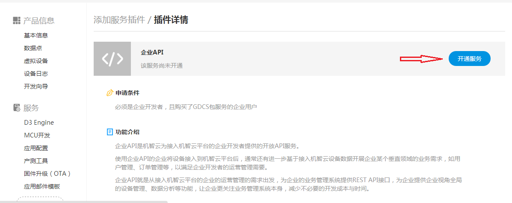

title: Enterprise Application Development
---
# Overview
Enterprise applications refer to the specific business management functionality by using the obtained data from those devices connected to Gizwits cloud in order to satisfy enterprises’ operation and management needs for devices and device users. Usually, in the process of enterprise application development, not only does it need to retrieve the data of the connected devices through the Gizwits cloud platform, but it also needs to control the devices and carry out statistical analysis of the device data using the enterprise APIs, which allows you to focus on the overall business applications.  

## SNoti service
The SNoti service is a real-time device message transmission service. This service can push enterprises’ device data to enterprise application systems in real time, which helps your organization to achieve business requirements based on the device data.
SNoti service capabilities

* Based on message publish-subscribe model
* 40-50ms of average device data transmission time 
* Supports simultaneous requests from multiple clients
* Supports SSL transmission
* Device messages are cached for 3 days by default, which can be customized on your behalf
* Provides monitoring and early warning of device messages

## Enterprise API
The Enterprise API is based on the operation and management requirements of the enterprise connected to the Gizwits cloud platform. Using the data generated by the enterprise in the Gizwits cloud platform, it provides companies with device management, data analytics, and other functions at the enterprise level and with a holistic viewpoint, which allows you to focus on business management system itself and reduce unnecessary development costs and time.

# User cases
## EV Charger SaaS Platform 
The EV charger SaaS platform provides charging station operators with finding electric stations, booking, charging, and payment for electric vehicle owners. The operator manages charging stations, faults, orders, billing rules and settlement through an operation management platform powered by the EV charger SaaS platform for its daily business in a closed loop, which greatly improves the operational efficiency.  
The EV chargers is connected to Gizwits, and the EV charger SaaS platform needs to obtain the data of the chargers in real time. Based on these data, it can calculate the charge and whether there is a fault. These device data are collected by the Gizwits PaaS platform and sent to the EV charger SaaS platform in real time through the SNoti service.  
The EV charger SaaS platform can also perform statistical analysis through the enterprise open API, such as the location query, communication log, and fault query of the charging stations.

## Usage-based Rental Management System
The business of the usage-based rental management system is similar to that of the EV charger SaaS platform, which covers the car rental, bicycle rental. The operators need to build a usage-based rental management system to fulfill the necessary functions such as order, settlement and payment. 
When cars and bicycles are connected to Gizwits, the operators do not need to invest in the device connection, they can access the SNoti service through related protocols to obtain device data for business development. 

# Development Process
## SNoti service access
### 1. Access request
* The SNoti service is usually open to enterprise developers. If you need real-time data ingested into Gizwits PaaS platform for secondary development, please apply to Gizwits.
* SNoti services are generally used together with enterprise API services, so enterprise developers also need to apply for enterprise API services.

### 2. Learn about the protocol
For details, see SNoti service protocol.

### 3. Get access parameters
Log into the developer center and obtain the account and secret key for the enterprise to access the SNoti service and the enterprise API. Choose "Company Information" as shown below.

 
Choose your organization on the left, and then click "API configuration" to get Eid, Esecret. You can also set the IP white list here. If you do not set the IP white list, the messaging service will fail to authenticate.

 
If it is in the development environment, the enterprise developers need to get the external network IP address corresponding to the development environment through some tools, which can be obtained through ip.taobao.com, and the identified IP address is supposed to be copied to the white list in the above figure. Only one IP address can be set in each line. For a production environment, the system allows multiple source IP addresses to be set to access the message service.

### 4. On-demand implementation of the client 
According to the Demo Code, the enterprise can start the development of the client functions based on its own requirements. The Demo Code can be used as a prototype to implement the business logic after capturing the device data, such as: 
* Parse JSON messages pushed by SNoti service
* Publish the captured message in real time to the queue to which the enterprise application belongs and perform asynchronous operations;
* The data can also be written into the database directly after it is parsed. However, a data cleaning mechanism on a periodic basis needs to be established. 

### 5. Simulate a real device to push data through a virtual device
If the enterprise does not have any real device connected to Gizwits yet, it can use the virtual device to simulate it.

* Start Demo Code, provided that it has been modified as the correct product_key, auth_id and auth_secret
* Define data points under the product
* After the approval, you can start the virtual device and simulate the data, click "Push"
* Demo Code will print device state pushed by SNoti service in real time

## Using Enterprise API
### 1. Apply for enterprise API service
Enterprise developers log into the developer center and choose “Add services”, as shown below.

Click on the enterprise API in the red box above and jump to the next step.

 
### 2. Get parameters
Log into developer center and choose "Company Information" as shown below.

 
Select the organization for which you have permissions on the left, and then click "API configuration" to get Eid, Esecret, and also set IP white list here.

 
### 3. Learn about the protocol
After the approval of using enterprise API, the enterprise can make calls according to the enterprise API protocol.
Enterprise API can be found here.
