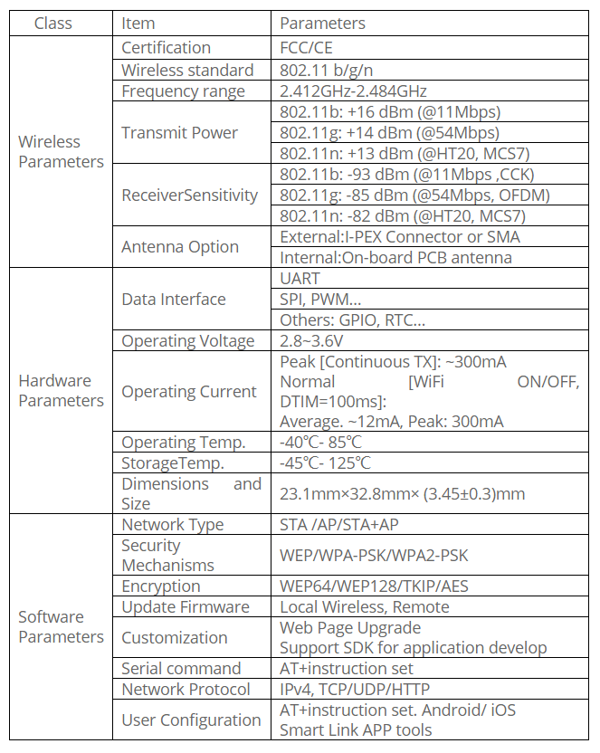
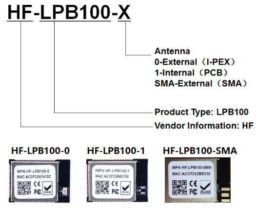

title: HF-LPB100 datasheet
---

# Overview of Characteristic

* Based on High-Flying Cotex-M3 MCU (MC101) + MediaTek Wi-Fi MT5931SA
* Support IEEE802.11b/g/n Wireless Standards
* Low-Power Applications with Excellent Power Save Scheme
* Support UART/SPI/PWM/GPIO Data Communication Interface
* Support Work As STA/AP/AP+STA Mode
* Support Smart Link Function
* Support Wireless/Remote Firmware Upgrade
* Support WPS Function
* Support Multi-TCP Client (Upto 5) Application
* Support Internal/External Antenna Option
* Single +3.3V Power Supply
* Smallest Size: 23.1mm x 32.8mm x 3.45±0.3mm
* FCC/CE Certificated

# HF-LPB100

Base on customer detailed requirement, HF-LPB100 series modules provide different variants and physical type for detailed application.

# Appendix

* Firmware download for HF-LPB100 
* Log check for LPB100 Gagent
* Download GAgent for HF LPB100 04020022
* GAgent for HF LPB100 04020021