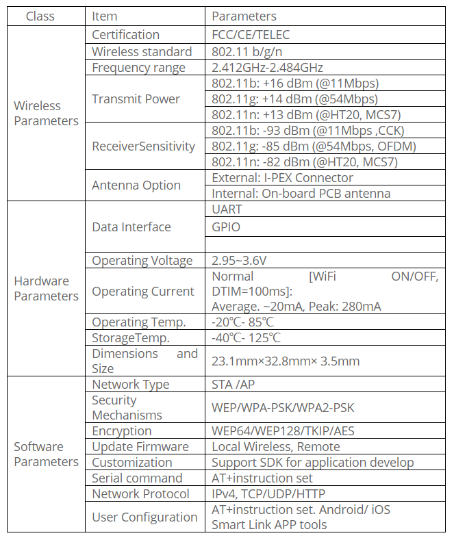
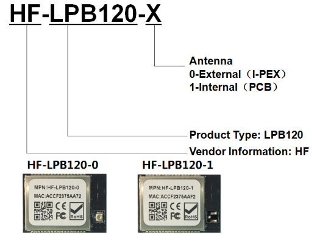

title: HF-LPB120 datasheet
---

# Overview of Characteristic

* Based on High-Flying Cost Effective Wi-Fi SOC: MC300 chipset
* Support IEEE802.11b/g/n Wireless Standards
* Support UART/GPIO Data Communication Interface
* Support Work As STA/AP Mode
* Support Smart Link Function (APP program provide)
* Support Wireless and Remote Firmware Upgrade Function
* Support WPS Function
* Support Internal/External(I-PEX) Antenna Option
* Single +3.3V Power Supply
* Smallest Size: 23.1mm x 32.8mm x3.5mm
* FCC/CE/TELEC Certificated

# HF-LPB120

Base on customer detailed requirement, HF-LPB120 series modules provide different variants and physical type for detailed application.

# Appendix

* Firmware download for HF-LPB120/HF-LPT120 
* Log check for LPB120/LPT120 Gagent
* Download GAgent for HFLPT120/LPB120/LPT220 04020025
* GAgent for HFLPT120/LPB120/LPT220 04020025