title: ESP8266EX Datasheet
---

# 1.Overview
 
Espressif’s ESP8266EX delivers highly integrated Wi-Fi SoC solution to meet users’ continuous demands for efficient power usage, compact design and reliable performance in the Internet of Things industry.

With the complete and self-contained Wi-Fi networking capabilities, ESP8266EX can perform either as a standalone application or as the slave to a host MCU. When ESP8266EX hosts the application, it promptly boots up from the flash. The integrated high- speed cache helps to increase the system performance and optimize the system memory. Also, ESP8266EX can be applied to any microcontroller design as a Wi-Fi adaptor through SPI/SDIO or UART interfaces.

ESP8266EX integrates antenna switches, RF balun, power amplifier, low noise receive amplifier, filters and power management modules. The compact design minimizes the PCB size and requires minimal external circuitries.

Besides the Wi-Fi functionalities, ESP8266EX also integrates an enhanced version of Tensilica’s L106 Diamond series 32-bit processor and on-chip SRAM. It can be interfaced with external sensors and other devices through the GPIOs. Software Development Kit (SDK) provides sample codes for various applications.

Espressif Systems’ Smart Connectivity Platform (ESCP) enables sophisticated features including:

* Fast switch between sleep and wakeup mode for energy-efficient purpose;
* Adaptive radio biasing for low-power operation
* Advance signal processing
* Spur cancellation and RF co-existence mechanisms for common cellular, Bluetooth, DDR, LVDS, LCD interference mitigation

## 1.1 Wi-Fi Key Features

* 802.11 b/g/n support
* 802.11n support (2.4 GHz), up to 72.2 Mbps
* Defragmentation
* 2 x virtual Wi-Fi interface
* Automatic beacon monitoring (hardware TSF)
* Support Infrastructure BSS Station mode/SoftAP mode/Promiscuous mode
* Antenna diversity

## 1.2 Specifications

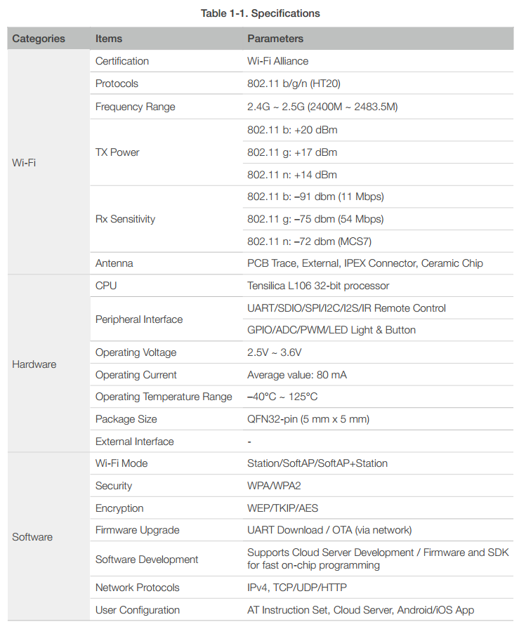

## 1.3 Applications

* Home appliances
* Home automation
* Smart plugs and lights
* Industrial wireless control
* Baby monitors
* IP cameras
* Sensor networks
* Wearable electronics
* Wi-Fi location-aware devices
* Security ID tags
* Wi-Fi position system beacons

# 2. Pin Definitions

Figure 2-1 shows the pin layout for 32-pin QFN package.

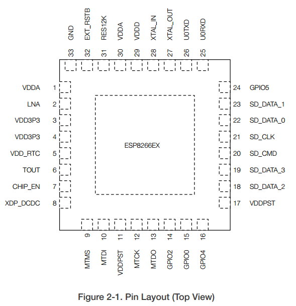

Table 2-1 lists the definitions and functions of each pin.

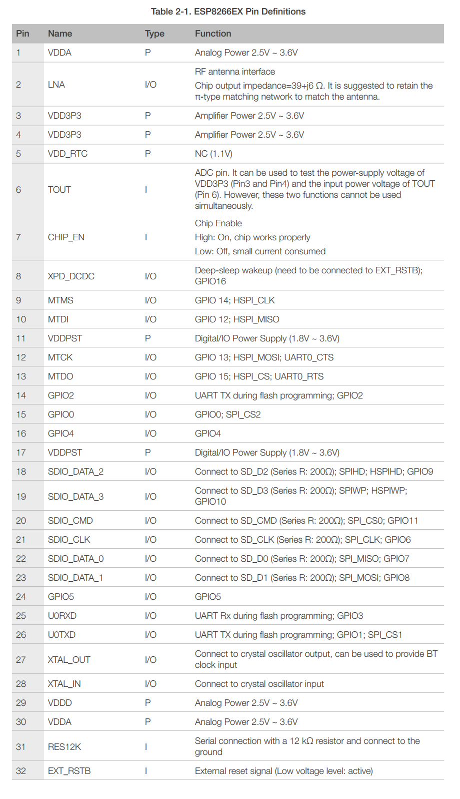

# 3. Functional Description

The functional diagram of ESP8266EX is shown as in Figure 3-1.

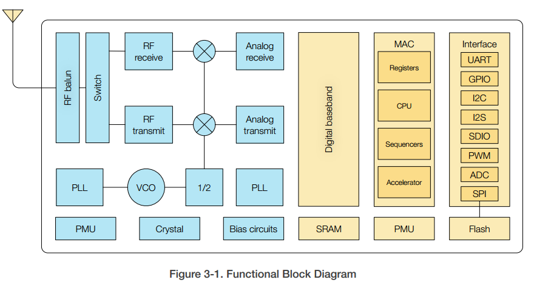

## 3.1 CPU, Memory, and Flash

### 3.1.1 CPU

The ESP8266EX integrates a Tensilica L106 32-bit RISC processor, which achieves extra- low power consumption and reaches a maximum clock speed of 160 MHz. The Real-Time Operating System (RTOS) and Wi-Fi stack allow 80% of the processing power to be available for user application programming and development. The CPU includes the interfaces as below:

* Programmable RAM/ROM interfaces (iBus), which can be connected with memory controller, and can also be used to visit flash.
* Data RAM interface (dBus), which can connected with memory controller.
* AHB interface which can be used to visit the register.

### 3.1.2 Memory

ESP8266EX Wi-Fi SoC integrates memory controller and memory units including SRAM and ROM. MCU can access the memory units through iBus, dBus, and AHB interfaces. All memory units can be accessed upon request, while a memory arbiter will decide the running sequence according to the time when these requests are received by the processor.

According to our current version of SDK, SRAM space available to users is assigned as below.
 

* RAM size < 50 kB, that is, when ESP8266EX is working under the Station mode and connects to the router, the maximum programmable space accessible in Heap + Data section is around 50 kB.
* There is no programmable ROM in the SoC. Therefore, user program must be stored in an external SPI flash.

### 3.1.3 External Flash

ESP8266EX uses external SPI flash to store user programs, and supports up to 16 MB memory capacity theoretically.
The minimum flash memory of ESP8266EX is shown below:

* OTA disabled: 512 kB at least
* OTA enabled: 1 MB at least

 

## 3.2 Clock

### 3.2.1 High Frequency Clock

The high frequency clock on ESP8266EX is used to drive both transmit and receive mixers. This clock is generated from internal crystal oscillator and external crystal. The crystal frequency ranges from 24 MHz to 52 MHz.

The internal calibration inside the crystal oscillator ensures that a wide range of crystals can be used, nevertheless the quality of the crystal is still a factor to consider to have reasonable phase noise and good Wi-Fi sensitivity. Refer to Table 3-1 to measure the frequency offset.

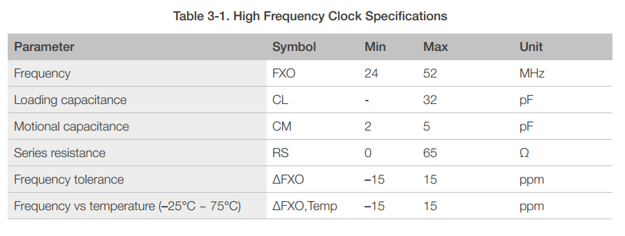

### 3.2.2 External Clock Requirements

An externally generated clock is available with the frequency ranging from 24 MHz to 52 MHz. The following characteristics are expected to achieve good performance of radio.

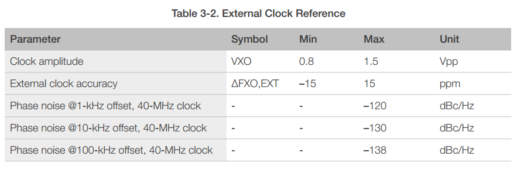

## 3.3 Radio

ESP8266EX radio consists of the following blocks.

* 2.4 GHz receiver
* 2.4 GHz transmitter
* High speed clock generators and crystal oscillator
* Bias and regulators
* Power management

### 3.3.1 Channel Frequencies

The RF transceiver supports the following channels according to IEEE802.11b/g/n standards.

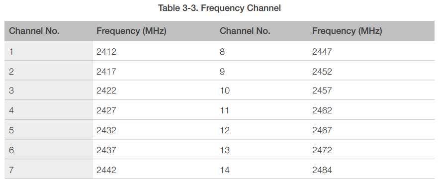

### 3.3.2 2.4 GHz Receiver

The 2.4 GHz receiver down-converts the RF signals to quadrature baseband signals and converts them to the digital domain with 2 high resolution high speed ADCs. To adapt to varying signal channel conditions, RF filters, automatic gain control (AGC), DC offset cancelation circuits and baseband filters are integrated within ESP8266EX.

### 3.3.3 2.4 GHz Transmitter

The 2.4 GHz transmitter up-converts the quadrature baseband signals to 2.4 GHz, and drives the antenna with a high-power CMOS power amplifier. The function of digital calibration further improves the linearity of the power amplifier, enabling a state of art performance of delivering +19.5 dBm average TX power for 802.11b transmission and +18 dBm for 802.11n (MSC0) transmission.

Additional calibrations are integrated to offset any imperfections of the radio, such as:

* Carrier leakage
* I/Q phase matching
* Baseband nonlinearities

These built-in calibration functions reduce the product test time and make the test equipment unnecessary.

### 3.3.4 Clock Generator

The clock generator generates quadrature 2.4 GHz clock signals for the receiver and transmitter. All components of the clock generator are integrated on the chip, including all inductors, varactors, loop filters, linear voltage regulators and dividers.

The clock generator has built-in calibration and self test circuits. Quadrature clock phases and phase noise are optimized on-chip with patented calibration algorithms to ensure the best performance of the receiver and transmitter.

## 3.4 Wi-Fi

ESP8266EX implements TCP/IP and full 802.11 b/g/n WLAN MAC protocol. It supports Basic Service Set (BSS) STA and SoftAP operations under the Distributed Control Function (DCF). Power management is handled with minimum host interaction to minimize active- duty period.

### 3.4.1 Wi-Fi Radio and Baseband

The ESP8266EX Wi-Fi Radio and Baseband support the following features:

* 802.11b and 802.11g
* 802.11n MCS0-7 in 20 MHz bandwidth
* 802.11n 0.4 μs guard-interval
* up to 72.2 Mbps of data rate
* Receiving STBC 2x1
* Up to 20.5 dBm of transmitting power
* Adjustable transmitting power
* Antenna diversity

### 3.4.2 Wi-Fi MAC

The ESP8266EX Wi-Fi MAC applies low-level protocol functions automatically, as follows:

* 2 × virtual Wi-Fi interfaces
* Infrastructure BSS Station mode/SoftAP mode/Promiscuous mode
* Request To Send (RTS), Clear To Send (CTS) and Immediate Block ACK
* Defragmentation
* CCMP (CBC-MAC, counter mode), TKIP (MIC, RC4), WEP (RC4) and CRC
* Automatic beacon monitoring (hardware TSF)
* Dual and single antenna Bluetooth co-existence support with optional simultaneous receive (Wi-Fi/Bluetooth) capability

## 3.5 Power Management

ESP8266EX is designed with advanced power management technologies and intended for mobile devices, wearable electronics and the Internet of Things applications.

The low-power architecture operates in the following modes:

* Active mode: The chip radio is powered on. The chip can receive, transmit, or listen.
* Modem-sleep mode: The CPU is operational. The Wi-Fi and radio are disabled.
* Light-sleep mode: The CPU and all peripherals are paused. Any wake-up events (MAC, host, RTC timer, or external interrupts) will wake up the chip.
* Deep-sleep mode: Only the RTC is operational and all other part of the chip are powered off.

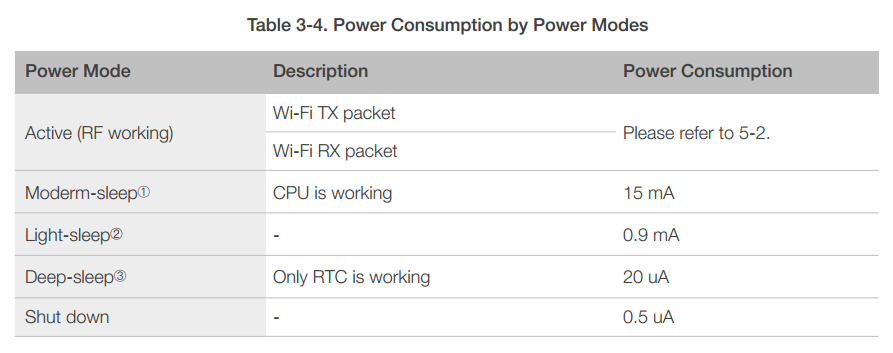

# 4 Peripheral Interface
 
## 4.1 General Purpose Input/Output Interface (GPIO)

ESP8266EX has 17 GPIO pins which can be assigned to various functions by programming the appropriate registers.

Each GPIO PAD can be configured with internal pull-up or pull-down (XPD_DCDC can only be configured with internal pull-down, other GPIO PAD can only be configured with internal pull-up), or set to high impedance. When configured as an input, the data are stored in software registers; the input can also be set to edge-trigger or level trigger CPU interrupts. In short, the IO pads are bi-directional, non-inverting and tristate, which includes input and output buffer with tristate control inputs.

These pins, when working as GPIOs, can be multiplexed with other functions such as I2C, I2S, UART, PWM, and IR Remote Control, etc.

For low power operations, the GPIOs can also be set to hold their state. For instance, when the IOs are not driven by internal and external circuits, all outputs will hold their states before the chip entered the low power modes.

The required drive strength is small— 5 μA or more is enough to pull apart the latch.

## 4.2 Secure Digital Input/Output Interface (SDIO)

ESP8266EX has one Slave SDIO, the definitions of which are described as Table 4-1, which supports 25 MHz SDIO v1.1 and 50 MHz SDIO v2.0, and 1 bit/4 bit SD mode and SPI mode.

## 4.3 Serial Peripheral Interface (SPI/HSPI)

ESP8266EX has two SPIs.

* One general Slave/Master SPI
* One general Slave HSPI

Functions of all these pins can be implemented via hardware.

### 4.3.1 General SPI (Master/Slave)

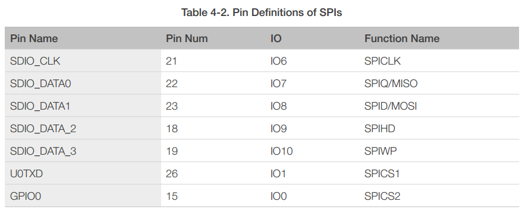

### 4.3.2 HSPI (Slave)

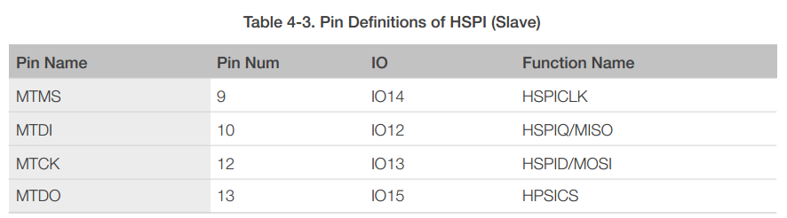

## 4.4 I2C Interface

ESP8266EX has one I2C, which is realized via software programming, used to connect with other microcontrollers and other peripheral equipments such as sensors. The pin definition of I2C is as below.

Both I2C Master and I2C Slave are supported. I2C interface functionality can be realized via software programming, and the clock frequency is 100 kHz at maximum.

## 4.5 I2S Interface

ESP8266EX has one I2S data input interface and one I2S data output interface, and supports the linked list DMA. I2S interfaces are mainly used in applications such as data collection, processing, and transmission of audio data, as well as the input and output of serial data. For example, LED lights (WS2812 series) are supported. The pin definition of I2S is shown in Table 4-5.

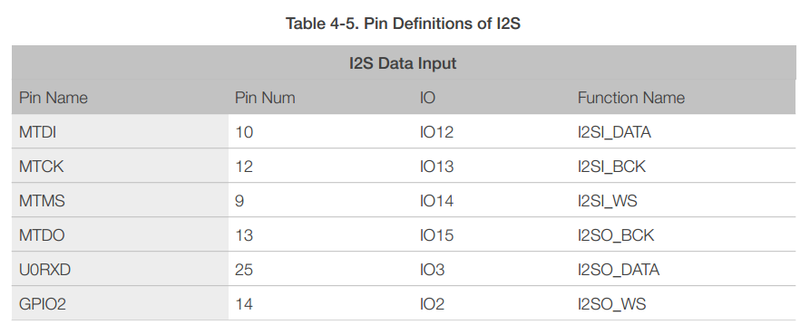

## 4.6 Universal Asynchronous Receiver Transmitter (UART)

ESP8266EX has two UART interfaces UART0 and UART1, the definitions are shown in Table 4-6.
 
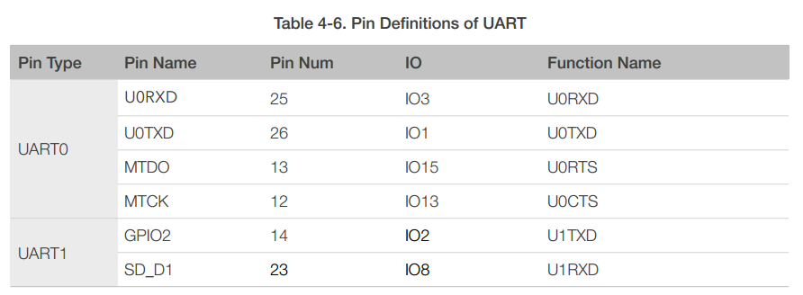

Data transfers to/from UART interfaces can be implemented via hardware. The data transmission speed via UART interfaces reaches 115200 x 40 (4.5 Mbps).

UART0 can be used for communication. It supports flow control. Since UART1 features only data transmit signal (TX), it is usually used for printing log.

## 4.7 Pulse-Width Modulation (PWM)

ESP8266EX has four PWM output interfaces. They can be extended by users themselves. The pin definitions of the PWM interfaces are defined as below.

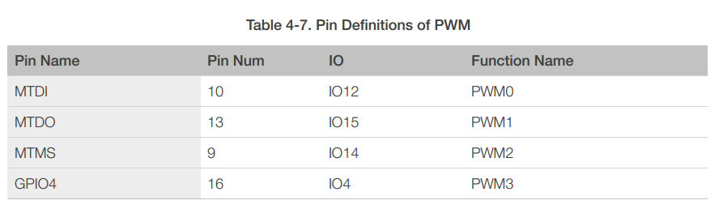

The functionality of PWM interfaces can be implemented via software programming. For example, in the LED smart light demo, the function of PWM is realized by interruption of the timer, the minimum resolution reaches as high as 44 ns. PWM frequency range is adjustable from 1000 μs to 10000 μs, i.e., between 100 Hz and 1 kHz. When the PWM frequency is 1 kHz, the duty ratio will be 1/22727, and a resolution of over 14 bits will be achieved at 1 kHz refresh rate.
 

## 4.8 IR Remote Control

ESP8266EX currently supports one infrared remote control interface. For detailed pin definitions, please see Table 4-8 below.

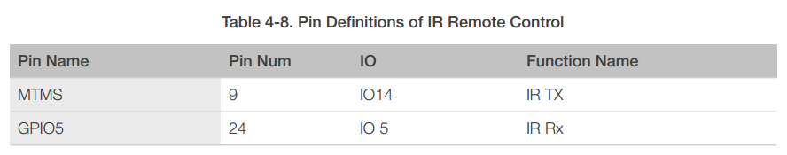

The functionality of Infrared remote control interface can be implemented via software programming. NEC coding, modulation, and demodulation are supported by this interface. The frequency of modulated carrier signal is 38 kHz, while the duty ratio of the square wave is 1/3. The transmission range is around 1m which is determined by two factors: one is the maximum current drive output, the other is internal current-limiting resistance value in the infrared receiver. The larger the resistance value, the lower the current, so is the power, and vice versa.

## 4.9 ADC (Analog-to-Digital Converter)

ESP8266EX is embedded with a 10-bit precision SAR ADC. TOUT (Pin6) is defined as below:

The following two measurements can be implemented using ADC (Pin6). However, they cannot be implemented at the same time.

* Measure the power supply voltage of VDD3P3 (Pin3 and Pin4).

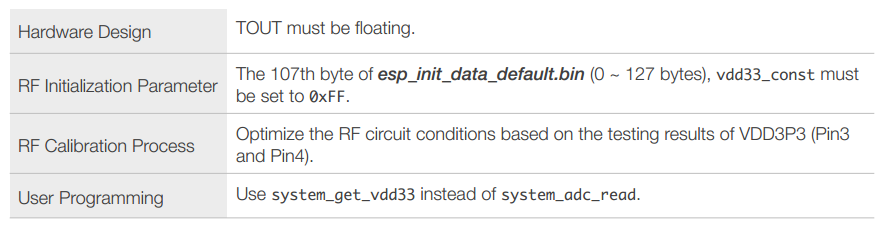

* Measure the input voltage of TOUT (Pin6).

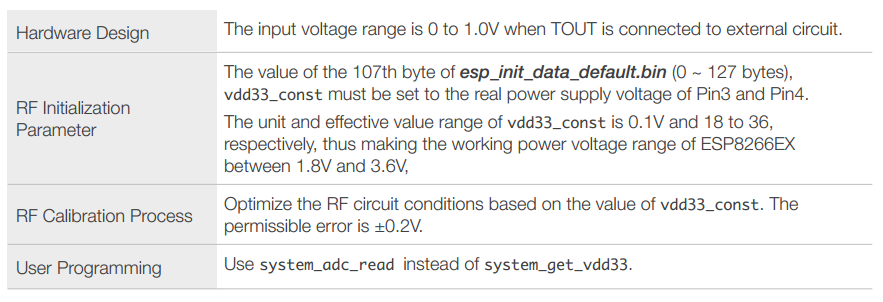

# 5 Electrical Specifications
 
## 5.1 Electrical Characteristics

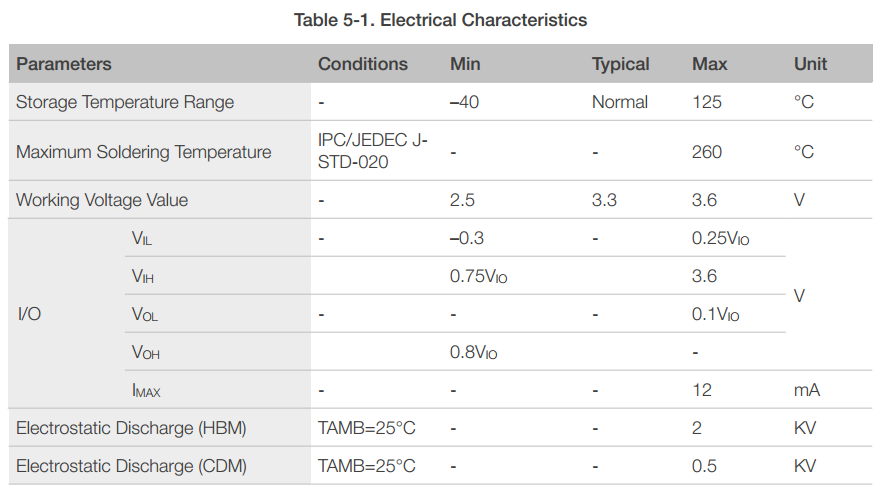

## 5.2 RF Power Consumption

Unless otherwise specified, the power consumption measurements are taken with a 3.0V supply at 25°C of ambient temperature. All transmitters’ measurements are based on a 50% duty cycle.

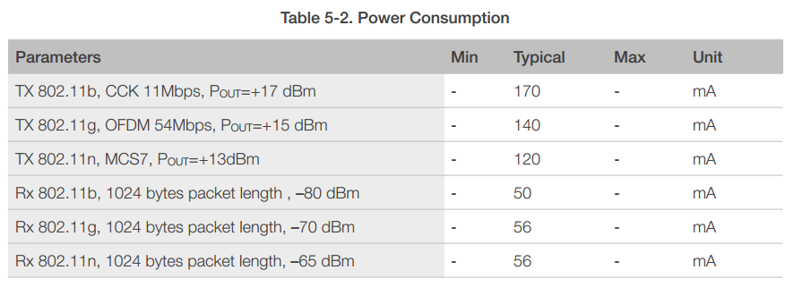

## 5.3 Wi-Fi Radio Characteristics

The following data are from tests conducted at room temperature, with a 3.3V power supply.

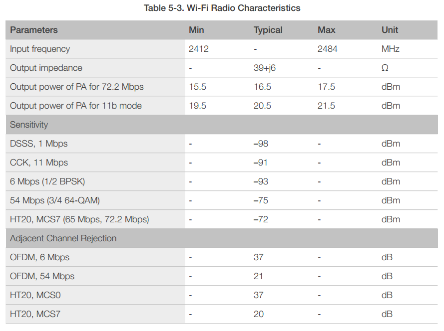

# 6 Package Information

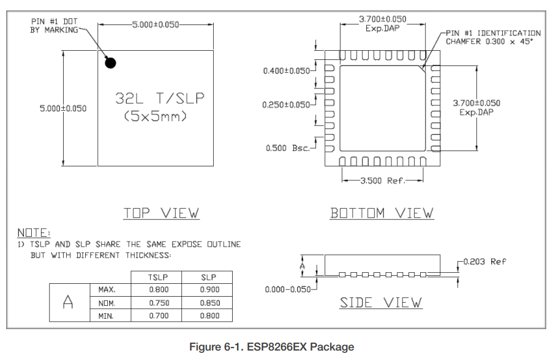

# Appendix

* Firmware download for ESP8266
* Log check for ESP8266 Gagent
* Download Agent for ESP8266 04020025
