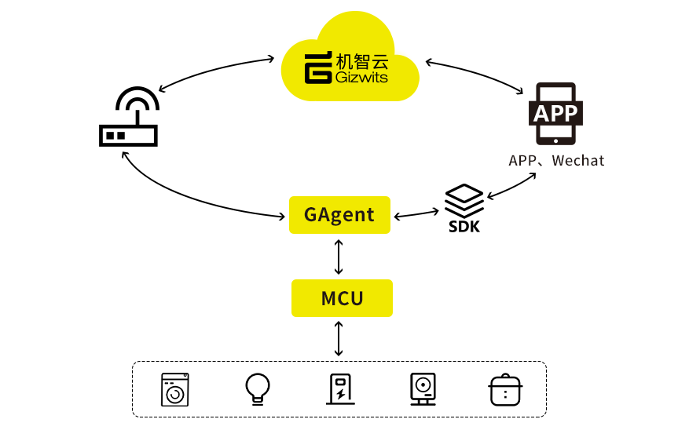
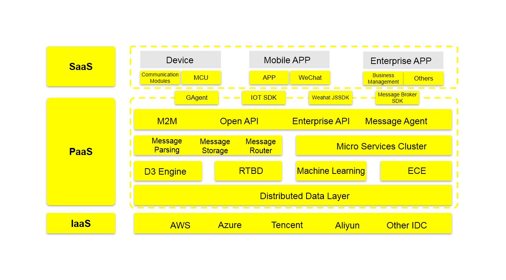
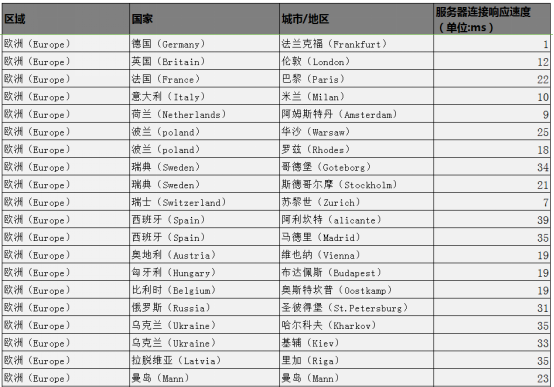
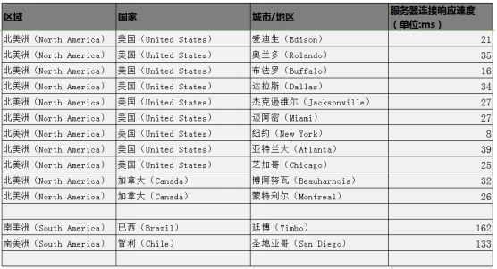
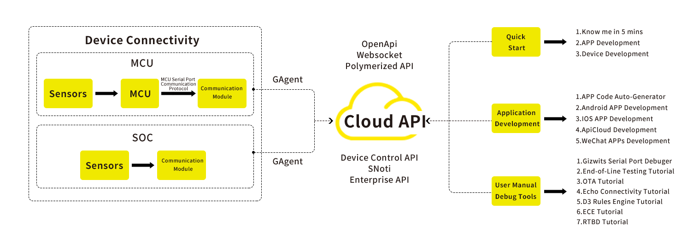

title: Overview
---
# Gizwits Platform Overview
## 1. Introduction
The Gizwits platform is a one-stop intelligent hardware development and cloud services platform for individuals and enterprise developers that has been built by Gizwits company with many years of deeply rooting in the industries, as well as actionable insights. The platform provides capabilities ranging from products definition, device-side development and debugging, application development, production testing, cloud-side development, operations management, and data services etc., which cover full lifecycle services from intelligent hardware provision to operation management.

The Gizwits platform provides developers with self-service smart hardware development tools and open cloud services. With self-service tools for dummies, comprehensive SDKs and API service capabilities, the platform lowers the technical barrier for IoT hardware development, reduces R&D costs, accelerates products launch speed, and helps developers promote the intellectualization of products to better connect and serve the end consumers.

## 2. Architecture

## 3. Gizwits Advantages
1. High availability
    - SLA 99.99%
    - EB-level massive data support
    - Flexible and scalable architecture
2. Fast connection
    - Fast connection within only a half day
    - Provide SDKs for each activity in the development process
    - Provide automatic code generation tools
    - Provide ECE capability to automatically adapt private protocols through cloud configuration scripts
    - Provide holistic solutions for industries
3. Professional services
    - Professional tools support for dummies
    - Professional support from our solution architecture team
    - Professional operation and maintenance support
4. Deep industry expertise
    - 10000+ enterprise customers
    - 80W + global IoT developers
5. Security
    - Comply with the X.509 certificate standard
    - Encrypted cloud storage for enterprise data  
    - Encryption for key business data 
    - Penetration test by professional security companies
    - Comply with the ISO27000 family of security management standards
6. Multi-tier cloud data services
    - Message Proxy Service: Subscribe to enterprise device data on demand
    - Enterprise API: Provides device control, device management, device location service and device data service etc.
    - D3 Engine: A flexible and powerful data orchestration engine
7. Openness
    - The world's most open IoT self-development platform
    - Integrate with Amazon Echo, WeChat, JD, Nest, Apple HomeKit, Suning Cloud and other major platforms
8. Internationalization
    - Global coverage: Built independent data centers and cloud platforms in China, Europe, America, and Southeast Asia to cover the devices and users in most countries and regions of the world for customers
    - Smart connection: Devices adapt their connections with the nearest cloud servers for acquiring the same service

## 4. Gizwites Global Server Deployment
1.The network response times in Guangzhou, Shenzhen, Guangxi, Hunan, and Fujian cities/regions are all less than 20ms (0.02 seconds); the network response times in other cities/regions of China are generally less than 40ms (0.04 seconds); the network response times in Singapore, Malaysia, Indonesia are less than 20ms (0.02 seconds); other cities in Asia are less than 70ms (0.07 seconds).

2.The response time in the Middle East is less than 70ms (0.07 seconds); the average response time in Oceania is about 98ms; the average response time in Africa is about 150ms (0.15 seconds); the overall situation remains good.

3.The overall network response time in Europe and other regions is less than 40ms (0.04 seconds).

4.The overall network response time in North America and other regions is less than 40 ms (0.04 seconds); the average response time in cities/regions of South America is 146 ms (0.146 seconds); the overall situation remains good.

(PS: Due to network instability, there are small deviations of response time.)
# Quick Start
## Five Minutes to Understand Gizwits
* Five minutes to understand Gizwits
* Definition of terms
## Fast Connection Wizard

# Application Development(App, Wechat)
Gizwits provides the APP SDKs, open source frameworks, and WeChat SDK to facilitate the quick building of mobile applications. You only need to implement business functions according to the tool guides without considering the underlying functions.

## 1. App development preparation and guidance
App development preparation and guidance

## 2. App code automatic generation service introduction
App code automatic generation service introduction

## 3. App open source frameworks
* iOS open source framework description (including source code)
* iOS push notification
* iOS third-party authentication and themes
* Rapid application development examples for iOS open source framework
* Android open source framework description (including source code)
* Android push notification
* Android third-party authentication and themes
* Rapid application development examples for Android open source framework
* APICloud open source framework guidlines (including source code)

## 4. App SDKs
App SDKs help developers rapidly complete App development. You only need to focus on the App UI and UE design, while relatively complex protocols and error handling can be ignored.

* Android SDK access
* IOS SDK access
* APICloud SDK User Guide

## 5. More guidelines for App development
* Transparent transmission mode of data
* Video tutorial for open source frameworks

## 6. Wechat Application Development
* Learn about WeChat application development
* WeChat application development tutorial

# Device Connectivity
## 1. Connecting your devices to Gizwits cloud quickly
In order to let developers quickly understand the process of our device connection, we provide two fast connection tutorials for MCU and SOC solutions based on the open-source suite Gokit. Both tutorials use the smart lighting as a case study.

Note: It is not necessary to use Gokit suite for device connection

* Fast connection tutorial for MCU solution
* Fast connection tutorial for SOC solution 

## 2. GAgent communication module usage
The main role of GAgent is data forwarding. It is a data exchange bridge among devices, Gizwits cloud, and applications (APP).

In order to enable different communication modules to connect to Gizwits cloud, we provide multiple burning methods and logging methods for those modules to ensure that the GAgent firmware runs normally in the modules.

Note: Please follow the following steps when performing the module burning operation; otherwise, unknown errors will occur.

* GAgent details
* Burning instructions for HF-LPB100 serial port 
* Burning instructions for HF-LPT120 serial port
* Burning instructions for MXCHIP serial port
* Burning instructions for ESP8266 serial port
* Burning instructions for Guanghetong G510 module
* Log retrieve tutorial for debugging communication modules

## 3. MCU code automatic generation service
In order to reduce the barrier for development, shorten the development cycle, and reduce the investment in development resources, Gizwits has launched an automatic code generation service. The cloud generates the device-side code for the corresponding product based on the defined product data points.

* Introduction and tutorial for the automatic code generation tool 
* Porting instructions for MCU SDK common version
* Porting the code automatically generated by Gizwits using STM32CubeMX
* Optimization instructions for 8051 platform by tailoring code 

## 4. Gokit open source suite 
In order to enable developers to experience the Gizwits service faster, we provide the open source suite Gokit for developers to learn and reference, so that developers can connect their own products to Gizwits cloud quickly.

* Gokit2 User Guide
* Introduction to Gokit3 series development suite
* Gokit3 hardware manual
* Gokit3(S) user manual
* Introduction to Gokit3(S) development suite 
* Gokit3 (S) development environment setup
* Detailed annotation for GoKit-SoC program
* Detailed annotation for GoKit-MCU program

## 5. Connecting ArduinoUnoWIFI to Gizwits cloud
* How to connect ArduinoUNOWIFI to Gizwits cloud
* How to burn ESP8266 firmware into ArduinoUNOWiFi
* SDK API introduction for ArduinoUNOWiFi 
* Making a smart lamp using ArduinoUNO WiFi

## 6. More guidelines for device connection
* Development tutorial for ECE demo 
* Gizwits serial port tool tutorial 

# Cloud API
If you have completed device connection and App development, and want to obtain data from the Gizwits PaaS platform to build a business management system or access services provided by Gizwits, the following documents should be noticed:

* 1). Understanding enterprise application development
* 2). Understanding enterprise APIs
* 3). SNoti API (V2.1.3)
* 4). Gizwits Open API (new)
* 5). Websocket API guide
* 6). API tutorial
    - Use openapi (postman) to control virtual devices
    - Use Websocket webpage to control devices
    - Aggregation API tutorial
    - Device linkage API tutorial
    - Demo tutorial for Snoti real-time synchronization service 

# User Manual
* Product transfer from a personal account to an enterprise account
* OTA tutorial
* Production testing tool tutorial
* D3 engine tutorial
* ECE fog computing tutorial
* Amazon Echo integration tutorial
* Real-time big data guidelines
* Global deployment solutions
