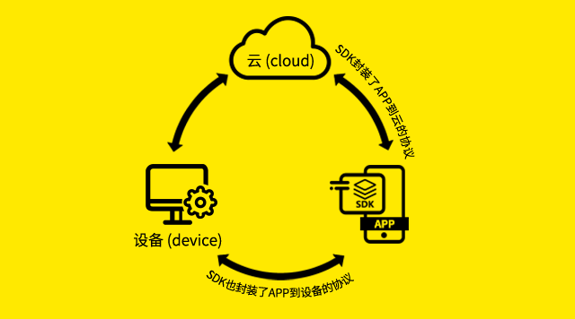
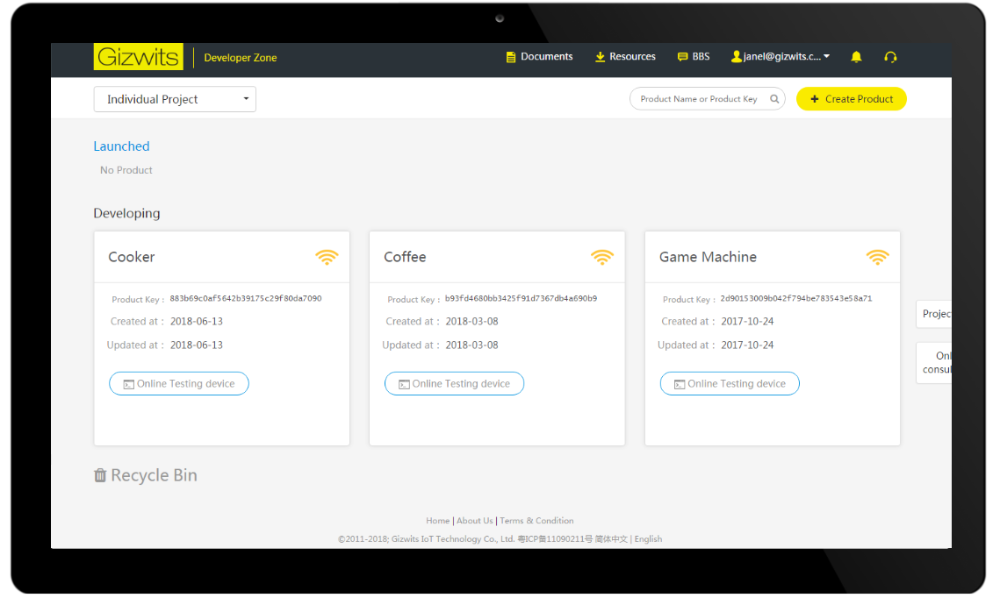
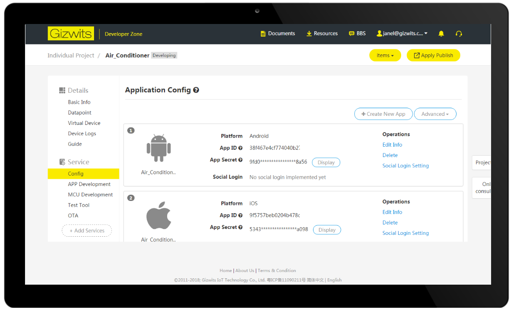
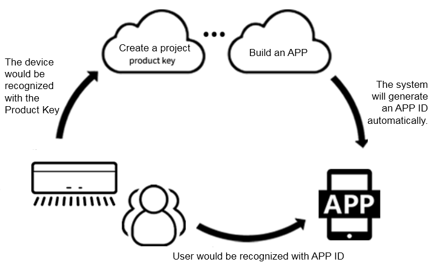

title: App development preparation and guidance
---

# Overview

This article mainly introduces the functions of the Gizwits Cloud access SDK for devices and Gizwits App open source framework, as well as the preparatory work for the early stage. Developers can choose the convenient way for App development according to their own project requirement.

# Gizwits App Development Resources 

Gizwits now offers three App development methods (integrating SDK, using App open source framework, and using App code auto-generator), which facilitate rapid App development according to the different needs of developers. The following are recommended development methods with corresponding requirements.

## 1. Gizwits cloud access SDK for devices

The Gizwits cloud access SDK for devices (hereinafter referred to as SDK) encapsulates the communication process between the mobile phones (including PAD and other devices) and the devices, as well as between the mobile phones and Gizwits cloud. The process includes network access configuration, device discovery, connectivity, control, heartbeat, status reporting, and alarm notification. Using the SDK, you can quickly complete App development and only need to focus on the App UI and UE design. Relatively complex protocols and error handling can be ignored.

This method is applicable to the App that needs to do complex business logic processing, or needs to integrate the SDK to accomplish remote control after the App development has been completed.

Gizwits currently offers three SDKs: the native SDK for iOS, the native SDK for Android, and the APICloud SDK for cross-platform. Developers can choose anyone according to the needs of the project. The APICloud SDK can be used to develop once with HTML5 technology and can be adapted to both iOS and Android platforms.

* Native SDK for iOS platform
* Integration guide of native SDK for iOS Platform
* Native SDK Android platform
* Integration guide of native SDK for Android platform 
* APICloud SDK for cross-platform
* Integration guide of APICloud SDK for cross Platform

## 2. Gizwits App open source framework

In order to further ease the challenges associated with App development, Gizwits launched the App open source framework in which the following functions have been modularly integrated:

This method is applicable to the APP that needs to do simple business logic processing.

1. User module: user registration, user login, password recovery, third party authentication (WeChat, QQ)
2. Network access configuration for device (Arilink+SoftAP)
3. Device discovery and list
4. Push notification: supports Jiguang Push, Baidu Push
5. Custom skin

The App open source framework makes each module an independent package. If you want to know the implementation code and flow of one of the modules, directly refer to the framework code.

* Guide of App open source framework for iOS
* Quick start guide based on App open source framework for iOS
* Guide of App open source framework for Android
* Quick start guide based on App open source framework for Android
* Guide of APICloud open source framework
* Video tutorials of App open source framework

## 3. Gizwits App code auto-generator

This method is applicable to the project that needs its own product App to debug, or requires a complete App code for reference.

In order to lower the barrier for the development of smart hardware App and reduce the investment in development resources, Gizwits has further developed the App open source code that implements the complete functions based on the "App Open Source Framework". After creating corresponding data points on the product project, Gizwits cloud generates an App reference code of the corresponding product according to the defined data points.

The automatically generated App code modularly integrates the necessary functions of a smart hardware App, mainly including:

1. User module: user registration, password recovery, third party anthentication (Wechat, QQ)
2. Network access configuration (Arilink+SoftAP)
3. Device discovery and list
4. Device control
5. Push notification: After the device raises the alarm, the alarm information is pushed to the App. The main push platforms we use are Jiguang Push and Baidu Push.

After developers download the source code, they only need to optimize the UI and design the control logic and device control interface. The control page of the source code implements the standard flow of device control using Gizwits SDK. During the secondary development of the App, you only need to package and install to complete the control App of your own product.

Introduction and tutorial for App code auto-generator.

## 4.Other App development tutorials

* iOS push notification guide
* iOS third-party authentication and re-skin tutorial
* Android push notification guide
* Android third-party authentication and re-skin tutorial
* Explanation of SDK data transparent transmission

Note: The above methods are all based on open source frameworks.

# Get ready

## 1. Create a product and define data points

 
## 2. Create Android and iOS applications for your product

In the left navigation pane, click "Application Configuration" under “Services” to add Android and iOS applications respectively.

 
## 3. The meaning and role of App ID and App Secret
App ID: application identification code, when the developer needs to develop applications for a smart product (including iOS, Android, Web applications, etc.), an App ID is automatically generated after an application is created in the Gizwits developer center and associates with the device. This App ID is required during application development. All users registered in the App are bound under this App ID.

App Secret: App ID verification secret.

As shown in the figure below, it is the role that App ID plays in the process of developing App.

## 4. See Also

See "Introduction to App code auto-generator" to understand what functions the automatically generated App code has;

See "App open source framework" to understand

* Guide of App open source framework for iOS
* Guide of iOS App push notification integration
* Guide of iOS App third-party authentication and re-skin
* Quick start of iOS App development
* Guide of App open source framework for Android
* Guide of Android App push notification integration
* Guide of Android App third-party authentication and re-skin
* Guide of APICloud open source framework

See "App Development SDK" to develop the IoT App (many user cases of design details can be found here)

* Guide of iOS SDK 2.0 integration
* Guide of Android SDK 2.0 integration
* Guide of APICloud SDK
* Explanation of SDK data transparent transmission
* Guide of SDK debug log capture
* SDK error codes

More application development guides

* Application development FAQ
* Device sharing guide
* Application process of third-party authentication platform 
